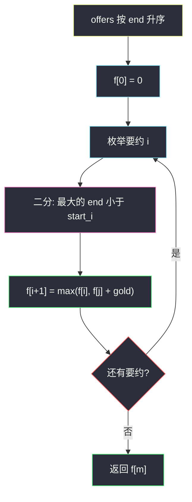

# 2830. 销售利润最大化（Maximize the Profit as the Salesman）

> 题目来源：[https://leetcode.cn/problems/maximize-the-profit-as-the-salesman/](https://leetcode.cn/problems/maximize-the-profit-as-the-salesman/)
>
> 灵茶题单小节定位：§7.2 不相交区间

## 一、问题描述

数轴上有 `n` 栋房屋，编号从 `0` 到 `n - 1`。二维数组 `offers`，其中 `offers[i] = [start_i, end_i, gold_i]` 表示第 `i` 个买家想用 `gold_i` 枚金币买走闭区间 `[start_i, end_i]` 内的**所有**房屋。

同一所房屋不能卖给不同买家；允许留着不卖。返回能赚到的最大金币数。

**数据范围**：

- `1 <= n <= 10^5`
- `1 <= offers.length <= 10^5`
- `0 <= start_i <= end_i <= n - 1`
- `1 <= gold_i <= 10^3`

**示例 1**：

```text
输入：n = 5, offers = [[0,0,1],[0,2,2],[1,3,2]]
输出：3
解释：有 5 所房屋（编号 0..4），3 个要约。
把 [0,0] 以 1 金币卖给第 1 位买家，把 [1,3] 以 2 金币卖给第 3 位买家。
最多 3 枚金币。
```

**示例 2**：

```text
输入：n = 5, offers = [[0,0,1],[0,2,10],[1,3,2]]
输出：10
解释：把 [0,2] 以 10 金币卖给第 2 位买家。这比拆成 1+2 更优。
```

**核心思考点**：每个 offer 是带权闭区间，选中的区间两两不能相交（端点重叠也冲突，因为同一房屋只能卖一次）。这就是加权的**不相交区间最大权和**——按右端点排序后 DP，转移时二分找「上一个 `end < start` 的区间」。

## 二、暴力解法

`m` 个要约，`2^m` 子集；对每个子集扫房屋占用数组，冲突则丢弃，合法则累加金币。

```python
def maximizeTheProfitBrute(n, offers):
    m = len(offers)
    best = 0
    for mask in range(1 << m):
        used = [False] * n
        gold, ok = 0, True
        for i in range(m):
            if (mask >> i) & 1:
                s, e, g = offers[i]
                for x in range(s, e + 1):
                    if used[x]:
                        ok = False
                        break
                    used[x] = True
                if not ok:
                    break
                gold += g
        if ok:
            best = max(best, gold)
    return best
```

### 复杂度

- 时间：`O(2^m · n)`。`m = 10^5` 不可用。
- 空间：`O(n)`。

瓶颈：最优结构只依赖「最后一个选中的区间」——前面互不重叠的最大收益已经是一个子问题。

## 三、优化探索

### 3.1 按 end 排序就是决策顺序 ⭐

选中的区间按右端点从左到右排列后，相邻两个必须满足 `prev.end < curr.start`（闭区间，相等会在端点房屋上冲突）。于是：

```text
f[i+1] = 考虑排序后前 i 个要约（下标 0..i）的最大收益
       = max( f[i],                          # 不选 i
              f[j] + gold[i] )               # 选 i，j 是 end < start[i] 的要约个数
```

`j` 是「第一个 `end ≥ start[i]` 的位置」，它左边那一段全部合法可拼接。因为已按 `end` 升序，这段前缀对 `f` 单调，二分即可。

### 3.2 为什么是 `end < start` 不是 `end ≤ start` ⭐⭐

房屋 `2` 既是 A 的右端又是 B 的左端时，两笔买卖抢同一栋房。官方示例 1 里 `[0,0,1]` 与 `[1,3,2]` 能同时选，是因为 `0 < 1`；若改成 `[0,1]` 与 `[1,3]` 就冲突。

### 3.3 另一种线性下标 DP

也可以按下标房屋推进：`dp[i+1]` = 只考虑房屋 `0..i` 的最大收益。不卖房屋 `i` 则 `dp[i+1] = dp[i]`；卖给某个以 `i` 结尾的要约 `[s,i,g]` 则 `dp[i+1] = max(..., dp[s] + g)`。按结束位置分组后 `O(n + m)`。两种都满足时限；§7.2 的标准模板是「排序 + 二分上一个不相交」。



## 四、代码实现

### 主解：按 end 排序 + 二分前驱

```python
class Solution:
    def maximizeTheProfit(self, n: int, offers: List[List[int]]) -> int:
        offers.sort(key=lambda t: t[1])       # 按右端点
        m = len(offers)
        ends = [t[1] for t in offers]
        f = [0] * (m + 1)                     # f[i]：前 i 个要约
        for i, (s, e, g) in enumerate(offers):
            lo, hi = 0, i
            while lo < hi:                    # 第一个 end >= s 的位置
                mid = (lo + hi) // 2
                if ends[mid] < s:
                    lo = mid + 1
                else:
                    hi = mid
            f[i + 1] = max(f[i], f[lo] + g)
        return f[m]
```

手写二分可以换成 `j = bisect.bisect_left(ends, s, 0, i)`。

同一个 `start` 也可能对应多种 gold：把它们看成不同要约即可，`max(不选, 选)` 每次只吸收一个。若两个要约完全相同，选两次会自交，DP 不会同时收下——这是「不相交」自己保证的，不用去重。

### 可选：Java

```java
class Solution {
    public int maximizeTheProfit(int n, List<List<Integer>> offers) {
        offers.sort((a, b) -> a.get(1) - b.get(1));
        int m = offers.size();
        int[] ends = new int[m];
        for (int i = 0; i < m; i++) ends[i] = offers.get(i).get(1);
        int[] f = new int[m + 1];
        for (int i = 0; i < m; i++) {
            int s = offers.get(i).get(0), g = offers.get(i).get(2);
            int lo = 0, hi = i;
            while (lo < hi) {
                int mid = (lo + hi) / 2;
                if (ends[mid] < s) lo = mid + 1;
                else hi = mid;
            }
            f[i + 1] = Math.max(f[i], f[lo] + g);
        }
        return f[m];
    }
}
```

### 对照：按房屋下标的 `O(n + m)`

```python
class Solution:
    def maximizeTheProfit(self, n: int, offers: List[List[int]]) -> int:
        groups = [[] for _ in range(n)]
        for s, e, g in offers:
            groups[e].append((s, g))
        dp = [0] * (n + 1)                    # dp[i]：房屋 0..i-1
        for i in range(n):
            dp[i + 1] = dp[i]                 # 不把房屋 i 卖出去
            for s, g in groups[i]:
                dp[i + 1] = max(dp[i + 1], dp[s] + g)
        return dp[n]
```

`dp[s]` 只用了房屋 `0..s-1`，与当前要约 `[s, i]` 不交。

为什么两种 DP 答案相同：把要约按结束房屋放进桶之后，房屋下标 `i` 的递增顺序**就是** end 的排序顺序。`dp[s]` 已经包含了所有 `end < s` 的要约（它们最晚在房屋 `s-1` 被结算），等价于排序写法里二分找到的 `f[j]`。差别只是「状态下标用房屋」还是「用要约序号」。

### 细节说明

- **`n` 未出现在主解里**：房屋可以不卖，空档自动合法；`n` 只限制 `end` 上界。
- **相同 `end` 的多个要约**：排序稳定性无所谓，二分仍找 `end < start`；它们彼此相交，`f` 的 `max(不选, 选)` 不会同时收下两个。
- **`gold` 很小但 `m` 很大**：答案最大 `m · 10^3`，int 够用。
- **空 offer 列表**：`m = 0`，`f = [0]`，返回 0——全部不卖合法。
- **一个要约覆盖整段 `[0, n-1]`**：二分 `j = 0`，答案就是这一个 gold 与「不选」的 0 取 max，再跟其它要约比。
- **完全重叠的高价 vs 拆开的两段低价**：示例 2 就是这种；DP 会自动选 10 而不是 1+2，不必特判。

## 五、例子演示

**示例 1**：排序后仍是 `[0,0,1]`、`[0,2,2]`、`[1,3,2]`（end = 0, 2, 3）。

| i | 要约 | start | 二分 j（end < start 的个数） | 不选 f[i] | 选 f[j]+gold | f[i+1] |
|---|---|---|---|---|---|---|
| 0 | [0,0,1] | 0 | 0 | 0 | 0+1=1 | **1** |
| 1 | [0,2,2] | 0 | 0 | 1 | 0+2=2 | **2** |
| 2 | [1,3,2] | 1 | 1（只有 end=0 的那个） | 2 | 1+2=**3** | **3** |

返回 **3** ✅：选第 0 个和第 2 个，房屋 `[0,0]` 与 `[1,3]` 不交。

**示例 2**：中间那个 gold=10。

| i | 要约 | j | 不选 | 选 | f |
|---|---|---|---|---|---|
| 0 | [0,0,1] | 0 | 0 | 1 | 1 |
| 1 | [0,2,10] | 0 | 1 | **10** | 10 |
| 2 | [1,3,2] | 1 | 10 | 1+2=3 | **10** |

返回 **10** ✅。选 `[1,3,2]` 拼不上 10 那个区间（`2 ≮ 1`），拼上 `[0,0,1]` 只有 3，不如单吃 10。

房屋下标 DP 走同一例（`groups[0]=[(0,1)]`，`groups[2]=[(0,10)]`，`groups[3]=[(1,2)]`）：

| i | 不卖 dp[i] | 以 i 结尾的要约 | dp[i+1] |
|---|---|---|---|
| 0 | 0 | [0,0,1] → dp[0]+1=1 | 1 |
| 1 | 1 | 无 | 1 |
| 2 | 1 | [0,2,10] → dp[0]+10=10 | **10** |
| 3 | 10 | [1,3,2] → dp[1]+2=3 | **10** |
| 4 | 10 | 无 | 10 |

两种写法在 `i = 3` 都拒绝了「3 vs 10」的诱惑，答案仍是 10。

## 六、复杂度分析

- **时间复杂度：`O(m log m)`**——排序 + 每个要约一次二分。房屋下标写法是 `O(n + m)`。
- **空间复杂度：`O(m)`**（或 `O(n + m)`）。

## 七、对比总结

| 维度 | 子集枚举 | 排序 + 二分 DP | 房屋下标 DP |
|---|---|---|---|
| 时间 | `O(2^m · n)` | `O(m log m)` | `O(n + m)` |
| 状态 | 子集 | 前 i 个要约 | 前 i 栋房屋 |
| 适用 | 不可用 | `end` 值域很大时仍可 | `n` 与 `m` 同阶时更直 |

**易错点**

- 写成 `end <= start`：端点房屋会卖两次。
- 二分写成 `end <= start` 的插入点，或在未排序数组上二分。
- 忘记「不选当前」这一支：只写 `f[i+1] = f[j] + g`，会强制卖掉当前要约。
- 按 `start` 排序再二分 `end`：前驱集合不再是前缀，`f` 下标失去拓扑含义。必须按 **end** 排。

**套路归纳**：带权不相交区间 = **按右端排序 + `f[i] = max(不选, 选+二分前驱)`**。闭区间重叠判定钉死 `end < start`；开闭一旦写反，官方第一例就会从 3 变成错答。这和 [#1235 规划兼职工作](https://leetcode.cn/problems/maximum-profit-in-job-scheduling/) 是同一张转移表，只是房屋编号从 0 开始。

## 八、举一反三

1. **[1235. 规划兼职工作](https://leetcode.cn/problems/maximum-profit-in-job-scheduling/)**：加权不相交区间的原题模板，排序 + 二分 DP。
2. **[2008. 出租车的最大盈利](https://leetcode.cn/problems/maximum-earnings-from-taxi/)**：把 `[start,end,tip]` 换成路程盈利，骨架相同。
3. **[1751. 最多可以参加的会议数目 II](https://leetcode.cn/problems/maximum-number-of-events-that-can-be-attended-ii/)**：不相交 + 最多选 `k` 个，状态多一维。
4. **[2054. 两个最好的不重叠活动](https://leetcode.cn/problems/two-best-non-overlapping-events/)**：同目录 `two-best-non-overlapping-events.md`，`k = 2` 的特化，可用前缀最大代替完整 DP。
5. **[646. 最长数对链](https://leetcode.cn/problems/maximum-length-of-pair-chain/)**：权全是 1 的不相交区间，贪心按右端即可，对照着看「有权必须 DP、无权可贪心」。
