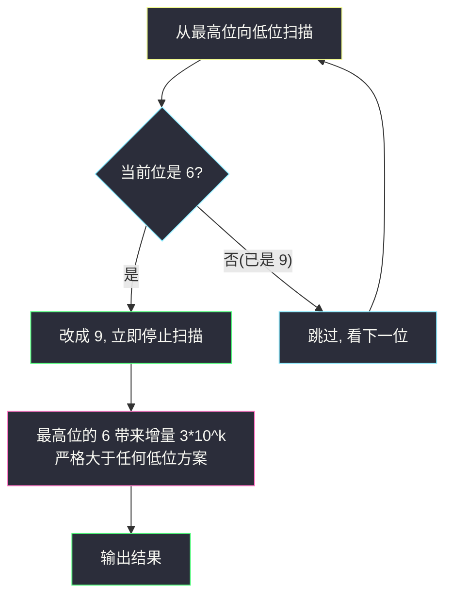

# 6 和 9 组成的最大数字（字典序贪心 · 高位优先）

## 一、问题描述

给你一个仅由数字 `6` 和 `9` 组成的正整数 `num`。你**最多只能变化一次**：把 `num` 中的某个 `6` 变成 `9`。请返回可以得到的**最大**数字。

> 🔗 LeetCode 1323：https://leetcode.cn/problems/maximum-69-number/
>
> 数据范围：`1 <= num <= 10^4`，`num` 由数字 `6` 和 `9` 组成。

**示例 1**

```
输入：num = 9669
输出：9969
解释：改变第一位 6 可以得到最大值 9969。
```

**示例 2**

```
输入：num = 9996
输出：9999
解释：改变最后一位 6，9999 是可以得到的最大值。
```

**示例 3**

```
输入：num = 9999
输出：9999
解释：没有 6 可以变化，返回原数字。
```

**直观理解**

「最多变一次」的决策点只有一个：**变哪一个 6（或者不变）**。比较的是不同位置带来的增益，而十进制数的比较规则是**高位优先**——这正是字典序贪心（灵茶题单 §3.1）最短的入门题：**求最大，就让高位尽量大；高位定了，再看次高位**。

---

## 二、暴力解法

枚举每一个 `6` 所在的位置，把它变成 `9` 得到候选值，取所有候选（含「不变」）中的最大值。

```python
class Solution:
    def maximum69Number(self, num: int) -> int:
        s = str(num)
        ans = num                                # 候选 0：一个都不变
        for i, ch in enumerate(s):
            if ch == '6':                        # 尝试只变这一个 6
                ans = max(ans, int(s[:i] + '9' + s[i + 1:]))
        return ans
```

### 复杂度

- **时间**：`O(L^2)`，`L` 为位数（每个候选都要重造一次字符串与整数，`num <= 10^4` 故 `L <= 4`）。
- **空间**：`O(L)`。

### 🔴 瓶颈在哪里

每个位置的增益其实**天生不平等**：高位的 `6` 变 `9` 涨得多，低位的涨得少。暴力把所有位置平等对待、逐个试出来，是在重复计算「显然」的大小关系——而位权（`10^k`）恰恰把所有候选的大小一次性排好了序。

---

## 三、优化探索（核心章节）

> 📚 本题在灵茶题单中属于 **§3.1 字典序最小/最大**，核心套路：**字典序最大 ⇒ 高位尽量大；高位确定后看次高位**。本题是这一套路的最短形态。

### 3.1 把「变大」翻译成数值增量

设某个 `6` 位于从低往高数的第 `k` 位（位权 `10^k`），把它变成 `9`，数值恰好增加：

```
delta = (9 - 6) * 10^k = 3 * 10^k
```

其余位一概不动。于是「选哪个 6」等价于「选哪个增量」：

| 6 所在位权 | 增量 |
|-----------|------|
| 个位 | `3` |
| 十位 | `30` |
| 百位 | `300` |
| 千位 | `3000` |

增量随位权**严格递增**，所以「最高位的 6」带来最大增量；若没有 `6`，则一个都不变（增量 `0`）。

### 3.2 用字典序语言重述

两个长度相同的数字串比较大小即比较字典序。`9669` 的候选：`9969`、`9699`。从高位往低位看，`9969` 在第 2 位就出现 `9`，而 `9699` 那里还是 `6`——**高位先变大者胜**。所以从左到右扫描，遇到**第一个** `6` 就变 `9` 并停止：更高位已经全是 `9`（都是最大数字），动不了；这一位从 `6` 提到 `9` 是当前能取得的最高位提升。

### 3.3 证明（构造的合法性 + 最优性）

- **合法性**：只把一个 `6` 改成 `9`，且只改一次，符合「最多变化一次」。
- **最优性**：设最高位的 `6` 在第 `k1` 位，任何其他方案要么不变（增量 `0`），要么改第 `k2 < k1` 位的 `6`（增量 `3 * 10^k2 < 3 * 10^k1`）。改第 `k1` 位的增量严格最大，故结果最大。∎



### 3.4 一句话核心

> **最高位的 `6` 变 `9`**——高位优先，一步定答案；没有 `6` 则原样返回。

---

## 四、代码实现

### Python（主解：替换最高位的 6）

```python
class Solution:
    def maximum69Number(self, num: int) -> int:
        return int(str(num).replace('6', '9', 1))
```

`str.replace` 的第三个参数 `1` 表示**只替换第一次出现**——从左往右第一次出现正是最高位，与手写扫描完全等价。

不依赖字符串 API 的数值写法（找回「最高位的 6」的位置再加工）：

```python
class Solution:
    def maximum69Number(self, num: int) -> int:
        x, k = num, -1            # k: 最高位的 6 所在位权, 初始 -1 表示没有 6
        p = 1                     # 当前位权
        while x:
            if x % 10 == 6:       # 从低位往高位扫, 记录最后一次(即最高)出现
                k = p
            x //= 10
            p *= 10
        return num if k < 0 else num + 3 * k
```

### Java（最优解同款）

```java
class Solution {
    public int maximum69Number(int num) {
        return Integer.parseInt(String.valueOf(num).replace('6', '9'));
    }
}
```

`String.replace(char, char)` 会替换**所有** `6`——但由 `6` 和 `9` 组成的数里……不行，`9669` 会变成 `9999` 而非 `9969`。必须只换第一次：

```java
class Solution {
    public int maximum69Number(int num) {
        return Integer.parseInt(String.valueOf(num).replaceFirst("6", "9"));
    }
}
```

---

## 五、具体例子演示

### 例 1：num = 9669（示例 1）

从高位到低位逐位决策（「当前看哪位、是否触发变换」的逐步表）：

| 步 | 当前位（从左数） | 该位数字 | 是 6? | 动作 | 当前数值 |
|----|------------------|----------|-------|------|----------|
| 1 | 第 1 位 | 9 | 否 | 已是最大数字，跳过 | `9669` |
| 2 | 第 2 位 | 6 | **是** | 变 9，停止扫描 | `9969` |

结束，输出 `9969`。对照增量视角：第 2 位的 6 位权 `100`，增量 `3 * 100 = 300`，`9669 + 300 = 9969` ✓，且严格大于改第 3 位的 `9669 + 30 = 9699`。

### 例 2：num = 9996（示例 2）

| 步 | 当前位 | 该位数字 | 是 6? | 动作 | 当前数值 |
|----|--------|----------|-------|------|----------|
| 1 | 第 1 位 | 9 | 否 | 跳过 | `9996` |
| 2 | 第 2 位 | 9 | 否 | 跳过 | `9996` |
| 3 | 第 3 位 | 9 | 否 | 跳过 | `9996` |
| 4 | 第 4 位 | 6 | **是** | 变 9，结束 | `9999` |

唯一的 6 在最低位，也只能改它，输出 `9999` ✓。

### 例 3：num = 9999（示例 3）

| 步 | 当前位 | 该位数字 | 是 6? | 动作 |
|----|--------|----------|-------|------|
| 1-4 | 每一位 | 9 | 否 | 全部跳过，一次变换也没用 |

扫完没有 6，原样返回 `9999` ✓——「最多变一次」允许零次。

---

## 六、复杂度分析

| 方法 | 时间 | 空间 | 说明 |
|------|------|------|------|
| 枚举每个 6 | `O(L^2)` | `O(L)` | 每个候选重新构造整数 |
| **只改最高位 6（本篇）** | `O(L)` | `O(L)`（字符串）/ `O(1)`（数值法） | 一趟扫描定位置，`L <= 4` 视作常数 |

---

## 七、对比总结

**字典序贪心的通用姿势（本题即最简形态）**

| 目标 | 贪心方向 | 本题对应 |
|------|----------|----------|
| 字典序 / 数值**最大** | 高位尽量**大** | 最高位的 `6` 提到 `9` |
| 字典序 / 数值**最小** | 高位尽量**小** | 如 #2375 构造最小数字 |

两条共享同一个骨架：**从最高位向低位扫，在「不破坏后续可行性」的前提下让当前位取到极值；高位确定后再看次高位。** 本题没有后续可行性约束（怎么变都合法），所以第一位碰到的 6 直接变；同批的 `construct-smallest-number-from-di-string.md`（根据模式串构造最小数字）加上了「排列 + I/D 模式」的可行性约束，骨架不变、难度上一个台阶。

**易错点**

1. Java 误用 `replace('6','9')` 换掉所有 6：`9669 → 9999` 是错的，必须 `replaceFirst`。
2. 忘记「最多一次」允许零次：`9999` 要原样返回，别硬找 6。
3. 以为要比较多个候选：位权已天然排序，**第一个** 6 就是答案，无需 `max`。

---

## 八、举一反三

| 题目 | 关系 |
|------|------|
| [2375. 根据模式串构造最小数字](https://leetcode.cn/problems/construct-smallest-number-from-di-string/) | 同节 §3.1 姊妹题：字典序**最小**方向 + 可行性约束，见同批 `construct-smallest-number-from-di-string.md` |
| [3170. 删除星号以后字典序最小的字符串](https://leetcode.cn/problems/lexicographically-minimum-string-after-removing-stars/) | 字典序最小 + 贪心栈，见同目录 `lexicographically-minimum-string-after-removing-stars.md` |
| [402. 移掉 K 位数字](https://leetcode.cn/problems/remove-k-digits/) | 高位优先的经典：删哪些位使剩余数最小 |
| [316. 去除重复字母](https://leetcode.cn/problems/remove-duplicate-letters/) | 同款「贪心 + 单调栈」保字典序最小 |
| [2384. 最大回文数字](https://leetcode.cn/problems/largest-palindromic-number/) | 同批「构造 + 贪心」lane：频次统计从大到小填两侧，见 `largest-palindromic-number.md` |

**思想迁移**

- 数字串比大小 = 定长字典序比较，**位权就是天然的优先级**。
- 「最多操作一次」类问题，先算清每次操作的增量/减量，再按优先级挑最大的一次。
- 口诀：**「要最大，高位大；见六且最高，换九就收工。」**
