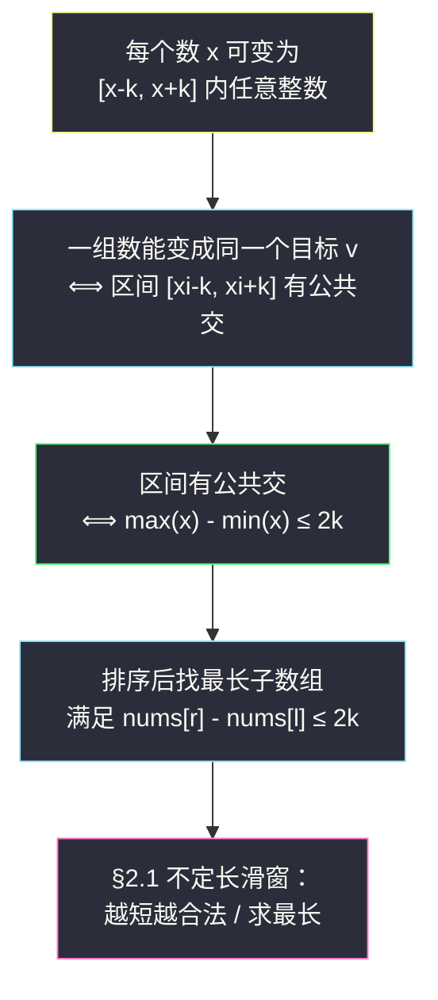
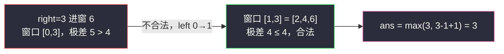

# 数组的最大美丽值（不定长滑窗 · 越短越合法 / 求最长）

## 一、问题描述

给你一个下标从 `0` 开始的整数数组 `nums` 和一个非负整数 `k`。你可以对**每个下标至多执行一次**操作：

> 选择下标 `i`，把 `nums[i]` 变成 `[nums[i] - k, nums[i] + k]` 范围内的**任意一个整数**。

数组的**美丽值**定义为：操作全部完成后，数组中出现次数最多的那个元素的出现次数（所有元素可以都不操作）。

请你返回最终能得到的**最大美丽值**。

> 🔗 LeetCode 2779：https://leetcode.cn/problems/maximum-beauty-of-an-array-after-applying-operation/
>
> 数据范围：`1 <= nums.length <= 10^5`，`0 <= nums[i] <= 10^5`，`0 <= k <= 10^5`。

**示例 1**

```
输入：nums = [4,6,1,2], k = 2
输出：3
解释：把 1 变成 3、6 变成 4（也可以把 2 变成 4），
     排序后子数组 [2,4,6] 中的三个数都能变成同一个值 4，美丽值为 3。
```

**示例 2**

```
输入：nums = [1,1,1,1], k = 10
输出：4
解释：所有数本来 就相等，一个操作都不用做。
```

**直观理解**

「选出若干个数让它们最终相等」——每个数 `x` 的可达集合是一段**闭区间** `[x-k, x+k]`。一组数能同时变成某个目标值 `v`，当且仅当这些区间有公共部分。区间求交的经典结论是：**有公共点 ⟺ max − min ≤ 2k**。于是问题变成：选出尽可能多的一组数，满足最大值减最小值不超过 `2k`——这天然指向「排序 + 滑动窗口」。

---

## 二、暴力解法

先排序，然后枚举所有子数组 `[l..r]`，检查 `nums[r] - nums[l] <= 2k` 是否成立，取最长的合法子数组长度。

```python
class Solution:
    def maximumBeauty(self, nums: List[int], k: int) -> int:
        nums.sort()
        n, ans = len(nums), 0
        for l in range(n):
            for r in range(l, n):
                if nums[r] - nums[l] <= 2 * k:      # 排序后 nums[r] 最大、nums[l] 最小
                    ans = max(ans, r - l + 1)
                else:
                    break                            # 后面 r 更大，必然更不合法，剪枝
        return ans
```

### 复杂度

- **时间**：`O(n²)`（最坏情况如全相等数组，内层不 break）。
- **空间**：`O(1)`（不计排序的栈空间）。

### 🔴 瓶颈在哪里

`n = 10^5` 时 `n² = 10^10`，远超时限。问题出在：`l` 每次右移后，`r` 又从 `l` 重新出发，窗口信息没有复用。观察发现 `l` 和 `r` 都是**只前进不后退**的——这正是滑动窗口的形状。

---

## 三、优化探索（核心章节）

> 📚 本题在灵茶题单中属于 **§2.1 越短越合法 / 求最长（不定长滑动窗口 · 第一类）**。灵神对这一类的口诀是：**窗口内不合法才收缩**——右端点每轮无条件前进，一旦窗口不合法就不断吐出左端点，直到重新合法，再更新答案。

### 3.1 第一步转化：操作区间化

每个元素 `x` 操作一次后可以变成 `[x-k, x+k]` 内的任意整数；不操作就是 `x` 本身（相当于区间内取 `x`）。所以「选中的一组数能否变成同一个值」与它们的原始顺序无关，只与数值有关。

一组数 `{x1, x2, ..., xj}` 能同时变成某个 `v` ⟺ 存在 `v` 落在所有区间 `[xi-k, xi+k]` 内 ⟺ 这些区间的交非空 ⟺ **`max(xi) - min(xi) <= 2k`**。



### 3.2 第二步转化：最优解一定取排序后的连续段

「选一组数」不需要它们在原数组中相邻，那最优组是排序后的连续段吗？是的：

> 设最优组 `S` 满足 `max(S) - min(S) <= 2k`。把排序后数值落在 `[min(S), max(S)]` 内的**所有**元素取出来记为 `T`（一段连续区间）。`T` 的最大最小值与 `S` 相同，所以 `T` 同样合法，且 `|T| >= |S|`。

因此只需在**排序后的数组**上找最长子数组，使其首尾差不超过 `2k`。

### 3.3 第三步转化：排序 + 滑窗

排序后有个巨大的红利：**窗口的最大值就是 `nums[right]`，最小值就是 `nums[left]`**，不需要任何维护最大/最小值的数据结构。

按 §2.1 模板「越短越合法 / 求最长」套：

- **进**：`right` 每轮 `+1`，窗口变长，`nums[right] - nums[left]` 只会不变或变大（越短越合法）；
- **收缩**：一旦 `nums[right] - nums[left] > 2k`，`left` 不断 `+1`；
- **更新**：窗口合法时，`ans = max(ans, right - left + 1)`。

注意收缩用 `while` 而不是 `if`：例如 `[1,1,1,100]`、`k=0`，`right` 走到 `100` 时 `left` 要一口气跳过三个 `1`。

### 3.4 一句话核心

> **「能同时变成一个数」⟺「极差 ≤ 2k」；排序把问题变成最长合法窗口，窗口不合法才收缩左端。**

---

## 四、代码实现

### Python（主解：排序 + 不定长滑窗）

```python
class Solution:
    def maximumBeauty(self, nums: List[int], k: int) -> int:
        nums.sort()
        ans = left = 0
        for right, x in enumerate(nums):       # x = nums[right]，窗口内最大值
            while x - nums[left] > 2 * k:      # 不合法才收缩（越短越合法）
                left += 1
            ans = max(ans, right - left + 1)   # 求最长
        return ans
```

**变量含义**

| 变量 | 含义 |
|------|------|
| `left` / `right` | 窗口左右端点，均只前进 |
| `x` | `nums[right]`，排序后即窗口最大值 |
| `nums[left]` | 窗口最小值 |
| `2 * k` | 合法极差上界（两个数各动 `k` 也能相遇） |

**循环不变式**：每轮更新答案时，`nums[right] - nums[left] <= 2k`，且 `left` 是满足该条件的最小左端点——窗口 `[left..right]` 是以 `right` 结尾的最长合法子数组。

### Java（最优解同款写法）

```java
class Solution {
    public int maximumBeauty(int[] nums, int k) {
        Arrays.sort(nums);
        int ans = 0;
        for (int left = 0, right = 0; right < nums.length; right++) {
            while (nums[right] - nums[left] > 2 * k) {
                left++;
            }
            ans = Math.max(ans, right - left + 1);
        }
        return ans;
    }
}
```

### 换个视角：二分也行

排序后窗口合法性关于 `left` 单调，也可以对每个 `right` 二分找第一个 `>= nums[right] - 2k` 的位置。时间同为 `O(n log n)`，但滑窗少一个 `log` 且代码更短，推荐滑窗。

---

## 五、具体例子演示

以 `nums = [4,6,1,2]`、`k = 2` 端到端走一遍。排序后 `nums = [1,2,4,6]`，合法条件 `极差 ≤ 2k = 4`。

| right | x = nums[right] | 收缩动作 | 窗口 [left, right] | 极差 | 窗口长度 | ans |
|-------|-----------------|----------|--------------------|------|----------|-----|
| 0 | 1 | 无（1−1=0 ≤ 4） | [0, 0] = [1] | 0 | 1 | 1 |
| 1 | 2 | 无（2−1=1 ≤ 4） | [0, 1] = [1,2] | 1 | 2 | 2 |
| 2 | 4 | 无（4−1=3 ≤ 4） | [0, 2] = [1,2,4] | 3 | 3 | **3** |
| 3 | 6 | 6−1=5 > 4 → left=1；6−2=4 ≤ 4 停 | [1, 3] = [2,4,6] | 4 | 3 | 3 |

最终答案 `3`：对应选出 `{2,4,6}`——`2→4`、`6→4`、`4` 不动，三个 `4`。✓

再看示例 2：`nums = [1,1,1,1]`、`k = 10`。极差恒为 `0 ≤ 20`，`left` 一步都不用动，`right = 3` 时窗口长 `4`，答案 `4`。✓



（上图：`right = 3` 这一步的收缩过程，`left` 从 0 推进到 1 后窗口恰好重新合法。）

---

## 六、复杂度分析

| 方法 | 时间 | 空间 | 说明 |
|------|------|------|------|
| 暴力枚举 | `O(n²)` | `O(1)` | 每个 `l` 重新扫 `r` |
| 排序 + 滑窗 | `O(n log n)` | `O(1)` | 排序 `O(n log n)`，滑窗 `O(n)`（`left`、`right` 合计至多前进 `2n` 次） |

（空间 `O(1)` 不计排序自身的递归栈，Python 的 `sort` 为 `O(n)` 辅助数组，Java 为 `O(log n)`。）

---

## 七、对比总结

**§2.1 家族的两个方向**

| 方向 | 口诀 | 代表题 |
|------|------|--------|
| 越短越合法 / 求最长（本篇） | 窗口内不合法才收缩 | #2779、#2831 |
| 越长越合法 / 求最短 | 窗口内不合法才扩张（收缩到恰好合法） | 见同目录 `minimum-subarray-length-with-distinct-sum-at-least-k.md` |

两者本质相同：单调性保证 `left` 不回头，只是答案记在「最长」还是「最短」。

**易错点**

1. **收缩必须 `while` 不是 `if`**：`left` 一次可能要跨多格（如 `[1,1,1,100]`、`k=0`）。
2. **`2k` 别写成 `k`**：两个数各自最多挪 `k`，相向而行最多靠近 `2k`。
3. **先排序**：不排序则 `nums[right]` 不是窗口最大值，条件失效。
4. 「操作至多一次」不等于「可以累积挪动」：区间是 `[x-k, x+k]`，不存在 `2k` 步漂移。

**模板（越短越合法求最长，Python 版）**

```python
nums.sort()
ans = left = 0
for right, x in enumerate(nums):
    while x - nums[left] > LIMIT:   # 不合法才收缩
        left += 1
    ans = max(ans, right - left + 1)
```

---

## 八、举一反三

| 题目 | 关系 |
|------|------|
| [1838. 最高频元素的频数](https://leetcode.cn/problems/frequency-of-the-most-frequent-element/) | 亲姊妹题：预算制「总共 +k 次」，排序后前缀和/滑窗，同为 §2.1 讲义例题 |
| [2831. 找出最长等值子数组](https://leetcode.cn/problems/find-the-longest-equal-subarray/) | 按值分组 + 排序下标 + 滑窗求最长，同款「越短越合法」 |
| [2009. 使数组连续的最少操作数](https://leetcode.cn/problems/minimum-number-of-operations-to-make-array-continuous/) | 排序 + 最长窗口（去重后极差约束）的对偶问法 |
| [3090. 每个字符最多出现两次的最长子串](https://leetcode.cn/problems/maximum-length-substring-with-two-occurrences/) | 同为「越短越合法求最长」，约束从极差换成字符计数 |
| [3795. 不同元素和至少为 K 的最短子数组](https://leetcode.cn/problems/minimum-subarray-length-with-distinct-sum-at-least-k/) | §2.1 反方向「越长越合法求最短」，见同目录 `minimum-subarray-length-with-distinct-sum-at-least-k.md` |

**思想迁移**

- 看到「每个数可以在 `[x-k, x+k]` 内变化 / 每个数 ±1 / 最多加 k」，第一反应：**排序 + 极差窗口**。
- 「选出的数与顺序无关」的问题，排序往往能免费赠送单调性。
- 口诀：**「区间有交才同值，极差不过两倍 k；排序滑窗步步进，不合法时吐左边。」**
