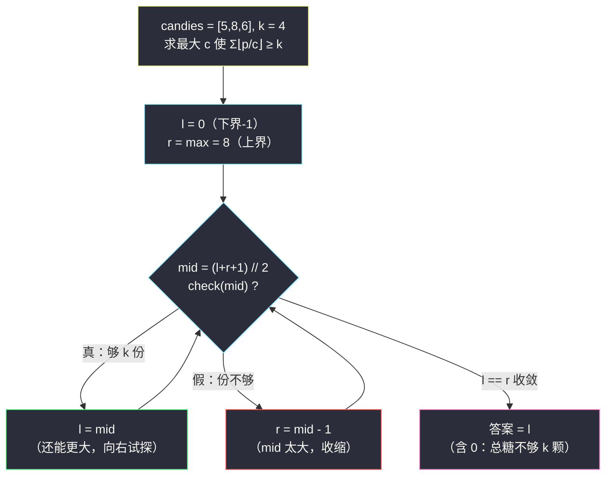

# 每个小孩最多能分到多少糖果（二分答案 · 求最大）

## 一、问题描述

给你一个下标从 0 开始的整数数组 `candies`，其中 `candies[i]` 表示第 `i` 堆糖果的个数。你可以把每一堆分成**任意多个子堆**，但不能把两堆合并到一起。

同时给你一个整数 `k`。你要把糖果分给 `k` 个小孩，使每个小孩分到**相同数目**的糖果，且每个小孩只能从**某一堆**中拿糖（可以有多堆不用，也可以某堆只用一部分）。

返回每个小孩**最多**能分到的糖果数目。

> 🔗 LeetCode 2226：https://leetcode.cn/problems/maximum-candies-allocated-to-k-children/
>
> 数据范围：`1 <= candies.length <= 10^5`，`1 <= candies[i] <= 10^7`，`1 <= k <= 10^12`。

**示例 1**

```
输入：candies = [5,8,6], k = 4
输出：4
解释：每份 4 颗——堆 5 分成 [4,1]、堆 8 分成 [4,4]、堆 6 分成 [4,2]，
共 1 + 2 + 1 = 4 份，恰好够 4 个小孩各拿 4 颗。
若每份 5 颗，只有 1 + 1 + 1 = 3 份，不够 4 人，因此答案取 4。
```

**示例 2**

```
输入：candies = [2,5], k = 11
输出：0
解释：糖果总数 7 < 11，连「每人 1 颗」都做不到，答案为 0。
```

**直观理解**

若规定「每份恰好 `c` 颗」，由于不能合并堆，堆 `p` 最多贡献 `⌊p / c⌋` 份。于是「每份 `c` 颗能否分给 `k` 人」就是一个**可计算的判定**：`⌊5/c⌋ + ⌊8/c⌋ + ⌊6/c⌋ >= k`？`c` 越大份数越少——判定结果随 `c` 单调翻转，这正是**二分答案**的信号，而且是「求最大」形态：**求满足 `check(c)` 的最大 `c`**。

---

## 二、暴力解法

从大到小枚举每份的糖果数 `c`（上限 `max(candies)`，再大任何堆都切不出一份），逐个验证。

```python
class Solution:
    def maximumCandies(self, candies: List[int], k: int) -> int:
        for c in range(max(candies), 0, -1):   # 从大到小试
            if sum(p // c for p in candies) >= k:
                return c
        return 0                                # 连 c=1 都不够 k 份
```

### 复杂度

- **时间**：`O(maxV * n)`，`maxV` 可达 `10^7`、`n` 可达 `10^5` → 最坏 `10^12` 次除法，必然超时。
- **空间**：`O(1)`。

### 🔴 瓶颈在哪里

线性枚举把「可行 / 不可行」的边界一格一格试探，但答案空间是**单调分界**的：小于等于某个值全可行、大于它全不可行。单调分界用二分，`10^7` 的空间只需 `log(10^7) ≈ 23` 次探测。

---

## 三、优化探索（核心章节）

> 📚 本题在灵茶题单中属于 **§2.2 二分答案 · 求最大**。与「求最小」互为镜像：求最小的口诀是「`l = 下界`，`r = 上界 + 1`，`if (check(mid)) r = mid else l = mid + 1`，答案 `l`」；**求最大则反过来**——`l = 下界 - 1`，`r = 上界`，`mid` 向上取整，`if (check(mid)) l = mid else r = mid - 1`，答案 `l`。

### 3.1 判定函数与单调性

设每份 `c` 颗，堆 `p` 能出 `⌊p / c⌋` 份，定义：

```
check(c) = ( Σ ⌊candies[i] / c⌋ ) >= k
```

- `c` 变大 → 每项 `⌊p/c⌋` 变小（或不变）→ 总份数**单调不增**；
- 所以 `check` 从某个分界点开始由真变假：`[0, ans]` 全真，`(ans, +∞)` 全假。

「可行区间是前缀 + 求分界点右端」→ 二分求最大。

### 3.2 答案的上下界与「0 的边界」

- **上界**：`max(candies)`。一份必须完整装进某一堆，`c > maxV` 时连最大堆都切不出一份，总份数为 0。
- **下界**：`1`。每份至少 1 颗。
- **答案可以是 0**：当糖果总数 `< k`（示例 2），`check(1)` 都为假。此时二分会收敛到 `l = 0`——所以初始 `l` 取「下界 − 1 = 0」，让 0 被搜索区间天然包含，**不需要**提前特判（当然，先判 `sum(candies) < k` 直接返回 0 也对，还能省一趟二分）。

### 3.3 求最大模板：为什么 mid 要向上取整

求最大时区间形态是 `(l, r]`，`check` 真向右收 `l = mid`。当 `l = r - 1` 时若 `mid = (l + r) // 2 = l`，一旦 `check(l)` 为真，执行 `l = mid` 后区间不动——**死循环**。取 `mid = (l + r + 1) // 2`（向上取整）保证这种情况下 `mid = r`，要么 `l = r` 收敛结束，要么 `r = mid - 1` 区间缩小。这是「求最大」与「求最小」模板最直观的一处镜像差异。



### 3.4 两种模板的一张对照表

| | 求最小（§2.1 形态） | 求最大（本篇形态） |
|---|---------------------|---------------------|
| 区间 | `[l, r)`，`r = 上界 + 1` | `(l, r]`，`l = 下界 − 1` |
| mid | `(l + r) // 2` 下取整 | `(l + r + 1) // 2` 上取整 |
| check 为真 | `r = mid`（向左收缩） | `l = mid`（向右收缩） |
| check 为假 | `l = mid + 1` | `r = mid - 1` |
| 答案 | `l` | `l` |

另一个等价视角（灵神也常用）：**求最大的可行 `c` = 求最小的不可行 `c`，再减一**。把 `check` 取反套「求最小」模板，得到首个失败位置 `F`，答案 `F - 1`。两种写法殊途同归，理解一个即可。

### 3.5 一句话核心

> **「每份 c 颗」的可行性随 c 单调翻转，Σ⌊p/c⌋ ≥ k 就是判定式；求最大用镜像模板——`l` 从「下界 − 1」起（把 0 兜进区间），`mid` 上取整防死循环。**

---

## 四、代码实现

### Python（主解：二分答案求最大）

```python
class Solution:
    def maximumCandies(self, candies: List[int], k: int) -> int:
        def check(c: int) -> bool:
            """每份 c 颗：能切出的总份数是否 >= k"""
            cnt = 0
            for p in candies:
                cnt += p // c
                if cnt >= k:          # 提前退出，k 可达 10^12 不虚
                    return True
            return False

        l, r = 0, max(candies)        # l = 下界-1（兜住答案 0），r = 上界
        while l < r:
            mid = (l + r + 1) // 2    # 向上取整，防 l=r-1 时死循环
            if check(mid):
                l = mid               # mid 可行：向更大试探
            else:
                r = mid - 1           # mid 不可行：收缩
        return l
```

**变量含义**

| 变量 | 含义 |
|------|------|
| `check(c)` | 每份 `c` 颗时 `Σ⌊candies[i]/c⌋ >= k` 是否成立 |
| `l` / `r` | 搜索区间 `(l, r]` 两端；循环不变式：`check(l)` 为真（除初始 0 外）、`check(r+1)` 为假 |
| `mid` 上取整 | 保证「真则 `l = mid`」时区间必然变化 |
| 返回 `l` | 最大的可行 c；总糖不足时收敛为 0 |

**循环不变式**：任意时刻，「`<= l` 的 c 全部可行（或 `l = 0` 未验证）」与「`> r` 的 c 全部不可行」同时成立；`l == r` 时 `l` 就是分界点本身。

### Java（最优解同款写法，注意用 long）

```java
// 每个小孩最多能分到多少糖果
// 测试链接 : https://leetcode.cn/problems/maximum-candies-allocated-to-k-children/
class Solution {
    public int maximumCandies(int[] candies, long k) {
        int maxV = 0;
        for (int p : candies) {
            maxV = Math.max(maxV, p);
        }
        int l = 0, r = maxV;               // l = 下界-1，r = 上界
        while (l < r) {
            int mid = l + (r - l + 1) / 2; // 向上取整
            if (check(candies, k, mid)) {
                l = mid;
            } else {
                r = mid - 1;
            }
        }
        return l;
    }

    private boolean check(int[] candies, long k, int c) {
        long cnt = 0;                      // Σ⌊p/c⌋ 可达 10^12，必须 long
        for (int p : candies) {
            cnt += p / c;
            if (cnt >= k) {
                return true;
            }
        }
        return false;
    }
}
```

---

## 五、具体例子演示

以 `candies = [5,8,6]`、`k = 4` 端到端走一遍。上界 `max = 8`，初始 `l = 0`、`r = 8`。

**第 1 轮：`mid = (0 + 8 + 1) // 2 = 4`**

| 堆 p | ⌊p/4⌋ |
|------|-------|
| 5 | 1 |
| 8 | 2 |
| 6 | 1 |

合计 `4 >= 4` ✓ → `l = 4`。（4 份：`[4]`、`[4,4]`、`[4,2]`，恰好 4 个孩子每人 4 颗。）

**第 2 轮：`mid = (4 + 8 + 1) // 2 = 6`**

| 堆 p | ⌊p/6⌋ |
|------|-------|
| 5 | 0 |
| 8 | 1 |
| 6 | 1 |

合计 `2 < 4` ✗ → `r = 5`。

**第 3 轮：`mid = (4 + 5 + 1) // 2 = 5`**

| 堆 p | ⌊p/5⌋ |
|------|-------|
| 5 | 1 |
| 8 | 1 |
| 6 | 1 |

合计 `3 < 4` ✗ → `r = 4`。此时 `l == r == 4`，循环结束，**答案 4** ✓。

汇总成二分轨迹表：

| 轮次 | l | mid | r | check(mid)（份数） | 动作 |
|------|---|-----|---|--------------------|------|
| 1 | 0 | 4 | 8 | ✓（4 ≥ 4） | l = 4 |
| 2 | 4 | 6 | 8 | ✗（2 < 4） | r = 5 |
| 3 | 4 | 5 | 5 | ✗（3 < 4） | r = 4 |
| 结束 | 4 | — | 4 | — | 答案 = 4 |

**再走「0 的边界」**：`candies = [2,5]`、`k = 11`。`r = 5`，无论 `mid` 取何值，`check` 里总份数最多 `2 + 5 = 7 < 11`，永远返回假 → 每轮都 `r = mid - 1`，最终 `l == r == 0`，返回 0 ✓。全程没有为 0 写一行特判——它就是「初始 `l` 取下界 − 1」的红利。

顺带一提 `l = r - 1` 的瞬间在第 3 轮前出现（`l=4, r=5`）：`mid = (4+5+1)//2 = 5 = r` 而不是 `4 = l`——若忘了 `+1` 向上取整，`mid` 落在 `l` 且 `check` 为真时 `l = mid` 原地踏步，正是死循环现场。

---

## 六、复杂度分析

| 方法 | 时间 | 空间 | 说明 |
|------|------|------|------|
| 暴力倒序枚举 | `O(maxV * n)` | `O(1)` | `10^7 * 10^5 = 10^12`，超时 |
| 二分答案（主解） | `O(n log maxV)` | `O(1)` | 约 `23` 轮 × `O(n)` 判定，`2.3 * 10^6` 次除法 |

（`log maxV = log 10^7 ≈ 23`；不计输入存储的额外空间。）

---

## 七、对比总结

**本题是「二分答案 · 求最大」的标准件**，和「求最小」一族共享同一个判定-收缩骨架，只是方向镜像：

| | #875 珍妮珂珂（求最小） | #1870 准时列车（求最小） | #2226 本篇（求最大） |
|---|--------------------------|--------------------------|------------------------|
| 二分的量 | 吃糖速度 | 列车时速 | 每份糖果数 |
| check | Σ⌈p/v⌉ ≤ h | Σ⌈d/v⌉ + 尾段 ≤ hour | Σ⌊p/c⌋ ≥ k |
| 方向 | 速度越大越快满足 → 向左收 | 时速越大越快满足 → 向左收 | 每份越大越难满足 → 向右收 |
| 无解形态 | 不存在（h 足够大总可行） | hour ≤ n−1 → -1 | 总糖 < k → 0 |

**易错点**

1. **`mid` 忘记 `+1` 向上取整**：`l = r - 1` 且 `check(l)` 为真时死循环，这是「求最大」模板第一大坑（第五节最后一轮就是现场）。
2. **初始 `l` 取 0 而不是 1**：把「无解输出 0」含进搜索区间，省掉特判；若坚持 `l = 1`，就要另判 `sum(candies) < k` 提前返回 0。
3. **溢出**：`k` 与总份数都可到 `10^12`，Java 的 `check` 计数器必须 `long`；Python 无此问题。
4. 上界用 `max(candies)` 而非 `sum(candies)`：一份装不进任何堆就是 0 份，上界取 `sum` 只是白多二分几轮（答案不变但更慢）。
5. `check` 里记得「凑够 `k` 就提前返回」，`n * 23` 次除法本就不多，但提前退出是零成本的好习惯。

---

## 八、举一反三

| 题目 | 关系 |
|------|------|
| [875. 爱吃香蕉的珂珂](https://leetcode.cn/problems/koko-eating-bananas/) | 求最小镜像题：check 是 `Σ⌈p/v⌉ ≤ h`，`l = 下界`、`r = 上界 + 1` |
| [1283. 使结果不超过阈值的最小除数](https://leetcode.cn/problems/find-the-smallest-divisor-given-a-threshold/) | 同款除法判定 `Σ⌈x/d⌉ ≤ threshold`，求最小 |
| [1802. 有界数组中指定下标处的最大值](https://leetcode.cn/problems/maximum-value-at-a-given-index-in-a-bounded-array/) | 求最大 + 数学公式版 check（O(1) 判定） |
| [1011. 在 D 天内送达包裹的能力](https://leetcode.cn/problems/capacity-to-ship-packages-within-d-days/) | 求最小的经典运载能力题 |
| [1870. 准时到达的列车最小时速](https://leetcode.cn/problems/minimum-speed-to-arrive-on-time/) | 同批姊妹篇（§2.1 求最小），见 `minimum-speed-to-arrive-on-time.md`，与本篇互为方向镜像 |

**思想迁移**

- 见到「**每个单元能切出的份数 = ⌊总量 / 单元大小⌋**」或「消耗 = ⌈总量 / 单元大小⌉」，几乎必是二分答案题：单元大小是二分的量，求和式是 check。
- 求最大 / 求最小模板成对记忆：**「最小：mid 下取整、真则收右；最大：mid 上取整、真则收左。」**（收右 = `r = mid`，收左 = `l = mid`）
- 答案可能为 0 的题，把初始 `l` 设成「下界 − 1」，让 0 住进区间里，比到处写特判优雅得多。
- 口诀：**「份数 floor 加总判，越加越大越难办；求最大时 mid 上取，l 从负一起步防零弹。」**
