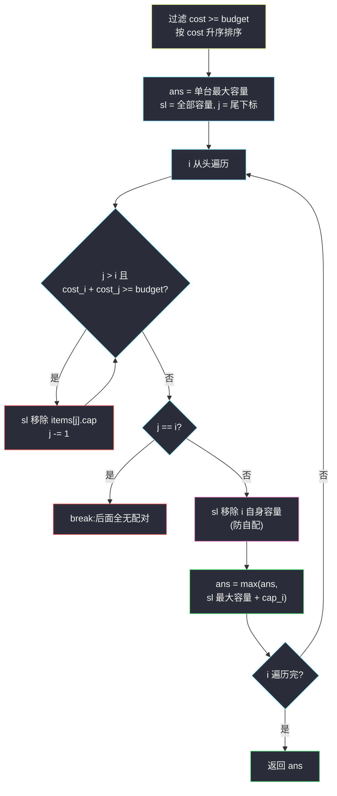

# 预算下的最大总容量(排序 + 有序集合 + 双指针 · 严格小于预算的两机最大容量和)

## 一、问题描述

给你两个长度为 `n` 的整数数组 `costs` 与 `capacity`,以及整数 `budget`:

- `costs[i]`:购买机器 `i` 的成本;
- `capacity[i]`:机器 `i` 的容量。

你最多可以购买**两台不同的机器**(也可以只买一台或不买),要求购买机器的**总成本严格小于 `budget`**(即 `总成本 < budget`),返回能获得的最大**总容量**。

> 🔗 LeetCode 3814:https://leetcode.cn/problems/maximum-capacity-within-budget/
>
> 数据范围:`1 <= n <= 10^5`,`1 <= costs[i], capacity[i] <= 10^5`,`1 <= budget <= 2 * 10^5`。

**示例 1**

```text
costs = [4,8,5,3], capacity = [1,5,2,7], budget = 8
输出:8
解释:买 0 号(成本 4,容量 1)与 3 号(成本 3,容量 7):总成本 7 < 8,总容量 1 + 7 = 8。
    注意 1 号机器成本 8,不满足 8 < 8,单买都不行。
```

**示例 2**

```text
costs = [3,5,7,4], capacity = [2,4,3,6], budget = 7
输出:6
解释:任何两台的成本之和都 >= 7,只能单买:成本 4、容量 6 的机器最优。
```

**示例 3**

```text
costs = [2,2,2], capacity = [3,5,4], budget = 5
输出:9
解释:任选两台成本和 4 < 5,取容量最大的两台 5 + 4 = 9。
```

**直观理解**

这是「两数之和」的**带预算最大化变体**:不再是「找到和恰好等于目标的两个数」,而是「在成本和严格小于预算的所有数对里,让容量和最大」。排序能解决成本约束的单调性,但「区间里容量最大」是动态的——排序 + 双指针 + 有序集合三件套各管一段。

---

## 二、暴力解法

枚举每一台与每一对机器,直接取最大:

```python
class Solution:
    def maximumCapacity(self, costs: List[int], capacity: List[int],
                        budget: int) -> int:
        n = len(costs)
        ans = 0                                  # 一台都不买
        for i in range(n):                       # 单台
            if costs[i] < budget:
                ans = max(ans, capacity[i])
        for i in range(n):                       # 两台
            for j in range(i + 1, n):
                if costs[i] + costs[j] < budget:
                    ans = max(ans, capacity[i] + capacity[j])
        return ans
```

### 复杂度

- **时间**:`O(n²)`——`n = 10^5` 时约 `5 * 10^9` 次判断,严重超时。
- **空间**:`O(1)`。

### 🔴 瓶颈在哪里

对每一对都重新做「成本合法吗」的判断,而这些判断高度重复:成本排序后,「谁能与 `i` 配对」是一段**连续区间**,区间本身随 `i` 单调移动——重复判断的解药是双指针;而区间里「容量最大」需要动态查询——解药是有序集合。

---

## 三、优化探索(核心章节)

> 📚 本题出自灵茶题单一期 **§1.2 进阶**(单调栈篇收录),模板要点:**排序 + 有序集合 + 双指针**——成本严格小于预算的两台机最大容量和。

### 3.1 观察特征

| 特征 | 说明 |
|------|------|
| 单台机器成本必 `< budget` | 两台组合成本更大,成本 ≥ budget 的机器**任何方案都不合法**,先过滤 |
| 成本排序后配对区间单调 | 固定 `i` 时,可配对的 `j` 恰是后缀 `(i, j_max]`,且 `i` 增大时 `j_max` 只左移 |
| 要的是区间内容量最大 | 双指针只会移动端点,不会告诉你区间里谁最大 → 需要动态最大值查询 |
| 容量可重复 | 多重集合,不能用去重的 set |

### 3.2 为什么「纯双指针」不够

经典的两数之和双指针(如 #167)只判**存在性**或计数;这里固定 `i` 后,要在「能与 `i` 配对」的整个后缀区间 `(i, j_max]` 里挑**容量最大**的那台——容量与成本无关(排序按成本),区间里容量最大的可能站在任何位置。区间随双指针**两端同时收缩**,这正是有序集合(或滑动窗口最大值)的用武之地:每个下标至多进出集合一次,总代价 `O(n log n)`。

### 3.3 关键一步:双指针 + 有序集合的配合

把过滤后的 `(cost, capacity)` 按 `cost` 升序为 `items`,`j` 从尾部出发,`sl` 维护多重有序集合,不变式:

> **处理第 `i` 轮取最大值时,`sl` 恰好等于 `{ items[t].capacity : i < t <= j }`**——即「下标比 `i` 大、且成本还能配上」的所有候选。

维护动作(按执行顺序):

1. `while j > i and cost_i + cost_j >= budget`:从 `sl` 移除 `items[j].capacity`,`j -= 1`(配不上的尾部永久出局,`i` 增大后更配不上);
2. 若 `j == i`:后面所有 `i' >= i` 都无配对,直接 `break`;
3. 从 `sl` 移除 `items[i].capacity` 自身——**防止自己和自己配对**(`sl` 此时必然还含着它,因为 `i < j`);
4. `ans = max(ans, sl[-1] + capacity_i)`,取走区间最大值。

`i` 自身移除后**不再放回**:下一轮的配对对象是 `i+1`,而「`i` 与 `i+1` 配对」在本轮 `sl` 已经覆盖(`sl` 区间 `(i, j]` 含 `i+1`),后续轮次无需重复。

### 3.4 流程图



### 3.5 一句话核心

> **成本排序给出配对区间的单调双端,有序集合扛住「区间容量最大」的动态查询;自身先出列,严格小于记心间。**

---

## 四、代码实现

### Python(主解:SortedList 双指针)

```python
from sortedcontainers import SortedList

class Solution:
    def maximumCapacity(self, costs: List[int], capacity: List[int],
                        budget: int) -> int:
        # 过滤单台就买不起的机器,按成本升序排序
        items = sorted((c, cap) for c, cap in zip(costs, capacity) if c < budget)
        k = len(items)
        ans = 0
        for _, cap in items:                     # 单台(最多买两台,含一台)
            ans = max(ans, cap)
        if k < 2:
            return ans

        sl = SortedList(cap for _, cap in items) # 候选容量多重集
        j = k - 1                                # 尾指针
        for i in range(k):
            ci, capi = items[i]
            while j > i and ci + items[j][0] >= budget:   # 配不上的尾部出局
                sl.remove(items[j][1])
                j -= 1
            if j == i:                           # 剩下只有自己,break
                break
            sl.remove(capi)                      # 移除自身,防自配
            if sl:
                ans = max(ans, sl[-1] + capi)    # 区间最大容量配 cap_i
        return ans
```

**变量含义**

| 变量 | 含义 |
|------|------|
| `items` | 过滤后按 `(cost, capacity)` 升序的机器表 |
| `sl` | 有序多重集合,取最大前恰好为 `{cap[t] : i < t <= j}` |
| `j` | 尾指针,随 `i` 增大单调左移 |
| `ans` | 初始为单台最大,逐轮被数对刷新 |

**循环不变式**:第 `i` 轮执行到 `ans = max(...)` 前,`sl` 恰含下标 `(i, j]` 的全部容量——`j` 的 while 只移除「> j」的,`i` 的自移除只删掉「≤ i」的,两侧夹出精确区间。

### 对拍验证(暴力 O(n²) 作参照)

```python
import random

def brute(costs, capacity, budget):
    n, ans = len(costs), 0
    for i in range(n):
        if costs[i] < budget:
            ans = max(ans, capacity[i])
    for i in range(n):
        for j in range(i + 1, n):
            if costs[i] + costs[j] < budget:
                ans = max(ans, capacity[i] + capacity[j])
    return ans

random.seed(0)
for _ in range(2000):
    n = random.randint(1, 30)
    costs = [random.randint(1, 60) for _ in range(n)]
    capacity = [random.randint(1, 100) for _ in range(n)]
    budget = random.randint(1, 120)
    assert Solution().maximumCapacity(costs, capacity, budget) \
        == brute(costs, capacity, budget)
print("对拍通过")
```

随机数据(含成本相同、预算边界、全过滤等情形)对拍 `2000` 组全部一致。

### Java(最优解环节:TreeMap 多重集)

```java
class Solution {
    public long maximumCapacity(int[] costs, int[] capacity, int budget) {
        int n = costs.length;
        int[][] items = new int[n][];
        int k = 0;
        long ans = 0;
        for (int i = 0; i < n; i++)
            if (costs[i] < budget) {
                items[k++] = new int[]{costs[i], capacity[i]};
                ans = Math.max(ans, capacity[i]);        // 单台
            }
        if (k < 2) return ans;
        Arrays.sort(items, 0, k, (a, b) -> a[0] - b[0]);
        TreeMap<Integer, Integer> cnt = new TreeMap<>();  // 容量 -> 个数
        for (int i = 0; i < k; i++)
            cnt.merge(items[i][1], 1, Integer::sum);
        int j = k - 1;
        for (int i = 0; i < k; i++) {
            while (j > i && items[i][0] + items[j][0] >= budget) {
                if (cnt.merge(items[j][1], -1, Integer::sum) == 0)
                    cnt.remove(items[j][1]);
                j--;
            }
            if (j == i) break;
            if (cnt.merge(items[i][1], -1, Integer::sum) == 0)   // 移除自身
                cnt.remove(items[i][1]);
            ans = Math.max(ans, cnt.lastKey() + (long) items[i][1]);
        }
        return ans;
    }
}
```

---

## 五、具体例子演示

用一个五元组例子端到端走主解(覆盖尾部左移、多轮配对、`j == i` 收尾三种情形):

```text
costs = [3,1,4,1,5], capacity = [9,2,8,7,3], budget = 6
过滤(cost < 6):全部保留
按 cost 排序 items = [(1,2), (1,7), (3,9), (4,8), (5,3)]   k = 5
```

**双指针移动与有序集合变化表**(`sl` 一律按升序展示;`sl[-1]` 为区间最大容量):

| 轮次 | i | (cost_i, cap_i) | j 的移动 | sl 变化 | sl[-1] | ans 更新 |
|------|---|------------------|----------|---------|--------|----------|
| 初始 | — | — | j = 4 | `[2,3,7,8,9]` | — | ans = 9(单台最大) |
| 1 | 0 | (1,2) | 1+5=6 ≥ 6 → 出局,j=4→3;1+4=5 < 6 停 | 移除 3:`[2,7,8,9]` | — | — |
| 1 | 0 | (1,2) | j=3 ≠ 0 | 移除自身 2:`[7,8,9]` | 9 | max(9, **2+9=11**) = 11 |
| 2 | 1 | (1,7) | 1+4=5 < 6,j 不动(=3) | 移除自身 7:`[8,9]` | 9 | max(11, **7+9=16**) = 16 |
| 3 | 2 | (3,9) | 3+4=7 ≥ 6 → 出局,j=3→2;j == i | 移除 8:`[9]` | — | — |
| 3 | 2 | (3,9) | **break** | — | — | — |

**关键回放**:

- **轮 1 尾部出局**:`(5,3)` 这台成本 5 的机器与任何 `i` 都配不上(最小成本 1 加它也到 6),永久出列——此后 `i` 再怎么前进都不必重看它;
- **轮 2 的区间断言**:`j` 停在 3,`sl` 恰为下标 `(1, 3]` 即 `{(3,9), (4,8)}` 的容量 `{9, 8}`,最大 9 与 `(1,7)` 配成 `7 + 9 = 16`,成本 `1 + 3 = 4 < 6` 合法 ✓;
- **轮 3 收尾**:`i = 2` 时 `j` 左移撞上 `i` 自身——`cost_2 = 3` 连和**最小的剩余候选**(其实就是它自己)都凑不出 `< 6`,后面 `i` 更大更不可能,`break` 干净收场。

**快速核对三个官方示例**:

- 示例 1:过滤后 `[(3,7),(4,1),(5,2)]`,轮 1 中 `3+5=8 ≥ 8` 出局 `(5,2)`,`3+4=7 < 8`,`sl` 剩 `{1}`,ans = `7+1 = 8`;轮 2 `j == i` break → **8** ✓;
- 示例 2:任何两台成本和 ≥ 7,双指针全部出局,`break` 后只剩单台答案 **6** ✓;
- 示例 3:`[(2,3),(2,5),(2,4)]`,两轮配对后 ans = `5+4 = 9` ✓。

**最终输出**(演示例):`16` ✓(暴力核对:最优对即 `(1,7)+(3,9)`,成本和 4 < 6)。

---

## 六、复杂度分析

| 方法 | 时间 | 空间 | 说明 |
|------|------|------|------|
| 暴力枚举数对 | `O(n²)` | `O(1)` | `n = 10^5` 超时 |
| 排序 + 双指针 + 有序集合(主解) | `O(n log n)` | `O(n)` | 排序 `O(n log n)`;`j` 总左移 `O(n)`,每次进出集合 `O(log n)` |

空间:有序集合与排序后数组各 `O(n)`。

---

## 七、对比总结

**同构链**——「两数之和」家族在约束上的三种变体:

| 题 | 数对约束 | 目标 |
|----|----------|------|
| #167 两数之和 II | 和**等于** target | 存在性(返回下标) |
| #1099 小于 K 的两数之和 | 和**小于** K | 最大化**和本身** |
| #3814 本篇 | 成本和**严格小于** budget | 最大化**另一个维度**(容量和) |

**易错点**

1. **严格小于**:判定条件是 `ci + cj < budget`,等号方向错一个,示例 1 的 8(成本恰好等于 budget)就会混进来;
2. **过滤别忘单台初始化**:「最多两台」包含一台——初始答案取「单台成本合法的最大容量」,不是 0(不买任何机器几乎不会是最优);
3. **移除自身防自配**:`sl` 里留着 `cap_i` 会算出 `2 * cap_i` 的假答案;
4. **`j == i` 必须 break** 而不是 continue:`i` 增大后可行区间只会更窄;
5. 容量可重复 → 有序**多重**集合,Java 用 `TreeMap` 计数而非 `TreeSet`;
6. 双指针的 `j` 停在「最后一个能配上的位置」,不要多减到第一个配不上的位置。

**模板(成本约束下的最优配对,Python)**

```python
items.sort()                          # 按成本升序
sl = SortedList(所有容量)
j = len(items) - 1
for i in range(len(items)):
    while j > i and cost_i + cost_j >= budget:
        sl.remove(cap_j); j -= 1      # 出局即出局
    if j == i: break
    sl.remove(cap_i)                  # 自身出列
    ans = max(ans, sl[-1] + cap_i)    # 区间最大配对
```

---

## 八、举一反三

| 题目 | 关系 |
|------|------|
| [1099. 小于 K 的两数之和](https://leetcode.cn/problems/two-sum-less-than-k/) | 一维版雏形:纯双指针即可,对比理解本题为何需要有序集合 |
| [2817. 限制条件下元素之间的最小差值](https://leetcode.cn/problems/minimum-absolute-difference-between-elements-with-restriction/) | SortedList + 单调指针的同款配合,索引约束换成了距离约束 |
| [719. 找出第 K 小的数对距离](https://leetcode.cn/problems/find-k-th-smallest-pair-distance/) | 排序 + 双指针 + 二分的组合拳,同族进阶 |
| [2563. 统计公平数对的数目](https://leetcode.cn/problems/count-the-number-of-fair-pairs/) | 同目录 `count-the-number-of-fair-pairs.md`:排序后双指针/二分数对计数的姊妹题 |
| [901. 股票价格跨度](https://leetcode.cn/problems/online-stock-span/) | 同目录 `online-stock-span.md`:单调栈经典,体会「单调结构」家族的分工 |

**思想迁移**

- **排序买断单调性**:凡是「和/差满足某阈值」的数对约束,先排序——可行配对立刻变成一段连续区间,双指针的移动合法性由此而来;
- **双指针答「边界」,有序集合答「内容」**:指针只维护区间的两个端,区间内部的极值查询交给有序集合/单调队列——认清这一分工,类似题目可以快速套模板;
- **初始化覆盖退化情形**:「最多选 k 个」类问题,记得把「选 1 个」「选 0 个」的最优值放进初始答案,别让主循环只顾配对忘了单人方案。
