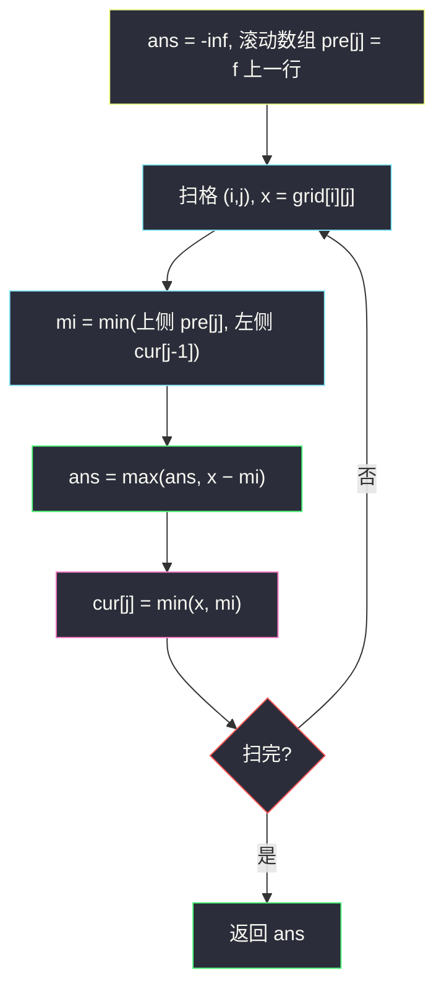

# 3148. 矩阵中的最大得分（Maximum Difference Score in a Grid）

> 题目来源：[https://leetcode.cn/problems/maximum-difference-score-in-a-grid/](https://leetcode.cn/problems/maximum-difference-score-in-a-grid/)
>
> 灵茶题单小节定位：§A 线性 DP（网格 DP · 望远镜求和转化）

## 一、问题描述

给你一个由**正整数**组成、大小为 `m x n` 的矩阵 `grid`。你可以从矩阵中的任一单元格移动到另一个位于**正下方或正右侧**的任意单元格（不必相邻）。从值为 `c1` 的单元格移动到值为 `c2` 的单元格的得分为 `c2 - c1`。

你可以从**任一**单元格开始，并且必须**至少移动一次**。

返回你能得到的**最大**总得分。

**数据范围**：

- `m == grid.length`
- `n == grid[i].length`
- `2 <= m, n <= 1000`
- `4 <= m * n <= 10⁵`
- `1 <= grid[i][j] <= 10⁵`

**示例 1**：

```text
输入：grid = [[9,5,7,3],[8,9,6,1],[6,7,14,3],[2,5,3,1]]
输出：9
解释：从 (0,1) 开始：(0,1)→(2,1) 得 7-5=2；(2,1)→(2,2) 得 14-7=7；总得分 9。
```

**示例 2**：

```text
输入：grid = [[4,3,2],[3,2,1]]
输出：-1
解释：从 (0,0) 移动到 (0,1)，得分 3-4 = -1。
```

**核心思考点**：多步移动的得分逐项累加 `c2-c1 + c3-c2 + ... = c_k - c1`——中间项**望远镜式抵消**，总得分只由「起点值 − 终点值」决定（起点须在终点的左上方向）。于是每个格子只需回答：「左上方所有格子中的最小值是多少」——行前缀 min + 列滚动即可，一格 `O(1)`。

## 二、暴力解法

### 思路

枚举每一对 `(起点, 终点)`（起点在终点左上），得分 = `grid[终] − grid[起]`，取最大。`O((mn)²)` 对组合，仅对拍基准。

### 代码

```python
def maxScoreBrute(grid: list[list[int]]) -> int:
    m, n = len(grid), len(grid[0])
    ans = -float("inf")
    for i2 in range(m):
        for j2 in range(n):
            for i1 in range(i2 + 1):
                for j1 in range(j2 + 1):
                    if i1 == i2 and j1 == j2:
                        continue
                    ans = max(ans, grid[i2][j2] - grid[i1][j1])
    return ans
```

### 复杂度

- 时间：`O(m²n²)`——`mn = 10⁵` 时 10¹⁰，不可行。
- 空间：`O(1)`。

## 三、优化探索

### 3.1 望远镜抵消：总得分 = 终点 − 起点 ⭐⭐

设路径依次经过 `c1 → c2 → ... → ck`（每步向右/下任意距离），总得分：

```text
(c2 − c1) + (c3 − c2) + ... + (ck − ck−1) = ck − c1
```

中间格子全部一加一减消掉。**最优路径必是两格直连**（任何多跳路径的得分等于首尾直连，不优不劣但直连总可行——只要首尾可直达，右/下方向传递可达）。问题坍缩为：

```text
max over 终点 (i,j) of [ grid[i][j] − min{ grid[i'][j'] : i' ≤ i, j' ≤ j, (i',j') ≠ (i,j) } ]
```

### 3.2 「左上最小值」的递推 ⭐⭐

定义 `f[i][j]` = 以 `(i,j)` 为**右下角**的矩形（含自身）内的最小格值：

```text
f[i][j] = min( grid[i][j], f[i-1][j], f[i][j-1] )
```

（子矩形的并 = 上矩形 ∪ 左矩形 ∪ 自身，三者 min 覆盖全部。）答案扫描时对每个非起点格用 `grid[i][j] − min(f[i-1][j], f[i][j-1])`（**不含自身**的左上最小）更新。`f` 可滚动到一行。

### 3.3 至少移动一次 ⇒ 起点必 ≠ 终点 ⭐

「必须移动」意味着得分对 `(起点, 终点)` 中两点不同——若允许原地不动，`x − x = 0` 会把全降矩阵的答案错误抬到 0（示例 2 应为 −1）。实现上取 `min(f[i-1][j], f[i][j-1])`（严格左上、不含自身）作为起点池即可，首行首列的 `f` 侧 inf 哨兵自动排除非法来源。



## 四、代码实现

### 主解：滚动行 + 左上最小

```python
class Solution:
    def maxScore(self, grid: List[List[int]]) -> int:
        n = len(grid[0])
        INF = float("inf")
        pre = [INF] * n                 # 上一行的 f 值（首行哨兵全 inf）
        ans = -INF
        for row in grid:
            cur = [0] * n
            left = INF                  # 当前行左侧的 f 值
            for j, x in enumerate(row):
                mi = min(pre[j], left)  # 不含自身的左上最小（起点池）
                ans = max(ans, x - mi)
                left = cur[j] = min(x, mi)
            pre = cur
        return ans
```

### 对照：二维 f 数组版（doocs 风格）

```python
class Solution:
    def maxScore(self, grid: List[List[int]]) -> int:
        m, n = len(grid), len(grid[0])
        f = [[0] * n for _ in range(m)]
        ans = -float("inf")
        for i, row in enumerate(grid):
            for j, x in enumerate(row):
                mi = float("inf")
                if i:
                    mi = min(mi, f[i - 1][j])
                if j:
                    mi = min(mi, f[i][j - 1])
                ans = max(ans, x - mi)
                f[i][j] = min(x, mi)
        return ans
```

### 细节说明

- **`mi` 是「起点池」**：不含当前格——保证至少移动一次；首行 `pre[j]` 为 INF、首列 `left` 为 INF，天然排除越界来源。
- **`f = min(x, mi)` 含自身**：`f` 语义是「以该格为右下角的矩形最小值」，为后续格子服务——「服务别人时算上自己，索取答案时排除自己」两个语义严格分开。
- **`ans` 初始化 `-inf`**：答案可以为负（示例 2 的 −1），不能拿 0 当初始值。
- **`m*n ≤ 10⁵`**：滚动版空间 `O(n)`、时间 `O(mn)`，1000×1000 也稳。
- **为什么不用关心「路径可连性」**：右/下移动的可达关系是偏序，且得分只看首尾——两格直接可达（一跳）总成立，无需构造真实路径。

## 五、例子演示

**示例 1 端到端：grid = [[9,5,7,3],[8,9,6,1],[6,7,14,3],[2,5,3,1]]**

逐行维护 `f`（含自身的左上最小，加粗为该行新写入值）：

| 行 | 处理后 f 行 | 本行内 ans 候选（x − mi） |
|---|---|---|
| 0: 9 5 7 3 | **9, 5, 5, 3**（首行 mi 恒 INF，f = 自身逐个与左 min） | 无（mi = INF，x − INF 不更新） |
| 1: 8 9 6 1 | **8, 8, 5, 1** | 8−9=−1；9−5=4；6−5=1；1−1=0 |
| 2: 6 7 14 3 | **6, 6, 5, 1** | 6−8=−2；7−6=1；**14−5=9**；3−1=2 |
| 3: 2 5 3 1 | **2, 2, 2, 1** | 2−6=−4；5−2=3；3−2=1；1−1=0 |

`ans = 9` ✅——出现在 `(2,2)`：`mi = min(f[1][2]=5, f[2][1]=6) = 5`，即起点 `(0,1)` 的 5，`14 − 5 = 9`。官方路径 `(0,1)→(2,1)→(2,2)` 得分 `2 + 7`，与两格直连 `(0,1)→(2,2)` 的 `14−5` 相等——望远镜抵消的实证。

**示例 2：grid = [[4,3,2],[3,2,1]]**：f 行 0 = [4,3,2]；行 1：`(1,0)` mi=4 → −1；`(1,1)` mi = min(3, 3) = 3 → −1；`(1,2)` mi = min(2,2) = 2 → −1。`ans = -1` ✅——严格递减矩阵里「损失最小」的一步。

**边界抽查（m 或 n 为 1 之外的小例）**：`grid = [[5, 1],[3, 6]]`：f 行 0 = [5,1]；行 1：`(1,0)` mi = 5 → −2；`(1,1)` mi = min(f[0][1]=1, f[1][0]=3) = 1 → 5。`ans = 5`（起点 `(0,1)` 的 1 → 终点 `(1,1)` 的 6）。

## 六、复杂度分析

设 `m, n` 为矩阵行列数：

- **时间复杂度：`O(m·n)`**——每格常数次 min/max。
- **空间复杂度：`O(n)`**（滚动版）或 `O(m·n)`（二维版）。

## 七、对比总结

| 维度 | 暴力对枚举 | 二维 f | 滚动行（主解） |
|---|---|---|---|
| 时间 | `O(m²n²)` | `O(mn)` | `O(mn)` |
| 空间 | `O(1)` | `O(mn)` | `O(n)` |
| 关键 | 直译定义 | 望远镜 + 矩形 min 递推 | 同左 + 滚动 |

**套路归纳**：**「差值链求和先望远镜」**——`(c2−c1)+(c3−c2)+...` 型目标先化简成首尾差，常能把「路径规划」降维成「区间最值」。配套骨架是**「以每格为终点的左上最小值」递推**：`f = min(自身, 上, 左)`，语义上 f 服务转移、mi（不含自身）服务答案。与 #1594 的 max/min 双状态、#2304 的逐行多列转移并列为网格 DP 三种基本形态——本题最特别的教训是**「至少一次操作」要用严格的起点池表达**，否则全降矩阵会错报 0。

## 八、举一反三

1. **[121. 买卖股票的最佳时机](https://leetcode.cn/problems/best-time-to-buy-and-sell-stock/)**：一维版「枚举卖出日 + 左侧历史最小买入价」，与本题骨架完全同构（`x − 前缀 min`）。
2. **[64. 最小路径和](https://leetcode.cn/problems/minimum-path-sum/)**：加法型网格 DP 入门（步长相邻版）。
3. **[1594. 矩阵的最大非负积](https://leetcode.cn/problems/maximum-non-negative-product-in-a-matrix/)**：本批姊妹篇，乘法 + 负数翻转的网格双状态。
4. **[2304. 网格中的最小路径代价](https://leetcode.cn/problems/minimum-path-cost-in-a-grid/)**：本批姊妹篇，转移代价依赖源格值的变体。
5. **[2016. 增量元素之间的最大差值](https://leetcode.cn/problems/maximum-difference-between-increasing-elements/)**：一维 `i < j` 的 `nums[j] − nums[i]` 最大——本题退化到一行的最小版。

**同族互引**：本批网格三部曲之二；`maximum-non-negative-product-in-a-matrix.md`（#1594）讲双状态、本篇讲望远镜转化、`minimum-path-cost-in-a-grid.md`（#2304）讲多列转移，三篇连刷覆盖网格 DP 常考点。
