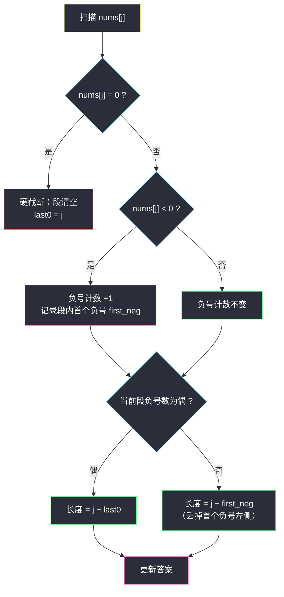

# 乘积为正数的最长子数组长度（正负双状态递推 · 零截断贪心）

## 一、问题描述

给你一个整数数组 `nums`，请你求出**乘积为正数**的**最长子数组**的长度。

一个数组的子数组是由原数组中零个或者更多个**连续**数字组成的数组。空子数组的乘积视为 `1`（正数，但长度 0 不构成答案，答案至少为 0）。

> 🔗 LeetCode 1567：https://leetcode.cn/problems/maximum-length-of-subarray-with-positive-product/
>
> 数据范围：`1 <= nums.length <= 10^5`，`-10^9 <= nums[i] <= 10^9`。

**示例 1**

```
输入：nums = [1,-2,-3,4]
输出：4
解释：整个数组的乘积 = 24 > 0。
```

**示例 2**

```
输入：nums = [0,1,-2,-3,-4]
输出：3
解释：最长正乘积子数组是 [1,-2,-3]，乘积 6；带上 0 乘积变 0，必须截断。
```

**示例 3**

```
输入：nums = [-1,-2,-3,0,1]
输出：2
解释：[-1,-2] 或 [-2,-3] 都是两负相乘得正。
```

**直观理解**

乘积的大小会爆炸（`10^9` 的 10 万次方），但**符号**只有三种状态：正、负、零。一段子数组的符号由两件事完全决定——**有没有 0**（有则全灭）和**负号的个数**（偶为正、奇为负）。于是「最长正乘积子数组」=「在两个 0 之间找一段、使其中负号个数为偶数的最长者」。围绕这个观察有两种等价写法：一是贪心地维护「当前段里第一个负号的位置」直接算长度；二是 DP 地维护「以 i 结尾的正/负乘积子数组长度」逐位递推。两种视角同源自灵茶题单 §4.2「乘积贪心：负负得正——数负号奇偶与 0 的截断」。

---

## 二、暴力解法

枚举每个起点，向右延伸，滚动维护当前段的**符号**：遇负翻转、遇 0 立即止损（再延伸下去乘积恒 0）：

```python
def max_len_brute(nums):
    n = len(nums)
    best = 0
    for i in range(n):
        sign = 1                          # 当前段 [i..j] 的乘积符号
        for j in range(i, n):
            if nums[j] == 0:
                break                     # 0 之后乘积恒 0，截断
            if nums[j] < 0:
                sign = -sign              # 负号计数翻转奇偶
            if sign > 0:
                best = max(best, j - i + 1)
    return best
```

### 复杂度

- **时间**：`O(n²)`，`n = 10^5` 时 `10^10` 超时。
- **空间**：`O(1)`。

### 🔴 瓶颈在哪里

每个起点都从零开始重数负号、重看一遍元素——但 `nums[j]` 对「以 j-1 结尾的段」的符号贡献与对「以 j 结尾的段」的贡献是**同一份信息**。把「以每个下标结尾」作为状态重用这些信息，内层循环就消失了。

---

## 三、优化探索（核心章节）

> 📚 本题在灵茶题单中属于 **§4.2 乘积贪心（负负得正）**。模板要点：**乘积只看符号——0 是硬截断，负号翻转奇偶；最优解 = 当前 0-free 段内「负号个数为偶数」的最长后缀**。讲法上与 DP 双视角互证：贪心视角直接维护段的几何信息，DP 视角维护两个长度状态。

### 3.1 贪心视角：0 截断 + 第一个负号

观察：以 `j` 结尾的正乘积子数组，必须落在「最后一个 0 之后」的段里，且负号个数为偶数。分两种情况（设 `last0` = 上一个 0 的下标，段起点为 `last0 + 1`）：

- 当前段（`last0+1 .. j`）内**负号个数为偶数**：整段都能要，长度 `j - last0`；
- 负号个数为**奇数**：必须丢掉**第一个**负号及它之前的全部元素（丢更靠后的负号会让奇偶性仍是奇），最优长度 `j - first_neg`，其中 `first_neg` 是段内第一个负号的下标。



### 3.2 DP 视角：以 i 结尾的正 / 负双状态递推

换一个同样经典的组织方式——定义：

- `pos`：以当前下标结尾、乘积为**正**的最长子数组长度；
- `neg`：以当前下标结尾、乘积为**负**的最长子数组长度。

转移只需看 `nums[i]` 的符号：

| nums[i] | 新 pos | 新 neg | 决策依据 |
|---------|--------|--------|----------|
| `> 0` | `pos + 1`（正延长正） | `neg + 1`（若 `neg > 0`，否则 0） | 正号不翻奇偶；没有负段就无源可延 |
| `< 0` | `neg + 1`（若 `neg > 0`，否则 0） | `pos + 1` | 负号交换正负角色 |
| `= 0` | 0 | 0 | 0 硬截断，两个状态双双清零 |

答案 = 扫描过程中 `pos` 的最大值。**两个视角完全等价**：`neg` 存活的条件「段内已有负号」恰对应贪心视角的「`first_neg` 存在」；`pos = j - last0`（偶负号）或 `j - first_neg`（奇负号时以负段 + 一个负号复活）——同一份奇偶信息，两种簿记。

### 3.3 为什么「丢第一个负号」而不是丢最后一个

奇数个负号时，任何正乘积后缀都必须**恰好再丢掉一个负号及其左侧**；丢哪个负号最省长度？负号把段切成若干段，丢掉**最靠左**的那个负号，剩下的是最长的「偶负号后缀」。若丢中间某个负号 `k`，那么 `k` 左侧的奇偶性修正后，右边界还是 `j`、左边界却推到了 `k` 之后，长度只会更短——「最左」即最优，这是负号奇偶贪心的核心一句话。

### 3.4 一句话核心

> **0 截断重开一局，负号只翻奇偶；奇数负时丢最左负号，双状态 pos/neg 递推一遍扫完。**

---

## 四、代码实现

### Python（主解：pos / neg 双状态递推，滚动变量）

```python
class Solution:
    def getMaxLen(self, nums: List[int]) -> int:
        pos = neg = 0                      # 以 i 结尾的正 / 负乘积最长长度
        ans = 0
        for v in nums:
            if v > 0:
                pos, neg = pos + 1, (neg + 1 if neg > 0 else 0)
            elif v < 0:
                pos, neg = (neg + 1 if neg > 0 else 0), pos + 1
            else:
                pos = neg = 0              # 0 硬截断
            ans = max(ans, pos)
        return ans
```

**变量含义**

| 变量 | 含义 |
|------|------|
| `pos` | 以当前元素结尾、乘积为正的最长子数组长度 |
| `neg` | 以当前元素结尾、乘积为负的最长子数组长度（无源则为 0） |
| `(neg + 1 if neg > 0 else 0)` | 无负段可延长时不能凭空造出负乘积 |
| `ans` | 全程 `pos` 的最大值 |

### Python（贪心同款：last0 / first_neg 双下标 + 负号计数）

```python
class Solution:
    def getMaxLen(self, nums: List[int]) -> int:
        ans, last0, first_neg, neg_cnt = 0, -1, -1, 0
        for j, v in enumerate(nums):
            if v == 0:                              # 硬截断，重开一局
                last0, first_neg, neg_cnt = j, j, 0
            else:
                if v < 0:
                    if neg_cnt == 0:                # 段内首个负号
                        first_neg = j
                    neg_cnt += 1
                if neg_cnt % 2 == 0:                # 偶数负号：整段可要
                    ans = max(ans, j - last0)
                else:                               # 奇数：丢最左负号左侧
                    ans = max(ans, j - first_neg)
        return ans
```

两份代码对同一份数据给出相同答案（贪心版是 §3.1 论证的直接翻译，DP 版是它的状态化写法），任选其一提交即可。

### Java（最优解同款写法）

```java
class Solution {
    public int getMaxLen(int[] nums) {
        int pos = 0, neg = 0, ans = 0;
        for (int v : nums) {
            if (v > 0) {
                pos = pos + 1;
                neg = neg > 0 ? neg + 1 : 0;
            } else if (v < 0) {
                int t = pos;
                pos = neg > 0 ? neg + 1 : 0;
                neg = t + 1;
            } else {
                pos = 0; neg = 0;
            }
            ans = Math.max(ans, pos);
        }
        return ans;
    }
}
```

---

## 五、具体例子演示

以示例 2 端到端走一遍：`nums = [0, 1, -2, -3, -4]`。双视角并列跟踪——DP 列给出 `pos / neg`，贪心列给出「段起点、负号计数、first_neg」：

| j | nums[j] | 决策依据（正负号计数） | pos | neg | 贪心视角：段 | 负号计数 | ans |
|---|---------|------------------------|-----|-----|--------------|----------|-----|
| 0 | 0 | 0 → 硬截断，两状态清零 | 0 | 0 | 段重开（last0=0） | 0（偶） | 0 |
| 1 | 1 | 正号：pos 延长；neg 无源 | 1 | 0 | 段 [1,1] | 0（偶）→ 长 j-last0 = 1 | 1 |
| 2 | -2 | 负号：角色互换，neg=pos+1 | 0 | 2 | 段 [1..2]，first_neg=2 | 1（奇）→ 长 j-first_neg = 0 | 1 |
| 3 | -3 | 再翻：奇→偶，pos=neg+1=3 | 3 | 1 | 段 [1..3] | 2（偶）→ 长 3 | **3** |
| 4 | -4 | 三翻：偶→奇，pos 掉回 2 | 2 | 4 | 段 [1..4]，奇 → 长 j-first_neg = 2 | 2 |

**逐步解读**：

- `j = 2`：负号计数 0→1（奇），正乘积后缀必须丢掉首个负号 `-2` 及其左侧，长度 0——体现在 DP 上 `pos` 归零（`neg` 无源不能复活）。
- `j = 3`：负号计数 1→2（偶），整段 `[1,-2,-3]` 乘积 `6 > 0`，长度 3 = `j - last0`；DP 上 `pos = neg_prev + 1 = 3`，负段被这个新负号「转正」。
- `j = 4`：计数 2→3（奇）又翻回奇数，只能丢最左负号，`[-3,-4]` 长 2；DP 上 `pos` 从 3 掉到 2。**奇偶翻转的方向感**：每来一个负号，正负两态互换身份再各 +1。

**其余示例速览**：`[1,-2,-3,4]` 负号计数 0→1→2（偶），无 0，整段长 4 → 答案 4 ✓；`[-1,-2,-3,0,1]` 前 3 个负号计数 3（奇，最优 2 = 丢最左 `-1` 后 `[-2,-3]`），`0` 截断后 `[1]` 长 1 → 答案 2 ✓。

---

## 六、复杂度分析

| 方法 | 时间 | 空间 |
|------|------|------|
| 枚举起点 + 滚动符号 | `O(n²)` | `O(1)` |
| pos / neg 递推（主解） | `O(n)` | `O(1)` |
| last0 / first_neg 贪心 | `O(n)` | `O(1)` |

一遍扫描、两个滚动变量。**时间 `O(n)`、空间 `O(1)`**——`10^5` 的规模毫无压力，连数组都不用开。

---

## 七、对比总结

**「符号状态」家族**（§4.2 乘积贪心及近亲）：

| 题 | 状态设计 | 关键机制 |
|----|----------|----------|
| #1567 本篇 | 结尾正 / 负双长度 | 0 截断 + 负号翻转 |
| #152 乘积最大子数组 | 结尾最大 / 最小双值 | 负号交换 max/min（数值版） |
| #53 最大子数组和 | 结尾最大和单状态 | 负和弃段重开（见下） |
| #918 环形最大子数组 | #53 + 环上分类 | 总和 − 最小子数组 |

**易错点**

1. `neg` 无源时不能 +1：`(neg + 1 if neg > 0 else 0)` ——凭空造不出「负乘积子数组」。反例 `[3, -2, 5]`：正确答案 1（`[3]` 或 `[5]`）；若在 `-2` 处把 `neg` 误置成 2，到 `5` 时会算出 `pos = 3` 的假答案（`[3,-2,5]` 乘积其实是 -30）。
2. **0 是截断不是重置历史**：段重开时 `first_neg` 也要重置（贪心版里 `last0 = first_neg = j`），否则跨段引用旧负号会算出幽灵长度。
3. 别用乘积数值递推：`10^9` 连乘必然溢出（Java）或拖慢（Python 大数），**只递推长度与符号**。
4. 「丢最左负号」是奇数情形的唯一最优切口，别试图丢右侧负号——那会把奇偶性修不回来。
5. 空数组 / 全 0 数组答案为 0：初始 `ans = 0` 天然覆盖。

---

## 八、举一反三

| 题目 | 关系 |
|------|------|
| [152. 乘积最大子数组](https://leetcode.cn/problems/maximum-product-subarray/) | 数值版孪生题：结尾最大/最小双状态，负号交换 max 与 min |
| [53. 最大子数组和](https://leetcode.cn/problems/maximum-subarray/) | 单状态版弃段重开：「负贡献就扔」与本题「0 就截断」同构 |
| [713. 乘积小于 K 的子数组](https://leetcode.cn/problems/subarray-product-less-than-k/) | 乘积族滑窗：窗口收缩的依据从「符号」换成「数值上界」 |
| [1524. 和为奇数的子数组数目](https://leetcode.cn/problems/number-of-sub-arrays-with-odd-sum/) | 同目录 `number-of-sub-arrays-with-odd-sum.md`：奇偶计数同构——把「负号奇偶」换成「和的奇偶」，前缀奇偶对计数 |
| [918. 环形子数组的最大和](https://leetcode.cn/problems/maximum-sum-circular-subarray/) | #53 的环形加强版，「弃段」思想的环上分类讨论 |
| [978. 最长湍流子数组](https://leetcode.cn/problems/longest-turbulent-subarray/) | 双状态交替的近亲：升/降比较符交替，同样「以 i 结尾」双状态递推 |

**思想迁移**

- 乘积题先**扔掉数值、只留符号**：`0` / 负号奇偶是全部信息量，双长度状态足够；这一步「降维」让 `10^9` 连乘的爆炸风险直接消失。
- 「以 i 结尾」的子数组 DP 招式通用：遇到「最长 / 最短 / 计数的子数组」先想结尾状态；需要更多维度（符号、奇偶、余数）就并行多开几个状态，见 `number-of-sub-arrays-with-odd-sum.md`。
- 贪心与 DP 双视角互相印证是这个题单 §4.2 的推荐学习法：`first_neg`（几何位置）与 `neg`（长度状态）是同一信息的两种坐标，能双语复述才算真正吃透。
- 口诀：**「零来清零重开段，负号翻转奇偶数；奇丢最左一负号，双态递推一遍完。」**
