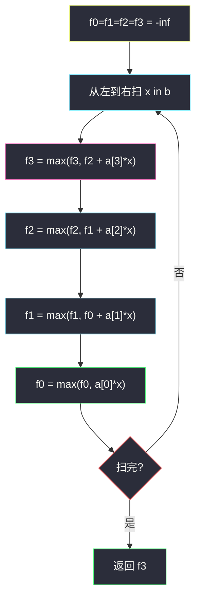

# 3290. 最高乘法得分（Maximum Multiplication Score）

> 题目来源：[https://leetcode.cn/problems/maximum-multiplication-score/](https://leetcode.cn/problems/maximum-multiplication-score/)
>
> 灵茶题单小节定位：§4.1 最长公共子序列（LCS）

## 一、问题描述

给你长度为 **4** 的整数数组 `a`，以及长度至少为 4 的整数数组 `b`。需要从 `b` 中选四个下标 `i0 < i1 < i2 < i3`，得分是

```text
a[0] * b[i0] + a[1] * b[i1] + a[2] * b[i2] + a[3] * b[i3]
```

返回能获得的最大得分。`a[i]`、`b[j]` **可为负**。

**数据范围**：

- `a.length == 4`
- `4 <= b.length <= 10^5`
- `-10^5 <= a[i], b[i] <= 10^5`

**示例 1**：

```text
输入：a = [3,2,5,6], b = [2,-6,4,-5,-3,2,-7]
输出：26
解释：选下标 0,1,2,5。得分 3*2 + 2*(-6) + 5*4 + 6*2 = 26。
```

**示例 2**：

```text
输入：a = [-1,4,5,-2], b = [-5,-1,-3,-2,-4]
输出：-1
解释：选下标 0,1,3,4。得分 (-1)*(-5) + 4*(-1) + 5*(-2) + (-2)*(-4) = -1。
```

**核心思考点**：`a` 必须**按顺序用完 4 个系数**，`b` 是一条长序列，每个位置「配给当前 `a[i]`」或「跳过」。这正是 LCS 的「对齐 / 不对齐」骨架，只是匹配改成乘法加权，且 `a` 侧不允许剩余。`|b|` 达 `1e5`，必须 `O(4 n) = O(n)`，不能 `O(n²)`。负数相乘不保序，**不能**先在 `b` 里挑四个最大再分配。

## 二、暴力解法

### 思路

枚举 `b` 的所有四元递增下标组合，直接算加权和。与 DP 独立，`C(n,4)` 仅适合短 `b`。

### 代码

```python
from itertools import combinations

def maxScoreBrute(a: list[int], b: list[int]) -> int:
    best = -10**18
    for i0, i1, i2, i3 in combinations(range(len(b)), 4):
        sc = a[0]*b[i0] + a[1]*b[i1] + a[2]*b[i2] + a[3]*b[i3]
        best = max(best, sc)
    return best
```

### 复杂度

- 时间：`O(n⁴)` 组合数。`n = 1e5` 不可行；`n ≤ 12` 可对拍。
- 空间：`O(1)`。

## 三、优化探索

### 3.1 和 LCS 同一张转移表 ⭐⭐

`f[i][j]` = 已经配对 `a` 的前 `i` 个系数、只用了 `b` 的前 `j` 个位置，能得到的最大得分。

- **不选** `b[j-1]`：`f[i][j-1]`（`a` 的进度不变）
- **选** `b[j-1]` 去配 `a[i-1]`：`f[i-1][j-1] + a[i-1]*b[j-1]`

```text
f[0][j] = 0                 还没开始配 a，得分为 0
f[i][0] = -inf  (i > 0)     b 用完了 a 还没配完，非法
f[i][j] = max( 不选, 选 )
```

`i` 只有 0..4，`j` 有 `n+1` 个，总状态 `5(n+1)`，转移 `O(1)` → **`O(n)`**。

非法状态必须是 `-inf` 而不是 0：否则「a 还剩系数、b 已经走完」会被当成得分 0，正负混合时会错。

### 3.2 为什么不能贪心挑 b ⭐

- 下标必须递增，四个位置的配对对象被顺序锁死，不能把 `b` 的值任意重排给 `a`。
- `a[i]` 可负：配一个很大的正 `b` 反而更差；配负 `b` 才是正贡献。
- 乘法没有「对 |b| 排序再按排列不等式匹配」的资格——排列不等式要求能自由配对，这里不能。

反例就在官方示例 2：最优得分是 **-1**，若干贪心「给正系数留大数、给负系数留小数」的策略会撞上顺序墙。

### 3.3 滚动成 4 个变量（0-1 倒序）⭐

`i` 维只有 4，从后往前滚，避免同一个 `b[j]` 配给多个 `a[i]`——和 0-1 背包逆序更新同一件事：

```text
扫到 x = b[j] 时：
f3 = max(f3, f2 + a[3]*x)   # 先更新「用得更多」的
f2 = max(f2, f1 + a[2]*x)
f1 = max(f1, f0 + a[1]*x)
f0 = max(f0,      a[0]*x)
```

若先更新 `f0`，`f1` 会用到已经包含当前 `x` 的 `f0`，等于一个 `x` 配了两次。



## 四、代码实现

### 主解：四个滚动变量，`O(n)`

```python
class Solution:
    def maxScore(self, a: list[int], b: list[int]) -> int:
        NEG = -10**18
        f0 = f1 = f2 = f3 = NEG
        for x in b:
            f3 = max(f3, f2 + a[3] * x)
            f2 = max(f2, f1 + a[2] * x)
            f1 = max(f1, f0 + a[1] * x)
            f0 = max(f0, a[0] * x)
        return f3
```

### 对照：二维表（便于理解，同样 `O(n)`）

```python
class Solution:
    def maxScore(self, a: list[int], b: list[int]) -> int:
        n = len(b)
        NEG = -10**18
        f = [[NEG] * (n + 1) for _ in range(5)]
        for j in range(n + 1):
            f[0][j] = 0
        for i in range(1, 5):
            for j in range(1, n + 1):
                f[i][j] = f[i][j - 1]
                if f[i - 1][j - 1] > NEG // 2:
                    f[i][j] = max(
                        f[i][j],
                        f[i - 1][j - 1] + a[i - 1] * b[j - 1],
                    )
        return f[4][n]
```

Python 整数任意精度，乘积不会溢出；其它语言用 64 位整数（最坏 `4 × 10^5 × 10^5 = 4×10^{10}`）。

### 细节说明

- **`f3` 初值 `-inf`**：`b` 长度 ≥ 4，扫完后 `f3` 一定被合法四元组更新过。
- **更新顺序不可改**：必须 `f3 → f2 → f1 → f0`。
- **不要**对 `b` 取四个极值再乘：顺序约束 + 符号会一起打脸。
- **`a` 用不满非法**：二维版用 `-inf` 切断；滚动版则表现为 `f_k` 仍是 `-inf`，不会污染更高维——因为加法从 `-inf` 来仍是 `-inf`（Python 里 `NEG + x` 仍极小）。

## 五、例子演示

**示例 1 端到端：`a = [3,2,5,6]`, `b = [2,-6,4,-5,-3,2,-7]`**

逐个 `x` 更新四个变量（未写出的保持 `-inf`）。

| x | f0 | f1（用旧 f0） | f2（用旧 f1） | f3（用旧 f2） |
|---|---|---|---|---|
| 2 | **6** | `-inf` | `-inf` | `-inf` |
| -6 | **6** | 6+2×(-6)=**-6** | `-inf` | `-inf` |
| 4 | **12** | max(-6, 6+8)=**14** | -6+20=**14** | `-inf` |
| -5 | 12 | 14 | **14** | 14+6×(-5)=**-16** |
| -3 | 12 | 14 | **14** | max(-16, 14-18)=**-4** |
| 2 | 12 | max(14, 12+4)=**16** | max(14, 14+10)=**24** | max(-4, 14+12)=**26** |
| -7 | 12 | 16 | 24 | max(26, 24-42)=**26** |

`f3 = 26` ✅。关键一步：下标 5 的 `x=2` 到来时，旧 `f2=14` 对应已经选了 `(2,-6,4)`，再加 `6*2` 得到 26。这与官方下标 `0,1,2,5` 一致。该步 `f1` 也会被抬到 16，但不影响最终 `f3`。

若误先更新 `f0`：同一个 `x=2` 会同时抬高 `f0` 再灌进 `f1`，相当于一个 2 用两次，答案虚高。

**示例 2：`a=[-1,4,5,-2]`, `b=[-5,-1,-3,-2,-4]`**

`n=5` 只有 5 种四元组。滚动结果 `f3 = -1`，对应官方 `0,1,3,4`：`(-1)*(-5)+4*(-1)+5*(-2)+(-2)*(-4) = -1` ✅。

注意 `5*(-3)=-15` 比 `5*(-2)=-10` 更差，所以第三位宁可留 `-2` 给 `a[2]`，把最后一个 `-4` 给负的 `a[3]` 赚 +8——这是选/不选比出来的，不是「按绝对值排序」能看出来的。

**贪心会错**：把 `b` 降序取前 4 再按位置乘 `a`——官方示例 1 会变成 `3*4 + 2*2 + 5*2 + 6*(-3) = 8`，不是 26。排列不等式要求自由配对，本题下标必须递增，配对对象被顺序锁死。

**边界**：`b` 恰 4 个元素，答案就是四个对应相乘之和；`a` 全 0，答案 0；`a` 全负、`b` 全正，会尽量挑 `b` 里较小的四个（仍受顺序约束，DP 自动处理）。

## 六、复杂度分析

设 `n = len(b)`：

- **时间复杂度：`O(n)`**——每个 `b[j]` 做 4 次常数更新。二维表同样 `O(4n)`。禁止写成对 `j,k` 双重循环的 `O(n²)`。
- **空间复杂度：`O(1)`**（四个变量）；二维表 `O(n)`。

## 七、对比总结

| 维度 | C(n,4) 枚举 | LCS 型 DP（主解） | 贪心挑极值 |
|---|---|---|---|
| 时间 | `O(n⁴)` | `O(n)` | `O(n log n)` 但错 |
| 顺序 | 天然满足 | 下标递增藏在「只向右扫」 | 会重排，非法 |
| 负数 | 正确 | 选 vs 不选直接比 | 乘法破单调 |

**套路归纳**：§4.1 LCS 的骨架是「两个序列的前缀、每个位置选或不选」。本题 `a` 必须全选、`b` 可选，等价于「`a` 是模式串、`b` 是文本」的加权匹配。`a` 极短时把 `i` 维滚掉，复杂度跟文本长度线性。和 0-1 背包共用「倒序更新防重复用」这一招。

## 八、举一反三

1. **[1143. 最长公共子序列](https://leetcode.cn/problems/longest-common-subsequence/)**：同样的 `f[i][j]` 选/不选，相等才 +1。
2. **[1035. 不相交的线](https://leetcode.cn/problems/uncrossed-lines/)**：LCS 的几何包装，下标递增不能交叉。
3. **[115. 不同的子序列](https://leetcode.cn/problems/distinct-subsequences/)**：短模式配长文本，计数版「必须用完 s」。
4. **[72. 编辑距离](https://leetcode.cn/problems/edit-distance/)**：双串前缀 DP 的另一套转移（插删改）。
5. **[2915. 和为目标值的最长子序列的长度](https://leetcode.cn/problems/length-of-the-longest-subsequence-that-sums-to-target/)**：同批 `length-of-the-longest-subsequence-that-sums-to-target.md`，0-1 背包也是选/不选，容量维换成了「和」。

**同族互引**：本篇是「短模式 × 长文本」的加权 LCS；不要看到乘法就去贪心。同批区间 DP `maximum-number-of-operations-with-the-same-score-ii.md` 是两端收缩，和本篇「从左往右消费序列」不是同一张表。
