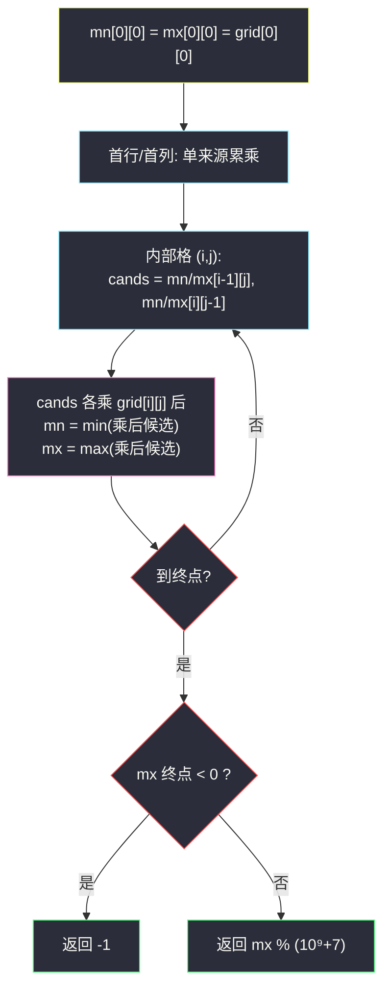

# 1594. 矩阵的最大非负积（Maximum Non Negative Product in a Matrix）

> 题目来源：[https://leetcode.cn/problems/maximum-non-negative-product-in-a-matrix/](https://leetcode.cn/problems/maximum-non-negative-product-in-a-matrix/)
>
> 灵茶题单小节定位：§A 线性 DP（网格 DP · max/min 双状态）

## 一、问题描述

给你一个大小为 `m x n` 的矩阵 `grid`。最初，你位于左上角 `(0, 0)`，每一步，你可以在矩阵中**向右**或**向下**移动。

在从左上角 `(0, 0)` 开始到右下角 `(m - 1, n - 1)` 结束的所有路径中，找出具有**最大非负积**的路径。路径的积是沿路径访问的单元格中所有整数的乘积。

返回**最大非负积**对 `10⁹ + 7` 取余的结果。如果最大积为**负数**，则返回 `-1`。

注意，取余是在得到最大积之后执行的。

**数据范围**：

- `m == grid.length`
- `n == grid[i].length`
- `1 <= m, n <= 15`
- `-4 <= grid[i][j] <= 4`

**示例 1**：

```text
输入：grid = [[-1,-2,-3],[-2,-3,-3],[-3,-3,-2]]
输出：-1
解释：从 (0, 0) 到 (2, 2) 的路径中无法得到非负积，所以返回 -1。
```

**示例 2**：

```text
输入：grid = [[1,-2,1],[1,-2,1],[3,-4,1]]
输出：8
解释：最大非负积对应的路径为 1 * 1 * -2 * -4 * 1 = 8。
```

**示例 3**：

```text
输入：grid = [[1,3],[0,-4]]
输出：0
解释：最大非负积对应的路径为 1 * 0 * -4 = 0。
```

**核心思考点**：有负数参与乘法时，「最大积」不能只跟踪最大值——一个很负的数乘以负数会翻成很大的正数。所以每个格子要**同时维护「到达该格的路径积的最小值与最大值」**：乘以正数时序不变，乘以负数时 min/max 互换。终点取 `max`，先判负再取模（「先取最大积、后取余」是题面明说的顺序）。

## 二、暴力解法

### 思路

`m, n ≤ 15`，路径条数 `C(28, 14) ≈ 4×10⁷` 略多但可以递归枚举所有路径算积取最大（对拍基准够用；提交可能勉强）。每步向右或向下，到终点结算。

### 代码

```python
def maxProductPathBrute(grid: list[list[int]]) -> int:
    m, n = len(grid), len(grid[0])
    best = -float("inf")
    def dfs(i, j, prod):
        nonlocal best
        prod *= grid[i][j]
        if i == m - 1 and j == n - 1:
            best = max(best, prod)
            return
        if i + 1 < m:
            dfs(i + 1, j, prod)
        if j + 1 < n:
            dfs(i, j + 1, prod)
    dfs(0, 0, 1)
    return -1 if best < 0 else best % (10 ** 9 + 7)
```

### 复杂度

- 时间：`O(C(m+n-2, m-1))`——15×15 时约 4×10⁷，Python 慢但对拍小矩阵可用。
- 空间：`O(m + n)` 递归深度。

## 三、优化探索

### 3.1 为什么要 min/max 成对维护 ⭐⭐

到达同一格的多条路径积有正有负。若只维护每格最大值 `mx[i][j]`：

- 当前格 `grid[i][j] = -4` 时，最优来源可能是**最负**的前驱积（负负得正）——`mx` 里根本没存它。

正确做法是双状态 `(mn, mx)`：转移候选 = 「上方格的 (mn, mx)」与「左方格的 (mn, mx)」各乘当前值，四个候选里取 min/max。正数乘法保序、负数乘法反序、零直接压平——双状态对所有情形统一成立：

```text
mn[i][j] = min( mn[i-1][j]×x, mx[i-1][j]×x, mn[i][j-1]×x, mx[i][j-1]×x )
mx[i][j] = max( 同上四个候选 )        其中 x = grid[i][j]
```

（四个候选**先乘后取**——不能先对前驱取 min/max 再乘：负数乘法反序，`lo×x` 可能大于 `hi×x`，乘完再比较才是安全写法。）

### 3.2 「先判负后取模」⭐

`(-3) % (10⁹+7)` 在 Python 里返回一个巨大的非负数（Python 取模恒非负），不能用它判断正负。必须在**取模之前**用真实的 `mx[m-1][n-1]` 判 `< 0` 返回 -1；非负才做 `% MOD`。Python 大整数让「全程真实积 → 最后取模」成为可能（每格 |值| ≤ 4、路径长 ≤ 29，积绝对值 ≤ 4²⁹ ≈ 2.8×10¹⁷，完全无压力）；C++/Java 需中途取模配合符号分类（另一套细节，见第七节）。

### 3.3 滚动数组与初始化 ⭐

转移只依赖上一行与当前行左侧——可滚动成两行甚至一行交错更新（`mn/mx` 同行左值更新顺序天然可用）。首行、首列只有单一来源（左 / 上），直接累乘初始化。



## 四、代码实现

### 主解：双状态网格 DP

```python
class Solution:
    def maxProductPath(self, grid: List[List[int]]) -> int:
        MOD = 10 ** 9 + 7
        m, n = len(grid), len(grid[0])
        mn = [[0] * n for _ in range(m)]
        mx = [[0] * n for _ in range(m)]
        mn[0][0] = mx[0][0] = grid[0][0]
        for j in range(1, n):                      # 首行：只能从左来
            v = mn[0][j - 1] * grid[0][j]
            mn[0][j] = mx[0][j] = v
        for i in range(1, m):                      # 首列：只能从上来
            v = mn[i - 1][0] * grid[i][0]
            mn[i][0] = mx[i][0] = v
        for i in range(1, m):
            for j in range(1, n):
                x = grid[i][j]
                cands = (mn[i - 1][j] * x, mx[i - 1][j] * x,
                         mn[i][j - 1] * x, mx[i][j - 1] * x)
                mn[i][j] = min(cands)
                mx[i][j] = max(cands)
        return -1 if mx[m - 1][n - 1] < 0 else mx[m - 1][n - 1] % MOD
```

（首行/首列单一来源时 mn = mx，故用 `mn` 一处计算即可。）

### 进阶：滚动一行版（O(n) 空间）

```python
class Solution:
    def maxProductPath(self, grid: List[List[int]]) -> int:
        MOD = 10 ** 9 + 7
        m, n = len(grid), len(grid[0])
        mn = [0] * n
        mx = [0] * n
        mn[0] = mx[0] = grid[0][0]
        for j in range(1, n):
            mn[j] = mx[j] = mn[j - 1] * grid[0][j]
        for i in range(1, m):
            # 每行第 0 列: 只能从上来(上一行的 mn[0])
            mn[0] = mx[0] = mn[0] * grid[i][0]
            for j in range(1, n):
                x = row[j]
                cands = (mn[j] * x, mx[j] * x, mn[j - 1] * x, mx[j - 1] * x)
                mn[j] = min(cands)
                mx[j] = max(cands)
        return -1 if mx[n - 1] < 0 else mx[n - 1] % MOD
```

### 细节说明

- **四个候选乘完再取 min/max**：上方与左侧各贡献 mn、mx 两个——负数乘法反序，若先取 min/max 再乘，`lo×x` 与 `hi×x` 的大小关系可能在负格上颠倒，这是本题最隐蔽的实现陷阱（本文初版即踩中，对拍 120/500 组失败后修正）。
- **首行/首列 mn = mx**：单条路径到达，积唯一；不是笔误。
- **判负在取模前**：见 3.2，`best % MOD` 只在 `best >= 0` 时执行。
- **0 的角色**：当前格为 0 时，四个候选乘完全部是 0，mn = mx = 0——后续乘法从 0 重新出发，符合「路径穿过 0 后积恒 0」的语义（示例 3 输出 0）。
- **数值范围**：路径长 `m+n-1 ≤ 29`，|积| ≤ 4²⁹ ≈ 2.8×10¹⁷ < 2⁶³，即便 C++ `long long` 全程真实值也安全——中途取模并非必须（但判负仍要先于取模）。
- **m = 1 或 n = 1**：只有一条路径，首行/首列初始化即全程，逻辑自洽。

## 五、例子演示

**示例 2 端到端：grid = [[1,-2,1],[1,-2,1],[3,-4,1]]**

初始化：首行 `mn=mx=[1, -2, -2]`（单路径累乘），首列 `mn=mx=[1, 1, 3]`。

| 格子 | 前驱候选 × 当前值 | mn | mx |
|---|---|---|---|
| (1,1) | {−2×(−2), 1×(−2)} = {4, −2} | **−2** | **4** |
| (1,2) | {−2×1, 4×1} | **−2** | **4** |
| (2,1) | {−2×(−4), 4×(−4), 3×(−4)} = {8, −16, −12} | **−16** | **8** |
| (2,2) | {−2×1, 4×1, −16×1, 8×1} = {−2, 4, −16, 8} | **−16** | **8** |

`mx[2][2] = 8 ≥ 0`，返回 **8** ✅。注意两处负数翻转的好戏：

- **(1,1)**：前驱积有两种（−2 与 1），乘上当前的 −2 后，原来最大的 1 翻成最小的 −2、原来最小的 −2 翻成最大的 4——若只维护「每格最大值」，这里会丢掉 4；
- **(2,1)**：候选乘完是 {8, −16, −12}，最大候选 8 来自「前驱最小 −2 × 负数」——官方路径 `1→1→−2→−4→1 = 8` 恰好走在「交替翻转」线上，最终在终点格被 mx 收编。

单状态跟踪任何一路都会算不出 8，这就是双状态必要性的活教材。

**示例 1：grid = [[-1,-2,-3],[-2,-3,-3],[-3,-3,-2]]**：全负矩阵、每条路径恰含 5 个负数（奇数个）→ 积恒负 → `mx[2][2] < 0`，返回 **-1** ✅。

**示例 3：grid = [[1,3],[0,-4]]**：首行 `mn=mx=[1, 3]`；(1,0)：`1×0 = 0`；(1,1)：候选 `1×(−4) = −4`、`3×(−4) = −12`、`0×(−4) = 0` → mn = −12、mx = 0。`mx = 0 ≥ 0` → 返回 **0** ✅（0 也是非负，路径 1→0→−4）。

## 六、复杂度分析

设 `m, n` 为矩阵行列数：

- **时间复杂度：`O(m·n)`**——每格常数次比较与乘法。
- **空间复杂度：`O(m·n)`** 二维表；滚动一行版 `O(n)`。

## 七、对比总结

| 维度 | 暴力枚举路径 | 双状态网格 DP |
|---|---|---|
| 时间 | `O(C(m+n, m))` 指数级 | `O(m·n)` |
| 空间 | `O(m+n)` | `O(n)`～`O(m·n)` |
| 负数处理 | 天然正确 | min/max 成对转移 |
| 泛化 | 任意步型 | 标准右/下移动 |

**套路归纳**：**「乘法 + 负数 ⇒ max/min 双状态」**是乘法型 DP 的铁律（最小子数组积、最长正积子数组同款）。记忆锚点：负数乘法是**反序变换**，单点最优无法跨越负号传播——必须把「最差」也背着走。网格 DP 三件套（首行首列初始化、上/左两来源、终点取答案）叠加这道双状态即完整模板。取模类题目还要记「**先定号后取模**」，Python 尤其 `%` 恒非负、不能反序。

## 八、举一反三

1. **[152. 乘积最大子数组](https://leetcode.cn/problems/maximum-product-subarray/)**：一维版 max/min 双状态，本题的线性亲戚。
2. **[1567. 乘积为正数的最长子数组长度](https://leetcode.cn/problems/maximum-length-of-subarray-with-positive-product/)**：正/负计数双状态，负数翻转的计数形态。
3. **[62. 不同路径](https://leetcode.cn/problems/unique-paths/)**：网格 DP 计数版骨架（无障碍首行首列全 1）。
4. **[120. 三角形最小路径和](https://leetcode.cn/problems/triangle/)**：加法型网格 DP 入门，与本题对照体会乘法的双状态需求。
5. **[1911. 最大子序列交替和](https://leetcode.cn/problems/maximum-alternating-sum-of-any-subsequence/)**：另一类「运算反序」（奇偶交替取号）导致的双状态 DP。

**同族互引**：本批网格三部曲之一——`maximum-difference-score-in-a-grid.md`（#3148，最小前缀视角）与 `minimum-path-cost-in-a-grid.md`（#2304，多列转移），三篇覆盖网格 DP 的三种典型转移形态。
