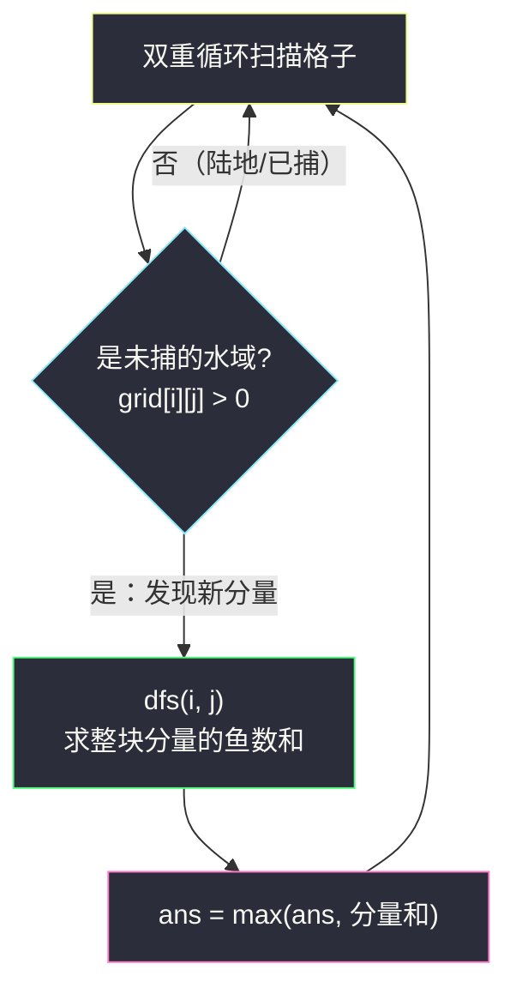

# 网格中的最大鱼数（网格图 DFS · 连通分量求和）

## 一、问题描述

给你下标从 0 开始、`m x n` 的网格 `grid`，每个格子的含义：

- `grid[i][j] = 0`：**陆地格**，渔夫不能进入；
- `grid[i][j] > 0`：**水域格**，里面有 `grid[i][j]` 条鱼，渔夫可以进入。

渔夫可以从**任意水域格**出发，然后执行以下操作任意次（含 0 次）：捕当前格的所有鱼（捕完格子清零），或移动到上下左右相邻的**水域格**。求渔夫最多能捕多少条鱼。

> 🔗 LeetCode 2658：https://leetcode.cn/problems/maximum-number-of-fish-in-a-grid/
>
> 数据范围：`1 <= m, n <= 10`，`0 <= grid[i][j] <= 10`（官方示例见原题链接，下文演示用自拟网格）。

**示例（自拟演示网格）**

```
grid = [
  [0, 2, 1, 0],
  [4, 3, 0, 0],
  [5, 0, 0, 8],
  [0, 0, 7, 9],
]
```

左上水域连成一块（鱼数 `2+1+3+4+5 = 15`），右下水域连成一块（`8+9+7 = 24`），最多捕 **24** 条。

**直观理解**

渔夫一旦落在某个水域格，就能在它所在的**连通分量**里自由穿梭、把每一格的鱼都捕光——「从哪格出发」不重要，重要的是「落在哪一块水域里」。于是问题变成：求所有水域连通分量的鱼数总和的最大值。这正是灵神网格图 DFS 模板最经典的用法。

---

## 二、暴力解法

按题面直译：枚举**每一个**水域格作为起点，从它出发把能到达的鱼全部捕光计数，取所有起点的最大值。

```python
class Solution:
    def findMaxFish(self, grid: List[List[int]]) -> int:
        m, n = len(grid), len(grid[0])
        DIRS = (1, 0), (-1, 0), (0, 1), (0, -1)

        def catch_all(si: int, sj: int) -> int:
            g = [row[:] for row in grid]          # 每个起点复制一份现场
            st = [(si, sj)]
            total = 0
            while st:
                i, j = st.pop()
                if g[i][j] == 0:
                    continue
                total += g[i][j]
                g[i][j] = 0
                for dx, dy in DIRS:
                    x, y = i + dx, j + dy
                    if 0 <= x < m and 0 <= y < n and g[x][y] > 0:
                        st.append((x, y))
            return total

        return max((catch_all(i, j) for i in range(m) for j in range(n)
                    if grid[i][j] > 0), default=0)
```

### 复杂度

- **时间**：`O((mn)²)`——最坏每个起点都要把整片水域走一遍。
- **空间**：`O(mn)`——每个起点复制一份网格。

### 🔴 瓶颈在哪里

同一个连通分量的每个格子都会作为起点把整块重新走一次：`k` 格的一块水域被算了 `k` 遍。而「从 A 出发能捕多少」和「从 A 的邻居 B 出发能捕多少」答案完全一样——大量重复计算。数据小（`m, n ≤ 10`）时暴力也能过，但只要把网格放大就崩，必须换个角度。

---

## 三、优化探索（核心章节）

> 📚 本题出自灵茶题单 **「网格图 DFS 基础 · 一、网格图 DFS」** 小节，套路是灵神的**网格 DFS 模板**：方向数组 `DIRS` + 越界判断 + 访问标记，一次性求出每个连通分量的权值和。

### 3.1 关键观察：答案 = 起点所在连通分量的鱼数总和

渔夫的可达范围 = 起点所在的四连通水域分量；「捕完清零」的规则意味着同一格不会被数两次。所以：

```
ans = max（每个水域连通分量的 grid 值之和）
```

起点在分量里具体哪一格无关紧要——这让「枚举起点」彻底失去意义，改成「枚举分量」。

### 3.2 换个枚举对象：扫格子，遇到新分量才算一次

双重循环扫全图，遇到**还没捕过鱼的水域格**（`grid[i][j] > 0`）就说明发现了一个新分量，从它 DFS 把整块的鱼加起来，与全局答案取 max。每个格子只会被「进入」一次，`O(mn)` 收工。

### 3.3 原地置 0：捕鱼即访问标记

「捕完清零」和「访问标记」天然是同一件事：进入格子时取值累加、随即将 `grid[i][j] = 0`。置 0 后：

- 它不再是水域，邻居再怎么扩散也进不来——防重复访问；
- 主循环再扫到它时 `grid[i][j] > 0` 不成立——不会重复出发。

于是连 `visited` 数组都省了，这就是「原地标记」的妙处。



`dfs(i, j)` 的骨架（递归版）：

```python
def dfs(i: int, j: int) -> int:
    if not (0 <= i < m and 0 <= j < n) or grid[i][j] == 0:
        return 0                  # 越界或陆地（捕过的格也是 0）
    fish = grid[i][j]             # 先取值
    grid[i][j] = 0                # 再原地标记
    for dx, dy in DIRS:
        fish += dfs(i + dx, j + dy)
    return fish
```

两个顺序细节：**先取值再置 0**（反过来值就丢了）；**越界与陆地共用一个 return**（捕过的格子值已是 0，自动被同一条件挡住，不需要额外的 visited 判断）。

### 3.4 递归与显式栈：两写法等价

`m, n ≤ 10` 时递归深度最多 100，绝对安全，递归版最好写。网格变大时（如 #1020 的 500 x 500）递归会爆栈，掌握显式栈写法一劳永逸：

| 写法 | 标记时机 | 防重复入栈的方式 |
|------|----------|------------------|
| 递归 | 进入函数即置 0 | 递归调用前天然被入口条件挡住 |
| 显式栈 | 出栈时检查 `grid[x][y] == 0` 则跳过 | 允许重复入栈，出栈时去重 |
| 显式栈（改进） | **入栈即置 0** | 邻居检查通过就立刻清零再入栈 |

### 3.5 一句话核心

> 扫全图，遇到未捕的水域格就 DFS 把整个连通分量的鱼数求和，取最大值；捕鱼清零兼作访问标记，`O(mn)` 时间、原地 `O(1)` 额外空间（不含递归栈）。

---

## 四、代码实现

### Python（主解：递归 DFS + 原地置 0）

```python
class Solution:
    def findMaxFish(self, grid: List[List[int]]) -> int:
        m, n = len(grid), len(grid[0])
        DIRS = (1, 0), (-1, 0), (0, 1), (0, -1)

        def dfs(i: int, j: int) -> int:
            if not (0 <= i < m and 0 <= j < n) or grid[i][j] == 0:
                return 0                      # 越界 / 陆地 / 已捕
            fish = grid[i][j]                 # 捕鱼
            grid[i][j] = 0                    # 原地标记：已访问
            for dx, dy in DIRS:
                fish += dfs(i + dx, j + dy)
            return fish

        ans = 0
        for i in range(m):
            for j in range(n):
                if grid[i][j] > 0:            # 发现一个新分量
                    ans = max(ans, dfs(i, j))
        return ans
```

**变量含义**

| 变量 | 含义 |
|------|------|
| `dfs(i, j)` | 返回 `(i, j)` 所在未捕分量的鱼数总和，沿途全部清零 |
| `ans` | 已见分量的最大鱼数和 |
| `grid[i][j] = 0` | 捕鱼 + 访问标记二合一 |

**循环不变式**：外层循环扫描到 `(i, j)` 时，`grid` 中 `(0,0)..(i-1,n-1)` 与第 `i` 行 `(i,0)..(i,j-1)` 范围内的所有水域要么已被某个分量吞并清零，要么 `(i, j)` 即将成为新分量的起点。

### Python（显式栈版：入栈即累加、即标记）

```python
class Solution:
    def findMaxFish(self, grid: List[List[int]]) -> int:
        m, n = len(grid), len(grid[0])
        DIRS = (1, 0), (-1, 0), (0, 1), (0, -1)
        ans = 0
        for i in range(m):
            for j in range(n):
                if grid[i][j] == 0:
                    continue
                total = grid[i][j]            # 起点先计入
                grid[i][j] = 0                # 计入后立刻清零（入栈即标记）
                st = [(i, j)]
                while st:
                    x, y = st.pop()
                    for dx, dy in DIRS:
                        nx, ny = x + dx, y + dy
                        if 0 <= nx < m and 0 <= ny < n and grid[nx][ny] > 0:
                            total += grid[nx][ny]     # 先累加
                            grid[nx][ny] = 0          # 再清零
                            st.append((nx, ny))
                ans = max(ans, total)
        return ans
```

这里最容易翻车的点：**累加和清零必须成对出现在「入栈」时刻**（起点也不例外）。若改成「出栈时累加」却「入栈时清零」，取到的就全是 0。

### Java（最优解同款，可选）

```java
class Solution {
    private static final int[][] DIRS = {{1, 0}, {-1, 0}, {0, 1}, {0, -1}};
    private int[][] grid;
    private int m, n;

    public int findMaxFish(int[][] grid) {
        this.grid = grid;
        m = grid.length;
        n = grid[0].length;
        int ans = 0;
        for (int i = 0; i < m; i++)
            for (int j = 0; j < n; j++)
                if (grid[i][j] > 0)
                    ans = Math.max(ans, dfs(i, j));
        return ans;
    }

    private int dfs(int i, int j) {
        if (i < 0 || i >= m || j < 0 || j >= n || grid[i][j] == 0)
            return 0;
        int fish = grid[i][j];
        grid[i][j] = 0;                        // 原地标记
        for (int[] d : DIRS)
            fish += dfs(i + d[0], j + d[1]);
        return fish;
    }
}
```

---

## 五、具体例子演示

### 例 1：自拟 4 x 4 网格，端到端跟踪

```
grid = [
  [0, 2, 1, 0],
  [4, 3, 0, 0],
  [5, 0, 0, 8],
  [0, 0, 7, 9],
]
```

主循环行优先扫描，第一个 `> 0` 的格是 `(0,1)`，启动分量 A 的 DFS（方向顺序：下、上、右、左；「已捕」= 值被清 0）：

**阶段一：分量 A（左上水域）的 DFS 递归轨迹**

| # | 进入 dfs | 捕鱼置 0 后该格 | 下 | 上 | 右 | 左 | 该层返回 |
|---|----------|----------------|----|----|----|----|----------|
| 1 | (0,1) | 2 → 0 | 递归 → #2 | 越界 0 | 递归 → #6 | (0,0)=0 陆地 | 2+12+0+1 = **15** |
| 2 | (1,1) | 3 → 0 | (2,1)=0 陆地 | 已捕 0 | (1,2)=0 陆地 | 递归 → #3 | 3+0+0+9 = 12 |
| 3 | (1,0) | 4 → 0 | 递归 → #4 | (0,0)=0 | 已捕 0 | 越界 0 | 4+5 = 9 |
| 4 | (2,0) | 5 → 0 | (3,0)=0 陆地 | 已捕 0 | (2,1)=0 陆地 | 越界 0 | 5 |
| #回溯 | #3 返回 9，#2 继续 | — | — | — | — | — | — |
| 5 | (0,2) | 1 → 0 | (1,2)=0 陆地 | 越界 0 | (0,3)=0 陆地 | 已捕 0 | 1 |

分量 A 捕完后的矩阵快照（`.` 表示 0）：

```
. . . .
. . . .
. . . 8
. . 7 9
```

`ans = 15`。主循环继续扫描，其余左上格全为 0，直到 `(2,3)`：

**阶段二：分量 B（右下水域）的 DFS 轨迹**

| # | 进入 dfs | 捕鱼置 0 后该格 | 下 | 上 | 右 | 左 | 该层返回 |
|---|----------|----------------|----|----|----|----|----------|
| 6 | (2,3) | 8 → 0 | 递归 → #7 | (1,3)=0 陆地 | 越界 0 | (2,2)=0 陆地 | 8+16 = **24** |
| 7 | (3,3) | 9 → 0 | 越界 0 | 已捕 0 | 越界 0 | 递归 → #8 | 9+7 = 16 |
| 8 | (3,2) | 7 → 0 | 越界 0 | (2,2)=0 陆地 | 已捕 0 | (3,1)=0 陆地 | 7 |

全图清零，`ans = max(15, 24) = 24` ✓

### 例 2：全是陆地的边界情形

`grid = [[0,0],[0,0]]`：主循环扫不到任何 `> 0` 的格子，`dfs` 一次都不调用，返回 `0`——这也是 `max(..., default=0)` 在暴力版里必须写 `default` 的原因。

### 例 3：单格水域

`grid = [[5]]`：扫描到 `(0,0)` 启动 DFS，四方向全越界，返回 5 ✓

---

## 六、复杂度分析

| 方法 | 时间 | 空间 | 说明 |
|------|------|------|------|
| 暴力（逐起点） | `O((mn)²)` | `O(mn)` | 同一分量重复走多遍，还复制网格 |
| 连通分量求和 | `O(mn)` | `O(mn)` 递归栈 / `O(1)` 栈版不计输出 | 每格恰好进入一次 |

---

## 七、对比总结

**网格连通分量家族：同一副骨架，换汤不换药**

| 题 | 分量内统计什么 | 答案 |
|----|----------------|------|
| #200 岛屿数量 | 分量个数 | 计数 |
| #695 岛屿的最大面积 | 分量内格子数 | 取最大 |
| **#2658 本篇** | **分量内权值和** | **取最大** |
| #463 岛屿的周长 | （可不用分量，逐格贡献） | 求和 |

从「数格子」到「加权求和」，只改 `dfs` 里累加的那一行：`cnt += 1` 换成 `total += grid[i][j]`。

**易错点**

1. **`0` 是陆地、不能进入**：扩散条件必须是 `grid[nx][ny] > 0`，顺手写成 `>= 0` 会把陆地当水域踩进去。
2. **先取值再置 0**：`fish = grid[i][j]` 与 `grid[i][j] = 0` 顺序颠倒会全部加 0。
3. 原地清零后**不需要** `visited`；若用了 `visited` 反而要想清楚「捕过的格」和「访问过的格」是否同一集合，容易画蛇添足。
4. 显式栈版的两种防重策略别混用：要么「出栈时发现是 0 就跳过」，要么「入栈前就清零并累加」，混着写会漏算或重算。

主解 `dfs` 就是本 lane 通用的「分量权值和」骨架：入口合并越界与陆地判断、先取值后置 0、四方向递归累加——把 `total += grid[i][j]` 换成 `total += 1` 就是 #695，换个统计量又能适配一批题。

---

## 八、举一反三

| 题目 | 关系 |
|------|------|
| [695. 岛屿的最大面积](https://leetcode.cn/problems/max-area-of-island/) | 本题的「数格子」版：`total += 1` 代替 `total += grid[i][j]` |
| [200. 岛屿数量](https://leetcode.cn/problems/number-of-islands/) | 分量计数版：每启动一次 DFS 计数 +1 |
| [463. 岛屿的周长](https://leetcode.cn/problems/island-perimeter/) | 同 lane 入门题，贡献法可绕开 DFS，见同批 `island-perimeter.md` |
| [1034. 边界着色](https://leetcode.cn/problems/coloring-a-border/) | 在分量遍历中顺带判定「边界格」，见同批 `coloring-a-border.md` |
| [1020. 飞地的数量](https://leetcode.cn/problems/number-of-enclaves/) | 「从边界反向 DFS 淹没」套路，见同批 `number-of-enclaves.md` |
| [1254. 统计封闭岛屿的数目](https://leetcode.cn/problems/number-of-closed-islands/) | 反向淹没法数封闭岛屿，注意 0 是陆地，见同批 `number-of-closed-islands.md` |
| [733. 图像渲染](https://leetcode.cn/problems/flood-fill/) | 网格 DFS 最纯粹的形态（Flood Fill），适合作为模板第一练 |

**思想迁移**

- 看到「可从任意点出发、在可达范围内收集收益」，先翻译成「**连通分量的权值和**」，再谈别的。
- 「修改现场」的题（捕鱼清零、染色、淹没），优先考虑**原地标记**，一举消灭 `visited`。
- 口诀：**「起点不重要，落在哪块最重要；扫到新格 DFS 去，捕鱼清零当标记。」**
