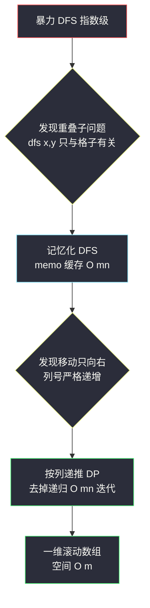

# 2684. 网格中的最大移动次数（Maximum Number of Moves in a Grid）

> 题目来源：[https://leetcode.cn/problems/maximum-number-of-moves-in-a-grid/](https://leetcode.cn/problems/maximum-number-of-moves-in-a-grid/)
>
> 灵茶题单小节定位：§一、网格图 DFS（记忆化搜索篇：DFS 结果是「值」而不是「标记」）

## 一、问题描述

给你一个大小为 `m × n` 的下标从 0 开始的二维矩阵 `grid`，你需要从 **第一列** 任意一个格子出发，按以下规则移动：

- 设当前位于格子 `(x, y)`，你可以移动到 `(x + 1, y + 1)`、`(x, y + 1)` 或 `(x - 1, y + 1)`（即向右一列，行号不变或上下变化一格）；
- 移动到的格子值必须 **严格大于** 当前格子值 `grid[x][y]`。

返回你能得到的 **最大移动次数**（可能为 0，表示一步都走不了）。

**数据范围**：

- `2 <= m, n <= 1000`
- `1 <= grid[i][j] <= 10⁵`

**示例 1**：

```text
输入：grid = [[2,4,3,5],
             [5,4,9,3],
             [3,4,2,11]]
输出：3
解释：从 (0,0) 出发：2 → 4 → 9 → 11，
     路径 (0,0) → (1,1) → (1,2) → (2,3)，共移动 3 次。
```

**核心思考点**：这题与普通「网格图 DFS 遍历」最大的不同在于——DFS 要返回的不是「访问过没有」，而是「从这里出发最多还能走几步」。同一个格子可能从多条路径到达，其后续答案却是固定的，于是 **记忆化**（把算过的答案缓存起来）顺理成章。

## 二、暴力解法

### 思路

不缓存任何结果，对第一列每个格子 `(i, 0)` 调用普通 DFS：枚举右上 / 右 / 右下三个方向，值严格变大就递归下去，返回「三个分支结果的最大值 + 1」（走不动返回 0）。答案取所有起点中的最大值。

### 代码

```python
def maxMovesBrute(grid: list[list[int]]) -> int:
    m, n = len(grid), len(grid[0])

    def dfs(x: int, y: int) -> int:
        best = 0
        for dx in (-1, 0, 1):              # 行号 -1/0/+1，列号恒 +1
            nx = x + dx
            if 0 <= nx < m and y + 1 < n and grid[nx][y + 1] > grid[x][y]:
                best = max(best, dfs(nx, y + 1) + 1)
        return best

    return max(dfs(i, 0) for i in range(m))
```

### 复杂度

- 时间：`O(3^(m·n))` 指数级——最坏情况下格子值沿路径单调上升，同一格被不同路径反复到达、反复整棵重算。
- 空间：递归深度 `O(n)`。

`m = n = 1000` 时直接超时，必须消除重复计算。

## 三、优化探索

### 3.1 重复子问题在哪

观察两条路径 `(0,0)→(1,1)→(2,2)` 与 `(1,0)→(1,1)→(2,2)`：它们到达 `(2,2)` 之后的部分完全一致——因为「从 `(2,2)` 出发最多走几步」只取决于 **格子本身**，与怎么来的无关。

这就是重叠子问题：`dfs(x, y)` 的返回值可以缓存到 `memo[x][y]`，第二次访问直接命中。

### 3.2 记忆化 DFS

- `memo[x][y]` 初始化为 `-1`，表示未计算；
- `dfs(x, y)` 开头查缓存，末尾写缓存；
- 递归深度为列数 `n ≤ 1000`，在 Python 递归上限之内（保险起见可调 `sys.setrecursionlimit`）。

### 3.3 更进一步：按列递推（去掉递归）

由于移动方向 **永远是向右一列**，按列从右往左（或从左往右刷表）即可把递归变成循环：

- `dp[x][y] = max(dp[nx][y+1] + 1)`，其中 `nx ∈ {x-1, x, x+1}` 且 `grid[nx][y+1] > grid[x][y]`，走不动为 0；
- 从倒数第二列开始向左递推（右端列 `dp = 0`）；
- 答案 = 第一列 `dp` 的最大值。

还可以继续做空间优化：递推只依赖右边一列，`dp` 可以压成一维数组（`O(m)` 空间）。



## 四、代码实现

### 主解：记忆化 DFS

```python
import sys

def maxMoves(grid: list[list[int]]) -> int:
    sys.setrecursionlimit(10 ** 6)
    m, n = len(grid), len(grid[0])
    memo = [[-1] * n for _ in range(m)]

    def dfs(x: int, y: int) -> int:
        if memo[x][y] != -1:                 # 命中缓存
            return memo[x][y]
        best = 0
        for dx in (-1, 0, 1):
            nx = x + dx
            if 0 <= nx < m and y + 1 < n and grid[nx][y + 1] > grid[x][y]:
                best = max(best, dfs(nx, y + 1) + 1)
        memo[x][y] = best                    # 写缓存
        return best

    return max(dfs(i, 0) for i in range(m))
```

### 优化版：按列递推 + 一维数组

```python
def maxMovesDP(grid: list[list[int]]) -> int:
    m, n = len(grid), len(grid[0])
    # dp[x]：当前列格子 (x, y) 出发的最大移动次数；初始为最后一列（全 0）
    dp = [0] * m
    for y in range(n - 2, -1, -1):           # 从倒数第二列向左
        ndp = [0] * m
        for x in range(m):
            for dx in (-1, 0, 1):
                nx = x + dx
                if 0 <= nx < m and grid[nx][y + 1] > grid[x][y]:
                    ndp[x] = max(ndp[x], dp[nx] + 1)
        dp = ndp
    return max(dp)
```

### 细节说明

- **DFS 的三类返回值**：遍历型 DFS 返回 `True/False`（连通判定），回溯型无返回值（路径收集），本篇这种 **求值型 DFS** 返回数值并配 `memo`——三者写法骨架相似，区别在于「状态要不要还原」：记忆化 DFS **绝不还原** `memo`（缓存就是要留着的），回溯型才还原路径状态。
- **递归边界**：走不动（三个方向都不满足）时 `best = 0` 自然返回，无需显式判断列 `y == n-1`。
- **为什么记忆化安全**：值严格递增保证路径无环——同一格不会在一条路径上出现两次；而不同路径到同一格的「剩余答案」相同，缓存命中正确。

## 五、例子演示

用示例 1 的网格端到端走一遍：

```text
列号 y:     0   1   2   3
行 x=0:     2   4   3   5
行 x=1:     5   4   9   3
行 x=2:     3   4   2   11
```

**第一步：主入口对第一列三格分别调用 DFS**。

`dfs(0,0)`（格值 2）的递归轨迹：

| 深度 | 当前格 | 值 | 尝试方向（右上/右/右下） | 结果 |
|---|---|---|---|---|
| 1 | (0,0) | 2 | (−1,1) 越界；(0,1)=4 > 2 ✓；(1,1)=4 > 2 ✓ | 取两分支最大 |
| 2a | (0,1) | 4 | (−1,2) 越界；(0,2)=3 ✗；(1,2)=9 > 4 ✓ | 进入 (1,2) |
| 3 | (1,2) | 9 | (0,3)=5 ✗；(1,3)=3 ✗；(2,3)=11 > 9 ✓ | 进入 (2,3) |
| 4 | (2,3) | 11 | 右侧越界 | 返回 0 |
| 3 | (1,2) | 9 | — | memo[1][2] = 0 + 1 = **1** |
| 2a | (0,1) | 4 | — | memo[0][1] = 1 + 1 = **2** |
| 2b | (1,1) | 4 | (0,2)=3 ✗；(1,2)=9 ✓ 缓存命中！ | memo[1][2] = 1 直接拿 |
| 2b | (1,1) | 4 | — | memo[1][1] = 1 + 1 = **2** |
| 1 | (0,0) | 2 | — | memo[0][0] = 2 + 1 = **3** |

注意表格里 `2b` 分支的「缓存命中」——`dfs(1,2)` 在 `2a` 分支已算过并写入 `memo[1][2] = 1`，`2b` 直接取值不再展开，这就是记忆化省时间的地方。

**第二步：其余起点**（缓存已热）：

| 起点 | 调用 | 过程 | 结果 |
|---|---|---|---|
| (1,0) 值 5 | dfs(1,0) | (0,1)=4 ✗、(1,1)=4 ✗、(2,1)=4 ✗（都 ≤ 5） | memo[1][0] = **0** |
| (2,0) 值 3 | dfs(2,0) | (1,1)=4 ✓ → memo 命中 = 2 → +1 | memo[2][0] = **3** |

**最终答案**：`max(3, 0, 3) = 3` ✅。两条最优路径：`(0,0)→(1,1)→(1,2)→(2,3)` 与 `(2,0)→(1,1)→(1,2)→(2,3)`。

```mermaid
flowchart LR
    subgraph P["两条最优路径（值 2/3 → 4 → 9 → 11）"]
        A00["(0,0) 2"] --> B11["(1,1) 4"]
        C20["(2,0) 3"] --> B11
        B11 --> C12["(1,2) 9"]
        C12 --> D23["(2,3) 11"]
    end
    style P fill:#1e1f29,stroke:#6272a4
    style A00 fill:#2b2d3a,stroke:#f1fa8c,color:#f8f8f2
    style C20 fill:#2b2d3a,stroke:#f1fa8c,color:#f8f8f2
    style B11 fill:#2b2d3a,stroke:#8be9fd,color:#f8f8f2
    style C12 fill:#2b2d3a,stroke:#8be9fd,color:#f8f8f2
    style D23 fill:#2b2d3a,stroke:#50fa7b,color:#f8f8f2
```



## 六、复杂度分析

设 `N = m × n`：

- **时间复杂度：`O(N)`**
  - 每个格子的 `dfs` 只会「真正计算」一次（其余全部缓存命中），每次计算只看 3 个方向，总计 `O(3N)`。
  - 按列递推版同理：每列 `m` 个格子各看 3 个方向，共 `O(3N)`。
- **空间复杂度：`O(N)`**
  - 记忆化版：`memo` 为 `O(N)`，递归栈深 `O(n)`；
  - 递推版：一维数组仅 `O(m)`（不算输出的前提下是唯一额外空间）。

## 七、对比总结

| 维度 | 暴力 DFS | 记忆化 DFS | 按列递推 DP |
|---|---|---|---|
| 时间 | `O(3^N)` 指数级 | `O(N)` | `O(N)` |
| 空间 | `O(n)` 栈 | `O(N)` memo + 栈 | `O(m)` 一维数组 |
| 思维成本 | 低 | 中（想到缓存） | 中（想到拓扑序：列号） |
| 实现风险 | 超时 | 递归深度（n ≤ 1000 安全） | 无递归，最稳 |

**套路归纳**：网格图 DFS 一旦「要返回值」而非「只要标记」，立刻想到三件事——①状态只与格子有关（可缓存）；②移动方向受限（可能存在天然拓扑序，可改递推）；③路径值单调（无环，缓存正确）。这三点也是从 DFS 过渡到 DP 的标准桥梁。

## 八、举一反三

1. **[329. 矩阵中的最长递增路径](https://leetcode.cn/problems/longest-increase-path-in-a-matrix/)**：本题的四方向版（可上下左右任意走、值严格递增），记忆化 DFS 经典 Hard。
2. **[2328. 网格图中递增路径的数目](https://leetcode.cn/problems/number-of-increasing-paths-in-a-grid/)**：记忆化 DFS 数路径条数再取模，把「max」换成「求和」。
3. **[1020. 飞地的数量](https://leetcode.cn/problems/number-of-enclaves/)**：遍历型 DFS（返回标记）的对照篇，体会「求值」与「遍历」写法差异（见本站 `number-of-enclaves.md`）。
4. **[62. 不同路径](https://leetcode.cn/problems/unique-paths/)**：同样「只能向右一列」，纯计数 DP 入门。
5. **[2435. 矩阵中和能被 K 整除的路径](https://leetcode.cn/problems/paths-in-matrix-whose-sum-is-divisible-by-k/)**：带余数状态的网格 DP，本题递推思想的扩展。

**同族互引**：本篇是网格图 DFS 从「遍历」走向「求值」的转折点——`number-of-closed-islands.md`（遍历型）、`coloring-a-border.md`（遍历 + 收集型）与本篇（求值型）对照阅读，可以一次看清三类 DFS 模板的差异全在「返回什么、缓存什么」。
