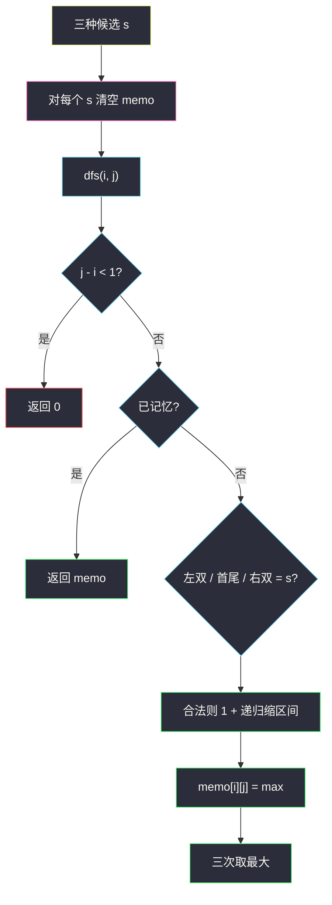

# 3040. 相同分数的最大操作数目 II（Maximum Number of Operations With the Same Score II）

> 题目来源：[https://leetcode.cn/problems/maximum-number-of-operations-with-the-same-score-ii/](https://leetcode.cn/problems/maximum-number-of-operations-with-the-same-score-ii/)
>
> 灵茶题单小节定位：§8.2 区间 DP

## 一、问题描述

给你一个整数数组 `nums`。若当前至少还有 2 个元素，可以执行以下任意一种操作：

- 删掉**最前面两个**元素；
- 删掉**最后两个**元素；
- 删掉**第一个和最后一个**元素。

一次操作的**分数**是被删两数之和。要求**所有操作分数相同**，求最多能进行多少次操作。

**数据范围**：

- `2 <= nums.length <= 2000`
- `1 <= nums[i] <= 1000`

**示例 1**：

```text
输入：nums = [3,2,1,2,3,4]
输出：3
解释：
- 删前两个，分数 3+2=5，剩余 [1,2,3,4]
- 删首尾，分数 1+4=5，剩余 [2,3]
- 删首尾，分数 2+3=5，剩余 []
```

**示例 2**：

```text
输入：nums = [3,2,6,1,4]
输出：2
解释：删前两个得 5，剩余 [6,1,4]；再删最后两个 1+4=5，剩余 [6]。无法继续。
```

**核心思考点**：每次只动两端，剩下的永远是一段连续区间 → 区间 DP。分数必须全程一致，而分数由**第一次操作**决定，候选只有三种：`nums[0]+nums[1]`、`nums[0]+nums[n-1]`、`nums[n-2]+nums[n-1]`。对每个候选分数 `s` 做 `dfs(i,j)`：当前区间 `[i,j]` 上分数为 `s` 的最多操作次数。`n = 2000` 时**不要把 `s` 塞进三维数组**，三次搜索各自一份二维 memo。

## 二、暴力解法

### 思路

对每个候选分数，在当前数组上尝试三种删法（和为 `s` 才走），切片递归。无记忆化时同一区间被重复展开。

### 代码

```python
def maxOperationsBrute(nums: list[int]) -> int:
    def dfs(arr: list[int], score: int) -> int:
        if len(arr) < 2:
            return 0
        ans = 0
        if arr[0] + arr[1] == score:
            ans = max(ans, 1 + dfs(arr[2:], score))
        if arr[0] + arr[-1] == score:
            ans = max(ans, 1 + dfs(arr[1:-1], score))
        if arr[-2] + arr[-1] == score:
            ans = max(ans, 1 + dfs(arr[:-2], score))
        return ans

    a = list(nums)
    cands = {a[0] + a[1], a[0] + a[-1], a[-2] + a[-1]}
    return max(dfs(a, s) for s in cands)
```

### 复杂度

- 时间：无 memo 最坏指数；每次复制数组再乘常数。仅 `n ≤ 8` 可作基准。
- 空间：递归栈 `O(n)`，另加切片拷贝。

## 三、优化探索

### 3.1 第一次操作锁死分数 ⭐

后续每一次删除的两数之和必须等于第一次的和。第一次只能是三种端点配对之一，所以候选 `s` **最多三个**（还可能重复，用集合去重）。

不存在「先随便删、再回头选 s」——`s` 不是搜索出来的，是开局三选一。

### 3.2 区间状态 `dfs(i, j)` ⭐⭐

固定 `s` 之后，局面只剩闭区间 `[i, j]`。三种转移：

```text
dfs(i, j) = 0                          若 j-i < 1（不足两个数）
dfs(i, j) = max{
    1 + dfs(i+2, j)     若 nums[i]+nums[i+1] = s,
    1 + dfs(i+1, j-1)   若 nums[i]+nums[j]   = s,
    1 + dfs(i,   j-2)   若 nums[j-1]+nums[j] = s
}
无合法转移则为 0
```

状态数 `O(n²)`，每个状态 `O(1)` 转移，单次搜索 `O(n²)`；三次共 `O(n²)`。`n = 2000` → 约 `4×10⁶`。

### 3.3 memo 不要带上 s ⭐⭐

若写成 `f[i][j][s]`：`s` 理论上 2..2000，三维 `2000³` 直接爆。即使 Python `@cache` 实际只碰到 3 个 `s`，模板上仍应：

- 对每个 `s` **单独**开 `memo[i][j]`（或清空同一张表再搜）；
- `dfs` 只收 `(i, j)`，`s` 当闭包常量。

按长度填表也行：区间长度从 2 升到 `n`，因为每次操作让长度减 2，依赖的是更短区间。



## 四、代码实现

### 主解：三个候选分数 + 二维记忆化

```python
class Solution:
    def maxOperations(self, nums: list[int]) -> int:
        n = len(nums)

        def solve(score: int) -> int:
            memo = [[-1] * n for _ in range(n)]

            def dfs(i: int, j: int) -> int:
                if j - i < 1:
                    return 0
                if memo[i][j] != -1:
                    return memo[i][j]
                ans = 0
                if nums[i] + nums[i + 1] == score:
                    ans = max(ans, 1 + dfs(i + 2, j))
                if nums[i] + nums[j] == score:
                    ans = max(ans, 1 + dfs(i + 1, j - 1))
                if nums[j - 1] + nums[j] == score:
                    ans = max(ans, 1 + dfs(i, j - 2))
                memo[i][j] = ans
                return ans

            return dfs(0, n - 1)

        cands = {nums[0] + nums[1], nums[0] + nums[-1], nums[-2] + nums[-1]}
        return max(solve(s) for s in cands)
```

### 对照：按长度填表（同一转移）

记忆化是自顶向下；自底向上按区间长度递增，每次操作让长度减 2，短区间先算好。

```python
def solve_iter(nums: list[int], score: int) -> int:
    n = len(nums)
    f = [[0] * n for _ in range(n)]
    for length in range(2, n + 1):          # 区间长度
        for i in range(0, n - length + 1):
            j = i + length - 1
            ans = 0
            if nums[i] + nums[i + 1] == score:
                ans = max(ans, 1 + (f[i + 2][j] if i + 2 <= j else 0))
            if nums[i] + nums[j] == score:
                ans = max(ans, 1 + (f[i + 1][j - 1] if i + 1 <= j - 1 else 0))
            if nums[j - 1] + nums[j] == score:
                ans = max(ans, 1 + (f[i][j - 2] if i <= j - 2 else 0))
            f[i][j] = ans
    return f[0][n - 1]
```

长度减 2 时下标 `i+2`、`j-2`、`i+1/j-1` 都已填过。三种 `score` 各跑一张表，取 max。和主解答案相同，`n=2000` 常数略大，默写仍推荐记忆化。

### 细节说明

- **`j - i < 1`**：闭区间长度 `j-i+1 < 2`。`n = 2` 时三种 `s` 相同，`dfs` 一次删光返回 1。
- **三种配对可能指向同一对**：长度为 2 时左双 = 右双 = 首尾，`max` 幂等。
- **先搜再写 memo**：三个分支都试完再存，避免把 0 当成「未算」。用 `-1` 区分。
- **不要共享一份 memo 给不同 `s`**：`[i,j]` 在 `s=5` 与 `s=7` 下答案不同。
- **等价写法**：强制第一次操作后 `1 + dfs(剩余)`，与「从满区间搜」等价，因为第一次只能走三种端点。
- **Python `@cache` 把 `s` 当参数**：实际只出现 3 个 `s`，能过；但 `n=2000` 的标准写法仍是三次清空二维表，避免有人改成真正的三维数组。

## 五、例子演示

**示例 1：`nums = [3,2,1,2,3,4]`，按长度填 `s = 5` 的表**

候选：`3+2=5`，`3+4=7`，`3+4=7`。只细填 `s = 5`。`f[i][j]` = 区间 `[i,j]` 最多操作。空/单元素为 0。长度从 2 开始（每次 -2，奇偶不变；本例 `n` 偶数）。

下标：`0:3  1:2  2:1  3:2  4:3  5:4`

**长度 2**：

| 区间 | 两数之和 | f |
|---|---|---|
| `[0,1]` 3+2 | 5 | **1** |
| `[1,2]` 2+1 | 3 | 0 |
| `[2,3]` 1+2 | 3 | 0 |
| `[3,4]` 2+3 | 5 | **1** |
| `[4,5]` 3+4 | 7 | 0 |

**长度 4**：

- `[0,3]=[3,2,1,2]`：左双 5 → `1+f[2,3]=1`；首尾 3+2=5 → `1+f[1,2]=1`；右双 1+2=3 ≠ 5。`f=1`
- `[1,4]=[2,1,2,3]`：左双 3、首尾 5 → `1+f[2,3]=1`、右双 5 → `1+f[1,2]=1`。`f=1`
- `[2,5]=[1,2,3,4]`：左双 3、首尾 **5** → `1+f[3,4]=2`、右双 7。`f=2`

**长度 6（满数组）**：

- 左双 5 → `1+f[2,5] = 1+2 = 3`
- 首尾 3+4=7 ≠ 5
- 右双 3+4=7 ≠ 5

`f[0][5] = 3`。路径：删 `[3,2]` → `[1,2,3,4]` 再删首尾 → `[2,3]` 再删。与官方一致 ✅。

**`s = 7` 满数组**：首尾或右双都能删一次，剩余 `[2,1,2,3]` 没有任何一对是 7，答案 1。最终 `max(3,1) = 3`。

**示例 2：`[3,2,6,1,4]`**

`s=5`：左双后剩 `[6,1,4]`，右双 `1+4=5`，再剩 `[6]`，共 2。其它 `s` 不更优。返回 **2** ✅。

## 六、复杂度分析

设 `n = len(nums)`：

- **时间复杂度：`O(n²)`**——最多 3 次搜索，每次 `O(n²)` 状态。
- **空间复杂度：`O(n²)`**——一份二维 memo（三次顺序复用可只开一张，每次清空）。递归栈 `O(n)`。

## 七、对比总结

| 维度 | 切片 DFS | 主解（分 s 的区间 DP） | 三维 `f[i][j][s]` |
|---|---|---|---|
| 时间 | 指数 | `O(n²)` | 空间先爆 |
| 分数 | 开局枚举 | 开局枚举 | 把 s 当状态 |
| n=2000 | 否 | 是 | 否 |

**套路归纳**：§8.2 区间 DP 的「操作缩两端」形态——状态是闭区间，转移是左双/右双/首尾。先把全局约束（同一分数）压缩成**常数个开局**，再对每个开局做二维区间搜索。同类还有石子合并、戳气球，差别只在「区间怎么缩、代价怎么算」。

## 八、举一反三

1. **[3038. 相同分数的最大操作数目 I](https://leetcode.cn/problems/maximum-number-of-operations-with-the-same-score-i/)**：只能反复删前两个，线性扫描即可，是本题的退化。
2. **[1690. 石子游戏 VII](https://leetcode.cn/problems/stone-game-vii/)**：每次取两端之一，区间 DP 算差值。
3. **[486. 预测赢家](https://leetcode.cn/problems/predict-the-winner/)**：同样只动两端，净胜分区间 DP。
4. **[312. 戳气球](https://leetcode.cn/problems/burst-balloons/)**：枚举区间内最后戳的位置，按长度填表的经典模板。
5. **[1547. 切棍子的最小成本](https://leetcode.cn/problems/minimum-cost-to-cut-a-stick/)**：切点当区间端点，枚举最后一刀。

**同族互引**：本篇是「端点配对 + 分数锁死」的区间 DP；同批划分题 `extra-characters-in-a-string.md` / `largest-sum-of-averages.md` 是前缀切段，状态一维或「前缀×段数」，对照着看就不会把区间 DP 写成线性 DP。
