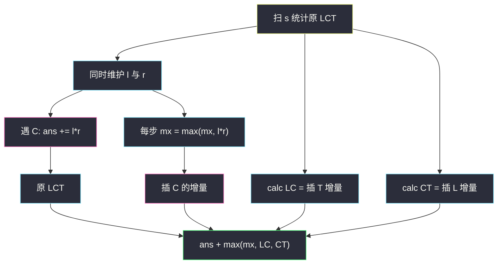

# 3628. 插入一个字母的最大子序列数（Maximum Number of Subsequences After One Inserting）

> 题目来源：[https://leetcode.cn/problems/maximum-number-of-subsequences-after-one-inserting/](https://leetcode.cn/problems/maximum-number-of-subsequences-after-one-inserting/)
>
> 灵茶题单小节定位：§6.3 进阶（枚举子序列中间字符；一次插入的增量可闭式算）

## 一、问题描述

给你一个由大写英文字母组成的字符串 `s`。你可以在任意位置（含开头、结尾）**最多插入一个**大写字母。

返回操作后，子序列 `"LCT"` 的**最大**个数。子序列保持相对顺序、不必连续。也可以选择不插入。

**数据范围**：

- `1 <= s.length <= 10⁵`
- `s` 仅含大写英文字母

必须 `O(n)`。插入其它字母（非 L/C/T）不会增加 `"LCT"`，只需考虑插 L、插 C、插 T 或不插。

**示例 1**：

```text
输入：s = "LMCT"
输出：2
解释：在开头插入 L 得到 "LLMCT"，两个 "LCT"：下标 [0,3,4] 与 [1,3,4]。
```

**示例 2**：

```text
输入：s = "LCCT"
输出：4
解释：开头插入 L 得到 "LLCCT"，2 个 L × 2 个 C × 1 个 T = 4。
```

**示例 3**：

```text
输入：s = "L"
输出：0
解释：即使插入一个字母也无法凑齐 L、C、T 三个位置。
```

**核心思考点**：原串 `"LCT"` 个数 = 枚举每个 `C`，左 `L` 数 × 右 `T` 数。插入一个字母的**增量**分别是：插 L → 原串 `"CT"` 数（插到最前）；插 T → 原串 `"LC"` 数（插到最后）；插 C → 某个插入点「左 L × 右 T」的最大值。

## 二、暴力解法

### 思路

枚举插入位置 `0..n` 与字母 `L/C/T`（含「不插」= 原串），对每个新串用三重循环或「枚举 C」统计 `"LCT"` 个数，取最大。

### 代码

```python
def numOfSubsequencesBrute(s: str) -> int:
    def count_lct(t: str) -> int:
        n, ans = len(t), 0
        for i in range(n):
            if t[i] != "L":
                continue
            for j in range(i + 1, n):
                if t[j] != "C":
                    continue
                for k in range(j + 1, n):
                    if t[k] == "T":
                        ans += 1
        return ans

    best = count_lct(s)
    for i in range(len(s) + 1):
        for ch in "LCT":
            best = max(best, count_lct(s[:i] + ch + s[i:]))
    return best
```

### 复杂度

- 时间：`O(n)` 个位置 × 3 个字母 × `O(n³)` 计数，约 `O(n⁴)`；改成枚举 C 计数则 `O(n²)`。
- `n = 10⁵` 不可用，仅作对拍。

## 三、优化探索

### 3.1 原串 LCT：枚举中间的 C ⭐

对每个 `C`，贡献 = 左边 `L` 个数 × 右边 `T` 个数。扫一遍：先统计总 `T`，扫到 `T` 先把右侧计数减一，再处理 `C`，最后把 `L` 加进左侧。这是「枚举中间、维护左右」的经典写法（与选择建筑 010/101 同构）。

### 3.2 三种插入的增量 ⭐⭐

设原串 LCT 个数为 `ans`。插入恰好一个字符时，**多出来的** `"LCT"` 必须用到这个新字符：

| 插入 | 新字符扮演 | 最优位置 | 增量 |
|------|------------|----------|------|
| L | 子序列的 L | 最左（前面没有更优的 L 来源） | 原串 `"CT"` 子序列数 |
| T | 子序列的 T | 最右 | 原串 `"LC"` 子序列数 |
| C | 子序列的 C | 使左 L × 右 T 最大的缝 | `max(leftL * rightT)` |

插到最左的 L 能与串中**所有** `"CT"` 配对；任何更右的位置只会丢掉左边的 C/T。T 对称。

插 C：新 C 的贡献恰是「插入点左侧 L 数 × 右侧 T 数」，与原 C 无关。在扫描原串时，每经过一个位置就用当前 `l * r` 更新这个 max（含「插在该字符之后」）。插在最前：左 L=0，贡献恒 0，不必特判。

### 3.3 答案 = 原值 + max 增量 ⭐

「最多一个」包含不插，增量为 0。三种增量都 ≥ 0，所以：

```text
答案 = 原 LCT + max( 插L增量, 插C增量, 插T增量 )
```

插其它字母增量为 0，被 max 自然丢掉。



核心一句：**新字母只能当 L / C / T 之一，增量分别是 CT 数、最大缝的 L×T、LC 数。**

## 四、代码实现

### 主解：一遍扫描 + 两种二元子序列

```python
class Solution:
    def numOfSubsequences(self, s: str) -> int:
        def calc(t: str) -> int:
            cnt = a = 0
            for c in s:
                if c == t[1]:
                    cnt += a
                a += int(c == t[0])
            return cnt

        l, r = 0, s.count("T")
        ans = mx = 0
        for c in s:
            r -= int(c == "T")
            if c == "C":
                ans += l * r
            l += int(c == "L")
            mx = max(mx, l * r)          # 插在当前字符之后的 C
        mx = max(mx, calc("LC"), calc("CT"))
        return ans + mx
```

`calc("LC")` 是二元子序列计数：每遇到第二个字母，累加已经出现的第一个字母个数。`calc("CT")` 同理。顺序必须是「先计再加」，否则同一位置的字符会自己配自己。

插 L 为何一定在最左：新 L 只能与它**右边**的 `"CT"` 配对。放得越左，右边的 CT 越多，最大即整串的 CT 数。插 T 对称，放最右。这两条不必枚举位置。

### 细节说明

- **先减 T 再处理 C**：对插 C 的缝，先减 T 后 `r` = 严格右侧 T，再 `l += L` 后 `l*r` 是「含当前 L、不含当前 T」的缝，正好是「插在当前字符之后」。
- **`n = 1`**：原 LCT=0，CT=LC=0，mx=0，返回 0。
- **整数**：L、C、T 均可 `10⁵` 级，乘积 `10¹⁰`，Python 无忧，其它语言用 64 位。
- **插入其它字母**：对 `"LCT"` 零贡献，不必枚举 `A..Z`。
- **`mx` 要在加 L 之后更新**，否则会漏掉「紧挨这个 L 后面插 C」。

Java 对照：

```java
class Solution {
    public long numOfSubsequences(String S) {
        char[] s = S.toCharArray();
        long l = 0, r = 0, ans = 0, mx = 0;
        for (char c : s) if (c == 'T') r++;
        for (char c : s) {
            if (c == 'T') r--;
            if (c == 'C') ans += l * r;
            if (c == 'L') l++;
            mx = Math.max(mx, l * r);
        }
        mx = Math.max(mx, Math.max(calc(s, 'L', 'C'), calc(s, 'C', 'T')));
        return ans + mx;
    }
    private long calc(char[] s, char a, char b) {
        long cnt = 0, x = 0;
        for (char c : s) {
            if (c == b) cnt += x;
            if (c == a) x++;
        }
        return cnt;
    }
}
```

## 五、例子演示

**示例 1：`s = "LMCT"`**

总 T=1。扫描：

| 字符 | 减 T 后 r | 原贡献 | 加 L 后 l | l*r（插 C） |
|------|-----------|--------|-----------|-------------|
| L | 1 | 0 | 1 | 1 |
| M | 1 | 0 | 1 | 1 |
| C | 1 | 1×1=**1** | 1 | 1 |
| T | 0 | 0 | 1 | 0 |

原 LCT = 1。`calc("LC")=1`（一对 L…C），`calc("CT")=1`。`mx = max(1,1,1)=1`。答案 1+1=**2** ✅（插 L 或插 T 或在 L 后插 C 增量都是 1；官方选开头插 L）。

**示例 2：`s = "LCCT"`**

| 字符 | r | 原贡献 | l | l*r |
|------|---|--------|---|-----|
| L | 1 | 0 | 1 | 1 |
| C | 1 | 1 | 1 | 1 |
| C | 1 | 1 | 1 | 1 |
| T | 0 | 0 | 1 | 0 |

原 LCT=2。`calc("LC")=2`（一个 L 配两个 C），`calc("CT")=2`（两个 C 配一个 T）。`mx=2`。答案 2+2=**4** ✅。

**示例 3：`s = "L"`**：三种增量皆 0，返回 **0** ✅。

**插 C 吃满左右：`s = "LLTT"`**

原串没有 C，原 LCT=0。`calc("LC")=0`，`calc("CT")=0`。扫描时 `l` 从 0→1→2，`r` 在两个 T 之前一直是 2，故 `l*r` 最大 = 2×2=4。答案 **4**：在两个 L 与两个 T 之间插入一个 C，4 个 `"LCT"`。若把 C 插在最前或最后，左 L 或右 T 变成 0，增量为 0。这正是「缝上 max」不能偷换成「随便插一个 C」的原因。

## 六、复杂度分析

设 `n = len(s)`：

- **时间复杂度：`O(n)`**——一遍主扫描 + 两次二元计数。
- **空间复杂度：`O(1)`**——若干计数器。

## 七、对比总结

| 维度 | 枚举插入再数 | 主解增量 |
|------|--------------|----------|
| 时间 | `O(n²)` 起 | `O(n)` |
| 插入位置 | 显式构造新串 | 最优位置可证明（L 最左、T 最右、C 取缝 max） |
| 易错 | 漏掉「不插入」 | 先减 T / 后加 L 的顺序 |

**套路归纳**：**长度为 3 的模式子序列**先枚举中间字符，左右计数相乘。一次修改（插入/删除/改写一个字符）只影响「新字符所扮演的那一角」，把增量拆成三种角色分别优化。同类还有「插入一个字符最大化 pattern 子序列」（pattern 长为 2 时更简单）。

## 八、举一反三

1. **[2207. 字符串中最多数目的子序列](https://leetcode.cn/problems/maximize-number-of-subsequences-in-a-string/)**：pattern 长 2，插入一个字符——本题的二元简化版。
2. **[2222. 选择建筑的方案数](https://leetcode.cn/problems/number-of-ways-to-select-buildings/)**：枚举中间建筑，左×右；同目录 `number-of-ways-to-select-buildings.md`。
3. **[115. 不同的子序列](https://leetcode.cn/problems/distinct-subsequences/)**：任意 pattern 的子序列计数 DP。
4. **[940. 不同的子序列 II](https://leetcode.cn/problems/distinct-subsequences-ii/)**：统计不同子序列个数，末尾追加字符的增量思想。
5. **[730. 统计不同回文子序列](https://leetcode.cn/problems/count-different-palindromic-subsequences/)**：子序列计数的区间加强。

**同族互引**：`number-of-ways-to-select-buildings.md` 把「枚举中间 × 左右计数」讲透；本题在同一骨架上加「一次插入三角色增量」。
