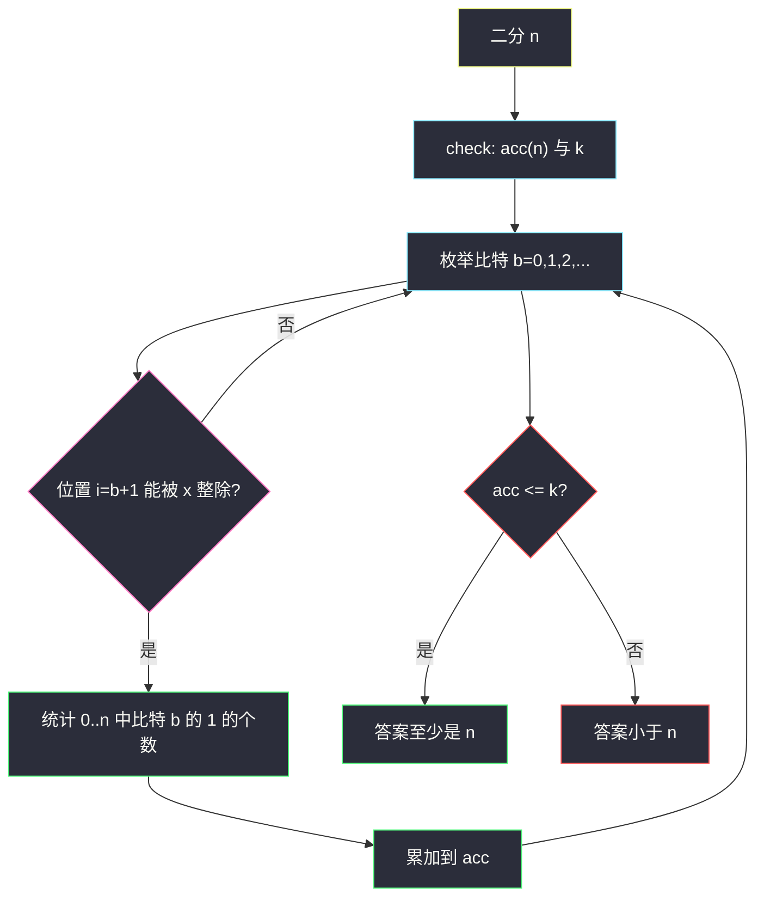

# 3007. 价值和小于等于 K 的最大数字（Maximum Number That Sum of the Prices Is Less Than or Equal to K）

> 题目来源：[https://leetcode.cn/problems/maximum-number-that-sum-of-the-prices-is-less-than-or-equal-to-k/](https://leetcode.cn/problems/maximum-number-that-sum-of-the-prices-is-less-than-or-equal-to-k/)
>
> 灵茶题单小节定位：§10.2 统计合法元素的价值总和

## 一、问题描述

给你整数 `k` 和 `x`。一个整数 `num` 的**价值（price）**定义如下：看它的二进制表示，**从最低有效位开始、按下标 1、2、3、… 编号**；价值等于那些下标 `i` 满足 `i % x == 0` 且该位是 `1` 的个数。

下表是官方给出的计算例子：

| x | num | 二进制 | price |
|---|---|---|---|
| 1 | 13 | 000001101 | 3 |
| 2 | 13 | 000001101 | 1 |
| 2 | 233 | 011101001 | 3 |
| 3 | 13 | 000001101 | 1 |
| 3 | 362 | 101101010 | 2 |

`num` 的**累加价值**是 `1` 到 `num` 每个数的价值之和。若累加价值 ≤ `k`，称 `num` 是**廉价**的。返回最大的廉价数字。

**数据范围**：

- `1 <= k <= 10^15`
- `1 <= x <= 8`

**示例 1**：

```text
输入：k = 9, x = 1
输出：6
解释：6 是最大的廉价数字（累加价值恰好 9；7 的累加价值 12 > 9）。
```

| x | num | 二进制 | price | 累加价值 |
|---|---|---|---|---|
| 1 | 1 | 001 | 1 | 1 |
| 1 | 2 | 010 | 1 | 2 |
| 1 | 3 | 011 | 2 | 4 |
| 1 | 4 | 100 | 1 | 5 |
| 1 | 5 | 101 | 2 | 7 |
| 1 | 6 | 110 | 2 | 9 |
| 1 | 7 | 111 | 3 | 12 |

`x = 1` 时每个置位都计价，price = popcount。

**示例 2**：

```text
输入：k = 7, x = 2
输出：9
解释：9 的累加价值是 6 ≤ 7；10 的累加价值是 8 > 7。
```

| x | num | 二进制 | price | 累加价值 |
|---|---|---|---|---|
| 2 | 1 | 0001 | 0 | 0 |
| 2 | 2 | 0010 | 1 | 1 |
| 2 | 3 | 0011 | 1 | 2 |
| 2 | 4 | 0100 | 0 | 2 |
| 2 | 5 | 0101 | 0 | 2 |
| 2 | 6 | 0110 | 1 | 3 |
| 2 | 7 | 0111 | 1 | 4 |
| 2 | 8 | 1000 | 1 | 5 |
| 2 | 9 | 1001 | 1 | 6 |
| 2 | 10 | 1010 | 2 | 8 |

只给 **1-index 且从最低位起** 的第 2、4、6、… 位置计价。`1` 的最低位是位置 1，不计价。

**核心思考点**：累加价值对 `num` 单调不减（每个数的 price ≥ 0），可以二分答案。check 需要在 `O(log num)` 内求出 `1..num` 的价值总和——按位统计「区间内某比特为 1 的次数」，只对下标 `i % x == 0` 的比特累加。不要数错位号：位置 1 = `num & 1`，不是最高位。

## 二、暴力解法

从 1 往后逐个加 price，直到累加超过 `k`。

```python
def findMaximumNumberBrute(k, x):
    def price(num: int) -> int:
        c, i = 0, 1
        while num:
            if (num & 1) and i % x == 0:
                c += 1
            num >>= 1
            i += 1
        return c

    acc, num = 0, 0
    while True:
        acc += price(num + 1)
        if acc > k:
            return num
        num += 1
```

`k` 到 `10^15` 时答案本身可以到 `10^15` 量级，线性扫描不可用。

### 复杂度

- 时间：`O(ans · log ans)`。
- 空间：`O(1)`。

瓶颈：不需要每个 `num` 的 price，只需要它们的**总和**；总和可以按比特贡献拆开。

## 三、优化探索

### 3.1 二分答案 ⭐

`acc(n) = Σ_{t=1}^{n} price(t)` 单调。二分最大的 `n` 使 `acc(n) ≤ k`。上界取 `10^16` 足够：`x ≤ 8` 时 64 位里计价比特不多，`acc(n)` 大约随 `n` 线性增长，`n` 不会超过约 `10^16`。

### 3.2 按位贡献：不要数错下标 ⭐⭐

`price(t)` = 若干互不相关的比特指示之和，所以

```text
acc(n) = Σ_{满足 i%x==0 的位置 i}  (1..n 中第 i 位为 1 的个数)
```

位置 `i` 对应 **0-index 的比特 `b = i - 1`**（最低位 `b = 0` 是位置 1）。`[0, n]` 与 `[1, n]` 在这些比特上计数相同（0 没有任何 1）。

`[0, n]` 中比特 `b` 为 1 的个数：周期 `2^{b+1}`，每周期前半 0 后半 1，后半长度 `2^b`。

```text
cycle = 1 << (b + 1)
full, rem = divmod(n + 1, cycle)
cnt = full * (1 << b) + max(0, rem - (1 << b))
```

只对 `(b+1) % x == 0` 的 `b` 累加。`n` 的比特数 ≤ 60 左右，一次 check 是 `O(log n)`。



### 3.3 和数位 DP 的关系

从高位到低位填二进制、状态 `(pos, tight, priced_ones)` 也能求 `acc(n)`，属于 §10.2 的标准数位 DP。按位贡献更短，且不容易把「从低位编号」写成从高位编号。两种 check 都可以塞进同一套二分。

数位 DP 的价值总和写法：`dfs(i, tight)` 返回「从比特 `i`（高位）填到结尾、当前是否贴上界」的 **price 之和**（不是个数）。转移到下一位 `b ∈ {0, 1}`（受 `tight` 限制），若该位对应的 1-index 位置能被 `x` 整除且 `b = 1`，贡献等于「后面能填出的数的个数」。个数本身再开一个并列返回，或用「剩余自由位 `2^k`」当场算。比按位贡献啰嗦，迁移到「价值依赖相邻位」的题才值得上。

## 四、代码实现

### 主解：二分 + 按位统计 1 的贡献

```python
class Solution:
    def findMaximumNumber(self, k: int, x: int) -> int:
        def count_bit(n: int, b: int) -> int:
            cycle = 1 << (b + 1)
            half = 1 << b
            full, rem = divmod(n + 1, cycle)
            return full * half + max(0, rem - half)

        def acc(n: int) -> int:
            if n <= 0:
                return 0
            s, b = 0, 0
            while (1 << b) <= n:
                if (b + 1) % x == 0:          # 1-index 位置从最低位起
                    s += count_bit(n, b)
                b += 1
            return s

        lo, hi = 0, 10**16
        while lo < hi:
            mid = (lo + hi + 1) // 2
            if acc(mid) <= k:
                lo = mid
            else:
                hi = mid - 1
        return lo
```

Java 签名是 `long findMaximumNumber(long k, int x)`，二分上下界与 `acc` 全部用 `long`。移位用 `1L << b`，避免 `1 << 31` 溢出。

```java
class Solution {
    public long findMaximumNumber(long k, int x) {
        long lo = 0, hi = (long) 1e16;
        while (lo < hi) {
            long mid = (lo + hi + 1) >>> 1;
            if (acc(mid, x) <= k) lo = mid;
            else hi = mid - 1;
        }
        return lo;
    }
    long acc(long n, int x) {
        if (n <= 0) return 0;
        long s = 0;
        for (int b = 0; (1L << b) <= n; b++)
            if ((b + 1) % x == 0) s += countBit(n, b);
        return s;
    }
    long countBit(long n, int b) {
        long cycle = 1L << (b + 1), half = 1L << b;
        long full = (n + 1) / cycle, rem = (n + 1) % cycle;
        return full * half + Math.max(0, rem - half);
    }
}
```

### 细节说明

- **循环条件 `(1 << b) <= n`**：更高比特在 `1..n` 里全是 0，不必数。若写成 `b < 63` 也对，只是多几轮空转。
- **`divmod(n+1, cycle)` 的 `+1`**：闭区间 `[0, n]` 一共 `n+1` 个数。漏掉 `+1` 会让官方第一例算错。
- **`x = 1`**：每个位置都计价，`acc(n)` 就是 `1..n` 的 popcount 之和。
- **答案可以为很大的偶数/奇数**：不要误以为廉价数字有奇偶限制；唯一限制是累加价值。
- **上界太小会漏答案**：有人把 `hi` 设成 `k`。`x > 1` 时很多比特不计价，`acc(n)` 增长慢于 `n`，答案可以 **大于** `k`（示例 2：`k = 7` 答案是 9）。`10^16` 留足余量。
- **从最高位编号**：把 `bin(num)` 字符串的左起第 1 位当位置 1，官方表全错。必须右起。
- **`count_bit` 写成 `[1, n]` 再另减 0**：0 没有置位，减不减都一样；真正易错的是周期公式里用 `n` 而不是 `n+1`。

## 五、例子演示

**示例 1：`k = 9, x = 1`，验证 `acc(6)` 与 `acc(7)`**

`x = 1`，比特 0、1、2 都计价（6 的最高比特是位 2）。

| 比特 b | 位置 i | `[0,6]` 中该位为 1 的个数 | 贡献 |
|---|---|---|---|
| 0 | 1 | 1,3,5 → 3 | 3 |
| 1 | 2 | 2,3,6 → 3 | 3 |
| 2 | 3 | 4,5,6 → 3 | 3 |

`acc(6) = 9 ≤ 9`。`acc(7)` 每个比特再多一个 1（7=`111`），变成 12 > 9。二分会停在 **6** ✅。

**示例 2：`k = 7, x = 2`，看 `acc(9)`**

只计价位置 2、4、… 即比特 1、3、…。

| 比特 b | 位置 i | `[0,9]` 中为 1 的个数 |
|---|---|---|
| 1 | 2 | 2,3,6,7 → 4 |
| 3 | 4 | 8,9 → 2 |

`acc(9) = 6 ≤ 7`。`n = 10` 时比特 1 与比特 3 各多一个 1（10=`1010`），`acc(10) = 8 > 7`。答案 **9** ✅。

注意：`9 = 1001` 的最低位（位置 1）是 1，但 `1 % 2 ≠ 0`，**不计价**；第四位（位置 4）才加 1。若误从最高位编号，这例会立刻算错。

## 六、复杂度分析

- **时间复杂度：`O(log U · log U)`**——二分 `O(log U)` 次，每次扫 `O(log n)` 个比特，`U = 10^16`。
- **空间复杂度：`O(1)`**。

## 七、对比总结

| 维度 | 逐个累加 | 二分 + 按位贡献 | 二分 + 数位 DP |
|---|---|---|---|
| 时间 | `O(ans log ans)` | `O(log² U)` | `O(log² U · 状态)` |
| 位号风险 | 从低位右移，不易错 | 必须 `i = b+1` | 从高位填时容易把编号写反 |
| 推荐 | 仅作对拍 | 主解 | 与 §10.1/§10.2 模板对照 |

**易错点**

- 位号从 MSB 数，或 0-index 却拿 `b % x == 0` 判断。
- 二分上界用 `k`，`x ≥ 2` 时答案可能比 `k` 大。
- `count_bit` 漏了 `n+1`，`acc(6)` 对不上官方表。
- 把 price 理解成数值本身而不是置位个数。

**套路归纳**：§10.2 要的是「1..n 的价值总和」而不是「合法个数」。价值能按位拆就**拆位 + 区间内 1 的个数**；拆不开再上数位 DP。外层一律二分（或直接数学反推）找最大 `n`。钉死编号：**最低位是位置 1**。

## 八、举一反三

1. **[233. 数字 1 的个数](https://leetcode.cn/problems/number-of-digit-one/)**：十进制按位贡献，「1..n 中某位为 1 的次数」，与本题二进制版同构。
2. **[600. 不含连续 1 的非负整数](https://leetcode.cn/problems/non-negative-integers-without-consecutive-ones/)**：二进制数位 DP 计数，状态带「上一位是不是 1」。
3. **[1012. 至少有 1 位重复的数字](https://leetcode.cn/problems/numbers-with-repeated-digits/)**：十进制数位 DP + 掩码，§10.1 计数模板。
4. **[788. 旋转数字](https://leetcode.cn/problems/rotated-digits/)**：判定函数 + 计数；n 大时同样换成数位 DP。
5. **[2719. 统计整数数目](https://leetcode.cn/problems/count-of-integers/)**：数位 DP 求区间内数位和落在 `[min,max]` 的个数，价值总和的近亲。
