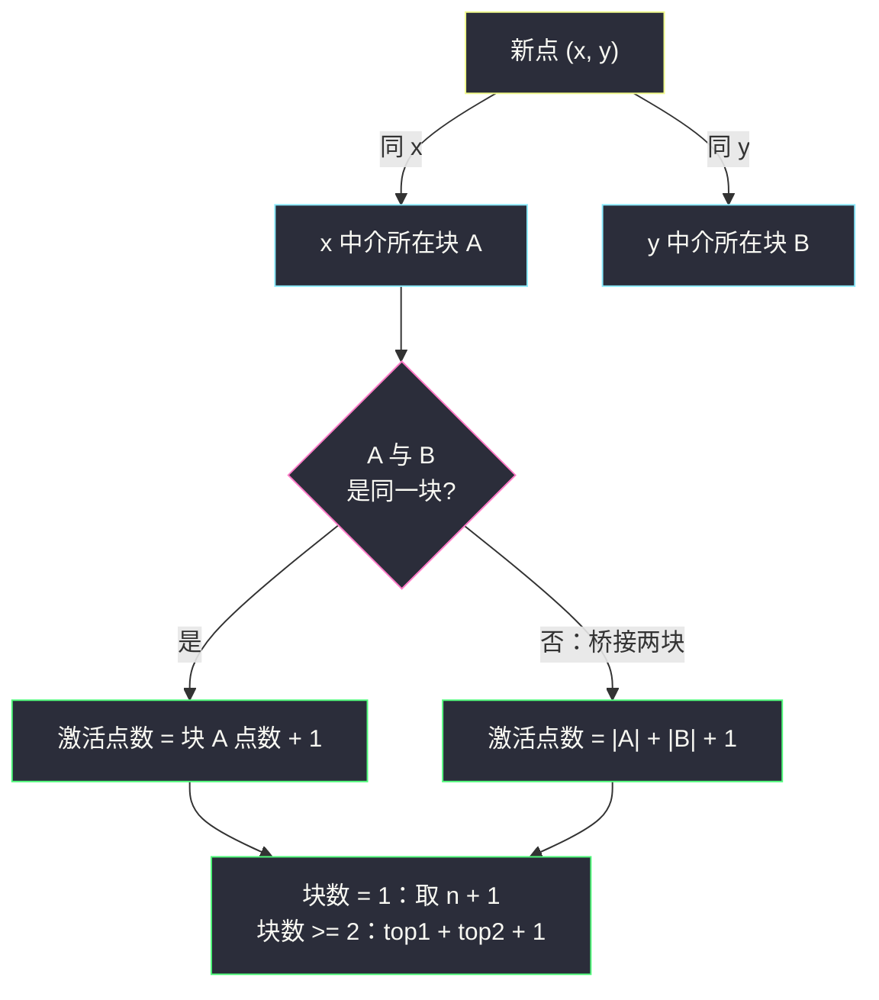
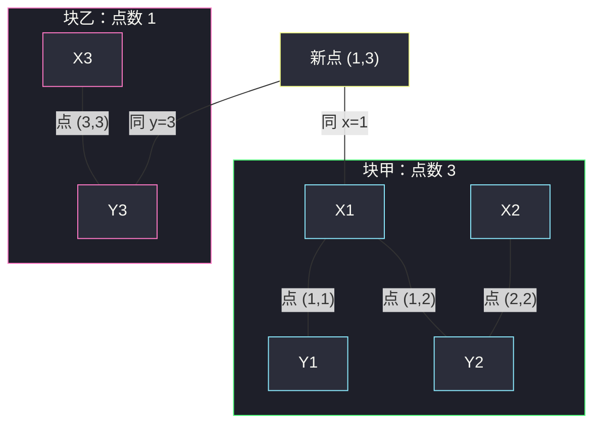

# 添加一个点后可激活的最大点数（中介并查集 · 双块桥接）

## 一、问题描述

给定二维整数数组 `points`，`points[i] = [xi, yi]`，所有点坐标**互不相同**。

**激活规则**：若一个点被激活，则所有与它**同 x 坐标**或**同 y 坐标**的点也被激活；被激活的点继续按此规则**链式扩散**，直到无法继续。

你还可以**额外添加一个不在 `points` 中的整数坐标点** `(x, y)`，并**从新点开始激活**。返回可被激活的**最大**点数（含新点本身）。

> 🔗 LeetCode 3873：https://leetcode.cn/problems/maximum-points-activated-with-one-addition/
>
> 数据范围：`1 <= n <= 10^5`，`-10^9 <= xi, yi <= 10^9`。

**示例 1**

```
输入：points = [[1,1],[1,2],[2,2]]
输出：4
解释：添加 (1,3)，激活 (1,3) -> 同 x=1 的 (1,1)、(1,2) -> (1,2) 同 y=2 的
     (2,2)，共激活 4 个点（含新点）。
```

**直观理解**

「同 x 或同 y」的链式扩散，就是 [#947 移除最多的同行或同列石头](https://leetcode.cn/problems/most-stones-removed-with-same-row-or-column/)的同款传递闭包：点按「行或列相连」划分成**连通块**，激活块内任意一点就会点亮整块。

新点 `(x, y)` 则是一张**万能桥牌**：它同时挂着「x 值」和「y 值」两个中介，**至多把两个连通块焊接成一片**。于是问题变成：

> 找出各连通块的**真实点数**，块数 >= 2 时把**最大的两块**桥起来，再加新点自己那个 1；只有一块时，新点贴着它放，答案 `n + 1`。

---

## 二、暴力解法

照搬 #947 的思路：石头两两判断「同行或同列」就合并，最后统计每块点数：

```python
class Solution:
    def maxPoints(self, points: List[List[int]]) -> int:
        n = len(points)
        fa = list(range(n))                     # 对点编号直接建并查集

        def find(x: int) -> int:
            while fa[x] != x:
                fa[x] = fa[fa[x]]
                x = fa[x]
            return x

        for i in range(n):
            for j in range(i + 1, n):           # 两两判断：O(n^2)
                if points[i][0] == points[j][0] or points[i][1] == points[j][1]:
                    fa[find(i)] = find(j)

        cnt = {}
        for i in range(n):
            r = find(i)
            cnt[r] = cnt.get(r, 0) + 1
        top = sorted(cnt.values(), reverse=True)
        if len(top) == 1:
            return n + 1
        return top[0] + top[1] + 1
```

### 复杂度

- **时间**：`O(n² α(n))`，`n = 10^5` 时约 `5 * 10^9` 次判断，**超时**。
- **空间**：`O(n)`。

（枚举新点坐标更不可行：坐标域 `±10^9`，候选点无穷。）

### 🔴 瓶颈在哪里

和 #947 一模一样：两两比较在重复传递「同一行/同一列」的信息。`n` 上限从 `10^3` 提到 `10^5`，`O(n²)` 彻底失效，必须让**坐标值本身当节点**。

---

## 三、优化探索（核心章节）

> 📚 本题在灵茶题单中属于 **§7.3 中介并查集**（常用数据结构 B · 并查集），与 `most-stones-removed-with-same-row-or-column.md`（#947）同小节互为姊妹：同款中介图，#947 数块数，本篇称块重。模板要点：**把「坐标值」当节点，点连接它的 x 中介与 y 中介**。

### 3.1 观察特征

| 特征 | 说明 |
|------|------|
| 激活规则 = 「同 x 或同 y」的传递闭包 | 与 #947 完全同族的连通块结构 |
| 新点挂两个值（x、y） | 相当于额外加一条 x 边 + 一条 y 边 |
| `n = 10^5`、坐标 `±10^9` | 两两比较不可行；哈希离散化必备 |
| 求的是**最大**激活数 | 不是判定，要统计每块的**真实点数** |

### 3.2 中介建模：点变边

把出现过的每个 x 值、每个 y 值哈希成节点（`('x', v)` 与 `('y', v)` 严格区分），每个点 `i` 执行：

```python
union(('x', points[i][0]), ('y', points[i][1]))
```

`n` 次 union 后，中介图的连通块与「点视角」的连通块**一一对应**：两点同行 ⟺ 共享行中介；扩散链在两种视角下完全一致。

### 3.3 新点的威力：至多焊接两块

新点 `(x, y)` 若被激活，它能点亮的集合是：

- x 值对应的块 `A = find(('x', x))`（若 x 值从未出现，这一侧为空）；
- y 值对应的块 `B = find(('y', y))`（同理）；
- 加上它自己。

所以**任何**新点的收益 ≤ `某块点数 + 另一块点数 + 1`，其中两块还可能相同（收益退化为单块 + 1）。**上界 = 最大块点数 + 次大块点数 + 1**。

### 3.4 关键可行性引理：任意两块都能桥，且桥点必不撞车

**引理**：设 `A`、`B` 是两个不同的连通块，任取 `A` 中出现过的 x 值 `xa`、`B` 中出现过的 y 值 `yb`，则新点 `(xa, yb)` **一定不在 `points` 中**。

**证明（反证）**：若 `(xa, yb)` 是已有某点，它自己就会执行 `union(('x', xa), ('y', yb))`，把 `A`、`B` 焊成一块，与「不同块」矛盾。∎

又因为每个真实点都同时贡献一个 x 中介和一个 y 中介，**任何块内必有 x 中介**（也必有 y 中介），所以「从 A 取 x 值、从 B 取 y 值」总是可行。两条合起来：

> **块数 >= 2 时，答案 = 最大块点数 + 次大块点数 + 1，且这个答案构造得出来。**



### 3.5 单块情形：n + 1

只有一块时，新点取 `(xa, y_new)`：`xa` 取块内出现过的 x 值，`y_new` 取**全新**的 y 值（坐标域 `±10^9`，`n <= 10^5`，一定找得到）。新点只挂 x 一侧，点亮整块 + 自己 = `n + 1`；`y_new` 全新保证它不会是已有坐标。

### 3.6 统计块内「真实点数」的坑

**块数 ≠ 中介数，块内中介数 ≠ 块内点数**。一行 `k` 个点共享同一个 x 中介；一块里 x 中介个数、y 中介个数、真实点数是三个不同的数。正确做法：

```python
for x, y in points:
    cnt[find(('x', x))] += 1        # 每个点向「它 x 中介所在块」投票
```

每个点恰好投一票，`cnt[root]` 才是该块真实点数。

### 3.7 一句话核心

> **点变边、值当点建中介图；块内点数向 x 中介投票统计；块多取 top1+top2+1，块一取 n+1——桥点不撞车由反证法兜底。**

---

## 四、代码实现

### Python（主解：中介并查集 + 块点数统计）

```python
class Solution:
    def maxPoints(self, points: List[List[int]]) -> int:
        fa, sz = {}, {}

        def find(x: tuple) -> tuple:
            if x not in fa:                  # 中介首次出现：自立门户
                fa[x] = x
                sz[x] = 1
                return x
            root = x
            while fa[root] != root:          # 找根
                root = fa[root]
            while fa[x] != root:             # 路径压缩
                fa[x], x = root, fa[x]
            return root

        def union(x: tuple, y: tuple) -> None:
            rx, ry = find(x), find(y)
            if rx == ry:
                return
            if sz[rx] < sz[ry]:              # 小树挂大树
                rx, ry = ry, rx
            fa[ry] = rx
            sz[rx] += sz[ry]

        for x, y in points:
            union(('x', x), ('y', y))        # 点 = 连接 x、y 中介的边

        cnt = {}
        for x, y in points:                  # 统计每块真实点数
            r = find(('x', x))
            cnt[r] = cnt.get(r, 0) + 1

        if len(cnt) == 1:                    # 只有一块：贴边放新点
            return len(points) + 1
        top = sorted(cnt.values(), reverse=True)
        return top[0] + top[1] + 1           # 桥接最大两块 + 新点自己
```

**变体（x/y 独立编号，数组版，性能更好）**

```python
class Solution:
    def maxPoints(self, points: List[List[int]]) -> int:
        id_x, id_y, m = {}, {}, 0
        for x, y in points:                  # 离散化：x、y 各自编号
            if x not in id_x:
                id_x[x] = m; m += 1
            if y not in id_y:
                id_y[y] = m; m += 1
        fa = list(range(m)); sz = [1] * m
        # ... find / union 与主解相同（数组版），
        # 对每个点 union(id_x[x], id_y[y])，再对每个点
        # cnt[find(id_x[x])] += 1，取 top1 + top2 + 1 或 n + 1
```

把元组键换成整数下标，省掉每次 `find` 的哈希开销，大数据下常数更小。

**变量含义**

| 变量 | 含义 |
|------|------|
| `('x', v)` / `('y', v)` | 值 v 的 x 中介 / y 中介，**两个不同节点** |
| `fa` / `sz` | 父指针 / 集合大小（按大小合并用） |
| `cnt[root]` | 以 root 为根的块内**真实点数** |
| `top[0] + top[1] + 1` | 最大两块点数 + 新点 |

**循环不变式**：处理完前 `k` 个点后，`fa` 恰是前 `k` 个点「同 x 或同 y」的传递闭包；因此 `cnt` 统计阶段每个点投给的就是它最终所属的块。

### Java（最优解）

```java
// 添加一个点后可激活的最大点数
// 测试链接 : https://leetcode.cn/problems/maximum-points-activated-with-one-addition/
class Solution {
    public int maxPoints(int[][] points) {
        int n = points.length;
        int[] fa = new int[2 * n];
        int[] sz = new int[2 * n];
        for (int i = 0; i < 2 * n; i++) { fa[i] = i; sz[i] = 1; }

        Map<Integer, Integer> idX = new HashMap<>(), idY = new HashMap<>();
        int[] cx = {0}, cy = {0};
        for (int[] p : points) {
            int a = idX.computeIfAbsent(p[0], k -> cx[0]++);   // x 中介 [0, n)
            int b = idY.computeIfAbsent(p[1], k -> n + (cy[0]++)); // y 中介 [n, 2n)
            union(fa, sz, a, b);
        }

        Map<Integer, Integer> cnt = new HashMap<>();
        for (int[] p : points)
            cnt.merge(find(fa, idX.get(p[0])), 1, Integer::sum);

        if (cnt.size() == 1) return n + 1;
        int first = 0, second = 0;
        for (int v : cnt.values()) {
            if (v > first) { second = first; first = v; }
            else if (v > second) second = v;
        }
        return first + second + 1;
    }

    private int find(int[] fa, int x) {
        while (fa[x] != x) { fa[x] = fa[fa[x]]; x = fa[x]; }
        return x;
    }

    private void union(int[] fa, int[] sz, int x, int y) {
        int rx = find(fa, x), ry = find(fa, y);
        if (rx == ry) return;
        if (sz[rx] < sz[ry]) { int t = rx; rx = ry; ry = t; }
        fa[ry] = rx; sz[rx] += sz[ry];
    }
}
```

---

## 五、具体例子演示

**演示 A（官方示例 1，单块情形）**：`points = [[1,1],[1,2],[2,2]]`。

中介编号：`X1=0, Y1=1, Y2=2, X2=3`。

| 步骤 | 点 | union 操作 | 找根 | fa 快照 (X1 Y1 Y2 X2) | 说明 |
|------|----|-----------|------|------------------------|------|
| 初始 | — | — | — | `[0,1,2,3]` | 各中介自成一块 |
| 1 | (1,1) | union(0,1) | 根 0 vs 根 1，大小 1 vs 1 | `[0,0,2,3]` | Y1 挂 X1 |
| 2 | (1,2) | union(0,2) | 根 0（大小 2）vs 根 2（大小 1） | `[0,0,0,3]` | Y2 挂根 0 |
| 3 | (2,2) | union(3,2) | 根 3（大小 1）vs 根 0（大小 3） | `[0,0,0,0]` | X2 挂根 0，全连通 |

**块点数统计**：

| 点 | 投票 find(X 中介) | cnt |
|----|-------------------|-----|
| (1,1) | find(0)=0 | `cnt[0]=1` |
| (1,2) | find(0)=0 | `cnt[0]=2` |
| (2,2) | find(3)=0 | `cnt[0]=3` |

只有一块（根 0，点数 3）→ 答案 = `3 + 1 = 4` ✓。

**新点可行性（对应示例解释）**：添加 `(1,3)`——x 值 1 是块内出现过的值，y 值 3 全新，坐标不在 `points` 中。激活链：

| 步骤 | 激活 | 依据 |
|------|------|------|
| 1 | (1,3) | 新点本身 |
| 2 | (1,1)、(1,2) | 与 (1,3) 同 x=1 |
| 3 | (2,2) | 与 (1,2) 同 y=2，链式扩散 |

共 4 个 ✓。

**演示 B（双块桥接，块数 >= 2 的主战场）**：`points = [[1,1],[1,2],[2,2],[3,3]]`。

中介编号：`X1=0, Y1=1, Y2=2, X2=3, X3=4, Y3=5`。

| 步骤 | 点 | union 操作 | 找根（大小） | fa 快照 (X1 Y1 Y2 X2 X3 Y3) | 说明 |
|------|----|-----------|--------------|------------------------------|------|
| 初始 | — | — | — | `[0,1,2,3,4,5]` | |
| 1 | (1,1) | union(0,1) | 0(1) vs 1(1) | `[0,0,2,3,4,5]` | 块甲 {X1,Y1} |
| 2 | (1,2) | union(0,2) | 0(2) vs 2(1) | `[0,0,0,3,4,5]` | Y2 挂根 0 |
| 3 | (2,2) | union(3,2) | 3(1) vs 0(3) | `[0,0,0,0,4,5]` | X2 挂根 0，块甲成型 |
| 4 | (3,3) | union(4,5) | 4(1) vs 5(1) | `[0,0,0,0,4,4]` | 块乙 {X3,Y3} |

**块点数统计**：

| 点 | 投票 find(x 中介) | cnt |
|----|-------------------|-----|
| (1,1) | find(0)=0 | `cnt[0]=1` |
| (1,2) | find(0)=0 | `cnt[0]=2` |
| (2,2) | find(3)=0 | `cnt[0]=3` |
| (3,3) | find(4)=4 | `cnt[4]=1` |

两块：块甲点数 3、块乙点数 1 → 答案 = `3 + 1 + 1 = 5`。



**桥点合法性（3.4 引理现场验证）**：取块甲的 x 值 `1`、块乙的 y 值 `3`，新点 `(1,3)`。若 `(1,3)` 在 `points` 中，它早就会把 `X1` 与 `Y3` 合并、块甲块乙根本不会分开——矛盾，故 `(1,3)` 必不在 `points` 中 ✓（`points` 里确实没有它）。

**激活链逐步跟踪**：

| 步骤 | 激活 | 依据 | 已激活集合 |
|------|------|------|------------|
| 1 | (1,3) | 新点本身 | `{(1,3)}` |
| 2 | (1,1)、(1,2) | 同 x=1 | `{(1,3),(1,1),(1,2)}` |
| 3 | (2,2) | (1,2) 同 y=2 | `{(1,3),(1,1),(1,2),(2,2)}` |
| 4 | (3,3) | (1,3) 同 y=3 | 5 个点 |

共 `3 + 1 + 1 = 5` ✓。

---

## 六、复杂度分析

| 方法 | 时间 | 空间 | 说明 |
|------|------|------|------|
| 两两判断合并（暴力） | `O(n² α(n))` | `O(n)` | `n = 10^5` 约 `5 * 10^9` 次判断，超时 |
| 中介并查集（主解） | `O(n α(n))` | `O(n)` | n 次 union + n 次投票 + 块值排序 |

（`sorted(cnt.values())` 严格说是 `O(B log B)`，`B <= n`；也可以一遍扫维护 top1/top2 做 `O(B)`，见 Java 版。）

---

## 七、对比总结

**同族两姊妹**——同一张中介图，两种问法：

| 题 | 问法 | 用到连通块的什么 |
|----|------|------------------|
| #947 移除最多的同行或同列石头 | 最多删几个 | 只要**块数**（n - 块数） |
| #3873 本篇 | 加一个点最多激活几个 | 要每块的**真实点数**，取 top1 + top2 |

**易错点**

1. **x 中介与 y 中介混用一个键**：`('x', 1)` 与 `('y', 1)` 必须是两个节点。反例 `points = [[1,2],[3,1],[2,4]]`：正确划分为 `{X1,Y2}`、`{X3,Y1}`、`{X2,Y4}` 三块各 1 点，答案 `1 + 1 + 1 = 3`；若把数值 1 当同一个节点，三次 union 会把 1、2、3、4 全串成一块，误答 `3 + 1 = 4`。
2. **拿块内中介数当点数**：一行 `k` 个点共享一个 x 中介。点数必须由「每个点投一票」统计（3.6）。
3. **单块忘 +1 / 单块忘判**：块数恰为 1 时答案 `n + 1`，别套 `top1 + top2`（没有次大块）。
4. **担心新点撞车**：不需要额外去重检查——3.4 引理保证「跨块取 x、y」构造出的桥点天然不在 `points` 中；单块时用「已有 x + 全新 y」同样安全。
5. **Python 递归 find 爆栈**：`2n = 2 * 10^5` 个中介、无按大小合并时链可很长，主解用迭代 find + 按大小合并，树高 `O(log)` 级。

**模板（中介并查集 + 块权统计，Python）**

```python
fa, sz = {}, {}

def find(x):
    if x not in fa:
        fa[x] = x; sz[x] = 1
        return x
    root = x
    while fa[root] != root:
        root = fa[root]
    while fa[x] != root:
        fa[x], x = root, fa[x]
    return root

def union(x, y):
    rx, ry = find(x), find(y)
    if rx == ry:
        return
    if sz[rx] < sz[ry]:
        rx, ry = ry, rx
    fa[ry] = rx
    sz[rx] += sz[ry]

for x, y in points:
    union(('x', x), ('y', y))          # 点变边

cnt = {}
for x, y in points:
    cnt[find(('x', x))] = cnt.get(find(('x', x)), 0) + 1   # 块权 = 真实点数

top = sorted(cnt.values(), reverse=True)
ans = len(points) + 1 if len(top) == 1 else top[0] + top[1] + 1
```

---

## 八、举一反三

| 题目 | 关系 |
|------|------|
| [947. 移除最多的同行或同列石头](https://leetcode.cn/problems/most-stones-removed-with-same-row-or-column/) | 同小节姊妹篇 `most-stones-removed-with-same-row-or-column.md`，同款中介图先刷它 |
| [990. 等式方程的可满足性](https://leetcode.cn/problems/satisfiability-of-equality-equations/) | 同批地基篇 `satisfiability-of-equality-equations.md`（§7.1），并查集模板来源 |
| [721. 账户合并](https://leetcode.cn/problems/accounts-merge/) | 字符串中介 + 块内收集，中介思想练手 |
| [1202. 交换字符串中的元素](https://leetcode.cn/problems/smallest-string-with-swaps/) | 块权统计 + 块内排序重组 |
| [1631. 最小体力消耗路径](https://leetcode.cn/problems/path-with-minimum-effort/) | 并查集按边权从小到大合并的另一种「进阶」用法 |
| [547. 省份数量](https://leetcode.cn/problems/number-of-provinces/) | 连通块计数基本功 |

**思想迁移**

- 「同属性就连通 + 值域巨大」的场景，把**属性值**哈希成节点、把实体降级为**边**——比较的平方代价变成连接的线性代价。
- 「额外允许一次干预（加一个点/删一条边/改一个值）求最优」的题型，先算**干预的上界**（本题：新点至多碰两个块），再证**可达**（本题：反证法保证桥点合法），上界即答案。
- 口诀：**「值当点、点当边，块权投票记心间；两块桥接取双最，一块贴边 n 加一。」**
