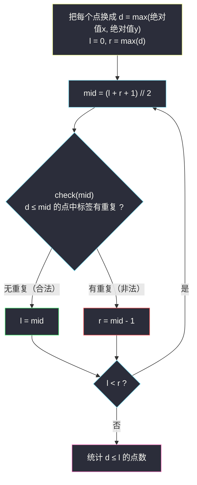

# 正方形中的最多点数（二分答案 · 二分间接值）

## 一、问题描述

给你两个数组：`points[i] = [xi, yi]` 表示点坐标，字符串 `s` 中 `s[i]` 是第 `i` 个点的**标签**。

一个以**原点为中心、边与坐标轴平行**的正方形称为**合法**的，当且仅当它内部（**含边界**）不存在两个**相同标签**的点。正方形的边长可以是 0。

返回一个合法正方形**最多**能容纳多少个点。

> 🔗 LeetCode 3143：https://leetcode.cn/problems/maximum-points-inside-the-square/
>
> 数据范围：`1 <= points.length == s.length <= 10^5`，坐标绝对值 `≤ 10^9`，所有点互不相同，`s` 仅含小写字母。

**示例**

```
输入：points = [[2,2],[-1,-2],[-4,4],[-3,1],[3,-3]], s = "abdca"
输出：2
解释：半边长取 2 的正方形恰好圈住 a(2,2) 和 b(-1,-2)，标签互不相同；
再放大到圈住任一 a 点 + 另一个 a 点就非法，也圈不进更多新标签。

输入：points = [[1,1],[-2,-2],[-2,2]], s = "abb"
输出：1
解释：两个 b 的距离都是 2，正方形不能同时含两者；半边长 1 只能圈住 a(1,1)。
```

**直观理解**

正方形只有一个自由度——大小。随着正方形逐渐放大，圈进的点**只会变多不会变少**，而标签冲突一旦出现就再也无法消失。所以「边长轴」上是清晰的**左合法右非法**结构。本题在灵神题单中属于 **§2.3 二分间接值**：我们最终要的是「点数」，但二分的对象不是点数，而是一个**中间量——正方形的半边长 r**，先把最大合法 r 二分出来，点数再由 r 统计导出。

---

## 二、暴力解法

正方形由半边长 `r` 唯一决定（边长 = `2r`，`r ≥ 0`），而最优的 `r` 一定出现在「某个点的距离减 1」处——再大一点就会放进新点。所以把每个点到原点的「方阵距离」`d` 收集起来当候选，从大到小逐个试：

```python
class Solution:
    def maxPointsInsideSquare(self, points: List[List[int]], s: str) -> int:
        n = len(points)
        cand = sorted({max(abs(x), abs(y)) for x, y in points}, reverse=True)

        def inside_count_and_valid(r: int):
            seen = set()
            cnt = 0
            for i in range(n):
                if max(abs(points[i][0]), abs(points[i][1])) <= r:
                    if s[i] in seen:
                        return -1              # 标签冲突，非法
                    seen.add(s[i])
                    cnt += 1
            return cnt

        for d in cand:                          # 从大到小逐个候选 r 试
            res = inside_count_and_valid(d - 1)
            if res >= 0:
                return res
        return 0
```

### 复杂度

- **时间**：`O(n^2)`。最坏 `10^5` 个不同距离、每个候选 `O(n)` 验证，约 `10^10` 次运算，超时。
- **空间**：`O(n)`（候选集与标签集合）。

### 🔴 瓶颈在哪里

候选 `r` 有 `O(n)` 个，逐个验证太慢。但注意两个事实：其一，`r` 增大时圈进的点集**单调扩大**，合法性只可能由真变假；其二，验证一个给定 `r` 只要 `O(n)`。单调 + 可快速判定 = 二分。而 `r` 的取值范围是 `[0, 10^9]`，二分只需 `log2(10^9) ≈ 30` 轮。

---

## 三、优化探索（核心章节）

> 📚 本题在灵茶题单中属于 **§2.3 二分间接值**。二分的不是最终答案（点数），而是一个**可判定、且判定结果关于它单调的中间量**（半边长 r）；求最大仍用灵神模板：**`check(mid)` 满足则 `l = mid`，否则 `r = mid - 1`**，`mid` 向上取整（求最小家族则 `r = mid`，见同目录 `koko-eating-bananas.md`）。

### 3.1 关键观察：点到正方形的「距离」是切比雪夫距离

以原点为中心、边平行坐标轴、半边长为 `r` 的正方形，内部（含边界）的点集是 `{(x, y) : |x| ≤ r 且 |y| ≤ r}`。两个条件合并成一句：

```
点在正方形内（含边界） ⟺ d = max(|x|, |y|) ≤ r
```

`d` 叫做切比雪夫距离（Chebyshev）。于是问题完全「去几何化」：把每个点替换成一个数字 `d` 和一个标签，正方形变成**阈值 r**，圈点变成「`d ≤ r` 的点」。

### 3.2 单调性：r 越大越容易非法

`r` 变大，`{d ≤ r}` 的点集只会扩张——若某 `r` 已把同标签两点圈入，更大的 `r` 也必然圈着它们。所以合法性在 `r ∈ [0, 10^9]` 上**左真右假**：


顺带一提，`r = 0`（边长 0，退化为原点）总是合法的：所有点互不相同，原点处最多一个点，不可能出现同标签两点——所以下界 0 永远是真，可以放心作为 `l` 的起点。

### 3.3 §2.3 的精髓：二分「间接值」而不是答案

为什么不直接二分点数？因为「能否恰好/至少圈进 m 个点且合法」没有便宜的判定；而「半边长 r 是否合法」有 `O(n)` 判定，且点数关于 `r` 单调不减。于是链路是：

```
二分 r（间接值） → 得到最大合法 r* → 答案 = #{ d ≤ r* }
```

最终答案从 `r*` **统计导出**，而不是二分本身返回。这就是灵神把这类题归入「二分间接值」的原因：**找到那个能判定、判定又单调的中间量**，答案往往是它的函数。



### 3.4 进阶：不二分也行——每标签记「最小 / 次小」

合法要求「每个标签至多圈进一个点」，等价于 `r` **严格小于**每个标签的**次小距离**（次小距离 `d2` 一旦 `≤ r`，该标签的两个点就都进来了；注意含边界，所以不能取等）。于是：

```
r* = 所有标签次小距离 d2 的最小值 - 1（若某标签只出现一次，则无约束）
答案 = #{ d ≤ r* } = #{ d < min(每个标签的 d2) }
```

一次遍历维护每标签的最小 `d1` 与次小 `d2`，再一次遍历数点，整体 `O(n)`，连排序都不用。二分版是「撞」出分界点，这个版本是把分界点**显式算**出来——与 #2982（见同批 `find-longest-special-substring-that-occurs-thrice-ii.md`）里「二分长度 → top-3 分类讨论」的升级路径完全同构。

### 3.5 一句话核心

> **点到轴对齐正方形的包含判定就是切比雪夫距离 d ≤ r → 合法性关于 r 左真右假 → 二分最大合法 r（间接值），答案 = d ≤ r 的点数；或直接取「所有标签次小 d 的最小值」为门槛，O(n) 数点。**

---

## 四、代码实现

### Python（主解：二分间接值）

```python
class Solution:
    def maxPointsInsideSquare(self, points: List[List[int]], s: str) -> int:
        ds = [max(abs(x), abs(y)) for x, y in points]   # 切比雪夫距离

        def check(r: int) -> bool:
            """半边长 r 的正方形是否合法：圈进的点无重复标签"""
            seen = set()
            for d, c in zip(ds, s):
                if d <= r:
                    if c in seen:
                        return False
                    seen.add(c)
            return True

        l, r = 0, max(ds)          # r = 0 恒合法（原点至多一个点）；上界最大距离
        while l < r:
            mid = (l + r + 1) // 2         # 求最大：向上取整防死循环
            if check(mid):
                l = mid                    # mid 合法，还能更大
            else:
                r = mid - 1                # mid 非法，收缩
        return sum(d <= l for d in ds)     # 答案由 r* 统计导出
```

**变量含义**

| 变量 | 含义 |
|------|------|
| `d = max(abs(x), abs(y))` | 点的切比雪夫距离：被半边长 r 的正方形圈住 ⟺ `d ≤ r` |
| `check(r)` | 圈进的点中是否标签互异（合法性） |
| `l` | 真区右边界：≤ l 的半边长都合法 |
| `r` | 假区左边界 - 1：> r 的半边长都非法 |
| 返回值 | 最大合法半边长下圈住的点数 `#{d ≤ l}` |

### Python（O(n) 版：最小 / 次小距离，进阶）

```python
class Solution:
    def maxPointsInsideSquare(self, points: List[List[int]], s: str) -> int:
        INF = float('inf')
        d1, d2 = defaultdict(int), defaultdict(int)   # 每标签最小/次小切比雪夫距离
        limit = INF                                   # 合法 r 的上界（不含）：所有标签 d2 的最小值
        for (x, y), c in zip(points, s):
            d = max(abs(x), abs(y))
            if d < d1[c]:
                d1[c], d2[c] = d, d1[c]
            elif d < d2[c]:
                d2[c] = d
            limit = min(limit, d2[c])
        # 合法 r < limit，最优取 limit - 1；答案 = d < limit 的点数
        return sum(1 for x, y in points if max(abs(x), abs(y)) < limit)
```

### Java（二分版）

```java
class Solution {
    public int maxPointsInsideSquare(int[][] points, String s) {
        int n = points.length;
        int[] ds = new int[n];
        int maxD = 0;
        for (int i = 0; i < n; i++) {
            ds[i] = Math.max(Math.abs(points[i][0]), Math.abs(points[i][1]));
            maxD = Math.max(maxD, ds[i]);
        }
        int l = 0, r = maxD;
        while (l < r) {
            int mid = l + (r - l + 1) / 2;            // 求最大：向上取整
            if (check(ds, s, mid)) l = mid;
            else r = mid - 1;
        }
        int ans = 0;
        for (int d : ds) if (d <= l) ans++;
        return ans;
    }

    private boolean check(int[] ds, String s, int r) {
        boolean[] seen = new boolean[26];
        for (int i = 0; i < ds.length; i++) {
            if (ds[i] <= r) {
                int c = s.charAt(i) - 'a';
                if (seen[c]) return false;
                seen[c] = true;
            }
        }
        return true;
    }
}
```

---

## 五、具体例子演示

### 示例 1：points = [[2,2],[-1,-2],[-4,4],[-3,1],[3,-3]]，s = "abdca"

先去几何化，算每个点的切比雪夫距离 `d = max(|x|, |y|)`：

| 点 | 标签 | d = max(绝对值x, 绝对值y) |
|----|------|---------------------------|
| (2,2) | a | 2 |
| (-1,-2) | b | 2 |
| (-4,4) | d | 4 |
| (-3,1) | c | 3 |
| (3,-3) | a | 3 |

按 d 分层理解：`r = 2` 圈住前两个（a、b 各一）；`r = 3` 会把第二个 a 也圈进来——冲突就在这一层爆发。二分验证：`l = 0`，`r = max(d) = 4`。

| 轮次 | l | r | mid | 圈进 d ≤ mid 的点 | 标签 | check ? | 动作 |
|------|---|---|-----|---------------------|------|---------|------|
| 1 | 0 | 4 | 2 | (2,2), (-1,-2) | a, b | ✓ 无重复 | `l = 2` |
| 2 | 2 | 4 | 3 | 再加 (3,-3), (-3,1) | **a, a**, b, c | ✗ a 重复 | `r = 2` |

`l == r == 2`，答案 = `#{d ≤ 2}` = **2** ✓。

O(n) 版复核：标签 a 的距离 `[2, 3]` → `d1 = 2, d2 = 3`；b/c/d 各一个点无约束；`limit = 3`；答案 = `#{d < 3}` = 2 ✓。两法一致。

### 示例 2：points = [[1,1],[-2,-2],[-2,2]]，s = "abb"

`d` 分别为 `1(a), 2(b), 2(b)`。标签 b 的次小 `d2 = 2`，`limit = 2`，答案 = `#{d < 2}` = **1** ✓。二分同样会收敛到 `l = 1`（`check(2)` 因两个 b 失败，`check(1)` 合法），圈住的就是 a(1,1)。注意这里两个 b 同层——**同一层内出现重复标签，答案就停在这层之前**，这是分层视角下最好记的说法。

---

## 六、复杂度分析

| 方法 | 时间 | 空间 | 说明 |
|------|------|------|------|
| 暴力逐候选 r | `O(n^2)` | `O(n)` | `10^5` 个候选 × `O(n)` 验证，约 `10^10`，超时 |
| 二分间接值（主解） | `O(n log D)` | `O(n)` | `D = 10^9`，约 30 轮 × `O(n)` check，约 `3 * 10^6` |
| 最小/次小距离（进阶） | `O(n)` | `O(26)` | 两个哈希表（标签 ≤ 26 个），一趟扫完 |

---

## 七、对比总结

**「直接二分答案」vs「二分间接值」**（§2.2 与 §2.3 的分野）：

| | §2.2 直接二分答案 | §2.3 二分间接值（本篇） |
|---|-------------------|--------------------------|
| 二分对象 | 答案本身（长度 / 对数 / 每份数量） | 中间量 r（半边长），答案 ≠ r |
| 答案来源 | 二分返回值 l 即答案 | 先得 r*，再统计 `#{d ≤ r*}` 导出 |
| check | 直接判定「答案取 mid 行不行」 | 判定中间量的合法性，单调性挂在中间量上 |
| 典型题 | #875 / #2226 / #2576 / #2982 | #3143 / #1482（二分天数）/ #410（二分最大段和） |

**易错点**

1. 是**切比雪夫距离** `max(|x|,|y|)`，不是欧氏距离 `sqrt(x^2+y^2)`，也不是曼哈顿距离——正方形对应的是「两坐标各自受限」的度量。
2. **含边界**：`d = r` 的点算圈进。所以合法 `r` 必须严格小于标签的次小距离，O(n) 版里写 `d < limit` 而不是 `≤`。
3. 某标签只出现一次时它**不构成约束**；全部标签唯一时 `limit = 无穷`，所有点都能圈进。
4. 同层（d 相同）出现重复标签，最大合法 r 停在该层**之前**（`r = d - 1`）。
5. `r = 0` 恒合法可作下界（点互不相同，原点至多一个点）；`mid` 上取整防死循环。

**模板（求最大间接值，Python 版）**

```python
def largest_ok(check, lo, hi):         # 间接值 ∈ [lo, hi]，check(lo) 必真
    l, r = lo, hi
    while l < r:
        mid = (l + r + 1) // 2         # 上取整防死循环
        if check(mid): l = mid
        else:          r = mid - 1
    return l                            # 再由 l 统计/换算出真正答案
```

---

## 八、举一反三

| 题目 | 关系 |
|------|------|
| [1482. 制作 m 束花所需的最少天数](https://leetcode.cn/problems/minimum-number-of-days-to-make-m-bouquets/) | 二分间接值（天数）再判定，求最小方向的镜像 |
| [410. 分割数组的最大值](https://leetcode.cn/problems/split-array-largest-sum/) | 二分「最大段和」这一间接量，答案同样是导出关系 |
| [1266. 访问所有点的最小时间](https://leetcode.cn/problems/minimum-time-visiting-all-points/) | 切比雪夫距离的直接练习：点间移动步数 = max(绝对值dx, 绝对值dy) |
| [2982. 找出出现至少三次的最长特殊子字符串 II](https://leetcode.cn/problems/find-longest-special-substring-that-occurs-thrice-ii/) | 同批姊妹篇（§2.2 求最大），同样有「二分 → O(n) 分类」升级路线，见同批 `find-longest-special-substring-that-occurs-thrice-ii.md` |
| [2576. 求出最多标记下标](https://leetcode.cn/problems/find-the-maximum-number-of-marked-indices/) | 同批姊妹篇（§2.2 求最大），二分对数 k、返回 2k，见同批 `find-the-maximum-number-of-marked-indices.md` |
| [2226. 每个小孩最多能分到多少糖果](https://leetcode.cn/problems/maximum-candies-allocated-to-k-children/) | §2.2 求最大模板范本，见同目录 `maximum-candies-allocated-to-k-children.md` |
| [875. 爱吃香蕉的珂珂](https://leetcode.cn/problems/koko-eating-bananas/) | 求最小模板对照，见同目录 `koko-eating-bananas.md` |

**思想迁移**

- 几何题先找**唯一自由度**：本题正方形只有「大小」一个参数，问题立刻退化为一维。
- 度量决定形状：**切比雪夫 ↔ 正方形**、欧氏 ↔ 圆、曼哈顿 ↔ 菱形（旋转 45° 后又是切比雪夫），换度量常能把几何判定变成一次比较。
- 答案不好二分时，去找「能 `O(n)` 判定 + 单调」的**间接量**——二分它，答案再导出；若间接量的临界点能显式算出（如本题次小距离），连二分都可退役。
