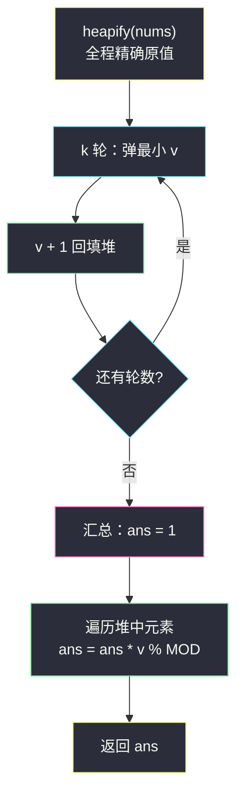

# K 次增加后的最大乘积（堆基础 · 每轮给最小加一 + 乘积取模）

## 一、问题描述

给你一个非负整数数组 `nums` 和一个整数 `k`。你可以执行下述操作**恰好 `k` 次**：

- 选择 `nums` 中任意一个元素，将其值加 `1`。

返回执行 `k` 次操作后，`nums` 数组能得到的**最大乘积**。由于答案可能很大，返回其对 `10^9 + 7` 取余后的结果。

> 🔗 LeetCode 2233：https://leetcode.cn/problems/maximum-product-after-k-increments/
>
> 数据范围：`1 <= nums.length <= 10^5`，`0 <= nums[i] <= 10^5`，`1 <= k <= 10^5`。

**示例 1**

```
输入：nums = [0, 4], k = 5
输出：20
解释：把 5 次 +1 全部给 0：nums 变为 [5, 4]，乘积 5 * 4 = 20。
```

**示例 2**

```
输入：nums = [6, 3, 3, 2], k = 2
输出：216
解释：两次 +1 都给 2：nums 变为 [6, 3, 3, 4]，乘积 6 * 3 * 3 * 4 = 216。
```

**直观理解**

「k 次机会，每次给任意一个元素 +1，最大化乘积」——直觉上应该**把加数投资给当前最小的元素**（劫富济贫，缩小差距）。本题要做两件事：用交换论证把直觉变成定理；再处理好「取模时机」这个隐蔽大坑。

---

## 二、暴力解法

按直觉逐轮模拟：每轮线性扫描找最小值，给它 +1。

```python
class Solution:
    def maximumProduct(self, nums: List[int], k: int) -> int:
        MOD = 10 ** 9 + 7
        nums = nums[:]
        for _ in range(k):
            j = 0
            for i in range(1, len(nums)):
                if nums[i] < nums[j]:
                    j = i
            nums[j] += 1                      # 给最小值 +1
        ans = 1
        for v in nums:
            ans = ans * v % MOD
        return ans
```

### 复杂度

- **时间**：`O(nk)`——k 轮，每轮全量扫描找最小。
- **空间**：`O(n)`（拷贝数组）。

### 🔴 瓶颈在哪里

`n, k <= 10^5` 时最坏 `10^10` 次比较，必然超时。同样的问题模式：每轮只动**一个**最小值，却为它付出全量扫描的代价——#1046、#3264 的老朋友，堆一上就消失。

---

## 三、优化探索（核心章节）

> 📚 本题在灵茶题单中属于 **§5.1 堆的基础用法**（数据结构③ A 路）。模板要点：**K 次取最小替换类问题就是堆模拟**——本题把「替换」换成「+1 回填」。

### 3.1 贪心策略：每轮给最小值 +1

先看交换论证。设 `a <= b`，比较这「一次 +1」花在哪里更划算：

```
给 a 加：乘积贡献 (a + 1) * b = ab + b
给 b 加：乘积贡献 a * (b + 1) = ab + a
差 = (ab + b) - (ab + a) = b - a >= 0
```

**结论**：`+1` 给较小的元素永远不劣。反复应用：任意一个最优分配方案，都可以通过若干次这样的「交换」逐步调整成「每轮都给全局最小 +1」而乘积不降——贪心正确。

等价的理解：`+1` 是相对增益（比例放大），底数越小相对收益越大——`1 → 2` 是翻倍，`100 → 101` 只涨 1%。

### 3.2 堆化：弹最小、加一、回填

```python
heapq.heapify(nums)
for _ in range(k):
    v = heapq.heappop(nums)     # 当前全局最小
    heapq.heappush(nums, v + 1) # 加完立刻回堆，可能仍是最小
```

回填不能省：`[0, 4]` 中 `0 → 1` 后 `1` 依旧是最小，下一轮还会是它，直到被抬到与 `4` 持平。

### 3.3 取模时机：决策阶段绝不取模（本题最大的坑）

堆里参与**比较**的数必须保持精确原值——一旦存「取模后的值」，大小关系被破坏，贪心决策全盘皆错（模完变小、排序错乱）。

正确姿势是**两段式**：

- **决策阶段（k 次 +1）**：全程用精确原值。`nums[i] <= 10^5`、`k <= 10^5`，模拟中最大值不超过 `2 * 10^5`，`int` 毫无压力；
- **汇总阶段（连乘）**：连乘满足同余性，此时可以**边乘边模**（Python 也可以仗着大整数先算精确乘积最后再模，两者等价，边乘边模更快）。

注意与 #3264（乘法版）对照：那题数据小、全程无需取模；本题乘积大到必须取模，才暴露出「什么时候能取模」的分寸感。

### 3.4 边界：0 是最危险的元素

数组含 `0` 时（示例 1），任何一次乘积里带着 0 都直接归零。贪心自动救场：`0` 是最小值，第一轮必被选中 `0 → 1`，直到它不再是全局最小——**堆天然把 0 处理成最高优先级的扶持对象**，无需特判。本题数据没有负数；若有负数，「+1 优先给谁」的讨论会更复杂（负数乘法会翻转符号），不适用于本贪心。

### 3.5 进阶：均摊加速（了解即可）

当 `k` 远大于 `n` 时，k 次之后所有元素会趋于「基本拉平」。可以先模拟到「最小值 ≥ 原最大值」的时刻，把剩余轮数 `rem` 均摊：每个元素 `+ ⌊rem / n⌋`，再给排序后最小的 `rem mod n` 个各 `+1`，全程排序 `O(n log n)` 免去逐轮堆操作。本题 `k <= 10^5`，堆版 `O((n + k) log n)` 已绰绰有余，不再展开。



### 3.6 一句话核心

> 交换论证保证「每轮给最小 +1」最优；堆里存**原值**做决策，只在最终连乘时取模。

---

## 四、代码实现

### Python（主解：小根堆模拟 + 边乘边模）

```python
import heapq

class Solution:
    def maximumProduct(self, nums: List[int], k: int) -> int:
        MOD = 10 ** 9 + 7
        heapq.heapify(nums)                 # 原地建堆，保持精确原值
        for _ in range(k):
            v = heapq.heappop(nums)         # 当前全局最小
            heapq.heappush(nums, v + 1)     # 劫富济贫：+1 回填
        ans = 1
        for v in nums:                      # 汇总阶段：连乘边取模
            ans = ans * v % MOD
        return ans
```

**变量含义**

| 变量 | 含义 |
|------|------|
| `nums` | 原地 `heapify` 成小根堆（决策阶段存精确原值） |
| `v` | 本轮弹出的全局最小值 |
| `ans` | 最终乘积（模 `10^9 + 7`） |

**循环不变式**：第 t 轮开始前，堆中恰好是「前 t − 1 次 +1 全部按贪心投放后」的数组内容。

**细节**：两段式是关键——`heappush(nums, v + 1)` 中是原值 `v + 1`，不带任何 `% MOD`；模运算只出现在最后的连乘里。

### Java（最优解同款：原值决策 + long 边乘边模）

```java
class Solution {
    public int maximumProduct(int[] nums, int k) {
        final int MOD = 1_000_000_007;
        PriorityQueue<Integer> pq = new PriorityQueue<>();
        for (int x : nums) pq.offer(x);         // 决策阶段存原值
        for (int i = 0; i < k; i++) {
            pq.offer(pq.poll() + 1);            // 弹最小 +1 回填
        }
        long ans = 1;                            // 乘积用 long 承接
        for (int x : pq) ans = ans * x % MOD;    // 汇总阶段才取模
        return (int) ans;
    }
}
```

Java 必须边乘边模：元素最大 `2 * 10^5`、连乘两个就超 `int`，`long` 承接 `ans * x <= (10^9) * (2 * 10^5) = 2 * 10^14` 安全。

---

## 五、例子演示

### 例 1：nums = [0, 4], k = 5（含 0 的边界）

初始堆：`{0, 4}`。逐步跟踪：

| 轮 | 弹出最小 v | +1 后回填 | 堆内容（升序） | 数组视角 |
|----|------------|-----------|----------------|----------|
| 1 | 0 | 1 | {1, 4} | [1, 4] |
| 2 | 1 | 2 | {2, 4} | [2, 4] |
| 3 | 2 | 3 | {3, 4} | [3, 4] |
| 4 | 3 | 4 | {4, 4} | [4, 4] |
| 5 | 4 | 5 | {4, 5} | [4, 5] |

连乘：`4 * 5 = 20`，**返回 `20`** ✓

注意前 4 轮 0 被「抬」到 4 才放手——**0 若不被优先消灭，乘积永远是 0**；第 5 轮堆顶已是并列最小 4（弹哪个结果都一样）。

### 例 2：nums = [6, 3, 3, 2], k = 2

初始堆：`{2, 3, 3, 6}`。逐步跟踪：

| 轮 | 弹出最小 v | +1 后回填 | 堆内容（升序） | 数组视角 |
|----|------------|-----------|----------------|----------|
| 1 | 2 | 3 | {3, 3, 3, 6} | [6, 3, 3, 3] |
| 2 | 3 | 4 | {3, 3, 4, 6} | [6, 4, 3, 3] |

连乘：`3 * 3 * 4 * 6 = 216`，**返回 `216`** ✓

**反例对照**：若把两次 +1 都给同一个 3（数组 `[6, 3, 4, 3]`），乘积 `6 * 3 * 4 * 3 = 216` 相同——因为并列最小时任选其一等价；但若第一刀先给了 6（数组 `[7, 3, 3, 2]`），第二次再给最小 2（数组 `[7, 3, 3, 3]`），乘积只有 `7 * 3 * 3 * 3 = 189 < 216`，印证「+1 给较大者必亏」。

### 取模时机的错误示范

若在第 3.2 步写成 `heappush(nums, (v + 1) % MOD)`：本题数值小不会出错，但当值增长到 `10^9` 量级后模完变小，会被错误地继续当作「最小」反复加——**决策错乱**。模只能出现在「只做加法结合（连乘）」的汇总段。


---

## 六、复杂度分析

| 方法 | 时间 | 空间 | 说明 |
|------|------|------|------|
| 暴力扫描 | `O(nk)` | `O(n)` | 每轮线性找最小 |
| 小根堆 | `O(n + k log n)` | `O(n)` | `heapify` `O(n)`；k 轮弹压各 `O(log n)`；汇总连乘 `O(n)` |

堆版总时间 `O((n + k) log n)`，`n, k <= 10^5` 时约 `2 * 10^5 * 17` 次堆操作，轻松通过。

---

## 七、对比总结

**同是「K 次取最小」，各题的考点偏移**

| 题 | 每轮动作 | 额外考点 |
|----|----------|----------|
| #3264 K 次乘运算 | 最小 × multiplier | `(值, 下标)` 并列取最前 |
| **#2233 本篇** | 最小 +1 | 贪心证明 + 取模时机 + 0 的边界 |
| #3296 使山高度为零 | 产量最小 +1 | 结果是「完成时间」而非数组 |
| #1046 最后的石头 | 取**最大**两块相撞 | 大根堆存负数 |

**易错点**

1. **决策阶段取模**：堆中存模后值直接破坏大小关系，是本题头号错误。
2. **忘记回填**：`+1` 后的新值必须回堆（它可能连续多轮都是最小）。
3. **0 的处理**：不必特判，堆自动优先抬 0；但若手写排序贪心，注意 0 会拉低乘积的连锁效应。
4. **并列最小时任选**：不影响结果（交换论证中 `b - a = 0`），无需 tie-break。

**模板（K 次给最小 +1）**

```python
heapq.heapify(nums)              # 精确原值
for _ in range(k):
    v = heapq.heappop(nums)
    heapq.heappush(nums, v + 1)
return functools.reduce(lambda a, b: a * b % MOD, nums, 1)
```

---

## 八、举一反三

| 题目 | 关系 |
|------|------|
| [3264. K 次乘运算后的最终数组 I](https://leetcode.cn/problems/final-array-state-after-k-multiplication-operations-i/) | 乘法版姊妹：`(值, 下标)` 元组堆模拟，见同批 `final-array-state-after-k-multiplication-operations-i.md` |
| [3296. 使山高度为零的最少秒数](https://leetcode.cn/problems/minimum-number-of-seconds-to-make-mountain-height-zero/) | 同款「每轮给最小 +1」，但求的是完成时刻，堆模拟与二分答案双解，见同目录 `minimum-number-of-seconds-to-make-mountain-height-zero.md` |
| [1046. 最后一块石头的重量](https://leetcode.cn/problems/last-stone-weight/) | 家族镜像题：取最大两块相撞，见同批 `last-stone-weight.md` |
| [2558. 从数量最多的堆取走礼物](https://leetcode.cn/problems/take-k-gifts-from-the-richest-pile/) | K 次取最大开方回填，最后求总和 |
| [1648. 销售价值减少的彩色气球](https://leetcode.cn/problems/sell-diminishing-valued-colored-balls/) | 同款「分配 k 次增量、按最大优先变现」的贪心 + 排序/堆，含取模 |

**思想迁移**

- **交换论证**是证明「逐轮贪心」类策略的标准武器：比较同一资源投放在两个候选上的收益差，推出不劣方向。
- **取模与比较不能混用**：一切依赖大小关系的结构（堆、排序、二分）里放原值，模运算退到纯算术汇总段。
- 口诀：**「加一给最小，交换论证稳；堆中原值走，乘完才取模。」**
