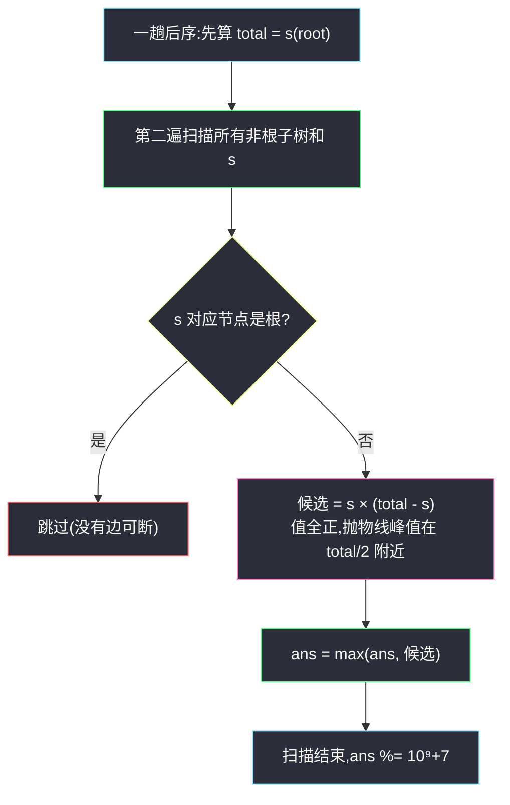
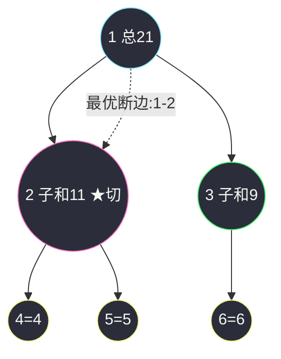

# 1339. 分裂二叉树的最大乘积(Maximum Product of Splitted Binary Tree)

> 🔗 LeetCode 1339:https://leetcode.cn/problems/maximum-product-of-splitted-binary-tree/
>
> 📚 灵茶题单小节:§2.3 自底向上 DFS(后序遍历)(难度分 1675)
>
> 同族文章:[#3249 统计好节点的数目](count-the-number-of-good-nodes.md)(同为"后序累加子树统计量"的家谱)、[#979 在二叉树中分配硬币](https://leetcode.cn/problems/distribute-coins-in-binary-tree/)(同款子树和思想,站内题解预告中)。

## 一、问题描述

给你一棵根为 `root` 的二叉树,请你**删除 `1` 条边**,使二叉树分裂成两棵子树,且它们**子树和的乘积尽可能大**。

由于答案可能很大,请将结果对 `10^9 + 7` **取模**后返回。

**示例 1**

```text
输入:root = [1,2,3,4,5,6]
输出:110
解释:删除 1-3 之间的边,两棵子树的和分别为 11(左)与 10(根侧),乘积 110。
```

**示例 2**

```text
输入:root = [1,null,2,3,4,null,null,5,6]
输出:90
解释:树为 1→2→{3,4},其中 4 的孩子是 5、6。断开 2 与 4 之间的边,
一半是节点 4 的子树 {4,5,6}(和为 15),另一半是 {1,2,3}(和为 6),
乘积 15 × 6 = 90。(断开 4 与 6 之间的边得 6 × 15,同为 90。)
```

**示例 3**

```text
输入:root = [2,3,9,10,7,8,6,5,4,11,1]
输出:1025
```

**示例 4**

```text
输入:root = [1,1]
输出:1
```

> 数据范围:树中节点数 `[2, 5 * 10⁴]`,每个节点值在 `[1, 10⁴]` 之间(全为正数)。

**直观理解**:一条边断开,把节点集切成两半——一半是"某个非根节点 `u` 的子树"(和为 `s(u)`),另一半是"剩下的所有节点"(和为 `total - s(u)`)。所以"枚举所有断边方式"等价于"枚举所有非根节点 `u` 的子树和"。问题转化成:**一遍后序 DFS 算出全部子树和,在线段意义下找 `s × (total - s)` 的最大值**。转化完成的那一刻,题目已经做完了八成。

## 二、暴力解法

照定义直译:枚举每条树边,断开它,对两半分别做一次完整 DFS 求和,算乘积,取最大。

```python
class Solution:
    def maxProduct(self, root: Optional[TreeNode]) -> int:
        MOD = 10 ** 9 + 7

        def tree_sum(node, blocked):          # 求子树和,跳过 blocked 子树
            if node is None or node is blocked:
                return 0
            return (node.val + tree_sum(node.left, blocked)
                    + tree_sum(node.right, blocked))

        edges = []                            # 收集所有非根节点
        def collect(node):
            if node is None:
                return
            if node is not root:
                edges.append(node)
            collect(node.left)
            collect(node.right)

        collect(root)
        total = tree_sum(root, None)
        ans = 0
        for u in edges:                       # 枚举断边:一刀切下 u 的子树
            s = tree_sum(u, None)
            ans = max(ans, s * (total - s))
        return ans % MOD
```

### 复杂度

- 时间:`O(n²)`——`n - 1` 次断边枚举 × 每次子树求和 `O(n)`。`n ≤ 5 × 10⁴` 时约 2.5 × 10⁹ 次操作,必然超时。
- 空间:`O(n)`(节点列表 + 递归栈)。

聪明的读者已经看出浪费:每次断边后,除了 `u` 的子树,其余部分的和根本不用重算——`total - s(u)` 立刻可得;而所有 `u` 的 `s(u)` 可以在**同一次**后序遍历里全部算出。

## 三、优化探索

### 观察 1:断边 ⟺ 选一个非根节点的子树和

删除的边一定连接某个节点 `u` 与它的父节点,断开后的一半恰好是 `u` 的子树。反过来,每个非根节点 `u` 都对应唯一一条这样的边。于是:

```text
答案 = max over 非根 u: s(u) × (total - s(u))
```

`s(root)` 对应"不断边"的非法切分(另一半为空,乘积为 0),天然不会成为最大值,参与枚举也无妨——但主解里跳过更严谨。

### 观察 2:所有子树和一次后序全出

后序定义:`s(u) = u.val + s(u.left) + s(u.right)`。自底向上算,每个节点的子树和恰好由其左右孩子的结果相加而来,一遍遍历全树,顺手在 `u` 非根时更新答案:

```text
dfs(u):
    s = u.val + dfs(u.left) + dfs(u.right)
    若 u 不是根:ans = max(ans, s × (total - s))
    返回 s
```

需要 `total` 先行——可以先跑一趟求和,也可以第一趟后序时只累加、第二趟回看;更优雅的做法是**一趟后序存下所有子树和,遍历结束后统一扫描**。

### 观察 3:乘积何时最大

`total` 是定值,设 `s + t = total`,则 `s × t = s × (total - s)` 是开口向下的抛物线,对称轴在 `s = total / 2` 处——**两半越接近,乘积越大**。节点值全为正,不必担心负数翻盘;这也解释了示例 2 为什么切出 15 与 6(整树 21,无法切出 10.5/10.5,15 与 6 是可达切分里最均衡的)。



### 观察 4:大树与递归深度

`n ≤ 5 × 10⁴`,最坏(链形)递归深度 5 万,Python 默认递归限制 1000 直接爆栈。主解采用**迭代后序**:显式栈按"根 → 左 → 右"压栈,弹出时累加子树和;或者用更简单的两步迭代——先按先序收集节点列表,再**逆先序**累加(每个节点的子树和 = 自身 + 已算好的孩子和)。本文选后者,代码最短且无递归。

## 四、代码实现

```python
class Solution:
    def maxProduct(self, root: Optional[TreeNode]) -> int:
        MOD = 10 ** 9 + 7

        # ---- 第一遍:先序收集节点,顺便累加整树和 ----
        order = []
        stack = [root]
        total = 0
        while stack:
            node = stack.pop()
            if node is None:
                continue
            order.append(node)
            total += node.val
            stack.append(node.right)
            stack.append(node.left)

        # ---- 第二遍:逆先序累加子树和(孩子一定排在父的后面) ----
        ans = 0
        for node in reversed(order):
            if node.left:
                node.val += node.left.val       # 就地存储子树和
            if node.right:
                node.val += node.right.val
            if node is not root:                # 根没有边可断,跳过
                ans = max(ans, node.val * (total - node.val))
        return ans % MOD
```

### 细节说明

- **就地改 `val` 存子树和**:逆先序保证计算 `node` 时,其孩子的 `val` 已被子树和覆盖——省一个哈希表。代价是**输入树被破坏**(题目只要求返回乘积,无需复原);对拍时务必给主解和暴力各喂一棵独立构建的树。
- **`node is not root` 判根**:用对象同一性而非值;就地改值后不能再用值判断,`is` 判断不受影响。
- **取模时机**:先在**原始大整数域**上比大小,返回前才 `% MOD`。Python 整数无溢出,顺序随意;但 C++/Java 必须先取模再比较就会踩坑——`s × (total - s)` 最大约 `2.5 × 10¹⁰` 的平方量级,直接溢出 64 位,正确姿势是存 `s` 与 `total - s` 的原始值比较、乘积临时取模(或全程 `__int128`)。Python 写法天然免疫,这是语法糖送给我们的安全。
- **为什么逆先序可行**:先序列表里,任何节点都排在它的子孙**前面**;逆序扫描时子孙先于祖先被处理,祖先累加到的正是孩子"已完成的子树和"。
- **空孩子判空不能省**:`node.left` 可能为 `None`,直接相加会抛 `AttributeError`;这两行判空就是"树形 DP 的边界条件"。

## 五、例子演示

**示例 1** `root = [1,2,3,4,5,6]` 全流程:



第一遍先序收集(`栈:先右后左压栈 → 弹出顺序即先序`):`order = [1,2,4,5,3,6]`,`total = 1+2+3+4+5+6 = 21`。

第二遍逆序扫描:

| 步骤 | 节点 | 原值 | 累加 | 子树和 s | 候选 s×(21−s) | ans |
|---|---|---|---|---|---|---|
| 1 | 6 | 6 | 无孩子 | 6 | 6 × 15 = 90 | 90 |
| 2 | 3 | 3 | +6 | 9 | 9 × 12 = 108 | 108 |
| 3 | 5 | 5 | 无孩子 | 5 | 5 × 16 = 80 | 108 |
| 4 | 4 | 4 | 无孩子 | 4 | 4 × 17 = 68 | 108 |
| 5 | 2 | 2 | +4+5 | 11 | 11 × 10 = **110** | **110** |
| 6 | 1(根) | 1 | +11+9 | 21 | 跳过 | 110 |

返回 `110` ✅。切分 11/10 恰好是 `total/2 = 10.5` 两侧的最近组合,验证了三章观察 3 的"越均衡越大"。

**示例 3** `root = [2,3,9,10,7,8,6,5,4,11,1]` 全量核对。树形:`2 → {3, 9}`;`3 → {10, 7}`,`10 → {5, 4}`,`7 → {11, 1}`;`9 → {8, 6}`。`total = 66`,全部子树和与候选:

| 节点 | 子树组成 | s | 候选 s×(66−s) |
|---|---|---|---|
| 10 | {10,5,4} | 19 | 19 × 47 = 893 |
| 7 | {7,11,1} | 19 | 19 × 47 = 893 |
| **3** | {3,10,5,4,7,11,1} | **41** | 41 × 25 = **1025** ★ |
| 9 | {9,8,6} | 23 | 23 × 43 = 989 |
| 8 | {8} | 8 | 8 × 58 = 464 |
| 6 | {6} | 6 | 6 × 60 = 360 |
| 5 | {5} | 5 | 5 × 61 = 305 |
| 4 | {4} | 4 | 4 × 62 = 248 |
| 11 | {11} | 11 | 11 × 55 = 605 |
| 1 | {1} | 1 | 1 × 65 = 65 |

最优是断开 `2-3` 边:`41 × 25 = 1025` ✅。次优 989(断 2-9 边)只差 36——两棵子树和 41 与 23 的切法离均衡 33/33 都偏远,而 41/25 距 33 更近,与抛物线直觉完全吻合。

**示例 4** `root = [1,1]`:先序 `[1,1]`,`total = 2`;逆序第二个 `1`(孩子)得 `s=1`,候选 `1 × 1 = 1`;根跳过。返回 `1` ✅——只剩一条边时没有选择余地。

**边界用例速查**:

| 用例 | 输入 | 期望 | 考点 |
|---|---|---|---|
| 两节点 | `[1,1]` | 1 | 唯一的边,1 × 1 |
| 三节点满树 | `[1,2,3]` | 9 | `3 × 3` 胜过 `2 × 4`,均衡者赢 |
| 左链 | `[1,2,null,3]` | 9 | 切 3 得 `3 × 3 = 9`,切 2 上方只得 `5 × 1 = 5` |
| 大数 | `n=5×10⁴` 全 `10⁴` | 巨大,仅返回取模值 | Python 大数 / 其他语言取模姿势 |

提醒一个层序数组的经典陷阱(示例 2 现身说法):`[1,null,2,3,4,null,null,5,6]` 里两个 `null` 占掉了位置 5、6,**末尾的 5、6 是节点 4 的孩子**而不是节点 3 的——`null` 槽位同样消耗下标,凭直觉挂错树后,连"哪条边对应哪个子树"都会算错。

### 常见错误清单

- **边枚举漏掉/多算根**:`s(root) = total` 时另一半为 0,乘积 0,虽不影响 `max` 结果,但"根不可断边"这个语义要心里有数(`node is not root` 跳过是最直白表达)。
- **先取模再比较**:两个候选 `s₁×t₁` 与 `s₂×t₂` 若先各自 `% MOD`,大小关系可能被模运算打乱(模后小的未必真小)。必须原值比较、最终一次取模。
- **就地改 `val` 后又用 `val` 判根**:改值前若用 `node.val == root_val` 找根,改值后全部失效;本文用 `is` 同一性判断,免疫此坑。
- **递归版忘防爆栈**:`n ≤ 5×10⁴` 链形树递归深度 5 万,Python 必炸;要么迭代(本文),要么 `sys.setrecursionlimit` 兜底(LC 环境对该写法也友好,但迭代版无需任何环境假设)。
- **以为要枚举"边"**:树上的边与"非根节点"一一对应,把边集转成点集后,枚举对象从 `n-1` 条抽象的边变成 `n-1` 个具体的子树和——转化即简化。

## 六、复杂度分析

- **时间:`O(n)`**——先序收集一趟 + 逆序累加一趟,每个节点常数次操作;比暴力的 `O(n²)` 快了整整一个 `n`。
- **空间:`O(n)`**——节点列表必须显式存(迭代版的代价);递归版只需 `O(h)` 栈但受深度限制。本文取舍:用 `O(n)` 空间换无条件的栈安全。

## 七、对比总结

| 解法 | 时间 | 空间 | 栈安全 | 备注 |
|---|---|---|---|---|
| 枚举边 + 双 DFS 求和(暴力) | `O(n²)` | `O(n)` | ❌ 深递归 | 超时,仅作语义对照 |
| 递归后序 + 哈希表存子树和 | `O(n)` | `O(n)` | ❌ 深递归 | 最常见题解写法 |
| **迭代先序 + 逆序就地累加(本文)** | `O(n)` | `O(n)` | ✅ | 无环境假设,代码最短 |

| 易错点 | 说明 |
|---|---|
| 取模时机 | 比较用原值,返回才 `% MOD`;顺序颠倒会得出错误最大值 |
| 就地改值的副作用 | 输入树被破坏,复用前需重建;对拍两边各喂独立树 |
| 根节点参与枚举 | 语义上没有"断根上方的边",结果碰巧无害但属逻辑漏洞 |

**一句话**:"断边 → 选子树"的转化是本题的全部灵魂;剩下的是一遍再普通不过的后序子树和——**树上删一条边的问题,先想想一半是不是某个节点的子树**。

## 八、举一反三

- [#979 在二叉树中分配硬币](https://leetcode.cn/problems/distribute-coins-in-binary-tree/):同款后序子树和,但方向相反——利用"子树硬币数 − 子树节点数"算净流量,把"搬运步数"累加到边上。站内题解撰写中,完成后可回链。
- [#3249 统计好节点的数目](count-the-number-of-good-nodes.md)(站内):另一棵树上的"子树大小"后序 DP——一个数"和"、一个数"个数",模具完全相同。
- [#124 二叉树中的最大路径和](https://leetcode.cn/problems/binary-tree-maximum-path-sum/):后序向上返回"单边贡献",在节点处合并左右——与本文"向上返回子树和,在节点处比较切分"互为镜像练习。
- [#687 最长同值路径](https://leetcode.cn/problems/longest-univalue-path/):后序返回"从叶到当前的最长同值链",合并处更新答案,同款"返回值 + 全局 max"骨架。
- [#865 具有所有最深节点的最小子树](smallest-subtree-with-all-the-deepest-nodes.md)(站内):后序返回元组合并信息的代表作,与本文合读巩固"自底向上"三板斧。

> **框架总结**:子树和 / 子树大小 / 子树满足某性质的计数——**全部是一遍后序 DP 的 instantiation**。遇到"断边、分裂、摘子树"字眼,条件反射地写 `s(u) = u.val + s(左) + s(右)`。
