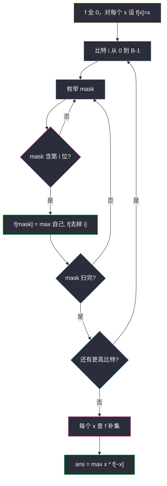

# 3670. 没有公共位的整数最大乘积（Maximum Product of Two Integers With No Common Bits）

> 题目来源：[https://leetcode.cn/problems/maximum-product-of-two-integers-with-no-common-bits/](https://leetcode.cn/problems/maximum-product-of-two-integers-with-no-common-bits/)
>
> 灵茶题单小节定位：§9.6 SOS DP

## 一、问题描述

给你整数数组 `nums`。请找两个**不同下标** `i, j`，满足 `nums[i]` 与 `nums[j]` 的二进制**没有公共的 1**（即 `nums[i] & nums[j] == 0`），并使乘积尽量大。没有这样的数对时返回 0。

**数据范围**：

- `2 <= nums.length <= 10^5`
- `1 <= nums[i] <= 10^6`

**示例 1**：

```text
输入：nums = [1,2,3,4,5,6,7]
输出：12
解释：3（011）和 4（100）无公共 1，3 × 4 = 12。其它合法对如 2×5=10 更小。
```

**示例 2**：

```text
输入：nums = [5,6,4]
输出：0
解释：5=101、6=110、4=100，任意两数都有公共 1。
```

**示例 3**：

```text
输入：nums = [64,8,32]
输出：2048
解释：64=1000000、32=0100000、8=0001000，两两都无公共位。最大乘积 64 × 32 = 2048。
```

**核心思考点**：`n = 10^5` 不能 `O(n²)` 枚举对。`x` 的合法搭档必须是 `~x` 的**子掩码**（搭档用到的 1 只能落在 `x` 的 0 上）。于是对每个 mask 预处理「它的所有子掩码里，数组中出现过的最大数」，每个 `x` 查一次 `f[~x]`。这正是 SOS DP（Sum over Subsets）把「求和」改成「取 max」的板子。值域 `≤ 10^6`，比特数 `B ≤ 20`，`B · 2^B ≈ 2×10^7`。

## 二、暴力解法

### 思路

枚举所有下标对，`AND` 为 0 就更新乘积。`n ≤ 10^5` 时 `5×10^9` 次，过不了；`n` 缩到几十可以对拍。

### 代码

```python
def maxProductBrute(nums: list[int]) -> int:
    ans = 0
    n = len(nums)
    for i in range(n):
        for j in range(i + 1, n):
            if nums[i] & nums[j] == 0:
                ans = max(ans, nums[i] * nums[j])
    return ans
```

### 复杂度

- 时间：`O(n²)`。
- 空间：`O(1)`。

瓶颈就是成对枚举。需要「给定 `x`，在剩下的数里快速找出与它按位无交的最大值」。

## 三、优化探索

### 3.1 合法搭档 = 补集的子掩码 ⭐

`a & b == 0` ⇔ `b` 的每一个 1 都落在 `a` 的 0 上 ⇔ `b` 是 `~a` 的子掩码（只看用于表示 `nums[i]` 的那 `B` 位，`B = max(nums).bit_length()`）。

所以：

```text
对每个 x，最佳搭档 = max{ y 出现在 nums 中 | y 是 (~x) 的子掩码 }
乘积 = x * 这个最大值（没有则 0）
```

问题变成：对**每一个** mask，求「mask 的所有子掩码中出现过的最大 nums」。直接枚举子掩码是 `3^B`（每个 bit：在 mask 里 / 在子掩码里 / 不在 mask 里），`B = 20` 约 `3.4×10^9`，偏紧。SOS 把它降到 `B · 2^B`。

### 3.2 SOS：按位做高维前缀 max ⭐⭐

把 `0 .. 2^B-1` 看成 `B` 维 0/1 立方体。`f[mask]` 希望等于「mask 沿每一位都可以改成 0」得到的所有点上的最大值——这就是每个轴上做一次前缀 max。

初始化：`f` 全 0；对数组里每个 `x`，`f[x] = x`（数本身就是它的掩码）。同一数值出现多次也还是 `f[x] = x`。

然后对每个比特 `i = 0 .. B-1`：

```text
若 mask 的第 i 位是 1：
    f[mask] = max(f[mask], f[mask 去掉第 i 位])
```

扫完第 `i` 位之后，`f[mask]` 已经吸收了「只在最低 `i+1` 个比特上与 mask 不同、那些比特必须是 0」的全部来源。全部 `B` 位扫完，`f[mask]` = mask 任意子掩码上出现过的最大值。



查询时补集取 `all_bits ^ x`，其中 `all_bits = (1<<B) - 1`，不要用语言的 `~x`（那会在符号位上取反）。

### 3.3 同一数值出现两次 ⭐

题目要的是不同**下标**。两个一样的正整数 `x & x = x ≠ 0`，它们**不能**配对——公共位就是自己的 1。SOS 也不会误把同一个 `x` 当成自己的搭档：`x` 是 `~x` 的子掩码当且仅当 `x = 0`，而 `nums[i] ≥ 1`。所以初始化写 `f[x] = x`、查询遍历每一个元素即可，不必维护出现次数。

若数组里是两个不同的数，值碰巧相等，结论相同：它们彼此 AND 不为 0。

**核心一句**：合法搭档在 `~x` 的子掩码里；SOS 预处理每个 mask 的子掩码最大值，再 `O(n)` 查询。

## 四、代码实现

### 主解：SOS 子掩码最大值

```python
class Solution:
    def maxProduct(self, nums: List[int]) -> int:
        mx = max(nums)
        B = mx.bit_length()              # 10^6 → 20
        M = 1 << B
        f = [0] * M
        for x in nums:
            f[x] = x                     # 该精确掩码上的值
        for i in range(B):
            bit = 1 << i
            for mask in range(M):
                if mask & bit:
                    lo = f[mask ^ bit]   # 第 i 位改成 0 的那个子掩码
                    if lo > f[mask]:
                        f[mask] = lo
        ans = 0
        all_bits = M - 1
        for x in nums:
            ans = max(ans, x * f[all_bits ^ x])
        return ans
```

### 对照：Java

```java
class Solution {
    public long maxProduct(int[] nums) {
        int mx = 0;
        for (int x : nums) {
            mx = Math.max(mx, x);
        }
        int B = 32 - Integer.numberOfLeadingZeros(mx); // mx ≥ 1
        int M = 1 << B;
        int[] f = new int[M];
        for (int x : nums) {
            f[x] = x;
        }
        for (int i = 0; i < B; i++) {
            int bit = 1 << i;
            for (int mask = 0; mask < M; mask++) {
                if ((mask & bit) != 0) {
                    f[mask] = Math.max(f[mask], f[mask ^ bit]);
                }
            }
        }
        long ans = 0;
        int all = M - 1;
        for (int x : nums) {
            ans = Math.max(ans, (long) x * f[all ^ x]);
        }
        return ans;
    }
}
```

乘积最大约 `10^6 × 10^6 = 10^{12}`，Java 必须用 `long`。

### 细节说明

- **`B` 取 `max(nums)` 的比特数就够**：更大的补集位全是 0，不会多出合法搭档。不要写死 20，小数时更省。
- **`f` 初值 0**：某补集下没有任何子掩码出现过，乘积 0，符合「没有合法对」。
- **不要 `f[x] = max(f[x], 下标或出现次数)`**：要的就是数值本身，掩码等于值。
- **查询遍历原数组而不是 `0..M-1`**：只对真实出现过的 `x` 乘；`f` 里被 SOS 填上的「空洞掩码」没有对应元素。
- **同一元素不会乘两次**：见 3.3。`[1,1]`、`[8,8]` 都应得 0。

## 五、例子演示

**示例 1：`[1,2,3,4,5,6,7]`，`max = 7`，`B = 3`，`M = 8`**

初始化 `f[1..7] = 1..7`。按 bit0、bit1、bit2 吸收低位子掩码（只列出变化）：

| 扫完 | f[1] | f[2] | f[3] | f[4] | f[5] | f[6] | f[7] |
|---|---|---|---|---|---|---|---|
| 初值 | 1 | 2 | 3 | 4 | 5 | 6 | 7 |
| bit0 | 1 | 2 | 3 | 4 | 5 | 6 | 7 |
| bit1 | 1 | 2 | 3 | 4 | 5 | 6 | 7 |
| bit2 | 1 | 2 | 3 | 4 | 5 | 6 | 7 |

本例每个 mask 自己就是最大子掩码，SOS 看起来像没动——因为 1..7 全出现了。查询：

| x | 补集 `7^x` | f[补集] | 乘积 |
|---|---|---|---|
| 1 = 001 | 110 = 6 | 6 | 6 |
| 2 = 010 | 101 = 5 | 5 | 10 |
| 3 = 011 | 100 = 4 | 4 | **12** |
| 4 = 100 | 011 = 3 | 3 | **12** |
| 5 = 101 | 010 = 2 | 2 | 10 |
| 6 = 110 | 001 = 1 | 1 | 6 |
| 7 = 111 | 000 = 0 | 0 | 0 |

答案 **12** ✅，对应 3 与 4。

**示例 2：`[5,6,4]` 为什么 SOS 得 0**

`5=101` 的补集是 `010=2`，数组没有 2 也没有 0，`f[2]` 保持 0。`6` 的补集是 `1`，`4` 的补集是 `3`，这两个掩码的子掩码 `{0,1}`、`{0,1,2,3}` 里都没有出现过的数（4、5、6 都不是它们的子掩码）。全部乘积 0。

**示例 3：`[64,8,32]`**

`64 = 2^6`，`B = 7`。`64` 的补集低 6 位全 1，子掩码包含 32 和 8，最大值 32，`64×32=2048`。三个数两两无交，SOS 选到了最大的两个。

**重复值：`[2,2,1]`**

`2 & 1 = 0`，`2×1=2`；两个 2 不能配对。`f[2]=2`，`f[1]=1`，SOS 后 `f[3]=max(3 的子掩码)=2`。查询 `1` 的补集 `2`，得 2；查询 `2` 的补集 `1`，得 1。答案 2，不会变成 `2×2`。

## 六、复杂度分析

设 `n = len(nums)`，`B = max(nums)` 的比特数 ≤ 20，`M = 2^B`：

| 项目 | 量级 |
|---|---|
| 时间 | 填表 `O(n)` + SOS `O(B · M)` + 查询 `O(n)`，即 `O(n + B · 2^B)` |
| 空间 | `O(2^B)` 的 `f` 数组 |

`B = 20` 时约两千万次更新，远小于 `n²`。

## 七、对比总结

| 维度 | 枚举数对 | 每个 x 枚举 `~x` 的子掩码 | SOS（主解） |
|---|---|---|---|
| 时间 | `O(n²)` | 最坏 `O(n · 2^B)` | `O(n + B · 2^B)` |
| `n=1e5, B=20` | 超时 | 可能超时 | 可过 |
| 思想 | 无 | 单点查子掩码 | 一次性预处理全部 mask |

**套路归纳**：约束是「`a` 的 1 与 `b` 的 1 不相交」→ `b` 活在 `~a` 的子掩码里。凡是「对每个 mask 要一份定义在它所有子掩码上的聚合」（和、max、min、OR），都是 SOS：按比特做高维前缀。求和是原板，本题只是把 `+=` 换成 `max`。

不要把 SOS 写成「枚举 mask 的全部子掩码 `sub = (sub-1) & mask`」当主循环——那是单点查询技巧，预处理全部 mask 时一定按位刷表。

## 八、举一反三

1. **[318. 最大单词长度乘积](https://leetcode.cn/problems/maximum-product-of-word-lengths/)**：单词字母集无交则乘长度。`n ≤ 1000` 可以 `O(n²)`；若 `n` 到 `10^5`、字母 26 位，就回到本题的 SOS。
2. **[1521. 找到最接近目标值的函数值](https://leetcode.cn/problems/find-a-value-of-mysterious-function-closest-to-target/)**：区间 AND 单调，和「子掩码」同一族位运算结构。
3. **[2044. 统计按位或能得到最大值的子集数目](https://leetcode.cn/problems/count-number-of-maximum-bitwise-or-subsets/)**：子集枚举；SOS 可做「超集/子掩码计数」的加速版。
4. **[421. 数组中两个数的最大异或值](https://leetcode.cn/problems/maximum-xor-of-two-numbers-in-an-array/)**：同是「给 x 找最佳搭档」，搭档条件改成异或最大，工具换成 01-Trie，不是 SOS。对照着记「条件变、结构变」。
5. **[902. 最大为 N 的数字组合](https://leetcode.cn/problems/numbers-at-most-n-given-digit-set/)** 不直接相关，但和本题一样都是「值域按位拆开」；SOS 拆的是比特轴，数位 DP 拆的是十进制轴。

**同族互引**：§9.6 的 SOS 就是比特维上的前缀和/前缀 max。会刷 `f[mask] |= f[mask ^ bit]` 之后，把运算符换成 `+` / `max` / `min` 就能覆盖计数、最大、最小三类子掩码查询。本题是 max 版的模板题。
