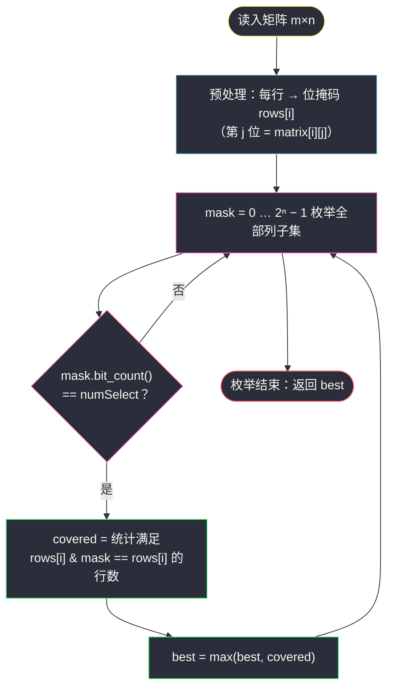

# 2397. 被列覆盖的最多行数（Maximum Rows Covered by Columns）

> 题目来源：[https://leetcode.cn/problems/maximum-rows-covered-by-columns/](https://leetcode.cn/problems/maximum-rows-covered-by-columns/)
>
> 灵茶题单小节定位：§位运算·子集枚举（集合覆盖）

## 一、问题描述

给你一个下标从 0 开始、大小为 `m × n` 的二进制矩阵 `matrix`，以及一个整数 `numSelect`，表示你必须从 `matrix` 中选择的**不同**列的数量（**恰好**选 `numSelect` 列）。

如果一行中所有的 `1` 都被你选中的列所覆盖，则认为这一行被**覆盖**了。形式上，设 `s = {c₁, c₂, …, c_numSelect}` 是你选择的列的集合，对于矩阵中的某一行 `row`，若满足下述条件，则该行被集合 `s` 覆盖：

- 对于满足 `matrix[row][col] == 1` 的每个单元格（`0 <= col <= n − 1`），`col` 均存在于 `s` 中；**或者**
- 该行中**不存在**值为 `1` 的单元格（全 0 行天然被任何集合覆盖）。

你需要选出 `numSelect` 个列，使被覆盖的行数最大化。返回这个最大行数。

**数据范围**：

- `m == matrix.length`，`n == matrix[i].length`
- `1 <= m, n <= 12`
- `matrix[i][j]` 要么是 `0` 要么是 `1`
- `1 <= numSelect <= n`

**示例 1**：

```text
输入：matrix = [[0,0,0],[1,0,1],[0,1,1],[0,0,1]], numSelect = 2
输出：3
解释：选择 s = {0, 2}。
- 第 0 行被覆盖：没有 1，天然覆盖。
- 第 1 行被覆盖：值为 1 的两列（0 和 2）都在 s 中。
- 第 2 行未覆盖：matrix[2][1] == 1 但 1 不在 s 中。
- 第 3 行被覆盖：唯一的 1 在列 2，2 在 s 中。
共覆盖 3 行。s = {1, 2} 同样能覆盖 3 行，但不可能更多。
```

**示例 2**：

```text
输入：matrix = [[1],[0]], numSelect = 1
输出：2
解释：只能选唯一一列，两行都被覆盖（第 1 行全 0 天然覆盖）。
```

**核心思考点**：`n ≤ 12` 这个约束是**明示**——全部列子集只有 `2¹² = 4096` 个，暴力枚举完全可行。难点不在「枚举」，而在把「行是否被覆盖」从逐格比对压成**一次位运算**：行变掩码、覆盖变子集判定，`rows[i] & mask == rows[i]` 一行代码替代内层双重循环。这是「数据范围小 → 状态压缩」思维链的标准入门题。

## 二、暴力解法

### 思路

用 `itertools.combinations` 枚举 `n` 列中选 `numSelect` 个的所有组合，对每个组合：把选中的列做成一个集合 `s`，再逐行逐格检查——该行的每个值为 `1` 的格子，其列下标是否都在 `s` 里（全 0 行直接算覆盖）。

组合数最坏 `C(12,6) = 924`，每组合检查 `m × n = 144` 格，总量 `924 × 144 ≈ 1.3 × 10⁵`——规模毫无压力，但**内层是纯 Python 循环套循环**，一旦矩阵规模放大就会立刻吃瘪；更重要的是它没有暴露本题的结构本质（覆盖 = 子集关系），后面对拍与优化都要靠这层洞察。

### 代码

```python
from itertools import combinations

def maximumRowsBrute(matrix: list, numSelect: int) -> int:
    m, n = len(matrix), len(matrix[0])
    best = 0
    for cols in combinations(range(n), numSelect):   # 枚举「恰好 numSelect 列」的全部组合
        s = set(cols)
        covered = 0
        for i in range(m):
            ok = True                                 # 全 0 行天然覆盖（循环体不执行，ok 保持 True）
            for j in range(n):
                if matrix[i][j] == 1 and j not in s:  # 有个 1 落在未选列 → 本行不覆盖
                    ok = False
                    break
            covered += ok
        best = max(best, covered)
    return best
```

### 复杂度

- 时间：`O(C(n, numSelect) × m × n)`，最坏约 `1.3 × 10⁵` 次格子检查。
- 空间：`O(n)`（组合与列集合）。
- 冗余所在：同一行的「哪些列有 1」这个静态信息被每个组合**重复扫描**——`m × n` 的矩阵逐格读了一遍又一遍，总共读了 `C(n, k)` 遍。

## 三、优化探索

### 3.1 关键抽象一：一行 = 一个位掩码

预处理每行为一个整数掩码：`rows[i]` 的第 `j` 位为 `1` 当且仅当 `matrix[i][j] == 1`。例如 `[1,0,1]` → 二进制 `101` → `5`。

这一步把「行内哪些列是 1」压缩成**一个整数**，是所有「行/状态压缩」题的第一块积木。建掩码本身也是位运算：`mask |= 1 << j`（把第 j 位点亮）。

### 3.2 关键抽象二：覆盖 = 子集判定 ⭐

「行 `i` 的所有 1 都在选中列集合 `s` 里」翻译成位运算语言：

```text
rows[i] 是 mask 的子集   ⇔   rows[i] & mask == rows[i]   ⇔   rows[i] | mask == mask
```

即：行掩码与选择掩码按位与后**原样保留**，说明行里的每个 1 位都被选择掩码罩住了。全 0 行的掩码是 `0`，`0 & mask == 0` 恒成立——**天然覆盖的特例被位运算自动吞掉**，一行 `if` 都不用写。这是位运算抽象「消灭特判」的经典红利。

判定一次子集只需一条机器指令，逐格扫描的 `O(n)` 内循环直接坍缩成 `O(1)`。

### 3.3 枚举层：`2ⁿ` 全枚举 + popcount 过滤

枚举 `mask` 从 `0` 到 `2ⁿ − 1` 的全部列子集，用 `mask.bit_count() == numSelect`（Python 3.10+ 内置）筛出「恰好 numSelect 列」的方案，对每个合法方案统计覆盖行数取最大。

为什么敢全枚举？`n ≤ 12 → 2¹² = 4096`；每个方案统计 `m ≤ 12` 行、每行一次 `&`——总量约 `4096 × 12 ≈ 5 × 10⁴` 次位运算，微秒级。**「先看数据范围猜算法复杂度上限」是竞赛基本功**：`n ≤ 20` 想状压 `2ⁿ`，`n ≤ 500` 想 `O(n³)`，本题就是这条经验法则的直接应用。



### 3.4 进阶路线：还能更快吗

- **Gosper's Hack 直接枚举固定 popcount 的掩码**：跳过所有 popcount 不对的 `mask`，枚举量从 `2ⁿ` 降到 `C(n, numSelect)`。本题量级下收益不大，但它是状压 DP（如 #1125 最小必要团队）里遍历「同大小子集」的标准工具，值得知道。模板如下（从最小掩码 `(1<<k)−1` 出发，每次生成「下一个同为 k 个 1 的更大掩码」）：

```python
# Gosper's Hack：枚举所有恰含 k 个 1 的掩码（升序）
k = numSelect
mask = (1 << k) - 1                 # 最小的 k 位全 1 掩码：0…011…1
while mask < (1 << n):
    process(mask)                    # 处理当前掩码（统计覆盖行数）
    c = mask & -mask                 # 最低位的 1（如 0110 → 0010）
    r = mask + c                     # 把最低一段连续 1 进位（0110 → 1000）
    mask = r | (((mask ^ r) >> 2) // c)   # 把进位吞掉的 1 补回到低位
```

  其原理一句话：**把掩码里最低的「连续 1 段」整体抬高一位，再把多出来的 1 挤回最低位**，恰好得到字典序下一个同 popcount 掩码。每步 `O(1)`，总枚举量正好 `C(n, k)`——在 `n = 20`、`k = 10` 时（`C(20,10) ≈ 1.8 × 10⁵`，而 `2²⁰ ≈ 10⁶`）优势开始真实。
- **行掩码去重计数**：`m` 行里相同掩码的行覆盖判定完全一致，可用 `Counter` 把行压成「掩码 → 出现次数」，统计层从 `m` 次比较降为「不同掩码数」次。本题 `m ≤ 12` 无必要，放大到 `m = 10⁵` 时这是关键一步。
- **为什么不能贪心**：直觉上「优先选 1 最多的列」并不对——两行的 1 可能错落在互补的列上，最优解必须整体权衡，局部贪心会反例（如示例 1 里贪心先选列 2 后，行 1 和行 2 争列 0/列 1，选哪边都只得 3，但「看起来 1 更少」的组合同样达标）。覆盖类问题是 NP-hard 的集合覆盖在小规模上的倒影，**枚举/状压是正解，贪心只在大规模上当近似算法**。

### 3.5 陷阱清单

- **「恰好」而非「至多」**：题面要求选 `numSelect` 列。多选一列只会让覆盖不减（掩码变大、子集判定更宽松），所以「至多」和「恰好」在本题**答案相同**——但要意识到这是单调性带来的巧合，过滤条件 `bit_count() != numSelect` 该写还得写（若去掉过滤、把 `best` 定义改成允许任意列数，答案也不变，但那是靠单调性而非定义）。
- **全 0 行**：天然覆盖，位运算版自动处理；手写循环版要小心 `ok = True` 初始化后内层不执行的情形（暴力代码已正确利用这一点）。
- **`1 << n` 上界**：掩码范围是 `[0, 2ⁿ)`，`range(1 << n)` 正好，别写成 `range(1 << n + 1)`（优先级坑：`n + 1` 先算）。

## 四、代码实现

```python
def maximumRows(matrix: list, numSelect: int) -> int:
    # 1) 每行压缩成位掩码：第 j 位 = matrix[i][j]
    rows = []
    for row in matrix:
        mask = 0
        for j, x in enumerate(row):
            if x:
                mask |= 1 << j          # 点亮第 j 位
        rows.append(mask)

    n = len(matrix[0])
    best = 0
    # 2) 枚举全部列子集，过滤出「恰好 numSelect 列」的方案
    for mask in range(1 << n):
        if mask.bit_count() != numSelect:
            continue                    # 列数不对，跳过
        # 3) 统计覆盖行数：rows[i] 是 mask 的子集 ⇔ 按位与后原样保留
        #    全 0 行掩码为 0，0 & mask == 0 恒真 → 天然覆盖被自动吞掉
        covered = sum(1 for r in rows if r & mask == r)
        best = max(best, covered)
    return best


# ------- 验证辅助：随机 0/1 矩阵 -------
import random

def random_matrix(m: int, n: int, p: float = 0.4) -> list:
    return [[1 if random.random() < p else 0 for _ in range(n)] for _ in range(m)]
```

### 细节说明

- **`mask |= 1 << j` 建掩码**：从空掩码 0 出发逐位点亮，是「行 → 掩码」的标准写法；也可以一行函数式搞定 `mask = sum(1 << j for j, x in enumerate(row) if x)`，循环版更易讲。
- **`r & mask == r` 的等价变体**：`r | mask == mask`、`r & ~mask == 0` 三者同义，都是「r 是 mask 的子集」。`r & ~mask == 0` 的口语版是「r 里没有任何一位落在 mask 之外」——按位取反 `~mask`（配合无限位补码语义）圈出了「未选列」的全集。
- **`bit_count()`**：Python 3.10+ 整数方法，数二进制里 1 的个数；旧版本可用 `bin(mask).count('1')`。选列子集大小的判定它一肩挑。
- **为什么统计层用生成器 `sum`**：12 个元素的求和写成生成器表达式，可读性和速度都优于手写循环累加；放大规模时再换 3.4 节的去重计数。
- **无需排序/去重的底气**：`m, n ≤ 12` 双双迷你，任何「聪明」优化在本题都是过度设计——先写对、再谈快，是这类小约束题的分寸感。

## 五、例子演示

以官方示例 1 `matrix = [[0,0,0],[1,0,1],[0,1,1],[0,0,1]]`、`numSelect = 2` 为例。

**第一步：行 → 掩码**（列 0 在最低位）：

| 行 | 内容 | 掩码（二进制） | 十进制 |
|---|---|---|---|
| 0 | `[0,0,0]` | `000` | 0 |
| 1 | `[1,0,1]` | `101` | 5 |
| 2 | `[0,1,1]` | `110` | 6 |
| 3 | `[0,0,1]` | `001` | 1 |

**第二步：枚举 `numSelect = 2` 的全部 `C(3,2) = 3` 个掩码**（`n = 3`，掩码范围 `0..7`，popcount 为 2 的有 3、5、6）：

| mask | 二进制 | 选中列 | 各行判定（`r & mask == r`？） | 覆盖数 |
|---|---|---|---|---|
| 3 | `011` | {0,1} | 行0 `0&3=0` ✅；行1 `5&3=1≠5` ❌；行2 `6&3=2≠6` ❌；行3 `1&3=1` ✅ | 2 |
| 5 | `101` | {0,2} | 行0 ✅；行1 `5&5=5` ✅；行2 `6&5=4≠6` ❌；行3 `1&5=1` ✅ | **3** |
| 6 | `110` | {1,2} | 行0 ✅；行1 `5&6=4≠5` ❌；行2 `6&6=6` ✅；行3 `1&6=0≠1` ❌ | 2 |

最大覆盖 3 行，**返回 3** ✅。注意行 0（全 0）在三个方案里全部通过判定——`0 & mask == 0` 恒真，特例消失于无形。

**枚举过滤层的可视**：`mask` 从 0 走到 7 共 8 个值，popcount 过滤后只剩 3 个候选——

| mask | popcount | 去留 |
|---|---|---|
| 0, 1, 2, 4 | 0 或 1 | ❌ 不到 numSelect |
| **3, 5, 6** | **2** | ✅ 进入统计层 |
| 7 | 3 | ❌ 超过 numSelect |

`2ⁿ` 全枚举里 popcount 过滤扔掉了 `2ⁿ − C(n,k)` 个方案；Gosper's Hack（3.4 节）则从源头只生成那 `C(n,k)` 个——两条路线殊途同归，后者是前者的「精准供给」版。

```mermaid
flowchart LR
    subgraph M["示例 1 · mask = 5（选列 0、2）"]
        R0["行0 [0,0,0] → 掩码 000<br>0 & 5 == 0 ✅ 覆盖"] --> R1["行1 [1,0,1] → 掩码 101<br>101 & 101 == 101 ✅ 覆盖"]
        R1 --> R2["行2 [0,1,1] → 掩码 110<br>110 & 101 = 100 ≠ 110 ❌ 未覆盖"]
        R2 --> R3["行3 [0,0,1] → 掩码 001<br>001 & 101 == 001 ✅ 覆盖"]
        R3 --> OUT["covered = 3 → best = 3"]
    end
    style R0 fill:#2b2d3a,stroke:#50fa7b,color:#f8f8f2
    style R1 fill:#2b2d3a,stroke:#50fa7b,color:#f8f8f2
    style R2 fill:#2b2d3a,stroke:#ff5555,color:#f8f8f2
    style R3 fill:#2b2d3a,stroke:#50fa7b,color:#f8f8f2
    style OUT fill:#2b2d3a,stroke:#f1fa8c,color:#f8f8f2
    style M fill:#1e1f29,stroke:#6272a4
```



**示例 2 快速验证**：`[[1],[0]]`，`numSelect = 1`。行掩码 `[1, 0]`；唯一合法 `mask = 1`（选列 0）：`1 & 1 == 1` ✅、`0 & 1 == 0` ✅，覆盖 2 行，返回 **2** ✅。

**边界演示**：

- **numSelect == n**：唯一合法掩码是 `2ⁿ − 1`（全选），所有行必被覆盖，答案恒为 `m`——任何矩阵只要列全选就是满分。
- **单行单列 `[[1]]`、numSelect=1**：掩码 `rows=[1]`，mask=1，`1&1==1` ✅，返回 1。
- **每行都只有一列 1 且互不相同**：如 4 行 4 列单位阵、numSelect=2——每个方案最多罩住 2 行（另加全 0 行），答案是 `C(4,2)` 覆盖数中的最大值 2；枚举会逐一验证这一点。

## 六、复杂度分析

设 `m` 为行数、`n` 为列数：

- **时间复杂度：`O(2ⁿ × (m + n))`**
  - 预处理掩码 `O(m × n)`；枚举 `2ⁿ` 个掩码，每个先花 `O(1)`（`bit_count`）过滤，合法者花 `O(m)` 统计。最坏 `2¹² × 12 ≈ 5 × 10⁴` 级别。
  - 对比暴力 `O(C(n,k) × m × n)`：位运算把内层逐格扫描的 `n` 因子消掉，常数再降一个量级；量级差异不改变本题「都能过」的结论，但**把覆盖判定变成 O(1)** 的抽象是后续状压 DP 的入场券。
- **空间复杂度：`O(m)`**
  - 行掩码数组。相比暴力的 `O(n)` 组合集合略增，换来的是判定层的全面提速。

## 七、对比总结

| 维度 | 暴力（combinations + 逐格） | 主解（位掩码全枚举） | 进阶（Gosper + 去重计数） |
|---|---|---|---|
| 时间 | `O(C(n,k) × m × n)` | `O(2ⁿ × m)` | `O(C(n,k) × D)`，D 为不同行掩码数 |
| 判定成本 | 逐行逐格循环 | 一次 `&` 比较 | 同左（掩码粒度） |
| 全 0 行特判 | 需 `ok = True` 兜底 | 位运算自动吞掉 | 同左 |
| 代码量 | 中（三层循环） | 短（两层 + 生成器） | 需额外 Hack 模板 |
| 本题必要性 | 对拍基准 | **首选** | 过度设计，知道即可 |

**套路归纳**：①**数据范围望远镜**：`n ≤ 20` 直接想 `2ⁿ` 状态压缩，本题 `n ≤ 12` 是教科书信号；②**行/状态 → 掩码**：静态信息压缩成整数，是位运算题的第一积木；③**「覆盖/包含」→ 子集判定**：`a & b == a` 一句顶一层内循环，特例（全 0）自动消失——把语义翻译成集合语言，位运算的威力才真正显形。

## 八、举一反三

1. **[1125. 最小的必要团队](https://leetcode.cn/problems/smallest-team-with-the-required-skills/)**：本题的状压 DP 进化版——技能集合做掩码，「覆盖所有需求」从枚举答案变成 DP 递推，`n ≤ 16` 的信号灯同样亮着。
2. **[2305. 公平分发饼干](https://leetcode.cn/problems/fair-distribution-of-cookies/)**：子集枚举 + 剪枝/状压 DP 的另一经典，`k ≤ 8` 的约束决定「枚举孩子拿到的子集」可行，与本题同一思维链。
3. **[1879. 两个数组最小的异或值之和](https://leetcode.cn/problems/minimum-xor-sum-of-two-arrays/)**：`n ≤ 14`，状压 DP 定义 `f[mask]` 为「已匹配列集合」的最小代价——掩码当**状态**而非**判定**，是本题掩码当判定的下一级用法。
4. **[201. 数字范围按位与](https://leetcode.cn/problems/bitwise-and-of-numbers-range/)**：位运算基本功题（公共前缀），与本题同刷可巩固「掩码即集合」的直觉。
5. **[869. 重新排序得到 2 的幂](https://leetcode.cn/problems/reordered-power-of-2/)**：小范围枚举 + 位运算判重的组合拳，`10⁹` 内的 2 的幂只有 30 个，枚举排列打表比对——「小范围 + 位技巧」的又一变奏。

**同族互引**：本篇与 `shortest-subarray-with-or-at-least-k-ii.md`（#3097）同属灵神题单「位运算·掩码思维」家族：#3097 用**前缀或 + 位计数**处理「或值至少 k」，本篇用**子集判定**处理「覆盖最多行」——两篇共同的心法是「**把语义翻译成掩码语言，让位运算替你写内层循环**」。先刷本篇建立「行 → 掩码 → 子集判定」三步反射，再去 #3097 看「位计数 → 滑动窗口」的进阶玩法。
