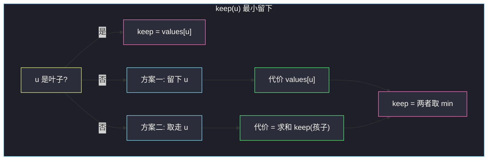

# 2925. 在树上执行操作以后得到的最大分数（Maximum Score After Applying Operations on a Tree）

> 题目来源：[https://leetcode.cn/problems/maximum-score-after-applying-operations-on-a-tree/](https://leetcode.cn/problems/maximum-score-after-applying-operations-on-a-tree/)
>
> 灵茶题单小节定位：§12.5 其他树形 DP

## 一、问题描述

有一棵 `n` 个节点的无向树，节点编号 `0` 到 `n - 1`，**根为 0**。`edges[i] = [a_i, b_i]` 表示一条边；`values[i]` 是节点 `i` 的值。

一开始分数为 0。每次操作：选一个节点 `i`，把 `values[i]` **加入分数**，再把 `values[i]` 置为 `0`。可做任意次。

做完后树必须**健康**：从根出发到**任意叶子**的路径上，节点值之和都不等于 0。也就是说，每条根到叶路径上至少留一个没被取走的点。

返回可获得的最大分数。

**数据范围**：

- `2 <= n <= 2 * 10^4`
- `values.length == n`，`1 <= values[i] <= 10^9`
- `edges` 保证构成合法树

**示例 1**：

```text
输入：edges = [[0,1],[0,2],[0,3],[2,4],[4,5]], values = [5,2,5,2,1,1]
输出：11
解释：选择节点 1、2、3、4、5。根 0 的值仍为 5（非 0），每条根到叶路径和都不为 0。
得分 2+5+2+1+1 = 11。这是最大得分。
```

**示例 2**：

```text
输入：edges = [[0,1],[0,2],[1,3],[1,4],[2,5],[2,6]], values = [20,10,9,7,4,3,5]
输出：40
解释：选择节点 0、2、3、4。
- 0→4 路径剩余和为 10
- 0→3 路径剩余和为 10
- 0→5 路径剩余和为 3
- 0→6 路径剩余和为 5
得分 20+9+7+4 = 40。
```

**核心思考点**：健康约束是「每条根—叶路径至少留一个点」。最大化取走的点权和 = **总和 − 必须留下的最小点权和**。树上最小命中集（带点权）用一次树 DP 就能算。

## 二、暴力解法

每个点「取 / 留」两种选择，`2^n` 枚举留下集合。对每个叶子沿父指针走到根，检查路径上是否至少有一个留下的点；合法方案里取走点和最大。

```python
from collections import deque

def maximumScoreBrute(edges, values):
    n = len(values)
    g = [[] for _ in range(n)]
    for a, b in edges:
        g[a].append(b)
        g[b].append(a)
    parent = [-1] * n
    q = deque([0])
    parent[0] = -2                       # 标记已访问
    while q:
        u = q.popleft()
        for v in g[u]:
            if parent[v] == -1:
                parent[v] = u
                q.append(v)
    parent[0] = -1
    leaves = [u for u in range(n)
              if all(v == parent[u] for v in g[u])]

    def path_ok(leaf, leftover):
        x = leaf
        while x != -1:
            if leftover[x]:
                return True
            x = parent[x]
        return False

    best = 0
    for mask in range(1 << n):
        leftover = [(mask >> i) & 1 for i in range(n)]
        if all(path_ok(lf, leftover) for lf in leaves):
            score = sum(values[i] for i in range(n) if leftover[i] == 0)
            best = max(best, score)
    return best
```

### 复杂度

- 时间：`O(2^n · n)`。`n ≤ 2·10^4` 完全不可用。
- 空间：`O(n)`。

瓶颈：相邻子树的「必须留下谁」互相独立——只需保证**每棵子树自己的根到叶路径被命中**，不必全局枚举。

## 三、优化探索

### 3.1 转化：总和 − 最小留下 ⭐

`values[i] ≥ 1`，留下的点值永远为正，所以「路径和 ≠ 0」等价于「路径上至少留一个点」。最大化取走 ⇔ 最小化留下的点权和，且留下的点打中每一条根—叶路径。

### 3.2 子树两种策略 ⭐⭐

对以 `u` 为根的子树，设 `keep(u)` = 让「从 `u` 走到该子树每个叶子」都被命中所需的**最小留下点权和**：

- **叶子**：从自己到自己的路径只有自己，必须留下，`keep(叶) = values[u]`。
- **非叶**：
  1. 留下 `u`：所有过 `u` 的路径已被命中，子孙可以全部取走 → 代价 `values[u]`。
  2. 取走 `u`：每个孩子子树必须自己健康 → 代价 `Σ keep(孩子)`。

因此 `keep(u) = min(values[u], Σ keep(孩子))`。答案 = `sum(values) - keep(0)`。

等价的「分数」写法：`healthy(u)` 为子树在保持健康前提下能取走的最大分数——叶子只能取 0；非叶是 `max(取 u + Σ healthy(孩子), 不取 u + Σ 子树全取)`。两种写法同一件事。



### 3.3 为什么不能「叶子也取走」

若叶子被取且祖先也全被取，这条根—叶路径值和变成 0，树不健康。所以叶子的「健康取分」只能是 0：必须把自己留下。任务书里这句话对应的就是 `keep(叶) = values[叶]`。

根 `n ≥ 2` 一定有孩子，不会被误判成叶子。实现时用「有没有孩子」判断，不要用度数（根度数 1 仍可能不是叶）。

## 四、代码实现

### 主解：最小留下点权

```python
class Solution:
    def maximumScoreAfterOperations(self, edges: List[List[int]], values: List[int]) -> int:
        n = len(values)
        g = [[] for _ in range(n)]
        for a, b in edges:
            g[a].append(b)
            g[b].append(a)

        def keep(u: int, fa: int) -> int:
            s = 0
            has_child = False
            for v in g[u]:
                if v == fa:
                    continue
                has_child = True
                s += keep(v, u)
            if not has_child:           # 叶子必须留下自己
                return values[u]
            return min(values[u], s)    # 留下自己 vs 让孩子各自健康

        return sum(values) - keep(0, -1)
```

Java 把 `keep` 与 `sum` 都改成 `long`。

```java
class Solution {
    List<Integer>[] g;
    int[] values;
    public long maximumScoreAfterOperations(int[][] edges, int[] values) {
        int n = values.length;
        this.values = values;
        g = new ArrayList[n];
        Arrays.setAll(g, i -> new ArrayList<>());
        for (int[] e : edges) {
            g[e[0]].add(e[1]);
            g[e[1]].add(e[0]);
        }
        long sum = 0;
        for (int v : values) sum += v;
        return sum - keep(0, -1);
    }
    long keep(int u, int fa) {
        long s = 0;
        boolean has = false;
        for (int v : g[u]) {
            if (v == fa) continue;
            has = true;
            s += keep(v, u);
        }
        if (!has) return values[u];
        return Math.min(values[u], s);
    }
}
```

### 对照：直接 DP 最大健康取分

```python
def dfs(u, fa):
    full = values[u]                  # 子树全取的上限先累加
    healthy_children = 0
    has_child = False
    for v in g[u]:
        if v == fa:
            continue
        has_child = True
        sub_full, sub_healthy = dfs(v, u)
        full += sub_full
        healthy_children += sub_healthy
    if not has_child:
        return values[u], 0           # 全取 = 自己；健康取 = 0
    # 取 u 则孩子必须健康；留 u 则孩子可全取
    healthy = max(values[u] + healthy_children, full - values[u])
    return full, healthy
```

答案是 `dfs(0, -1)[1]`。与主解 `sum - keep` 代数恒等。

### 细节说明

- **`values[i]` 到 `10^9`、`n` 到 `2·10^4`**：点和到 `2·10^13`，Python 整数无上限；Java 用 `long`。
- **无向边**：DFS 必须带 `fa`，避免走回父亲。
- **链状树**：每次 `min(自己, 唯一孩子的 keep)`，会把整条链上最便宜的一个点留下来——正好打中这一条路径。
- **星形（根连一堆叶子）**：`keep(0) = min(values[0], Σ 各叶子 values)`。两种方案直接比：留下根（叶子全取）vs 取走根（每个叶子自己留下）。
- **不要用度数判叶子**：根的度数可以是 1（一条链），它仍有孩子，必须走 `min` 而不是强制留下自己。用「DFS 时有没有孩子」最稳。
- **取走的点值为 0 之后**：健康定义看的是操作后的节点值之和。没被取的点仍是原来的正数，所以「至少留一个」与「路径和 ≠ 0」等价。本题 `values[i] ≥ 1` 保证这层等价成立。

## 五、例子演示

**示例 1**：`values = [5,2,5,2,1,1]`

```text
      0(5)
    /  |  \
  1(2) 2(5) 3(2)
       |
      4(1)
       |
      5(1)   ← 叶子
```

| 节点 | 孩子 keep 之和 | values[u] | keep(u) |
|---|---|---|---|
| 1 | （叶） | 2 | **2** |
| 3 | （叶） | 2 | **2** |
| 5 | （叶） | 1 | **1** |
| 4 | 1 | 1 | min(1,1)=**1** |
| 2 | 1 | 5 | min(5,1)=**1** |
| 0 | 2+1+2=5 | 5 | min(5,5)=**5** |

总和 16，留下 5，分数 **11** ✅。含义：要么留根 5，子孙全取；要么三条分支配上的 keep 之和也是 5。本例一样优。实际方案「留根、取其余」即官方解释。

**示例 2**：叶子 keep 为 7、4、3、5。

- `keep(1) = min(10, 7+4) = 10`（留下 1 比留下两个叶子更便宜）
- `keep(2) = min(9, 3+5) = 8`（留下两个叶子 3+5 比留下 2 更便宜）
- `keep(0) = min(20, 10+8) = 18`

总和 58 − 18 = **40** ✅。对应官方：取走 0、2、3、4（留下 1、5、6，权和 10+3+5=18）。

## 六、复杂度分析

- **时间复杂度：`O(n)`**——每条边走两次。
- **空间复杂度：`O(n)`**——邻接表 + 递归栈。

## 七、对比总结

| 维度 | 子集枚举 | 最小留下 keep | 健康取分 healthy |
|---|---|---|---|
| 时间 | `O(2^n · n)` | `O(n)` | `O(n)` |
| 状态含义 | 全局 0/1 | 子树打中所有 u—叶路径的最小点权 | 子树健康前提下最大取分 |
| 叶子 | 必须留 | `keep = values[u]` | `healthy = 0` |

**易错点**

- 叶子被取走：该路径在子树内部已经变成 0，若祖先也全取，整条根—叶和为 0。
- 用 `len(g[u]) == 1` 判叶子却忘了排除根。
- Java / C++ 用 `int` 存点和：`n · 10^9` 溢出。
- 把「健康」理解成「整棵树值和 ≠ 0」——官方要的是**每一条**根到叶，不是总和。

**套路归纳**：约束是「每条根—叶路径至少留一个」时，不要想集合覆盖，想**子树二选一**——**自己当挡板（子孙随便取）** vs **自己抽空（孩子各自当挡板）**。叶子没有子孙可推锅，只能自己留下。同类「树上选点满足路径约束」都是这套 min / max 合并。

## 八、举一反三

1. **[337. 打家劫舍 III](https://leetcode.cn/problems/house-robber-iii/)**：树上选点，相邻不能同时取——也是「取根 / 不取根」二选一的树 DP。
2. **[968. 监控二叉树](https://leetcode.cn/problems/binary-tree-cameras/)**：每条边/节点要被覆盖，状态比本题多一维（有相机 / 被看着 / 没被看着），骨架仍是后序合并。
3. **[3593. 使叶子路径成本相等的最小增量](https://leetcode.cn/problems/minimum-increments-to-equalize-leaf-paths/)**：同目录 `minimum-increments-to-equalize-leaf-paths.md`，同样在根—叶路径上做树 DP。
4. **[1339. 分裂二叉树的最大乘积](https://leetcode.cn/problems/maximum-product-of-splitted-binary-tree/)**：同目录 `maximum-product-of-splitted-binary-tree.md`，后序上报子树和，与本题后序上报 `keep` 同一走法。
5. **[3068. 最大节点价值之和](https://leetcode.cn/problems/find-the-maximum-sum-of-node-values/)**：树上 XOR 操作次数的奇偶约束，最终仍落到「选哪些点」的树/贪心 DP。
