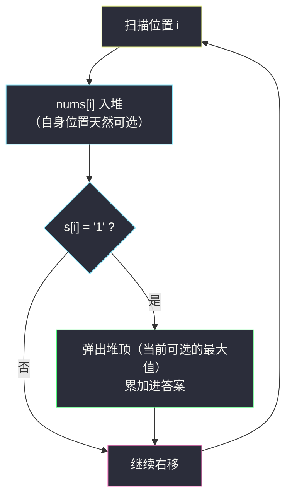

# 二进制交换后的最大分数（堆贪心的「可选集」思想）

## 一、问题描述

给你一个长度为 `n` 的整数数组 `nums` 和一个等长的二进制串 `s`。初始分数为 `0`，每个满足 `s[i] = 1` 的下标 `i` 贡献 `nums[i]` 分。

你可以执行**任意次**操作（可以为零次）：选择一个下标 `i`（`0 <= i < n - 1`）满足 `s[i] = 0` 且 `s[i+1] = 1`，交换这两个字符——也就是说，串中的 `1` 可以向左移动一格（前提是左边是 `0`）。

返回执行若干操作后能获得的**最大分数**。

> 🔗 LeetCode 3781：https://leetcode.cn/problems/maximum-score-after-binary-swaps/
>
> 数据范围：`1 <= n <= 10^5`，`1 <= nums[i] <= 10^7`。分数上界约 `10^5 × 10^7 = 10^12`，超出 32 位整数范围，Java/C++ 需用 64 位。

**示例 1**

```
nums = [2,1,5,2,3], s = "01010"
输出：7

操作序列（一种）：
i=0 交换得 "10010"，再 i=2 交换得 "10100"
两个 1 落在下标 0 和 2，得分 nums[0] + nums[2] = 2 + 5 = 7
```

**示例 2**

```
nums = [5,4,3], s = "011"
输出：9

s = "011" → 交换 i=0 得 "101" → 交换 i=1 得 "110"
两个 1 落在下标 0 和 1，得分 nums[0] + nums[1] = 5 + 4 = 9
```

**直观理解**

操作只能把 `1` 往左挪、且两个 `1` 互相穿不过去，所以这题本质是：**`k` 个 `1`（`k` 为 `s` 中 `1` 的个数）各自能在一段受限区间内选一个落点，互不重叠，最大化落点值之和**。这正是一类经典的「逐个决策 + 堆维护可选集」贪心——灵神题单 §5.2 堆进阶里反复出现的模板。

---

## 二、暴力解法

### 暴力 1：枚举落点组合

把每个 `1` 的所有可能落点枚举一遍，检查组合是否合法（位置严格递增、都不越过初始位置）：

```python
class Solution:
    def maxScore(self, nums: list[int], s: str) -> int:
        pos = [i for i, c in enumerate(s) if c == '1']
        self.best = 0
        def dfs(j, prev, acc):              # 第 j 个 1、前一个落点 prev
            if j == len(pos):
                self.best = max(self.best, acc)
                return
            for t in range(max(j - 1, prev + 1), pos[j] + 1):
                dfs(j + 1, t, acc + nums[t])
        dfs(0, -1, 0)
        return self.best
```

组合数最坏 `O(C(n, k))`，`n = 100` 时就已经不可用。

### 暴力 2：区间约束 DP

设 `f[j][p]` = 第 `j` 个 `1` 恰好落在位置 `p` 时，前 `j` 个 `1` 的最大得分：

```python
f[j][p] = max(f[j-1][q] for q in [j-2, p-1]) + nums[p],  p ∈ [j-1, pos_j]
```

`k` 个 `1`、每个位置一维，时间 `O(k · n)`，最坏 `10^10` 步，仍然超时——但它揭示了两条关键事实（见第三章），并非白写。

### 🔴 瓶颈在哪里

DP 把「历史最优」整行背着走，而每个 `1` 真正需要的只有「**当前可选的落点集合里最大那个值**」。信息可以被压缩成一个堆。

---

## 三、优化探索（核心章节）

> 📚 本题在灵茶题单中属于 **§5.2 堆进阶**，使用的正是「可选集」模板：**一边遍历维护候选堆，一边在被迫决策时弹出当前最优**。同批姊妹篇 [#2931 购买物品的最大开销](maximum-spending-after-buying-items.md) 是同一思想在 m 路归并上的变体。

### 3.1 先把「能落到哪」说清楚

**观察 1：`1` 只能向左移动。** 操作 `s[i]=0, s[i+1]=1` 交换后 `1` 从 `i+1` 来到 `i`，`0` 向右挪。

**观察 2：`1` 之间不能穿越。** 若想把某个 `1` 往左挪一格，左边必须是 `0`；两个 `1` 相邻时谁也过不去谁。因此 `1` 的**相对顺序永远不变**。

设从左数第 `j` 个 `1` 初始位于 `pos_j`。由观察 1，它最终的位置 `t_j <= pos_j`；由观察 2（前面还有 `j-1` 个 `1` 各占一格），`t_j >= j-1`。反过来，**任何满足 `j-1 <= t_j <= pos_j` 且严格递增的序列都能通过操作达到**（每个 `1` 依次左移即可，读者可用示例 1 自行验证）。

于是问题净化为：

> 从数组中选 `k` 个位置 `t_1 < t_2 < ... < t_k`，满足 `t_j <= pos_j`，最大化 `Σ nums[t_j]`。

### 3.2 贪心：扫描 + 可选集大根堆

从左到右扫描 `s`，维护一个**大根堆**作为「可选集」：

- 扫到位置 `i`：把 `nums[i]` 压入堆——**无论 `s[i]` 是 `0` 还是 `1`**；
- 若 `s[i] = '1'`：这是第 `j` 个 `1`，必须现在为它定落点，弹出堆顶累加。



**堆中的不变式**：处理第 `j` 个 `1` 时，堆里恰好是「位置不超过 `pos_j`、且尚未被前 `j-1` 次弹出取走的所有值」——这正是第 `j` 个 `1` 面前的完整可选集。

### 3.3 ⚠️ 易错点：`1` 自身的值必须入堆

一个很容易踩的坑：只把 `s[i] = '0'` 位置的值入堆，遇到 `1` 直接弹堆顶。这在示例 1 上恰好能过（两个 `1` 都从堆里拿到了更大的值），但马上翻车：

- `s = "111"`：堆始终为空，算出 `0`；正确答案是三个数全加（`1` 无处可移，留在原地）。
- 示例 2 `s = "011"`：第二个 `1` 面前堆已空，只能加 `0`，算出 `5`；正确答案 `9`。

**留在原地也是一种选择**，所以扫到 `1` 时必须先让 `nums[i]` 进可选集、再弹堆顶。这样写还有个附带的好处：弹堆顶时堆**必然非空**（自己刚进去），代码里不需要任何堆空分支。

### 3.4 为什么贪心是最优的（交换论证）

用两句话概括，细节用直觉版：

1. **可行性**：第 `j` 次弹出发生在扫描 `pos_j` 时，堆中元素的位置都不超过 `pos_j`。把贪心弹出的 `k` 个位置按从小到大排序，第 `r` 个位置一定 `<= pos_r`（前 `r` 次弹出的位置全都 `<= pos_r`），所以这组落点总能合法分配给 `k` 个 `1`——贪心的输出不是空中楼阁。
2. **最优性**：对 `j` 归纳。设某最优方案给前 `j` 个 `1` 的落点集合与贪心前 `j` 次弹出一致（`j = 0` 时显然）。看第 `j` 个 `1`：它无论最终落哪，那个位置的值此刻都已在堆里（位置 `<= pos_j` 且未被取走），所以堆顶 `g >= 它实际拿到的任何值 v`。若方案拿的不是 `g`，就在方案里做一个「链式交换」：把 `g` 换给第 `j` 个 `1`，被挤掉的那个值顺延给链条上前面的 `1`（每个落点的区间限制都仍然满足），总得分不降。归纳下去，贪心的总得分 `>=` 任何方案。

> 一句话核心：**每个 `1` 面前的可选集只会越来越大（新的位置不断入堆），先到的 `1` 拿走当前最大值永远不会亏。**

---

## 四、代码实现

### Python（主解）

```python
import heapq
from typing import List

class Solution:
    def maxScore(self, nums: List[int], s: str) -> int:
        heap = []                              # 大根堆：Python 里存负数
        ans = 0
        for i, c in enumerate(s):
            heapq.heappush(heap, -nums[i])     # 每个位置的值都进可选集
            if c == '1':                       # 第 j 个 1 必须定落点：
                ans += -heapq.heappop(heap)    # 取当前可选的最大值
        return ans
```

**变量含义**

| 变量 | 含义 |
|------|------|
| `heap` | 「可选集」：位置不超过当前扫描处、未被取走的所有值（存负数实现大根堆） |
| `-heapq.heappop(heap)` | 当前可选的最大值，即本次弹出的落点贡献 |

### Java（最优解同款写法）

```java
class Solution {
    public long maxScore(int[] nums, String s) {
        PriorityQueue<Integer> pq = new PriorityQueue<>(Comparator.reverseOrder());
        long ans = 0;                          // 上界 1e12，必须 long
        for (int i = 0; i < nums.length; i++) {
            pq.offer(nums[i]);                 // 1 自身的值也要入堆
            if (s.charAt(i) == '1') {
                ans += pq.poll();
            }
        }
        return ans;
    }
}
```

---

## 五、具体例子演示

### 示例 1：`nums = [2,1,5,2,3]`，`s = "01010"`（期望 7）

| 步骤 i | s[i] | 入堆值 | 弹出值 | 堆内容（弹出后，按值） | 累计得分 | 说明 |
|--------|------|--------|--------|------------------------|----------|------|
| 0 | 0 | 2 | — | {2} | 0 | 位置 0 的值进入可选集 |
| 1 | 1 | 1 | **2** | {1} | 2 | 第 1 个 1（初始 pos=1）取位置 0 的 2，胜过留原地（1） |
| 2 | 0 | 5 | — | {1, 5} | 2 | 位置 2 的值进入可选集 |
| 3 | 1 | 2 | **5** | {1, 2} | 7 | 第 2 个 1（初始 pos=3）取位置 2 的 5 |
| 4 | 0 | 3 | — | {1, 2, 3}（弃） | 7 | 扫描结束，剩余可选值丢弃 |

对应到操作序列：第 1 个 `1` 从下标 1 左移到 0，第 2 个 `1` 从下标 3 左移到 2，`s` 变为 `"10100"`，得分 `2 + 5 = 7` ✓。堆里被弹出的两个值（2、5）位置分别是 0 和 2，满足 `t_1 <= 1`、`t_2 <= 3` 且递增，合法。

### 示例 2：`nums = [5,4,3]`，`s = "011"`（期望 9）

| 步骤 i | s[i] | 入堆值 | 弹出值 | 堆内容 | 累计得分 |
|--------|------|--------|--------|--------|----------|
| 0 | 0 | 5 | — | {5} | 0 |
| 1 | 1 | 4 | **5** | {4} | 5 |
| 2 | 1 | 3 | **4** | {3} | 9 |

第二个 `1` 面前的可选集是 `{4, 3}`——**注意 4 正是它自己原位置的值**。若按 3.3 节的错误写法（`1` 不入堆），这一步会面对空堆只得 0 分，充分体现了「自身位置可选」这条规则。

---

## 六、复杂度分析

| 解法 | 时间 | 空间 |
|------|------|------|
| 枚举落点组合 | `O(C(n, k))` 指数级 | `O(k)` 递归栈 |
| 区间 DP | `O(k · n)` | `O(k · n)` |
| 可选集堆贪心（本篇） | `O(n log n)` | `O(n)` |

每个位置恰好入堆一次、每个 `1` 弹出一次，堆操作 `O(log n)`，总计 `O(n log n)`；`n = 10^5` 时约 `1.7 × 10^6` 次堆操作，轻松通过。空间瓶颈是堆，最坏存下所有 `0` 位置的值（未被弹出），`O(n)`。

---

## 七、对比总结

**与 §5.2 堆家族的对照**：本题是「**遍历维护候选堆，被迫决策时弹最优**」的最纯形态——没有反悔（对比 [可以到达的最远建筑](furthest-building-you-can-reach.md) 的反悔堆），也没有多路指针（对比 [#2931](maximum-spending-after-buying-items.md) 的 m 路归并），约束「`t_j <= pos_j`」由扫描顺序天然保证。

**易错点清单**

1. **只把 `0` 位置的值入堆**：示例 1 恰好能过，`"111"`、`"011"` 立刻翻车；`1` 自身位置必须可选。
2. **答案溢出**：`n × max(nums)` 达 `10^12`，Python 无感，Java/C++ 必须 `long`。
3. **误以为 `1` 能向右移**：操作只允许 `01 → 10`，方向只有一个。
4. **把「不穿越」想成「不能相邻」**：两个 `1` 可以紧挨着（示例 2 最终就是 `"110"`），只是相对顺序固定。
5. **堆空分支**：正确写法里 `1` 先入堆再弹出，堆必非空；如果你发现自己需要 `if heap:` 的判空，多半是把第 1 条踩了。

---

## 八、举一反三

| 题目 | 关系 |
|------|------|
| [2931. 购买物品的最大开销](https://leetcode.cn/problems/maximum-spending-after-buying-items/) | 同批姊妹篇（同 §5.2）：同样是「被迫决策时弹堆最优」，但可选集来自 m 个有序商店，见 `maximum-spending-after-buying-items.md` |
| [630. 课程表 III](https://leetcode.cn/problems/course-schedule-iii/) | 可选集堆 + 反悔的经典：按截止时间扫描，超时则弹掉已选中花费最大的课 |
| [502. IPO](https://leetcode.cn/problems/ipo/) | 按资本扫描解锁项目入堆，每次弹最大利润，「可选集随遍历扩大」同款 |
| [1642. 可以到达的最远建筑](https://leetcode.cn/problems/furthest-building-you-can-reach/) | 同目录姊妹篇：反悔堆（小顶存免费额度用掉的高度），见 `furthest-building-you-can-reach.md` |
| [857. 雇佣 K 名工人的最低成本](https://leetcode.cn/problems/minimum-cost-to-hire-k-workers/) | 排序 + 堆维护候选集的进阶组合 |

**思想迁移**

- 「受限区间内选 k 个位置最大化/最小化总和」是一整类题的骨架：把**区间约束转成扫描顺序**（位置 `<= pos_j` ⟺ 扫到 `pos_j` 时可见），再用一个堆维护「至今可见且未用」的值，决策时刻弹最优。凡是「相对顺序不变 + 各自受限」的安排问题都可以先往这个方向想。
- 口诀：**「扫描入堆攒可选，遇 1 弹顶定乾坤；自身位置莫遗漏，先入后弹不空堆。」**
