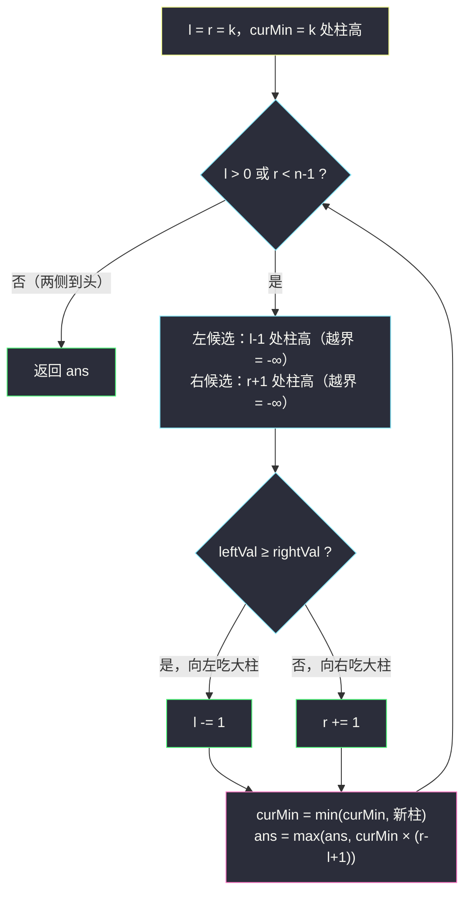
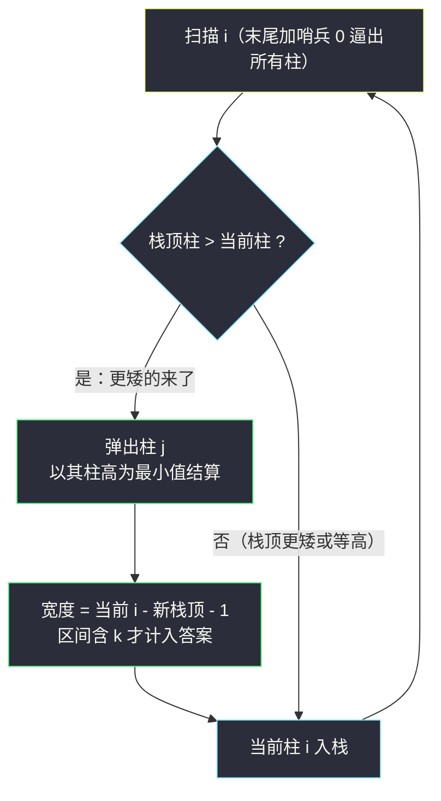

# 好子数组的最大分数（中心双指针贪心扩张 · 单调栈最大矩形）

## 一、问题描述

给定正整数数组 `nums`（下标从 0 开始）和整数 `k`。一个子数组 `[i, j]`（`i ≤ k ≤ j`，**必须包含下标 k**）的分数定义为：

```
score(i, j) = min(nums[i..j]) * (j - i + 1)        # 子数组最小值 × 长度
```

求所有合法子数组的最大分数。

> 🔗 LeetCode 1793：https://leetcode.cn/problems/maximum-score-of-a-good-subarray/
>
> 数据范围：`1 <= nums.length <= 10^5`，`1 <= nums[i] <= 2 * 10^4`，`0 <= k < nums.length`。

**示例**

```
输入：nums = [1,4,3,7,4,5], k = 3    输出：15
解释：取子数组 [4,3,7,4,5]（下标 1..5），min = 3，长度 5，分数 = 3 × 5 = 15。
      下标 3 的 7 被包含在内 ✓

输入：nums = [5,5,4,5,4,1,1,1], k = 0    输出：20
解释：取子数组 [5,5,4,5,4]（下标 0..4），min = 4，长度 5，分数 = 4 × 5 = 20。
```

**直观理解**

把 `nums` 画成柱状图：柱高 = 元素值，分数 = 一条**横跨下标 k 的水平线**下面能围出的矩形面积——高是「盖住范围内最矮的柱」，宽是范围长度。这是 #84 柱状图中最大矩形的变体：矩形**必须压在 k 这根柱子上**。灵神题单把它放在 **单调栈 · 二、矩形** 小节，模板有两条路：以每根柱为最小值结算最大宽度（单调栈），或从必含位置 k 向两侧**按较大值方向**贪心扩张（双指针）。

---

## 二、暴力解法

枚举所有含 `k` 的子数组：左端点 `i` 从 `k` 往左、右端点 `j` 从 `k` 往右，扩张过程中顺便维护当前最小值：

```python
class Solution:
    def maximumScore(self, nums: List[int], k: int) -> int:
        n = len(nums)
        ans = 0
        for i in range(k, -1, -1):
            cur_min = float('inf')
            for j in range(i, n):
                cur_min = min(cur_min, nums[j])
                if i <= k <= j:                 # 必须包含 k
                    ans = max(ans, cur_min * (j - i + 1))
        return ans
```

### 复杂度

- **时间**：`O(n^2)`——含 `k` 的子数组有 `(k+1) * (n-k)` 个，`n = 10^5` 时约 `2.5 * 10^9`，超时。
- **空间**：`O(1)`。

### 🔴 瓶颈在哪里

候选子数组是平方级的，但**决定分数的只有两个量：最小值与宽度**。反过来想：先钉死「哪根柱当最小值」，宽度就该开到最大——每根柱只对应一个极大区间，候选瞬间从平方个坍缩到 `n` 个。这就是单调栈视角；双指针视角则更进一步：从 `k` 出发一步步长大窗口，每一步都「先保住当前最小值，再吃宽度」。

---

## 三、优化探索（核心章节）

> 📚 本题在灵茶题单中属于 **单调栈 · 二、矩形**。灵神模板要点：**以每根柱为最小值的最大宽度**（单调栈弹栈结算，区间向两侧延伸到第一个严格更小的柱为止）；或者**双指针从必含位置 k 向两侧按较大值方向贪心扩张**——每走一步都相当于「固定当前最小值，把宽度开到这一步能开的最大」。

### 3.1 关键观察：固定最小值，宽度越大越好

分数 = min × 宽。若某个子数组的最小值是 `M`，那么在「最小值不小于 M」的前提下宽度每 +1，分数至少多 `M`。所以对每个可能的最小值 `M`，只需要看**包含 k 且元素全 ≥ M 的极大区间**——这一步把「枚举子数组」变成「枚举最小值」。

### 3.2 方法一：双指针从 k 向两侧按较大值方向扩张

从窗口 `[k, k]` 出发，`cur_min = nums[k]`。每一步比较两侧「下一根柱」：

- 左候选 `nums[l-1]`（`l = 0` 时视为 `-∞`），右候选 `nums[r+1]`（`r = n-1` 时视为 `-∞`）；
- **走向较大的一侧**，把新柱并入窗口，更新 `cur_min` 与答案。



**为什么走大的一侧（贪心直觉）**：当前窗口的分数由 `cur_min` 撑着；下一步无论吃哪根柱，`cur_min` 只会不变或变小。吃**较大**的柱，`cur_min` 有机会保持不变——白赚一格宽度；吃较小的柱，`cur_min` 立刻跳水，前面的大柱以后也接不回来了。

**正确性证明（三步，别跳）**：设最优分数为 `OPT`，取一个取到最优的子数组 `[L, R]`（含 `k`），其最小值 `M = min([L,R])`。

1. **构造极大区间**：令 `[L', R']` 为包含 `k` 且所有元素 `≥ M` 的极大区间（从 `k` 向两侧各延伸到第一个 `< M` 的柱为止）。因为 `[L,R]` 内元素全 `≥ M` 且含 `k`，所以 `[L', R'] ⊇ [L, R]`，于是 `min([L',R']) × (R'-L'+1) ≥ M × (R-L+1) = OPT`。
2. **贪心必然路过 `[L', R']`**：归纳——只要 `l > L'`，柱 `l-1` 就落在 `[L', k)` 内，值 `≥ M`；同理 `r < R'` 时 `r+1` 号柱 `≥ M`。于是窗口未长到 `[L', R']` 时，两侧候选都 `≥ M`，无论吃哪边，新窗口仍整段在 `[L', R']` 内、`cur_min ≥ M`。窗口宽度每步 +1，必然在某一时刻恰好等于 `R'-L'+1`；此时窗口含 `k`、整段在 `[L', R']` 内且等宽，只能是 `[L', R']` 本身。边界也不破：`l = L'` 且 `r < R'` 时左候选是 `< M` 的柱、右候选 `≥ M`，较大者必在右侧，不会提前冲出左界；右侧对称。
3. **收口**：贪心在那一刻记录的分数 `≥ M × (R'-L'+1) ≥ OPT`；而贪心的每个窗口都是含 `k` 的合法子数组，分数不可能超过 `OPT`。两边夹逼 ⟹ 贪心答案 = `OPT`。

### 3.3 方法二：单调栈（每根柱为最小值结算最大宽度）

对每根柱 `i`，求出它的**极大矩形**：向两侧延伸到第一根**严格小于** `nums[i]` 的柱为止，记区间 `[left_i + 1, right_i - 1]`。若该区间包含 `k`，则得到候选 `nums[i] * (right_i - left_i - 1)`。

**完备性**：最优子数组 `[L, R]` 的最小值 `M` 取在某根柱 `p ∈ [L, R]` 上（`nums[p] = M`），`[L, R]` 内没有比 `M` 更小的柱 ⟹ `[L, R]` 含于 `p` 的极大矩形且该矩形也含 `k` ⟹ 结算 `p` 时分数 `M × 大矩形宽度 ≥ M × (R-L+1)`。所以枚举全部柱取 max 不会漏。



**⚠️ 等值细节（本题最容易翻车的地方）**：两侧找的都是「**严格**更小」的柱，即弹栈条件是严格大于（等值不弹）。若按 #84 的惯性写成「一侧严格、一侧含等」，相邻等值柱会把彼此的矩形切断：如 `nums = [2,2], k = 0`，正确答案 `2 × 2 = 4`；等值截断后两根柱各只得 `[0,0]`、`[1,1]`，柱 1 的区间不含 `k`，答案错成 2。两侧都允许穿过等值柱，才能保证每根等值柱都能结算到完整的极大矩形。

### 3.4 两个方法的关系

| 视角 | 双指针（3.2） | 单调栈（3.3） |
|------|---------------|---------------|
| 枚举对象 | 窗口从小到大的 `2n` 个状态 | 每根柱的极大矩形（`n` 个结算） |
| 谁当最小值 | 隐式：`cur_min` 随窗口演化 | 显式：被弹出的柱 |
| 额外空间 | `O(1)` | `O(n)`（栈 + 边界数组） |
| 依赖 k 吗 | 深度依赖（起点就是 k） | 只在「区间是否含 k」过滤时用到 |

双指针是「把 k 焊在窗口里，让最小值自然塌落」；单调栈是「把每根柱的最小值地位逐个清账」。前者更快更省，后者模板更通用（k 的约束去掉就是 #84）。

### 3.5 一句话核心

> **含 k 的最优矩形 = 某个「天花板高度 M」下能盖住 k 的最宽整段；双指针每次吃较大的柱，保证每个天花板都被吃到最大宽度。**

---

## 四、代码实现

### Python（主解：双指针从 k 贪心扩张，`O(n)` / `O(1)`）

```python
from typing import List

class Solution:
    def maximumScore(self, nums: List[int], k: int) -> int:
        n = len(nums)
        ans = cur_min = nums[k]
        l = r = k
        while l > 0 or r < n - 1:
            left = nums[l - 1] if l > 0 else -1      # 越界视作 -∞（题设元素 >= 1）
            right = nums[r + 1] if r < n - 1 else -1
            if left >= right:                        # 向较大一侧扩张（等值走哪边都对）
                l -= 1
                cur_min = min(cur_min, nums[l])
            else:
                r += 1
                cur_min = min(cur_min, nums[r])
            ans = max(ans, cur_min * (r - l + 1))
        return ans
```

### Python（方法二：单调栈，每根柱结算极大矩形）

```python
from typing import List

class Solution:
    def maximumScore(self, nums: List[int], k: int) -> int:
        a = nums + [0]                # 哨兵 0：元素恒 >= 1，扫到它时清空整栈
        st = [-1]                     # 左哨兵下标
        ans = 0
        for i, x in enumerate(a):
            while st[-1] != -1 and a[st[-1]] > x:   # 严格大于才弹：等值穿过（3.3）
                j = st.pop()                          # 柱 j 以最小值身份结算
                L, R = st[-1] + 1, i - 1              # 极大矩形 [L, R]
                if L <= k <= R:
                    ans = max(ans, a[j] * (R - L + 1))
            st.append(i)
        return ans
```

**变量含义**

| 变量 | 含义 |
|------|------|
| `l, r` | 当前窗口边界，恒满足 `l ≤ k ≤ r` |
| `cur_min` | `min(nums[l..r])`，扩张时增量维护 |
| `left / right` | 两侧下一根柱的高度，越界用 `-1` 扮演 `-∞` |
| `st` | 单调栈（存下标，栈底到栈顶高度递增），`-1` 为左哨兵 |
| `L, R` | 被弹柱的极大矩形：新栈顶 + 1 到当前 i - 1 |

### Java（双指针版）

```java
class Solution {
    public int maximumScore(int[] nums, int k) {
        int n = nums.length;
        int ans = nums[k], curMin = nums[k];
        int l = k, r = k;
        while (l > 0 || r < n - 1) {
            int left = l > 0 ? nums[l - 1] : -1;
            int right = r < n - 1 ? nums[r + 1] : -1;
            if (left >= right) {
                curMin = Math.min(curMin, nums[--l]);
            } else {
                curMin = Math.min(curMin, nums[++r]);
            }
            ans = Math.max(ans, curMin * (r - l + 1));
        }
        return ans;
    }
}
```

---

## 五、具体例子演示

### 例 A：`nums = [1,4,3,7,4,5], k = 3`（双指针逐步表）

初始 `l = r = 3`，`cur_min = 7`，`ans = 7 × 1 = 7`：

| 步 | 左候选 `nums[l-1]` | 右候选 `nums[r+1]` | 决策 | 窗口 | cur_min | 本步分数 | ans |
|----|--------------------|--------------------|------|------|---------|----------|-----|
| 0 | 3 | 4 | 右大 → `r=4` | `[3,4]` | 4 | 4 × 2 = 8 | 8 |
| 1 | 3 | 5 | 右大 → `r=5` | `[3,5]` | 4 | 4 × 3 = 12 | 12 |
| 2 | 3 | 越界(-∞) | 左 → `l=2` | `[2,5]` | 3 | 3 × 4 = 12 | 12 |
| 3 | 4 | 越界 | 左 → `l=1` | `[1,5]` | 3 | 3 × 5 = 15 | **15** |
| 4 | 1 | 越界 | 左 → `l=0` | `[0,5]` | 1 | 1 × 6 = 6 | 15 |

终止 → **15** ✓。注意第 2 步吃进 3 之后 `cur_min` 塌到 3，此后靠宽度吃回来——这正是「固定最小值开最大宽度」的现场：从步 2 到步 4，天花板 3 一直没变，窗口从 4 宽吃到 5 宽。

### 例 A（续）：单调栈弹栈结算表

给数组加右哨兵 `0`，栈内先放左哨兵 `-1`。扫到更矮的柱时弹栈结算：

| 步 | 读入 i (值) | 弹出柱 j (值) | 新栈顶 | 结算区间 [L, R] | 值 × 宽 | 含 k=3? | ans |
|----|-------------|----------------|--------|------------------|---------|----------|-----|
| 1 | 0 (1) | —（入栈） | — | — | — | — | 0 |
| 2 | 1 (4) | —（1 > 4 否，入栈） | — | — | — | — | 0 |
| 3 | 2 (3) | 1 (4) | 0 | [1, 1] | 4 × 1 = 4 | 1 < 3 ✗ | 0 |
| 4 | 3 (7) | —（入栈） | — | — | — | — | 0 |
| 5 | 4 (4) | 3 (7) | 2 | [3, 3] | 7 × 1 = 7 | ✓ | 7 |
| 6 | 5 (5) | —（4 > 5 否，入栈） | — | — | — | — | 7 |
| 7 | 6 (0 哨兵) | 5 (5) | 4 | [5, 5] | 5 × 1 = 5 | 5 > 3 ✗ | 7 |
| 8 | 6 (0 哨兵) | 4 (4) | 2 | [3, 5] | 4 × 3 = 12 | ✓ | 12 |
| 9 | 6 (0 哨兵) | 2 (3) | 0 | [1, 5] | 3 × 5 = 15 | ✓ | **15** |
| 10 | 6 (0 哨兵) | 0 (1) | -1 | [0, 5] | 1 × 6 = 6 | ✓ | 15 |

（步 3 之后柱 2 入栈、步 5 之后柱 4 入栈，表中略去「入栈」行。）→ **15** ✓。被弹的柱就是「最小值身份」，宽度由两侧第一根更矮的柱（或哨兵）卡出来；不含 k 的区间（步 3、7）直接跳过。

### 例 B：`nums = [5,5,4,5,4,1,1,1], k = 0`（贴边扩张）

`k = 0` 贴在左边界，左候选恒为 `-∞`，只能一路向右：

| 步 | 右候选 | 窗口 | cur_min | 本步分数 | ans |
|----|--------|------|---------|----------|-----|
| 初始 | — | `[0,0]` | 5 | 5 | 5 |
| 1 | 5 | `[0,1]` | 5 | 5 × 2 = 10 | 10 |
| 2 | 4 | `[0,2]` | 4 | 4 × 3 = 12 | 12 |
| 3 | 5 | `[0,3]` | 4 | 4 × 4 = 16 | 16 |
| 4 | 4 | `[0,4]` | 4 | 4 × 5 = 20 | **20** |
| 5 | 1 | `[0,5]` | 1 | 1 × 6 = 6 | 20 |
| 6 | 1 | `[0,6]` | 1 | 7 | 20 |
| 7 | 1 | `[0,7]` | 1 | 8 | 20 |

→ **20** ✓。天花板 4 的极大区间 `[0,4]` 被完整吃到；后面的 1 把 `cur_min` 打穿，再宽也不值钱。

### 例 C：`nums = [2,2], k = 0`（等值陷阱）

- 正确做法（两侧严格小于）：两根 2 互不截断，任一根的极大矩形都是 `[0,1]`，含 `k=0`，得分 `2 × 2 = 4` ✓。
- 错误做法（等值截断）：两根柱各自只得到 `[0,0]` 与 `[1,1]`，后者不含 k，答案错成 `2` ✗。单调栈写法请回头对照 3.3 的弹栈条件。

---

## 六、复杂度分析

| 方法 | 时间 | 空间 |
|------|------|------|
| 暴力枚举含 k 子数组 | `O(n^2)` | `O(1)` |
| 双指针贪心扩张 | `O(n)`（窗口边界各单调移动，合计至多 `2n` 步） | `O(1)` |
| 单调栈 | `O(n)`（每根柱入栈、出栈各一次） | `O(n)`（栈；一遍哨兵法无需边界数组） |

双指针版是本题的「天花板实现」：单遍、原地、常数小。`n = 10^5` 下三者中只有它能同时把时间与空间都压到极限。乘法上界 `2 * 10^4 × 10^5 = 2 * 10^9` 已贴 int 边界，Java 中 `curMin * (r - l + 1)` 用 `int` 恰好不溢出（题面保证上界），Python 无需担心。

---

## 七、对比总结

**矩形/跨度家族对照**：

| 题 | 约束 | 模板 | 互引 |
|----|------|------|------|
| #84 柱状图中最大的矩形 | 无必含位置 | 单调栈结算每根柱极大矩形 | 去掉 k 过滤即本题方法二 |
| #1793 本题 | 必含下标 k | 双指针中心扩张 / 单调栈 + 区间含 k 过滤 | — |
| #901 股票价格跨度 | 单侧延伸 | 单调栈求「左侧第一个更大」 | `online-stock-span.md` |
| #962 最大宽度坡 | i < j 且 nums[i] ≤ nums[j] | 单调栈 + 从右向左对接 | `maximum-width-ramp.md` |

**易错点**

1. **等值处理**（3.3 / 例 C）：两侧必须「严格更小」才截断，等值柱要互相穿过，否则极大矩形被切碎、漏掉含 k 的完整区间。
2. **越界候选**：双指针两侧越界要给 `-∞`（本题元素 ≥ 1，用 `-1` 即可），否则比较时会把不存在的柱当成大柱。
3. **先更新窗口再算分**：吃进新柱后立刻 `min` 再 `max(ans, …)`，顺序颠倒会把旧宽配新 min。
4. **单调栈哨兵**：左哨兵 `-1` 让第一根柱也有边界可依；右哨兵用比所有元素小的值（这里是 0），扫完清栈结算。
5. 双指针**等值时走哪边都对**（两侧等高，`cur_min` 都不变），不必纠结 tie-break。

---

## 八、举一反三

| 题目 | 关系 |
|------|------|
| [84. 柱状图中最大的矩形](https://leetcode.cn/problems/largest-rectangle-in-histogram/) | 无 k 约束的原型题，本题方法二去掉「含 k」过滤即它 |
| [901. 股票价格跨度](https://leetcode.cn/problems/online-stock-span/) | 单调栈求单侧延伸的同族基础题，见同目录 `online-stock-span.md` |
| [907. 子数组的最小值之和](https://leetcode.cn/problems/sum-of-subarray-minimums/) | 同为「每根柱的最小值地位 × 贡献范围」，把 max 换成求和 |
| [962. 最大宽度坡](https://leetcode.cn/problems/maximum-width-ramp/) | 单调栈 + 双向对接的另一形态，见同目录 `maximum-width-ramp.md` |
| [1856. 子数组最小乘积的最大值](https://leetcode.cn/problems/maximum-subarray-min-product/) | 「min × 区间和」与本题「min × 长度」同骨架：单调栈结算极大区间 + 前缀和 |

**思想迁移**

- 「min × 宽」类最优化，永远先问：**这个 min 能撑住的最大宽度是多少**——把平方级子数组坍缩成 n 个极大区间。
- 带「必含位置 k」的区间问题，优先考虑**从 k 出发的中心扩张**（双指针），它天然满足约束、且往往单遍 `O(1)` 空间。
- 单调栈题里**等值的处理方向要单独想清楚**：求个数/贡献时往往要一侧去重（避免重复计数），求「是否存在/最大区间」时要两侧放行（保证极大）。先想清楚这道题怕「重复」还是怕「漏掉」。
- 口诀：**「从 k 往外吃大柱，最小值塌了宽度补；单调栈里清每柱，等值放行才不堵。」**
