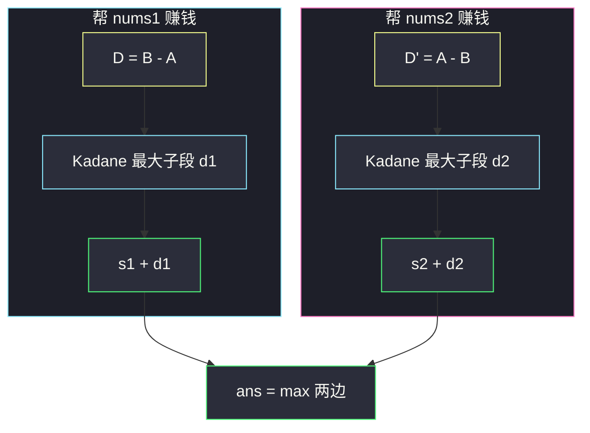

# 2321. 拼接数组的最大分数（Maximum Score Of Spliced Array）

> 题目来源：[https://leetcode.cn/problems/maximum-score-of-spliced-array/](https://leetcode.cn/problems/maximum-score-of-spliced-array/)
>
> 灵茶题单小节定位：§1.3 最大子数组和（最大子段和）

## 一、问题描述

给你两个下标从 0 开始、长度都为 `n` 的整数数组 `nums1` 和 `nums2`。

可以选两个整数 `left`、`right`（`0 <= left <= right < n`），把 `nums1[left..right]` 和 `nums2[left..right]` **整段交换**。这个操作最多做一次，也可以不做。

数组的**分数**是 `sum(nums1)` 与 `sum(nums2)` 里的较大值。返回操作之后可能达到的最大分数。

**数据范围**：

- `n == nums1.length == nums2.length`
- `1 <= n <= 10^5`
- `1 <= nums1[i], nums2[i] <= 10^4`

**示例 1**：

```text
输入：nums1 = [60,60,60], nums2 = [10,90,10]
输出：210
解释：选 left = 1, right = 1，得到
nums1 = [60,90,60]，nums2 = [10,60,10]。
分数 max(210, 80) = 210。
```

**示例 2**：

```text
输入：nums1 = [20,40,20,70,30], nums2 = [50,20,50,40,20]
输出：220
解释：选 left = 3, right = 4，得到
nums1 = [20,40,20,40,20]，nums2 = [50,20,50,70,30]。
分数 max(140, 220) = 220。
```

**示例 3**：

```text
输入：nums1 = [7,11,13], nums2 = [1,1,1]
输出：31
解释：不交换。分数 max(31, 3) = 31。
```

**核心思考点**：Hard 标签来自「要先想清楚交换到底在优化哪一边」，代码只是两次 Kadane。把 `nums1` 的一段换成 `nums2` 的对应段，`sum1` 的增量恰好是差分数组 `nums2[i] - nums1[i]` 的某段子数组和。两边对称做一次，再和不交换比较——而不交换其实已经被「整段差分数组」吃进去了。

## 二、暴力解法

### 思路

枚举交换区间 `[l, r]`（含不交换：额外比较原始两个和），算交换后两边的和，取 max。用「扫右端累加差分」把内层求和降到 `O(1)`。

### 代码

```python
def maximumsSplicedArrayBrute(nums1: list[int], nums2: list[int]) -> int:
    n = len(nums1)
    s1, s2 = sum(nums1), sum(nums2)
    ans = max(s1, s2)                        # 不交换
    for l in range(n):
        d = 0                                # sum(nums2[l..r] - nums1[l..r])
        for r in range(l, n):
            d += nums2[r] - nums1[r]
            ans = max(ans, s1 + d, s2 - d)   # 换到 nums1 / 换到 nums2
    return ans
```

### 复杂度

- 时间：`O(n²)`。`n = 10^5` 不可用，短数组对拍足够。
- 空间：`O(1)`。

## 三、优化探索

### 3.1 交换一段，只改一个差 ⭐

记 `A = nums1`，`B = nums2`，`s1 = sum(A)`，`s2 = sum(B)`。交换 `[L, R]` 之后：

```text
新 s1 = s1 - sum(A[L..R]) + sum(B[L..R])
      = s1 + sum((B-A)[L..R])

新 s2 = s2 + sum((A-B)[L..R])
      = s2 - sum((B-A)[L..R])
```

分数是 `max(新 s1, 新 s2)`。要的是所有区间（含「不交换」）上这个值的最大值。

不交换等价于增量 0。所以：

```text
ans = max(
    s1 + 最大子段和(B - A),     # 含 0：可以不换
    s2 + 最大子段和(A - B)
)
```

「含 0」看起来要 `max(0, Kadane)`，下面 3.3 说明**直接跑非空 Kadane 也是对的**。

### 3.2 两次 Kadane 覆盖所有决策 ⭐⭐

对差分数组 `D[i] = B[i] - A[i]` 求最大子段和，就是在给 `A` 找一段「换成 B 最赚」的区间；对称地对 `-D`（也就是 `A - B`）再找一段「换成 A 最赚」的区间给 `B`。

不需要同时优化两边——一次交换只能服务一边的分数，另一边会被改坏。最终分数取两边结果的较大值，已经覆盖「这次交换到底帮谁」。



### 3.3 为什么不用 `max(0, Kadane)` ⭐⭐

非空 Kadane 在差分数组全为负时会返回「最大的那个负数」。此时：

- `B - A` 全负 ⇒ 每个位置 `B[i] < A[i]` ⇒ `A - B` 全正 ⇒ 这边 Kadane 会取**整段**，增量恰好是 `s1 - s2`；
- 于是 `s2 + (s1 - s2) = s1`，等于「把整段 B 换成 A」，分数变成原来的 `s1`。

两边差分数组不可能同时全负（一个是另一个的相反数）。所以 `max(s1 + Kadane(B-A), s2 + Kadane(A-B))` 至少能拿到 `max(s1, s2)`，不交换被自动包含。示例 3 就是这条路。

### 3.4 Kadane 本尊 ⭐

当前段和 `t ≤ 0` 时，后面再接只会被拖累，从下一个元素重开：

```text
t = D[0], mx = t
对每个后续 v:
    t = t + v   若 t > 0
    t = v       若 t ≤ 0
    mx = max(mx, t)
```

`n = 10^5`，一遍线性扫。

**核心一句**：一次交换 = 在差分数组上选一段最大子段，给其中一边的总和加上这段收益。

## 四、代码实现

### 主解：双边 Kadane

```python
class Solution:
    def maximumsSplicedArray(self, nums1: list[int], nums2: list[int]) -> int:
        def kadane(xs: list[int], ys: list[int]) -> int:
            t = mx = xs[0] - ys[0]           # 非空，从第一格起步
            for x, y in zip(xs[1:], ys[1:]):
                v = x - y
                t = t + v if t > 0 else v
                mx = max(mx, t)
            return mx

        s1, s2 = sum(nums1), sum(nums2)
        # 帮 nums2：加上 A-B 的最大子段；帮 nums1：加上 B-A 的最大子段
        return max(s2 + kadane(nums1, nums2), s1 + kadane(nums2, nums1))
```

### 对照：Java 默写版

```java
class Solution {
    public int maximumsSplicedArray(int[] nums1, int[] nums2) {
        int s1 = 0, s2 = 0;
        for (int i = 0; i < nums1.length; i++) {
            s1 += nums1[i];
            s2 += nums2[i];
        }
        return Math.max(s2 + kadane(nums1, nums2), s1 + kadane(nums2, nums1));
    }

    private int kadane(int[] xs, int[] ys) {
        int t = xs[0] - ys[0], mx = t;
        for (int i = 1; i < xs.length; i++) {
            int v = xs[i] - ys[i];
            t = t > 0 ? t + v : v;
            mx = Math.max(mx, t);
        }
        return mx;
    }
}
```

`n · 10^4` 量级的和落在 `int` 范围内（最坏约 `2·10^9`，低于 `2^31 - 1`）。

### 细节说明

- **`kadane(xs, ys)` 算的是 `xs - ys` 的最大子段**。所以 `kadane(nums1, nums2)` 是 `A - B`，加到 `s2` 上；`kadane(nums2, nums1)` 是 `B - A`，加到 `s1` 上。参数顺序不要对调。
- **`t > 0` 才续上**：`t == 0` 时续不续对整数答案无影响；写成 `t >= 0` 也行。
- **不能两边各换一段**：题面只允许一次交换，且必须是同一对下标区间。
- **元素为正没有用来「剪枝」**：差分可正可负，Kadane 照常处理负数。

## 五、例子演示

**示例 1：nums1 = [60, 60, 60]，nums2 = [10, 90, 10]**

`s1 = 180`，`s2 = 110`。

帮 nums1，差分 `B - A = [-50, 30, -50]`：

| i | v | t（续 or 重开） | mx |
|---|---|---|---|
| 0 | -50 | -50 | -50 |
| 1 | 30 | 30（重开） | **30** |
| 2 | -50 | -20 | 30 |

`s1 + 30 = 210`。对应官方只换下标 1：`60` 换成 `90`。

帮 nums2，差分 `A - B = [50, -30, 50]`：

| i | v | t | mx |
|---|---|---|---|
| 0 | 50 | 50 | 50 |
| 1 | -30 | 20 | 50 |
| 2 | 50 | 70 | **70** |

`s2 + 70 = 180`。整段换到 nums2，得到原来的 nums1，分数 180，不如 210。

答案 **210** ✅。

**示例 2：nums1 = [20, 40, 20, 70, 30]，nums2 = [50, 20, 50, 40, 20]**

`s1 = 180`，`s2 = 180`。

`B - A = [30, -20, 30, -30, -10]`，Kadane 走完最大 40（前三个：30-20+30）。
`s1 + 40 = 220`。

`A - B = [-30, 20, -30, 30, 10]`，Kadane 最大 40（最后两个：30+10）。
`s2 + 40 = 220`。

这正是官方选的 `[3..4]`：nums2 吃进 `70, 30`，和变成 220。答案 **220** ✅。两边算出同一个分数，选哪边交换都可以。

**示例 3：nums1 = [7, 11, 13]，nums2 = [1, 1, 1]**

`s1 = 31`，`s2 = 3`。
`B - A = [-6, -10, -12]`，Kadane = -6，`s1 - 6 = 25`（亏）。
`A - B = [6, 10, 12]` 全正，Kadane = 28（整段），`s2 + 28 = 31`。

答案 **31** ✅。对应「不换」或「把 nums2 整段换成 nums1」——分数一样。若误以为 Hard 必须换一次，会换成 25，反而更差。

## 六、复杂度分析

设 `n` 为数组长度：

- **时间复杂度：`O(n)`**——两次 Kadane，各扫一遍。
- **空间复杂度：`O(1)`**——不必物化差分数组。

## 七、对比总结

| 维度 | 枚举区间 | 主解双边 Kadane |
|---|---|---|
| 时间 | `O(n²)` | `O(n)` |
| 决策 | 显式 l, r | 差分最大子段 |
| 不交换 | 单独 max(s1, s2) | 被「全负差分 → 整段对调」覆盖 |
| 代码量 | 双循环 | 十来行 |

**套路归纳**：**「用另一段替换自己的一段」= 差分数组上的最大子段和**。先写出交换后总和的代数式，增量一定是 `±(B[i]-A[i])` 的连续段，然后把 Kadane 当黑盒调用。Hard 的份量在推导，不在实现。同类还有「最多改一段 / 最多删一个」的 Kadane 变体，都是先代数、后扫描。

## 八、举一反三

1. **[53. 最大子数组和](https://leetcode.cn/problems/maximum-subarray/)**：Kadane 本体，本题差分上的子程序。
2. **[121. 买卖股票的最佳时机](https://leetcode.cn/problems/best-time-to-buy-and-sell-stock/)**：差分数组的最大子段（只买一次）。
3. **[918. 环形子数组的最大和](https://leetcode.cn/problems/maximum-sum-circular-subarray/)**：Kadane + 总和 − 最小子段。
4. **[1191. K 次串联后最大子数组之和](https://leetcode.cn/problems/k-concatenation-maximum-sum/)**：同目录 `k-concatenation-maximum-sum.md`，周期拼接版 Kadane。
5. **[1186. 删除一次得到子数组最大和](https://leetcode.cn/problems/maximum-subarray-sum-with-one-deletion/)**：同目录 `maximum-subarray-sum-with-one-deletion.md`，Kadane 加一维「删 / 不删」。

**同族互引**：§1.3 最大子段和。Hard 只是把「数组 A 换成 B 的一段」翻译成差分；和 `k-concatenation-maximum-sum.md` 一样，难在分类，代码短。
