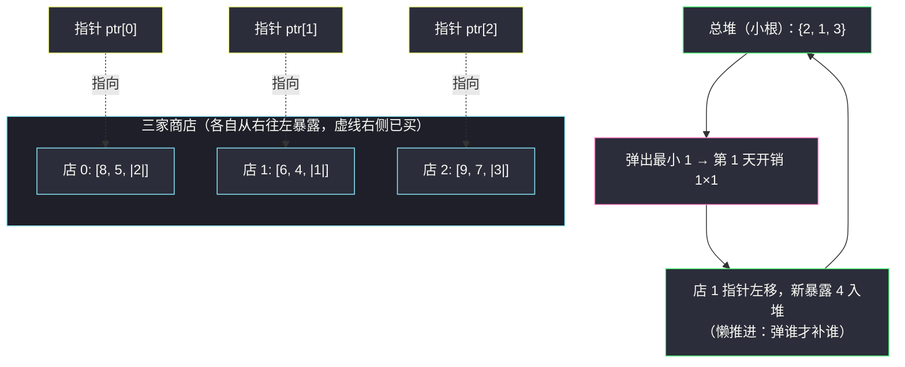

# 购买物品的最大开销（m 路归并式堆贪心 + 排序不等式）

## 一、问题描述

给你一个下标从 `0` 开始的二维整数数组 `values`，其中 `values[i]` 是一个**单调不增**的正整数数组，表示第 `i` 家商店在售的商品价格。

你要买下**所有**商品，规则如下：

- 从第 `1` 天开始，**每天恰好购买一件**商品；
- 在一家商店购物时，必须按数组**从右往左**的顺序买——即每次只能购买该店**尚未购买商品中最靠右**的一件（最便宜的先暴露出来）；
- 第 `d` 天购买价格为 `p` 的商品，开销为 `p × d`。

返回购买完全部商品的**最大**总开销。

> 🔗 LeetCode 2931：https://leetcode.cn/problems/maximum-spending-after-buying-items/
>
> 数据范围：`1 <= values.length <= 10^5`，`1 <= values[i].length`，`Σ values[i].length <= 10^5`，`1 <= values[i][j] <= 10^6`。天数最大 `10^5`、单日开销最大 `10^6 × 10^5 = 10^11`，总开销上界约 `5 × 10^15`，**必须使用 64 位整数**。

**示例 1**

```
values = [[8,5,2],[6,4,1],[9,7,3]]
输出：285

购买序列：1, 2, 3, 4, 5, 6, 7, 8, 9（依次从三家店的"便宜端"拿）
总开销 = 1×1 + 2×2 + 3×3 + ... + 9×9 = 285
```

**示例 2**

```
values = [[10,8,6,4,2],[9,7,5,3,1]]
输出：385
```

**直观理解**

所有商品迟早都要买，所以总开销 `= Σ (价格 × 天数)`。天数 `d` 是乘数：**便宜的尽量早买（乘小系数），贵的尽量晚买（乘大系数）**。约束在于每家店只能从右往左「剥洋葱」，你不能直接把压在左边的贵货提前拿出来。这题就是灵茶题单 §5.2 堆进阶里「**m 个指针 + 总堆懒推进**」的 m 路归并模板在贪心上的直接应用。

---

## 二、暴力解法

### 暴力：枚举所有合法购买顺序

每天的决策是「从哪家还没买空的店买一件」，DFS 枚举全部顺序：

```python
class Solution:
    def maxSpending(self, values: list[list[int]]) -> int:
        self.best = 0
        def dfs(shops, day, acc):
            if all(len(q) == 0 for q in shops):
                self.best = max(self.best, acc)
                return
            for i, q in enumerate(shops):
                if q:
                    p = q.pop()               # 买该店最右（最便宜）的
                    dfs(shops, day + 1, acc + p * day)
                    q.append(p)               # 回溯
        dfs([list(v) for v in values], 1, 0)
        return self.best
```

合法顺序总数是**多重排列** `n! / (m_1! · m_2! · ... · m_k!)`，`n` 稍大就爆炸——比如两家店各 `10` 件商品就有 `184756` 种顺序，`Σ = 10^5` 件商品时是天文数字。

### 🔴 瓶颈在哪里

暴力在「选哪家的顺序」这个维度上搜索，但天与天之间高度耦合（今天的选择决定了明天各家暴露什么）。要打破耦合，需要发现一个**逐日独立、且不破坏全局最优**的决策规则。

---

## 三、优化探索（核心章节）

> 📚 本题在灵茶题单中属于 **§5.2 堆进阶**。核心模板是 **m 路归并**：m 个各自有序的序列，各配一个指针，把 m 个「当前元素」放进一个总堆，弹出谁就懒推进谁的指针——与「合并 K 个升序链表」完全同构。同批姊妹篇 [#3781 二进制交换后的最大分数](maximum-score-after-binary-swaps.md) 是「可选集」思想的另一个变体。

### 3.1 先看清规则给了什么结构

「从右往左买 + 数组不增」组合起来有一个妙处：

> 每家店**下一件可买的商品，是该店剩余商品中最便宜的一件**；一旦买掉它，暴露出来的下一件**只会更贵或相等**。

于是任意时刻，你的可选集 = 每家店「暴露位」上的那一件，共 `m` 件（有些店可能已买空）。问题变成：**每天从这不超过 `m` 件中挑一件，怎么挑总开销最大？**

### 3.2 贪心规则：每天买当前最便宜的

直觉很直白：第 `d` 天的开销是 `p × d`，把小的 `p` 配小的 `d`、大的 `p` 留给大的 `d`。

先看一个**错误直觉**作对照——「贵的乘大天数，所以每天买最贵的」：

```
values = [[10,9],[1]]
每天买最贵：第 1 天买 9，第 2 天买 10，第 3 天买 1 → 9 + 20 + 3 = 32
每天买最便宜：第 1 天买 1，第 2 天买 9，第 3 天买 10 → 1 + 18 + 30 = 49
暴力枚举三种合法顺序：(1,9,10)=49，(9,1,10)=41，(9,10,1)=32 → 最优就是 49
```

「先花大钱」的方案把最贵的 `10` 压在了第 `2` 天，而 `1` 这种白送的乘数却在最后一天才消耗掉——**乘数 `d` 是全局稀缺资源，应该留给大价格**。

### 3.3 为什么「每天买最便宜」是最优的（两步证明）

这个证明非常干净，值得完整写下来。

**第一步：贪心产生的购买序列单调不降。**

某天弹出堆中最小值 `p`（设来自店 `i`），根据懒推进规则，店 `i` 的下一件 `v` 入堆。由 3.1 节，`v >= p`（同店越往左越贵）；而堆里剩下的元素本来就 `>= p`。所以新堆的最小值 `>=` 旧堆的最小值——**每天购买的价格只会持平或上涨**。

**第二步：排序不等式收尾。**

所有商品都要买光，所以任何合法方案都是**同一组价格**的某个排列。而排序不等式告诉我们：两个序列按**同序**（都非降）逐位相乘时内积最大——即

> 价格按非降顺序购买时，`Σ p_d × d` 取到这组价格所有排列中的最大值。

贪心序列恰好非降（第一步），因此它 `>=` 任何合法方案。∎

反过来这也解释了 3.2 的错误方案为什么输：「每天买最贵」产生非增序列，按排序不等式恰好是**最小**方向（32 正是那个例子三种顺序里的最小值）。

### 3.4 实现：m 个指针 + 总堆懒推进



要点：

- 初始把 `m` 家店的**末尾元素**入堆（每店一件，`(price, shop_id)`）；
- 每天弹堆顶（当前最便宜），累加 `price × day`；
- **懒推进**：只有被弹出的那家店才把指针左移一格、把新暴露的下一件补进堆——堆的大小恒为「未买空的商店数」，至多 `m`。

这就是 m 路归并的标准姿势：总堆里永远只放每路的「当前元素」，而不是把所有 `n` 件商品一股脑塞进堆。

---

## 四、代码实现

### Python（主解）

```python
import heapq
from typing import List

class Solution:
    def maxSpending(self, values: List[List[int]]) -> int:
        m = len(values)
        ptr = [len(row) - 1 for row in values]          # 每店指针：从末尾（最便宜端）起步
        heap = [(values[i][ptr[i]], i) for i in range(m)]
        heapq.heapify(heap)                             # 总堆：各店"下一件"，共 m 个
        ans = 0
        day = 1
        while heap:
            price, i = heapq.heappop(heap)              # 每天买当前最便宜的一件
            ans += price * day
            day += 1
            ptr[i] -= 1                                 # 懒推进：弹谁补谁
            if ptr[i] >= 0:
                heapq.heappush(heap, (values[i][ptr[i]], i))
        return ans
```

**变量含义**

| 变量 | 含义 |
|------|------|
| `ptr[i]` | 店 `i` 下一件可买商品的下标，从 `m_i - 1` 起向 `0` 移动 |
| `heap` | 总堆（小根），存 `(价格, 店号)`，大小 `<= m`，永远只含各店当前暴露的一件 |
| `day` | 当前天数，从 `1` 起 |

### Java（最优解同款写法）

```java
class Solution {
    public long maxSpending(int[][] values) {
        int m = values.length;
        int[] ptr = new int[m];
        PriorityQueue<long[]> heap = new PriorityQueue<>((a, b) -> Long.compare(a[0], b[0]));
        for (int i = 0; i < m; i++) {                   // 指针从末尾起步
            ptr[i] = values[i].length - 1;
            heap.offer(new long[]{values[i][ptr[i]], i});
        }
        long ans = 0, day = 1;
        while (!heap.isEmpty()) {
            long[] top = heap.poll();                   // 每天买当前最便宜
            int i = (int) top[1];
            ans += top[0] * day;
            day++;
            if (--ptr[i] >= 0) {                        // 懒推进该店指针
                heap.offer(new long[]{values[i][ptr[i]], i});
            }
        }
        return ans;
    }
}
```

---

## 五、具体例子演示

### 示例 1：`values = [[8,5,2],[6,4,1],[9,7,3]]`（期望 285）

三家店都从**末尾**开始暴露。下表逐步跟踪（`堆` 列为弹出后、懒推进后的内容）：

| 天 d | 三店暴露价（店0/店1/店2） | 堆内容（弹前） | 买哪家 | 价格 p | 开销 p×d | 累计 |
|------|--------------------------|----------------|--------|--------|----------|------|
| 1 | 2 / **1** / 3 | {1, 2, 3} | 店 1 | 1 | 1 | 1 |
| 2 | 2 / 4 / 3 → 弹 **2** | {2, 3, 4} | 店 0 | 2 | 4 | 5 |
| 3 | 5 / 4 / 3 → 弹 **3** | {3, 4, 5} | 店 2 | 3 | 9 | 14 |
| 4 | 5 / 4 / 7 → 弹 **4** | {4, 5, 7} | 店 1 | 4 | 16 | 30 |
| 5 | 5 / 6 / 7 → 弹 **5** | {5, 6, 7} | 店 0 | 5 | 25 | 55 |
| 6 | 8 / 6 / 7 → 弹 **6** | {6, 7, 8} | 店 1 | 6 | 36 | 91 |
| 7 | 8 / 空 / 7 → 弹 **7** | {7, 8} | 店 2 | 7 | 49 | 140 |
| 8 | 8 / 空 / 9 → 弹 **8** | {8, 9} | 店 0 | 8 | 64 | 204 |
| 9 | 空 / 空 / 9 → 弹 **9** | {9} | 店 2 | 9 | 81 | 285 |

购买序列 `(1, 2, 3, 4, 5, 6, 7, 8, 9)` 严格递增——正如 3.3 节所证，贪心序列必然非降；此例中三店交错得恰好完美递增，直接达到排序不等式的理论上界 `Σ i × i = 285`。

**观察两个细节**：

- 第 4 天买店 1 的 `4` 而不是店 0 的 `5`：便宜的先走，店 0 的 `5` 多等一天、乘数从 `4` 涨到 `5`，这正是「把大价格推向大天数」的机制；
- 第 9 天只剩 `9`：它一路没被弹出，因为总有大价格陪它垫后——**留到最后的都是被「惯着」的贵货**。

### 示例 2 快速复核：`values = [[10,8,6,4,2],[9,7,5,3,1]]`

两家店的暴露序列分别为 `2,4,6,8,10` 与 `1,3,5,7,9`，小根堆归并得到 `(1,2,3,...,10)`，总开销 `Σ i × i = 385` ✓。

---

## 六、复杂度分析

| 解法 | 时间 | 空间 |
|------|------|------|
| DFS 枚举顺序 | `O(n! / Π m_i!)` 指数级 | `O(n)` |
| m 指针 + 总堆（本篇） | `O(N log m)` | `O(m)` |

其中 `N = Σ values[i].length <= 10^5` 为商品总数，`m` 为商店数。每件商品恰好入堆一次、出堆一次，单次堆操作 `O(log m)`（堆大小不超过 `m`，**不是** `N`——这就是懒推进省下的），总计 `O(N log m)`。空间只需堆与指针数组 `O(m)`。

答案用 64 位：`N = 10^5`、单价 `10^6` 时总开销约 `10^6 × N²/2 = 5 × 10^15`，超出 32 位但远在 64 位安全范围内。

---

## 七、对比总结

**这题在堆家族里的位置**：

| 题 | 可选集来源 | 决策时机 | 弹出方向 |
|----|-----------|----------|----------|
| [#3781 本批](maximum-score-after-binary-swaps.md) | 单指针扫描积累 | 遇到 `1` 被迫决策 | 弹最大 |
| [#2931 本篇] | m 个有序商店的暴露位 | 每天必须买一件 | 弹最小 |
| [1642 最远建筑](furthest-building-you-can-reach.md) | 楼高差序列 | 爬不上去时 | 反悔弹最大 |
| [23 合并 K 个升序链表](https://leetcode.cn/problems/merge-k-sorted-lists/) | m 路有序链表 | 拼下一个节点 | 弹最小（无权重） |

前两题共享「可选集贪心」的骨架，后两题共享「m 指针 + 总堆」的实现骨架——本题恰好是两个骨架的交点。

**易错点清单**

1. **方向搞反**：以为「求最大就每天买最贵」。3.2 的反例说明这恰好走向排序不等式的最小端；记住「乘数给大价格，便宜货先清仓」。
2. **指针初始位置**：从每家店**末尾**（下标 `m_i - 1`，最便宜端）起步，向左移动；从 `0` 起步方向就全反了。
3. **懒推进遗漏**：弹出后忘记 `ptr[i] -= 1` 并补堆，或把所有商品一次性入堆（正确但退化成 `O(N log N)` 且空间 `O(N)`，浪费了 `log m` 的优势）。
4. **溢出**：Java 用 `long` 累加；`price × day` 已经可能到 `10^11`，不能先 `int` 乘再转。
5. **空店处理**：指针越过 `0` 后不再入堆，循环自然终止于堆空。

---

## 八、举一反三

| 题目 | 关系 |
|------|------|
| [3781. 二进制交换后的最大分数](https://leetcode.cn/problems/maximum-score-after-binary-swaps/) | 同批姊妹篇（同 §5.2）：单指针扫描的可选集堆贪心，见 `maximum-score-after-binary-swaps.md` |
| [23. 合并 K 个升序链表](https://leetcode.cn/problems/merge-k-sorted-lists/) | m 路归并 + 总堆的原始形态，本题的实现骨架正是它 |
| [378. 有序矩阵中第 K 小的元素](https://leetcode.cn/problems/kth-smallest-element-in-a-sorted-matrix/) | 多路有序结构 + 堆的懒推进，只取前 k 小 |
| [1439. 有序矩阵中的第 k 个最小数组和](https://leetcode.cn/problems/find-the-kth-smallest-sum-of-a-matrix-with-sorted-rows/) | 逐层做 m 路归并堆的进阶版 |
| [1642. 可以到达的最远建筑](https://leetcode.cn/problems/furthest-building-you-can-reach/) | 同目录姊妹篇：堆贪心 + 反悔，见 `furthest-building-you-can-reach.md` |

**思想迁移**

- **「逐日 + 排列目标」类问题**先问一句：所有方案是否都是同一多重集合的排列？若是，排序不等式立刻给出最优形态（同序/逆序），剩下的事只是构造出最接近该形态的可行方案——本题贪心恰好构造出了完美非降序列。
- **多路有序数据的消费**永远优先想「m 指针 + 总堆」：堆里只放每路当前的头部，弹出再补，堆大小锁死在 `m`。外部排序的归并段、K 路链表合并、定时器轮询……全是这一副骨架。
- 口诀：**「便宜先清仓，贵货压后场；m 路各一指针，弹谁再把谁装。」**
