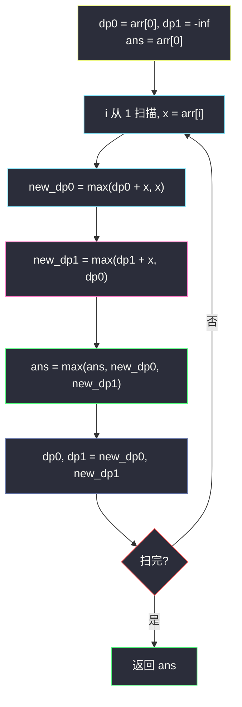

# 1186. 删除一次得到子数组最大和（Maximum Subarray Sum with One Deletion）

> 题目来源：[https://leetcode.cn/problems/maximum-subarray-sum-with-one-deletion/](https://leetcode.cn/problems/maximum-subarray-sum-with-one-deletion/)
>
> 灵茶题单小节定位：§A 线性 DP（最大子数组进阶 / 双状态）

## 一、问题描述

给你一个整数数组，返回它的某个**非空**子数组（连续元素）在执行一次**可选的删除操作**后，所能得到的最大元素总和。换句话说，你可以从原数组中选出一个子数组，并可以决定要不要从中删除一个元素（只能删一次哦），（删除后）子数组中至少应当有一个元素，然后该子数组（剩下）的元素总和是所有子数组之中最大的。

注意，删除一个元素后，子数组**不能为空**。

**数据范围**：

- `1 <= arr.length <= 10⁵`
- `-10⁴ <= arr[i] <= 10⁴`

**示例 1**：

```text
输入：arr = [1,-2,0,3]
输出：4
解释：选出 [1, -2, 0, 3]，删掉 -2，得到 [1, 0, 3]，和最大。
```

**示例 2**：

```text
输入：arr = [1,-2,-2,3]
输出：3
解释：直接选 [3]，这就是最大和（不删）。
```

**示例 3**：

```text
输入：arr = [-1,-1,-1,-1]
输出：-1
解释：不能选 [-1] 再删掉 -1 得到 0——子数组不能为空。
     直接选 [-1]，或选 [-1,-1] 删掉一个 -1。
```

**核心思考点**：经典「最大子数组和」（#53 Kadane）加一层「至多删一个」的自由度。多一个选择就多一个状态：`dp0[i]` = 以 `i` 结尾且**未删**的最大和；`dp1[i]` = 以 `i` 结尾且**已删恰好一个**的最大和。转移时「删掉当前元素」= 左段必须非空地接在当前元素之外——`dp1[i]` 可从 `dp0[i-1]`（删 `arr[i]` 本身）或 `dp1[i-1] + arr[i]`（早已删过，正常续接）转移。两条状态并行滚动即 `O(1)` 空间。

## 二、暴力解法

### 思路

枚举全部子数组 `[l, r]`，再枚举其中要删（或不删）的一个位置，三重循环求最大和。前缀和加速内层求和。

### 代码

```python
def maximumSumBrute(arr: list[int]) -> int:
    n = len(arr)
    pre = [0] * (n + 1)
    for i, x in enumerate(arr):
        pre[i + 1] = pre[i] + x
    ans = -float("inf")
    for l in range(n):
        for r in range(l, n):
            s = pre[r + 1] - pre[l]                 # 不删
            ans = max(ans, s)
            if l < r:                               # 删一个（删后仍非空）
                for d in range(l, r + 1):
                    ans = max(ans, s - arr[d])
    return ans
```

### 复杂度

- 时间：`O(n³)`（`n²` 个子数组 × `O(n)` 枚举删除位）。`n = 10⁵` 完全不可行，小数组对拍用。
- 空间：`O(n)` 前缀和数组。

## 三、优化探索

### 3.1 状态升维：为「删除」加一维 ⭐⭐

Kadane 的单状态 `dp[i] = max(dp[i-1] + arr[i], arr[i])` 只表达「不删」。删一个的选择发生在某个位置 `d`，删完后子数组被 `d` 劈成左右两段——**左右两段各自是普通的最大子数组段**。两种等价视角：

**视角 A（双状态 DP，主解）**：`dp0[i]` 不删、`dp1[i]` 已删一个，都以 `arr[i]` 结尾。关键转移是「删的就是 `arr[i]` 自己」：此时子数组实际是「以 `i-1` 结尾的某段 + 跳过 `arr[i]`」——但子数组的**名义终点**仍是 `i`，故 `dp1[i] = dp0[i-1]`（继承左段，右段为空）。配合「早删续接」`dp1[i-1] + arr[i]`，完整转移：

```text
dp0[i] = max(dp0[i-1] + arr[i], arr[i])
dp1[i] = max(dp1[i-1] + arr[i], dp0[i-1])     # 续接已删段 / 删掉当前位
```

注意 `dp1[i] = dp0[i-1]` 允许「删到只剩前段」，而前段非空由 `dp0` 定义保证——删除后子数组至少一个元素自动成立。

**视角 B（前后缀拼合）**：预处理 `L[i]` = 以 `i` 结尾的最大子数组和、`R[i]` = 以 `i` 开头的最大子数组和；删除位置 `d` 的最优值 = `L[d-1] + R[d+1]`（两段都可空，但至少一段要取——全空即删光，不允许），再与不删的 `max(L)` 合并。doocs 题解即此写法，`O(n)` 时间、`O(n)` 空间，理解「删中间 = 左右两段独立最优」最直观。

### 3.2 初始化的坑：n = 1 与「删光」⭐

`dp1` 在 `i = 0` 处必须为「不可达」——单元素子数组删掉就空了。初始化 `dp1[0] = -inf`（极小哨兵），任何 `max` 都不会选中它；若误初始化为 0，全负数组（示例 3）会错答 0。同理 `dp0[0] = arr[0]`。

### 3.3 答案取法：两个状态都要参选

「不删」的全局最优藏在 `dp0` 的历史最大里，「删一个」的最优藏在 `dp1` 的历史最大里——扫描时对两列都取 `max`。漏掉 `dp0` 会让「不删更好」的用例（示例 2）出错。



## 四、代码实现

### 主解：双状态滚动 DP

```python
class Solution:
    def maximumSum(self, arr: List[int]) -> int:
        # dp0: 以当前元素结尾、未删除的最大和
        # dp1: 以当前元素结尾、恰好删过一个的最大和
        dp0, dp1 = arr[0], float("-inf")
        ans = arr[0]
        for x in arr[1:]:
            dp0, dp1 = max(dp0 + x, x), max(dp1 + x, dp0)
            ans = max(ans, dp0, dp1)
        return ans
```

（Python 的元组赋值天然完成「并行更新」，无需临时变量。）

### 进阶：前后缀分解版（视角 B）

```python
class Solution:
    def maximumSum(self, arr: List[int]) -> int:
        n = len(arr)
        # L[i]: 以 i 结尾的最大子数组和；R[i]: 以 i 开头的最大子数组和
        L = [0] * n
        L[0] = arr[0]
        for i in range(1, n):
            L[i] = max(L[i - 1] + arr[i], arr[i])
        R = [0] * n
        R[n - 1] = arr[n - 1]
        for i in range(n - 2, -1, -1):
            R[i] = max(R[i + 1] + arr[i], arr[i])
        ans = max(L)                              # 不删
        for d in range(1, n - 1):                 # 删中间位 d
            ans = max(ans, L[d - 1] + R[d + 1])
        return ans
```

注意删除位 `d` 的枚举范围是 `[1, n-2]`——头尾位删除等价于缩短子数组，已被 `L`/`R` 的「重新开始」覆盖，无需单独枚举。

### 细节说明

- **`dp1 = max(dp1 + x, dp0)` 的两项**：前者「之前已删过，正常续接」；后者「现在删掉 `x`，继承左段」。`dp0` 不加 `x`——`x` 被删了，子数组的实体终点仍是 `i` 但 `x` 不计入和，这正是「名义终点」与「实际元素」分离的巧妙处。
- **更新用元组并行**：`dp0, dp1 = ..., max(..., dp0)` 里第二式的 `dp0` 必须是**旧值**；若写成两行顺序赋值且先更新 `dp0`，会把新值错接进 `dp1`。C++/Java 需临时变量。
- **全负数**（示例 3）：每轮 `dp0 = x`（负累加更差），`dp1 = max(-inf + x, dp0) = dp0`——「删一个后仍是单元素」被正确表达，`ans` 收敛到 `max(arr)` = -1 ✅。
- **`ans` 初始化为 `arr[0]`** 而非 0：全负时答案为负，不能拿 0 当哨兵。
- **前后缀版的「空段」语义**：`L[d-1] + R[d+1]` 中两项都非空（各自至少含一个元素），不违反「删后非空」。

## 五、例子演示

**示例 1 端到端：arr = [1,-2,0,3]**

| i | x | dp0 = max(dp0+x, x) | dp1 = max(dp1+x, dp0旧) | ans |
|---|---|---|---|---|
| 0 | 1 | 1（初始） | −inf（初始） | 1 |
| 1 | -2 | max(1−2, −2) = **−1** | max(−inf−2, 1) = **1**（删 −2，继承左段） | 1 |
| 2 | 0 | max(−1+0, 0) = **0** | max(1+0, −1) = **1** | 1 |
| 3 | 3 | max(0+3, 3) = **3** | max(1+3, 0) = **4** | **4** ✓ |

`dp1` 终值 4 = 「`[1,-2,0]` 删 −2 得 1」续接 3——对应子数组 `[1,-2,0,3]` 删 `-2` 后的 `[1,0,3]`，和 4 ✅。

**示例 2：arr = [1,-2,-2,3]**

| i | x | dp0 | dp1 | ans |
|---|---|---|---|---|
| 0 | 1 | 1 | −inf | 1 |
| 1 | -2 | −1 | 1 | 1 |
| 2 | -2 | −2（max(−1−2, −2)） | max(1−2, −1) = −1 | 1 |
| 3 | 3 | 3 | max(−1+3, −2) = 2 | **3** ✓ |

最优是不删的 `[3]`——`dp0` 重新起始于 3，任何含负段的组合（`dp1` 路线 1−2=−1、2）都更差。`ans` 取自 `dp0` 列，印证「两列都参选」的必要性。

**示例 3：arr = [-1,-1,-1,-1]**：`dp0` 恒为 −1（负累加被 `x` 重启），`dp1` 恒为 −1（`dp0` 继承），`ans = -1` ✅——「删一个」救不了全负数组。

## 六、复杂度分析

设 `n = len(arr)`：

- **主解时间：`O(n)`**，每轮常数次比较；**空间 `O(1)`**（两个滚动变量）。
- **前后缀版时间：`O(n)`**，三趟线性扫描；**空间 `O(n)`**（两个辅助数组）。

## 七、对比总结

| 维度 | 暴力 | 前后缀分解 | 双状态 DP（主解） |
|---|---|---|---|
| 时间 | `O(n³)` | `O(n)` | `O(n)` |
| 空间 | `O(n)` | `O(n)` | `O(1)` |
| 思维门槛 | 低 | 中（拆两段） | 中（状态设计） |
| 泛化性 | 差 | 删 k 个需 k 维前缀 | 「至多 k 个操作」加状态即可 |

**套路归纳**：**「带一次特殊操作的线性 DP」标准解法就是升状态**——`dp[0/1]` 编码「没用/已用」该操作，转移时交叉引用（`dp1 ← dp0` 表示在此处消耗操作）。本题的细节在于「删除当前元素」时名义终点与实际元素分离：继承 `dp0[i-1]` 而不加 `x`。初始化用 `-inf` 哨兵标记「不可达」，避免 `n = 1` 与全负的陷阱。这个 `0/1` 状态模板可直接搬到「至多交易一次」「至多跳过一个障碍」「至多删 k 个」整族题。

## 八、举一反三

1. **[53. 最大子数组和](https://leetcode.cn/problems/maximum-subarray-sum/)**：本题的零操作基座，Kadane 单状态。
2. **[152. 乘积最大子数组](https://leetcode.cn/problems/maximum-product-subarray/)**：另一类「双状态」（max/min 因为负数翻转），与本题的 `dp0/dp1` 对照刷。
3. **[1746. 经过一次操作后的最大子数组和](https://leetcode.cn/problems/maximum-subarray-sum-after-one-operation/)**：把「删除」换成「平方」——同一双状态模板换转移式即可。
4. **[918. 环形子数组的最大和](https://leetcode.cn/problems/maximum-sum-circular-subarray/)**：最大子数组家族的环形变体（总数 − 最小子数组），前后缀视角的亲戚。
5. **[1567. 乘积为正数的最长子数组长度](https://leetcode.cn/problems/maximum-length-of-subarray-with-positive-product/)**：正/负双状态滚动，状态设计与本题同型。

**同族互引**：灵茶题单线性 DP 的「最大子数组」支线；批 21 的 `k-concatenation-maximum-sum.md`（#1191）与 `sorting-three-groups.md`（本批 #2826）分别在拼接与变形方向上延伸 Kadane 思想。
