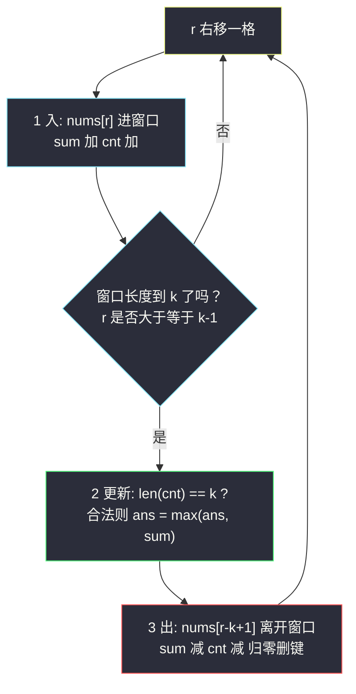
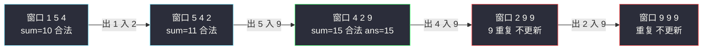

# 长度为 K 的子数组中的最大和（定长滑动窗口 · 入-更新-出）

## 一、问题描述

给定整数数组 `nums` 与整数 `k`，在所有**长度恰为 `k`** 且**元素互不相同**的子数组中找出最大子数组和；不存在这样的子数组则返回 `0`。

> 🔗 LeetCode 2461：https://leetcode.cn/problems/maximum-sum-of-distinct-subarrays-with-length-k/

**示例 1**

```
输入: nums = [1,5,4,2,9,9,9], k = 3
输出: 15
解释: [1,5,4] 和 10；[5,4,2] 和 11；[4,2,9] 和 15；[2,9,9] 与 [9,9,9] 元素重复。
      最大为 15。
```

**示例 2**

```
输入: nums = [4,4,4], k = 3
输出: 0
解释: 唯一的长度 3 子数组 [4,4,4] 元素重复，返回 0。
```

**直观理解**

窗口是一块固定宽度 `k` 的滑尺，从左往右一格一格挪。判「合法」= 窗口内 `k` 个数互不相同；求「最优」= 窗口内和的最大值。两个量都可以**增量维护**，这正是定长滑动窗口的标准舞台。

## 二、暴力解法（入门）

### 直观思路

枚举每个长度为 `k` 的子数组起点 `i`，切出子数组，用 `set` 判重，再求和取最大。

```python
class Solution:
    def maximumSubarraySum(self, nums: List[int], k: int) -> int:
        ans = 0
        for i in range(len(nums) - k + 1):
            sub = nums[i:i + k]
            if len(set(sub)) == k:          # k 个数互不相同
                ans = max(ans, sum(sub))
        return ans
```

### 复杂度

- **时间**：`O(n·k)`——每个窗口重新切、重新数、重新求和。
- **空间**：`O(k)`。

`n` 与 `k` 都到 `10⁵` 时约 `10¹⁰` 次操作，必然超时。

### 🔴 瓶颈在哪里

相邻两个窗口 `nums[i..i+k-1]` 与 `nums[i+1..i+k]` 只差**两个元素**：左边出去一个 `nums[i]`、右边进来一个 `nums[i+k]`。暴力却把中间 `k-1` 个共享元素全部重算了一遍。

## 三、优化探索（核心章节）

> 本题属于 **灵茶题单 · 01-滑动窗口与双指针 · §1.1 基础**（定长滑动窗口）。讲法对齐灵神的定长滑窗三步模板：**入 → 更新 → 出**，一步不少、顺序不乱。

### 3.1 增量维护两个量

用哈希表 `cnt` 维护窗口内每个数的出现次数，用变量 `window_sum` 维护窗口和：

- **进入**：右端 `nums[r]` 进窗口 → `window_sum += nums[r]`，`cnt[nums[r]] += 1`。
- **离开**：左端 `nums[l]` 出窗口 → `window_sum -= nums[l]`，`cnt[nums[l]] -= 1`。
- **判合法**：窗口内 `k` 个数互不相同 ⇔ `len(cnt) == k`。**前提**：计数归零的键必须立刻删除，否则 `len(cnt)` 会虚大。

### 3.2 三步模板：入-更新-出

枚举右端点 `r`（即 `for r in range(n)`），每轮固定做三件事：

1. **入**：把 `nums[r]` 纳入窗口（更新 `window_sum` 与 `cnt`）；
2. **更新**：当窗口长度首次达到 `k`（即 `r ≥ k-1`）时，窗口恰为 `nums[r-k+1..r]`，此刻检查合法并更新答案；
3. **出**：把 `nums[r-k+1]` 移出窗口，窗口缩回 `k-1` 长，为下一轮做准备。



### 3.3 三个常见疑问

- **为什么先更新再出？** 更新答案时窗口必须是完整的长度 `k`；出窗是给**下一轮**准备的收尾，放在更新之后。
- **为什么 `r < k-1` 时直接 `continue`？** 前 `k-1` 轮窗口长度不足 `k`，既不能更新答案，也没有元素可出。
- **`len(cnt) == k` 为什么等价于互不相同？** 窗口恰有 `k` 个元素，哈希表键数（不同元素个数）等于 `k`，意味着每个键计数都是 1。

### 3.4 一句话核心

> **定长窗口三步走——入、更新、出；`len(cnt) == k` 判互异，归零删键别偷懒。**

## 四、代码实现详解

### Python（主解：入-更新-出）

```python
class Solution:
    def maximumSubarraySum(self, nums: List[int], k: int) -> int:
        ans = 0
        window_sum = 0
        cnt = defaultdict(int)                  # 窗口内每个数的出现次数
        for i, x in enumerate(nums):
            # 1. 入：nums[i] 进入窗口
            window_sum += x
            cnt[x] += 1
            if i < k - 1:                       # 窗口长度不足 k
                continue
            # 2. 更新：此刻窗口 = nums[i-k+1 .. i]
            if len(cnt) == k:                   # k 个数互不相同
                ans = max(ans, window_sum)
            # 3. 出：nums[i-k+1] 离开窗口
            out = nums[i - k + 1]
            window_sum -= out
            cnt[out] -= 1
            if cnt[out] == 0:                   # 计数归零必须删键
                del cnt[out]                    # 否则 len(cnt) 虚大
        return ans
```

**变量含义**

| 变量 | 含义 |
|------|------|
| `i` | 窗口右端点（循环变量） |
| `window_sum` | 当前窗口内元素之和 |
| `cnt[x]` | 值 `x` 在当前窗口内的出现次数 |
| `len(cnt)` | 窗口内**不同**元素的个数 |
| `nums[i-k+1]` | 即将出窗口的左端元素 |

**循环不变式**：第 `i` 轮执行到「2 更新」时，窗口恰为 `nums[i-k+1..i]`，`window_sum` 与 `cnt` 与之严格对应；执行完「3 出」后，窗口为 `nums[i-k+2..i]`（长度 `k-1`），等待下一轮入窗补齐。

### Java（最优解同款）

```java
class Solution {
    public long maximumSubarraySum(int[] nums, int k) {
        long ans = 0, sum = 0;                  // 和最大 1e5 * 1e5 = 1e10，必须 long
        Map<Integer, Integer> cnt = new HashMap<>();
        for (int i = 0; i < nums.length; i++) {
            sum += nums[i];                     // 1. 入
            cnt.merge(nums[i], 1, Integer::sum);
            if (i < k - 1) continue;
            if (cnt.size() == k) {              // 2. 更新
                ans = Math.max(ans, sum);
            }
            int out = nums[i - k + 1];          // 3. 出
            sum -= out;
            int c = cnt.get(out) - 1;
            if (c == 0) cnt.remove(out);        // 归零删键
            else cnt.put(out, c);
        }
        return ans;
    }
}
```

## 五、具体例子演示

**示例 1**：`nums = [1,5,4,2,9,9,9]`，`k = 3`。逐轮跟踪（窗口用 `[l, r]` 表示）：

| i | 入（x） | 窗口 [l, r] | window_sum | len(cnt) | 更新 ans | 出 | 出后窗口 |
|---|---------|-------------|------------|----------|----------|-----|----------|
| 0 | 1 | [0,0] `1` | 1 | 1 | （不足 k，跳过） | — | `1` |
| 1 | 5 | [0,1] `1 5` | 6 | 2 | （不足 k，跳过） | — | `1 5` |
| 2 | 4 | [0,2] `1 5 4` | 10 | 3 | 合法，ans = **10** | 出 1 | `5 4` |
| 3 | 2 | [1,3] `5 4 2` | 11 | 3 | 合法，ans = **11** | 出 5 | `4 2` |
| 4 | 9 | [2,4] `4 2 9` | 15 | 3 | 合法，ans = **15** | 出 4 | `2 9` |
| 5 | 9 | [3,5] `2 9 9` | 20 | 2 | 9 重复，不更新 | 出 2 | `9 9` |
| 6 | 9 | [4,6] `9 9 9` | 27 | 1 | 重复，不更新 | 出 9 | `9 9` |

最终答案 `15`。注意 i=5、i=6 两轮：`window_sum` 反而更大，但 `len(cnt) < k`（键 `9` 的计数是 2、3），判非法跳过——这正是「归零删键」之外另一个计数陷阱的体现：**只看计数不看键数会误判合法**。



## 六、复杂度分析

| 方法 | 时间 | 空间 | 说明 |
|------|------|------|------|
| 暴力枚举起点 | `O(n·k)` | `O(k)` | 每窗口重算 |
| 定长滑窗（主解） | `O(n)` | `O(k)` | 每元素进窗一次、出窗一次，哈希操作均摊 `O(1)` |

空间 `O(k)`：窗口内不同元素至多 `k` 个。

## 七、方法对比与总结

| | 暴力 | 定长滑窗（主解） |
|--|------|------------------|
| 窗口和 | 每次重求 | 增量加减 |
| 判互异 | 每次重建 set | 增量计数 + 键数判断 |
| 时间 | `O(n·k)` | `O(n)` |

**易错点**

1. **顺序错误**：把「出」放在「更新」之前，会导致答案检查的是长度 `k-1` 的残缺窗口。
2. **归零不删键**：`cnt[out]` 减到 0 若不 `del`，`len(cnt)` 会把已消失的元素也数进去，`len(cnt) == k` 判定失真。
3. **i < k-1 的守卫**：前 `k-1` 轮没有出窗动作，漏掉 `continue` 会下标越界（或逻辑错乱）。
4. **Java 溢出**：窗口和最大约 `10¹⁰`，`int` 存不下，必须 `long`（Python 无此问题）。
5. **ans 初值 0**：不存在合法子数组时按题意返回 0，恰好被初值覆盖。

**模板（定长滑动窗口 · 灵神 §1.1 三步走）**

```python
# for i, x in enumerate(nums):
#     1) 入: sum += x; cnt[x] += 1
#     if i < k - 1: continue
#     2) 更新: if len(cnt) == k: ans = max(ans, sum)
#     3) 出: out = nums[i-k+1]; sum -= out; cnt[out] -= 1; 归零删键
```

## 八、举一反三

| 题目 | 关系 |
|------|------|
| [1456. 定长子串中元音的最大数目](https://leetcode.cn/problems/maximum-number-of-vowels-in-a-substring-of-given-length/) | 灵神 §1.1 入门第一题，同骨架 |
| [567. 字符串的排列](https://leetcode.cn/problems/permutation-in-string/) | 定长窗口 + 计数比对 |
| [2134. 最少交换次数来组合所有的 1](https://leetcode.cn/problems/minimum-swaps-to-group-all-1s-together/) | 环上定长窗口 |
| [1423. 可获得的最大点数](https://leetcode.cn/problems/maximum-points-you-can-obtain-from-cards/) | 反向转化：两端取 k 张 = 中间长 `n-k` 的窗口求最短和 |

**思想迁移**

- 「子数组**长度固定**」→ 无脑定长滑窗，三步「入-更新-出」默写出来就是满分模板。
- 「互不相同 / 恰好 k 种」类条件用「哈希计数 + 键数（或满足计数键数）」判定，出窗归零记得删键。
- Java 记得给和上 `long`：窗口和、前缀和是最常见的溢出点。
- 同批姊妹篇：`adjacent-increasing-subarrays-detection-ii.md`、`push-dominoes.md`、`count-valid-word-occurrences.md`（分组循环家族，与滑窗同为线性扫描三板斧）。
