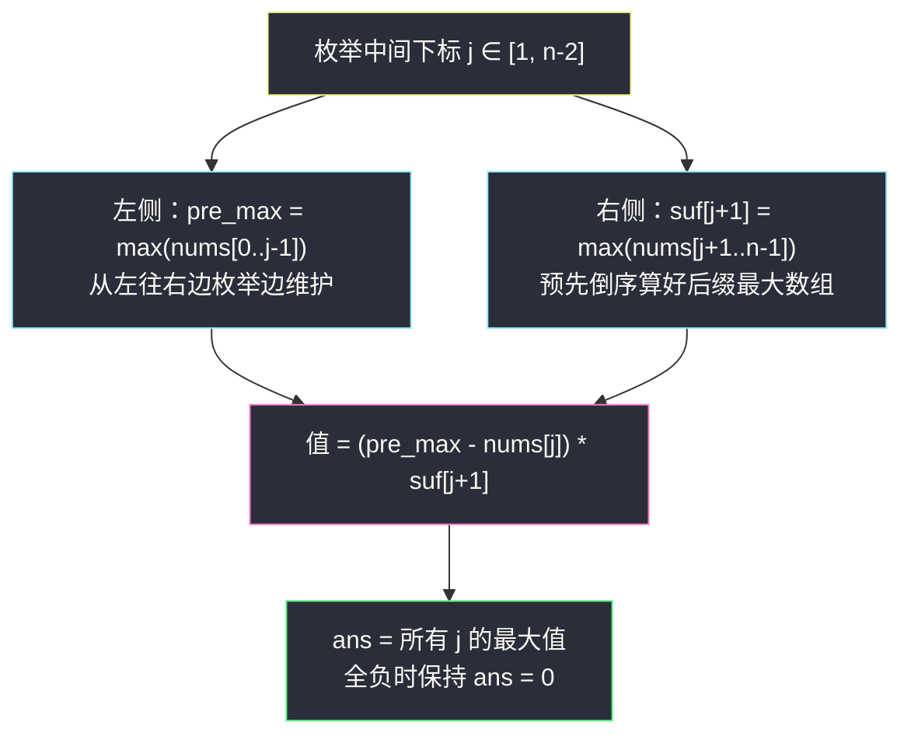
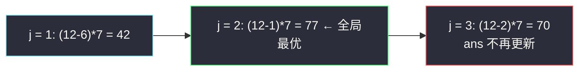

# 有序三元组中的最大值 II（枚举中间 · 前后缀最大值）

## 一、问题描述

给你一个下标从 0 开始的整数数组 `nums`。请你从所有满足 `0 <= i < j < k <= n - 1` 的下标三元组 `(i, j, k)` 中，找出并返回下标三元组**值**最大的那个值。

三元组的值定义为 `(nums[i] - nums[j]) * nums[k]`。

若所有三元组的值都为负数，则返回 `0`；`n >= 3` 时三元组必然存在，不会用到「返回 -1」的兜底条款。

> 🔗 LeetCode 2874：https://leetcode.cn/problems/maximum-value-of-an-ordered-triplet-ii/
>
> 数据范围：`3 <= nums.length <= 10^5`，`1 <= nums[i] <= 10^6`。
>
> 本题与 [#2873 有序三元组中的最大值 I](https://leetcode.cn/problems/maximum-value-of-an-ordered-triplet-i/) 题面完全相同，只是数据范围从 `n <= 100` 放大到 `10^5`——O(n²) 的做法在 I 能过、在 II 会被卡掉，逼你写出线性解。

**示例 1**

```
输入：nums = [12,6,1,2,7]
输出：77
解释：选 (i, j, k) = (0, 2, 4)，值为 (12 - 1) * 7 = 77，
不存在比 77 更大的有序下标三元组。
```

**示例 2**

```
输入：nums = [1,2,3]
输出：0
解释：唯一的三元组 (0, 1, 2) 的值为 (1 - 2) * 3 = -3 < 0，
所有三元组的值均为负，返回 0。
```

**直观理解**

三个下标有严格的先后顺序：`i` 在左边出「被减数」，`j` 在中间出「减数」，`k` 在右边出「乘数」。直觉上：**中间的 j 一旦固定，左边的 nums[i] 越大越好，右边的 nums[k] 越大越好**，两侧的最优选择互不干扰。这种「固定中间、两侧取聚合最值」的形态，正是灵茶题单里「枚举中间」模板的标志。

---

## 二、暴力解法

三重循环枚举 `(i, j, k)`，对每个合法组合计算 `(nums[i] - nums[j]) * nums[k]`，取最大。

```python
class Solution:
    def maximumTripletValue(self, nums: List[int]) -> int:
        n, ans = len(nums), 0
        for i in range(n):
            for j in range(i + 1, n):
                for k in range(j + 1, n):
                    ans = max(ans, (nums[i] - nums[j]) * nums[k])
        return ans
```

### 复杂度

- **时间**：`O(n³)`。
- **空间**：`O(1)`。

### 🔴 瓶颈在哪里

`n = 10^5` 时循环次数约 `n³/6 ≈ 1.7 * 10^14`，完全不可行。即使优化成枚举 `i, j` 后用 O(1) 拿「j 之后最大值」（预处理后缀最大），也还有 `O(n²) ≈ 10^10` 次，同样超时。必须把「选三元组」拆成只扫一遍的结构。

---

## 三、优化探索（核心章节）

> 📚 本题在灵茶题单中属于 **§0.2 枚举中间**：当「三元组/三段式结构」的最优解由左、中、右三部分贡献相乘（相加）时，枚举中间元素 j，同时维护左侧聚合信息（前缀最大）与右侧聚合信息（后缀最大），把三重循环压成单重。

### 3.1 结构观察：j 固定后两侧解耦

固定中间下标 `j`，值为：

`(nums[i] - nums[j]) * nums[k]`，其中 `i < j < k`。

关键事实：`nums[k] >= 1 > 0`，所以这个值关于 `nums[i]` 严格单调递增、关于 `nums[k]` 也严格单调递增。于是对固定的 `j`：

- 最优的 `i` 是 `max(nums[0..j-1])`（记作 `left_max`）；
- 最优的 `k` 是 `max(nums[j+1..n-1])`（记作 `right_max`）。

两侧互不影响——这就是「枚举中间」可行的前提：**中间元素把左右两边的自由度隔离了**。

### 3.2 两个方向的聚合：前缀最大 + 后缀最大

| 聚合量 | 定义 | 求法 |
|--------|------|------|
| 前缀最大 | `pre_max(j) = max(nums[0..j-1])` | 从左往右扫，一边枚举 `j` 一边更新，O(1) 摊还 |
| 后缀最大 | `suf(k) = max(nums[k..n-1])` | 从右往左扫一遍预处理成数组，或倒序递推 |

枚举 `j ∈ [1, n-2]`，答案为：

`max over j of (pre_max(j) - nums[j]) * suf(j + 1)`



### 3.3 再进一步：一次遍历 O(1) 空间

后缀数组其实也能省掉：换一个视角，**枚举右端点 k**（灵神 §0.1「枚举右、维护左」的变体），同时维护两个左信息：

- `pre_max`：`k` 之前出现过的最大 `nums[i]`；
- `max_diff`：`k` 之前所有 `i < j` 对中 `(nums[i] - nums[j])` 的最大值。

扫到 `k` 时先用 `max_diff * nums[k]` 更新答案，再让 `nums[k]` 以 `j` 的身份去更新 `max_diff`、以 `i` 的身份去更新 `pre_max`。这样空间降到 `O(1)`。

### 3.4 一句话核心

> **三段式 (左) − (中) × (右) 的最值：枚举中间 j，左侧取前缀最大、右侧取后缀最大，三重循环塌缩成 O(n) 单重循环。**

---

## 四、代码实现

### Python 主解：枚举 j + 后缀最大数组（结构最清晰）

```python
class Solution:
    def maximumTripletValue(self, nums: List[int]) -> int:
        n = len(nums)
        suf = [0] * (n + 1)              # suf[k] = max(nums[k..n-1])，suf[n] 哨兵 0
        for k in range(n - 1, -1, -1):
            suf[k] = max(suf[k + 1], nums[k])

        ans = 0
        pre_max = nums[0]                # max(nums[0..j-1])，j 从 1 开始
        for j in range(1, n - 1):
            ans = max(ans, (pre_max - nums[j]) * suf[j + 1])
            pre_max = max(pre_max, nums[j])   # nums[j] 加入左侧，供下一个 j 使用
        return ans
```

**变量含义**

| 变量 | 含义 |
|------|------|
| `suf[k]` | `nums[k..n-1]` 的最大值（后缀最大） |
| `pre_max` | 进入本轮循环时 `nums[0..j-1]` 的最大值（前缀最大） |
| `ans` | 全局最大值，初始 0：全负时按题意返回 0 |

**循环不变式**：处理 `j` 之前，`pre_max` 恰好等于 `max(nums[0..j-1])`；`suf[j+1]` 恰好等于 `max(nums[j+1..n-1])`。

### Python 进阶：枚举 k，O(1) 空间

```python
class Solution:
    def maximumTripletValue(self, nums: List[int]) -> int:
        ans = 0
        pre_max = nums[0]     # max(nums[0..t])，t 为已扫过的位置
        max_diff = 0          # max(nums[i] - nums[j])，其中 i < j <= t
        for k in range(1, len(nums)):
            x = nums[k]
            if max_diff > 0:                        # 负差不可能是答案（nums[k] > 0）
                ans = max(ans, max_diff * x)
            max_diff = max(max_diff, pre_max - x)   # x 以 j 的身份入列
            pre_max = max(pre_max, x)               # x 再以 i 的身份入列
        return ans
```

### Java（后缀数组版）

```java
// 有序三元组中的最大值 II
// 测试链接 : https://leetcode.cn/problems/maximum-value-of-an-ordered-triplet-ii/
class Solution {
    public long maximumTripletValue(int[] nums) {
        int n = nums.length;
        int[] suf = new int[n + 1];
        for (int k = n - 1; k >= 0; k--) {
            suf[k] = Math.max(suf[k + 1], nums[k]);
        }
        long ans = 0;
        int preMax = nums[0];
        for (int j = 1; j < n - 1; j++) {
            ans = Math.max(ans, (long) (preMax - nums[j]) * suf[j + 1]);   // 注意转 long
            preMax = Math.max(preMax, nums[j]);
        }
        return ans;
    }
}
```

> ⚠️ 溢出提醒：`nums[i] <= 10^6`，乘积上界 `(10^6) * (10^6) = 10^12`，超出 `int` 范围，Java 必须先转 `long` 再乘；Python 无此问题。

---

## 五、具体例子演示

以 `nums = [12,6,1,2,7]` 端到端走一遍。

**第一步：倒序构建后缀最大数组 `suf`**

| k（从右往左） | nums[k] | suf[k] = max(suf[k+1], nums[k]) |
|----|----|----|
| 4 | 7 | max(0, 7) = 7 |
| 3 | 2 | max(7, 2) = 7 |
| 2 | 1 | max(7, 1) = 7 |
| 1 | 6 | max(7, 6) = 7 |
| 0 | 12 | max(7, 12) = 12 |

**第二步：从左往右枚举中间 j**

| j | pre_max（先读） | nums[j] | suf[j+1] | (pre_max − nums[j]) * suf[j+1] | ans |
|---|----|----|----|----|----|
| 1 | 12 | 6 | 7 | (12−6)*7 = 42 | 42 |
| 2 | 12 | 1 | 7 | (12−1)*7 = **77** | **77** |
| 3 | 12 | 2 | 7 | (12−2)*7 = 70 | 77 |

（每轮读完 `pre_max` 后执行 `pre_max = max(pre_max, nums[j])`，本例中 `12` 一直是前缀最大，所以没变化。）

输出 `77` ✓，对应三元组 `(i, j, k) = (0, 2, 4)`。

**再看示例 2 的全负边界**：`nums = [1,2,3]`。`suf = [3, 3, 3, 0]`。枚举 `j = 1`：`pre_max = 1`，值 `(1-2)*3 = -3 < 0`，`max(0, -3)` 仍是 0，返回 `0` ✓——这就是 `ans` 初始化为 0 而不是负无穷的原因。



---

## 六、复杂度分析

| 方法 | 时间 | 空间 | 说明 |
|------|------|------|------|
| 暴力三重循环 | `O(n³)` | `O(1)` | n = 100（#2873）勉强能过 |
| 枚举 i,j + 后缀最大 | `O(n²)` | `O(n)` | 仍超时 |
| 枚举 j + 前后缀最大（本篇主解） | `O(n)` | `O(n)` | 后缀数组占空间 |
| 枚举 k + 维护 max_diff | `O(n)` | `O(1)` | 一趟扫完，空间最优 |

---

## 七、对比总结

**「枚举中间」模板**

1. 识别三段式结构：答案由「左聚合量 op 中间元素 op 右聚合量」组成；
2. 枚举中间下标 `j ∈ [1, n-2]`；
3. 左聚合量（前缀最大/和/计数）边枚举边维护；右聚合量（后缀最大/和）预处理成数组；
4. 每个j 用 O(1) 合成候选答案。

**易错点**

1. `ans` 初始值取 0 而非极小值——题面约定全负返回 0（示例 2 佐证）。
2. Java 乘法先转 `long`，`10^6 * 10^6` 溢出 `int`。
3. `pre_max` 要「先用于计算、后更新」；顺序写反会把 `nums[j]` 自己也算进左侧（`i < j` 被破坏）。
4. `j` 的范围是 `[1, n-2]`：两边至少要各留一个位置。

**模板（枚举中间，Python 版）**

```python
# 预处理右侧
suf = [0] * (n + 1)
for k in range(n - 1, -1, -1):
    suf[k] = max(suf[k + 1], nums[k])
# 枚举中间
ans, pre_max = 0, nums[0]
for j in range(1, n - 1):
    ans = max(ans, (pre_max - nums[j]) * suf[j + 1])
    pre_max = max(pre_max, nums[j])
```

---

## 八、举一反三

| 题目 | 关系 |
|------|------|
| [2873. 有序三元组中的最大值 I](https://leetcode.cn/problems/maximum-value-of-an-ordered-triplet-i/) | 同题面小范围版，先用它验证思路再来做 II |
| [1014. 最佳观光组合](https://leetcode.cn/problems/best-sightseeing-pair/) | 二元版枚举中间：得分 = (nums[i] + i) + (nums[j] − j)，枚举 j 维护左侧最大 |
| [42. 接雨水](https://leetcode.cn/problems/trapping-rain-water/) | 每根柱子是「中间」，能接的水由左侧最大与右侧最大决定，同一枚举思想 |
| [2100. 适合打劫银行的日子](https://leetcode.cn/problems/find-good-days-to-rob-the-bank/) | 枚举中间下标 i，用前后缀数组判定左右两侧是否各自连续递减/递增 |
| [121. 买卖股票的最佳时机](https://leetcode.cn/problems/best-time-to-buy-and-sell-stock/) | 枚举卖出日（中间），维护左侧最小买入价，是本题的减法镜像 |

**思想迁移**

- 看到「`i < j < k` 三元组」且三个位置的贡献**形式分离**，先问：固定中间 j 后，左右两侧是否各自独立取最值？是 → 枚举中间 + 前后缀聚合。
- 若只能用一侧信息（如 `i < j`），退化为灵神 §0.1「枚举右、维护左」单侧模板。
- 口诀：**「三元看中间，两侧聚合先；左边扫着记，右边数组算。」**

---
