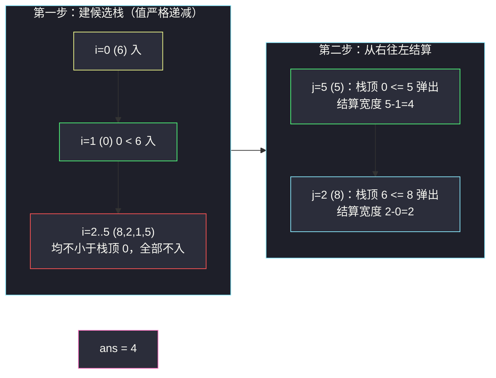

# 最大宽度坡（单调栈 · 递减候选栈 + 从右往左结算）

## 一、问题描述

给定一个整数数组 `nums`，**坡**是一对下标 `(i, j)`，满足 `i < j` 且 `nums[i] <= nums[j]`。坡的**宽度**是 `j - i`。

返回 `nums` 中坡的**最大宽度**；如果不存在坡，返回 `0`。

> 🔗 LeetCode 962：https://leetcode.cn/problems/maximum-width-ramp/
>
> 数据范围：`2 <= n <= 5 * 10^4`，`0 <= nums[i] <= 5 * 10^4`。

**示例**

```
输入：nums = [6,0,8,2,1,5]           输出：4
解释：最大宽度坡为 (i=1, j=5)：nums[1]=0 <= nums[5]=5，宽度 5-1=4。

输入：nums = [9,8,1,0,1,9,4,0,4,1]   输出：7
解释：最大宽度坡为 (i=2, j=9)：nums[2]=1 <= nums[9]=1，宽度 9-2=7。
```

**直观理解**

要「左小右大」且**离得越远越好**。左边挑尽量靠左的小值、右边挑尽量靠右的大值——两边都在「挑极值」，而「挑极值 + 保留候选」正是单调栈的招牌场景（灵茶题单 **§1.2 进阶**）。

---

## 二、暴力解法

枚举所有 `(i, j)` 对，检查 `nums[i] <= nums[j]` 并取最大宽度：

```python
class Solution:
    def maxWidthRamp(self, nums: List[int]) -> int:
        n = len(nums)
        ans = 0
        for i in range(n):
            for j in range(i + 1, n):
                if nums[i] <= nums[j]:
                    ans = max(ans, j - i)
        return ans
```

### 复杂度

- **时间**：`O(n^2)`，`n = 5 * 10^4` 时约 `2.5 * 10^9` 次比较，超时。
- **空间**：`O(1)`。

### 🔴 瓶颈在哪里

无序数组里配对极值只能两两枚举。但注意：答案只关心「每个 `i` 能配到的**最右** `j`」和「每个 `j` 能配到的**最左** `i`」——绝大多数中间组合是无用的。要砍掉无用的候选，需要先回答：**哪些 `i` 根本不可能是最优左端点？**

---

## 三、优化探索（核心章节）

> 📚 本题在灵茶题单中属于 **§1.2 单调栈进阶**。灵神模板要点：**栈存下标（值从栈底到栈顶递减）作为候选左端点，再从右往左扫 `j`，配得上就弹栈结算**——右端点从右往左只扫一遍，每个左端点只在「第一次配上的最大 `j`」处结算一次。

### 3.1 关键观察一：候选左端点只需「前缀严格新低」

若 `i1 < i2` 且 `nums[i1] <= nums[i2]`，则 `i2` 永远不可能比 `i1` 更优：任何能和 `i2` 配对的 `j`（`nums[i2] <= nums[j]`），由于 `nums[i1] <= nums[i2] <= nums[j]`，也必然能和 `i1` 配对，且宽度 `j - i1 > j - i2`。

**结论**：只有「从左往右走时严格创下新低」的位置才值得当候选左端点。从左往右扫一遍，只在新元素**严格小于**栈顶时入栈，栈内值天然严格递减：



### 3.2 关键观察二：右端点必须从右往左扫，且「配一次就弹」

栈内候选 `i` 的值**递减**（栈顶值最大、下标最小……不对——栈底 `i` 最小、值最大；栈顶 `i` 最大、值最小）。从右往左扫 `j = n-1, n-2, ...`：

- 若栈顶 `t` 满足 `nums[t] <= nums[j]`：这是 `t` **能配到的最右 `j`**（`j` 只会越来越小），宽度 `j - t` 已是 `t` 的最优解，**结算后弹出**，永不再看；
- 若栈顶 `t` 满足 `nums[t] > nums[j]`：栈内所有候选（值都 ≥ 栈顶……栈从底到顶值递减，栈下面的值更大）都 `> nums[j]`，**谁也配不上这个 `j`**，直接 `j` 左移。

第二个分支的「一刀切」依赖栈的单调性：栈顶配不上的元素，栈底更配不上（值更大）。所以每个 `j` 只需和栈顶比一次，配得上就连续弹到底。两个方向的扫描配合，每个下标进栈一次、出栈至多一次。

### 3.3 为什么这样是完备的（不漏最优解）

设最优坡为 `(i*, j*)`。`i*` 若不是前缀新低，则存在更靠左且值 ≤ 它的位置（3.1 的淘汰论证），那个位置也在栈中且给出不劣的答案——矛盾；故 `i*` 必在栈中。当 `j` 扫到 `j*`（或更右的、恰好也能配 `i*` 的 `j`——若 `i*` 更早被弹出，说明弹出时结算的 `j' > j*`……综合两种情形，`i*` 被弹出时结算的宽度 `>= j* - i*`）✓。不重不漏。

### 3.4 统一模板（单向一遍 + 反向一遍）

```
第一遍（左→右）：只有 nums[i] 严格小于栈顶值时入栈 → 候选栈，值严格递减
第二遍（右→左）：
    while 栈非空 且 nums[st[-1]] <= nums[j]:
        ans = max(ans, j - st.pop())    # 结算后弹掉，右端点只配一次
```

和「右侧第一个更大元素」（#739 每日温度，见 `online-stock-span.md`）对照：那题从左往右一遍、新元素入栈前弹栈结算；本题因为要**最大化 j - i**，右端点必须从右往左「先到先得」——同一套单调栈，扫描方向服务于目标（最大宽度 → 让 j 尽量大 → 从最大可能的 j 开始试）。

### 3.5 反例检验：为什么第二遍不能从左往右？

有人会想：第二遍也从左往右扫 `j`，遇到 `nums[st[-1]] <= nums[j]` 就结算弹栈，行不行？反例 `nums = [6,0,8,2,1,5]`：`j=2 (8)` 时弹掉栈里的 `1:0`（0 <= 8）结算宽度 `2-1=1`；但 `0` 真正能配到的最右 `j` 是 5（`0 <= 5`），宽度本可以是 4。**左往右扫无法预知右侧还有更大的 `j`**，提前结算就把候选浪费在了次优右端点上。而 `i` 想要配「最右的可行 `j`」，等价于 `j` 想要配「最左的可行 `i`」——两个方向必选其一，从右往左扫 `j` 才能保证每个候选第一次被配上时就是它的最大宽度。

### 3.6 替代解法：排序 + 前缀最小下标（O(n log n)）

本题还有一条不依赖单调栈的路：把下标按**值从小到大**排序，依次处理。每个元素 `x` 的最优左端点候选，是「值不大于它的所有已处理元素」中**最小的下标**——维护一个前缀最小下标 `mn` 即可：

```python
class Solution:
    def maxWidthRamp(self, nums: List[int]) -> int:
        idx = sorted(range(len(nums)), key=lambda i: nums[i])
        ans, mn = 0, len(nums)          # mn：已处理下标的最小值
        for i in idx:
            ans = max(ans, i - mn)
            mn = min(mn, i)
        return ans
```

正确性：值小的先处理，轮到 `x` 时 `mn` 恰是「值 <= nums[x] 的前缀」的最左下标（排序稳定处理相等值即可，无需分批）。它多付一次 `O(n log n)` 排序，换来「一行维护、无栈」的简洁；单调栈解法是严格 `O(n)`。两种做法值得都过一遍手——面试里先给排序版再优化到单调栈版，是标准的渐进展示路径。

### 3.7 一句话核心

> **候选 `i` 只留前缀严格新低（递减栈），`j` 从右往左扫：配得上就弹栈结算 `j - i`——右端点只配一次最大宽度。**

---

## 四、代码实现

### Python（主解：递减候选栈 + 反向结算）

```python
class Solution:
    def maxWidthRamp(self, nums: List[int]) -> int:
        n = len(nums)
        st = []                                  # 候选左端点下标，值严格递减
        for i, x in enumerate(nums):
            if not st or nums[st[-1]] > x:       # 只有严格更小才入栈
                st.append(i)

        ans = 0
        for j in range(n - 1, -1, -1):           # 右端点从右往左
            while st and nums[st[-1]] <= nums[j]:
                ans = max(ans, j - st.pop())     # 结算后弹出，永不再用
        return ans
```

**变量含义**

| 变量 | 含义 |
|------|------|
| `st` | 候选左端点下标栈；`st` 从底到顶下标递增、值严格递减 |
| `nums[st[-1]] <= nums[j]` | 栈顶候选能被当前 `j` 「盖住」（成坡条件） |
| `j - st.pop()` | 以被弹候选为左端、当前 `j` 为右端的坡宽（已是该候选的最优） |

### Java（最优解同款写法）

```java
class Solution {
    public int maxWidthRamp(int[] nums) {
        int n = nums.length;
        Deque<Integer> st = new ArrayDeque<>();
        for (int i = 0; i < n; i++) {
            if (st.isEmpty() || nums[st.peek()] > nums[i]) {
                st.push(i);
            }
        }
        int ans = 0;
        for (int j = n - 1; j >= 0; j--) {
            while (!st.isEmpty() && nums[st.peek()] <= nums[j]) {
                ans = Math.max(ans, j - st.pop());
            }
        }
        return ans;
    }
}
```

---

## 五、具体例子演示

以示例 1 端到端走一遍：`nums = [6,0,8,2,1,5]`。

**第一步：建候选栈（左→右，严格递减才入）**

| i | nums[i] | 栈顶（入栈前） | 是否入栈 | 栈（底→顶，`下标:值`） |
|---|---------|----------------|----------|------------------------|
| 0 | 6 | 空 | ✓ | `0:6` |
| 1 | 0 | `0:6`，0 < 6 | ✓ | `0:6 1:0` |
| 2 | 8 | `1:0`，8 > 0 | ✗ | `0:6 1:0` |
| 3 | 2 | `1:0`，2 > 0 | ✗ | `0:6 1:0` |
| 4 | 1 | `1:0`，1 > 0 | ✗ | `0:6 1:0` |
| 5 | 5 | `1:0`，5 > 0 | ✗ | `0:6 1:0` |

**第二步：从右往左结算**

| j | nums[j] | 弹栈过程 | 结算宽度 | ans | 栈（结算后） |
|---|---------|----------|----------|-----|--------------|
| 5 | 5 | 栈顶 `1:0`，0 ≤ 5 → 弹出 | 5-1 = **4** | 4 | `0:6` |
|   |   | 栈顶 `0:6`，6 ≤ 5? ✗ 停 | — | 4 | `0:6` |
| 4 | 1 | `0:6`，6 ≤ 1? ✗ | — | 4 | `0:6` |
| 3 | 2 | `0:6`，6 ≤ 2? ✗ | — | 4 | `0:6` |
| 2 | 8 | `0:6`，6 ≤ 8 → 弹出 | 2-0 = 2 | 4 | 空 |
| 1 | 0 | 栈空 | — | 4 | 空 |
| 0 | 6 | 栈空 | — | 4 | 空 |

输出 `4` ✓（最优坡 `(1, 5)`）。

回顾两遍扫描各自维护的不变量：第一遍结束时栈内值严格递减（栈底值最大、下标最小）；第二遍每弹一个就结算一个、栈只减不增——两个不变量合起来保证「每个候选只在它的最大宽度处被消费一次」。

**示例 2 完整演示** `nums = [9,8,1,0,1,9,4,0,4,1]`（n = 10）：

第一遍建栈（严格递减才入）：`0:9 → 1:8 → 2:1 → 3:0`；`i=4 (1)` 起后面的 `1,9,4,0,4,1` 都不小于栈顶 `0`，全部不入。候选栈 = `0:9 1:8 2:1 3:0`。

第二遍从右往左：

| j | nums[j] | 弹栈结算 | 宽度 | ans | 栈（结算后） |
|---|---------|----------|------|-----|--------------|
| 9 | 1 | `3:0`：0 ≤ 1 ✓ 弹 | 9-3 = 6 | 6 | `0:9 1:8 2:1` |
|   |   | `2:1`：1 ≤ 1 ✓ 弹（**相等也算坡**） | 9-2 = **7** | 7 | `0:9 1:8` |
|   |   | `1:8`：8 ≤ 1 ✗ 停 | — | 7 | `0:9 1:8` |
| 8 | 4 | 8 ≤ 4 ✗ | — | 7 | `0:9 1:8` |
| 7 | 0 | 8 ≤ 0 ✗ | — | 7 | `0:9 1:8` |
| 6 | 4 | 8 ≤ 4 ✗ | — | 7 | `0:9 1:8` |
| 5 | 9 | `1:8`：8 ≤ 9 ✓ 弹 | 5-1 = 4 | 7 | `0:9` |
|   |   | `0:9`：9 ≤ 9 ✓ 弹 | 5-0 = 5 | 7 | 空 |
| 4..0 | — | 栈空 | — | 7 | 空 |

输出 `7` ✓（最优坡 `(2, 9)`）。注意两个细节：`j=9` 处 `1 <= 1` 相等成坡；`j=5` 把两个候选一次弹光——**配一个弹一个，露出的下一个候选立刻接着试**。

**边界**：`nums = [5,4]` → 候选栈 `0:5 1:4`；`j=1 (4)`：栈顶 `1:4`，4 ≤ 4 ✓（相等也算坡）弹结算 `1-1=0`；栈顶 `0:5`，5 ≤ 4 ✗ 停。`j=0 (5)`：`0:5`，5 ≤ 5 ✓ 弹结算 `0-0=0`。答案 `0` ✓（无坡）。

再留意一个不变量：**结算时恒有 `j >= t`（宽度非负）**。栈内候选都是前缀严格新低，它左侧的任何位置值都更大；若 `j` 扫到候选 `t` 的左边（`j < t`），则位置 `t-1` 的值 `> nums[t]`，扫到 `j'=t-1` 时 `t` 早就被弹出了一一不会等到负宽度出现，无需对 `max` 兜底做任何特判。

---

## 六、复杂度分析

| 方法 | 时间 | 空间 |
|------|------|------|
| 暴力枚举 | `O(n^2) ≈ 2.5 * 10^9`，超时 | `O(1)` |
| 递减候选栈 + 反向结算 | `O(n)`（每下标入栈/出栈至多各一次） | `O(n)`（最坏严格递减数组全进栈） |
| 排序 + 前缀最小下标（3.6 节） | `O(n log n)` | `O(n)`（排序下标数组） |

两遍循环嵌套着 `while`，但**弹栈总次数 ≤ 入栈总次数 ≤ n**，摊还到每个 `j` 上均摊 `O(1)`。

排序解法（3.6 节）的时间大头是 `sorted` 的 `O(n log n)`：`n = 5 * 10^4` 时约 `8 * 10^5` 次比较，同样轻松——但单调栈版连这层 `log` 都省了，且不需要辅助排序数组打乱下标语义。

---

## 七、对比总结

**单调栈家族里本题的位置**：

| 题 | 栈存什么 | 何时结算 | 与本题的关系 |
|----|----------|----------|--------------|
| #901 股票价格跨度 | `(价格, 跨度)`，值递减 | 新元素弹栈瞬间 | 同为「左第一个更大」，本题是坡的宽度版 |
| #962 本篇 | 候选左端点下标，值严格递减 | 右端点从右往左配对瞬间 | —— |
| #3676 碗子数组的数目 | 下标，值递减 | 弹栈瞬间 + 入栈前各结算一次 | 同小节（§1.2），见 `count-bowl-subarrays.md` |

**两种解法怎么选**：单调栈版严格 `O(n)`、无排序扰动原顺序，是面试的首选主解；排序版思路直白（「值小的先到岗，维护最左哨位」），适合作为引出单调栈的铺垫或备胎。数据量大到排序都嫌慢（如 `n > 10^7` 的流式输入）时，单调栈还能在线处理，排序版做不到。

**易错点**

1. **入栈条件必须是严格小于**（`nums[st[-1]] > x` 才入）：相等值留下的旧下标更靠左、宽度更大，新的等值下标是废候选。若写成 `>=` 入栈，栈不再严格递减，第二遍「栈顶配不上则全配不上」的一刀切失效。
2. **右端点必须从右往左**：从左往右扫 `j` 时无法判断「当前 `j` 是否已是某候选的最右可配点」（右边的 `j` 还没见过），会漏解或退化为 `O(n^2)`。
3. **弹栈即结算、结算即弹栈**：右端点只配一次最大宽度；不弹会重复比较，弹了还能让更深的候选露出来继续配。
4. 相等元素成坡合法（`nums[i] <= nums[j]`），弹栈判断是 `<=`，别写成 `<`。
5. 结算宽度恒非负（`j >= t` 恒成立，见第五节边界段的不变量证明）；`j == t` 时自身成坡宽度 0，被 `max` 自然吸收，不必特判。

---

## 八、举一反三

| 题目 | 关系 |
|------|------|
| [901. 股票价格跨度](https://leetcode.cn/problems/online-stock-span/) | 同族基础版：左侧第一个更大元素的在线版，见 `online-stock-span.md` |
| [3676. 碗子数组的数目](https://leetcode.cn/problems/count-bowl-subarrays/) | 同批姊妹篇（同 §1.2）：同样「弹栈瞬间结算」，但结算的是子数组计数，见 `count-bowl-subarrays.md` |
| [739. 每日温度](https://leetcode.cn/problems/daily-temperatures/) | 右侧第一个更大元素，从左往右的单调栈标准题 |
| [975. 奇偶跳](https://leetcode.cn/problems/odd-even-jump/) | Hard 进阶：排序 + 单调栈预处理「下一个更大/不小于」关系图 |
| [581. 最短无序连续子数组](https://leetcode.cn/problems/shortest-unsorted-continuous-subarray/) | 对照题：同样在找「破坏单调性的边界」，可用单调栈或一次线性扫描 |
| [1673. 找出最具竞争力的子序列](https://leetcode.cn/problems/find-the-most-competitive-subsequence/) | 同族（本批姊妹篇）：单调栈另一个方向（递增栈）的运用，见 `find-the-most-competitive-subsequence.md` |

**思想迁移**

- 「**候选剪枝 + 反向匹配**」是单调栈解配对题的通用骨架：先用单调性淘汰永远不优的一方（本题：左端点只留前缀新低），再让另一方从最优方向扫过来，配对一次即退场。
- 看到最大化 `j - i` 且有 `nums[i] <= nums[j]` 这类**阈值条件**，先问「哪些 `i` 是废候选」「哪些 `j` 只需试一次」——两个问题答案都是单调栈。
- 双向扫描的分工值得记住：「正向建栈」负责把候选集压到最小（前缀新低），「反向匹配」负责让每个候选在最优时机被消费。后续遇到「最大化/最小化某种间隔」的配对题，先套这个骨架再改比较符。
- 口诀：**「左留新低递减栈，右从大到小滑；配上一弹结宽度，配不上看都不看。」**
