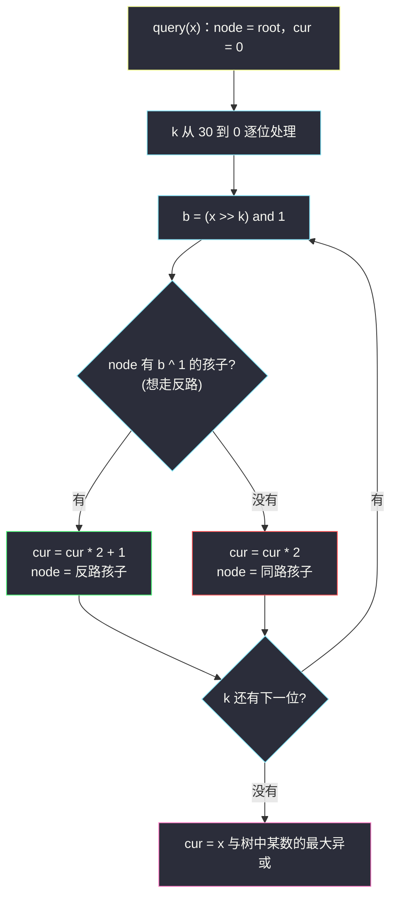
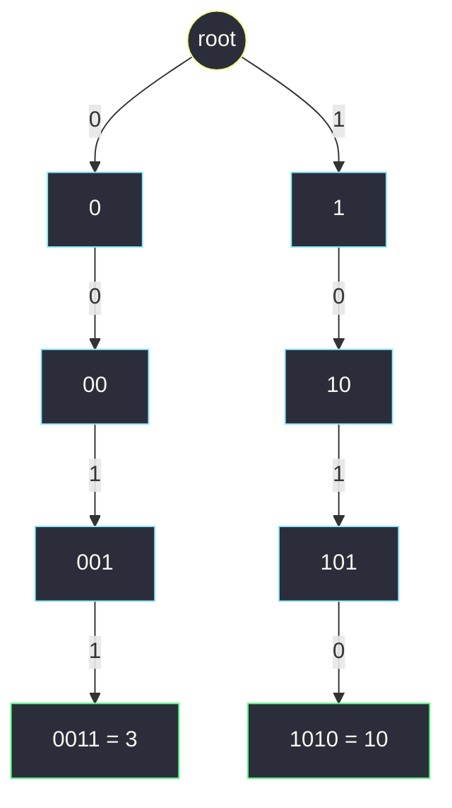

# 数组中两个数的最大异或值（0-1 字典树上逐位贪心走反路）

## 一、问题描述

给你一个非空整数数组 `nums`（元素非负），从中任取两个数 `a`、`b`（下标不同即可，值可相同），使 `a XOR b` 的值最大，返回这个最大值。

> 🔗 LeetCode 421：https://leetcode.cn/problems/maximum-xor-of-two-numbers-in-an-array/
>
> 数据范围：`1 <= nums.length <= 2 * 10^5`，`0 <= nums[i] <= 2^31 - 1`。

**示例**

```
输入：nums = [3, 10, 5, 25, 2, 8]
输出：28
解释：5 XOR 25 = 28，是所有数对中的最大异或值。

输入：nums = [0]
输出：0

输入：nums = [14, 70, 53, 83, 49, 91, 36, 80, 92, 51, 66, 70]
输出：127
```

**直观理解**

两两组合共有约 `n^2 / 2` 对，但异或值其实由**高位说了算**：第 `k` 位上一个 1 的价值（`2^k`）超过低位全部 1 的总和（`2^k - 1`）。所以正确的问法不是「哪两个数异或最大」，而是「**答案的最高位能不能是 1？次高位呢？**」从高到低逐位敲定——这就需要一种能把「数的高位前缀」当索引的结构：0-1 字典树。它是普通 Trie（[#208](implement-trie-prefix-tree.md)）把 26 个字母换成 0/1 两个比特后的样子，灵茶题单 §6.4 的主角。

---

## 二、暴力解法

### 暴力：双重循环枚举所有数对

```python
class Solution:
    def findMaximumXOR(self, nums: List[int]) -> int:
        ans = 0
        for i in range(len(nums)):
            for j in range(i + 1, len(nums)):
                ans = max(ans, nums[i] ^ nums[j])
        return ans
```

- **时间**：`O(n^2)`。`n = 2 * 10^5` 时约 `2 * 10^10` 次异或与比较，远超市售语言每秒可完成的量级，超时；
- **空间**：`O(1)`。

### 🔴 瓶颈在哪里

暴力把「数对」当成不可分割的原子。但两个数异或时，**高位不同的信息早已注定大局**——前缀相同的数对在高位贡献全 0，真正值得比较的只有「高位前缀不同」的组合。缺的是一个按**二进制高位前缀**组织数对的结构，以及「高位优先」的决策顺序。

---

## 三、优化探索（核心章节）

> 📚 本题在灵茶题单中属于 **§6.4 0-1 字典树（异或字典树）**，树形骨架完全来自 §6.1 的 [#208 实现 Trie](implement-trie-prefix-tree.md)：节点 = `children[2]`，只是「26 个字母」坍缩成「0 / 1 两条边」。

### 3.1 高位优先贪心：为什么逐位敲定是对的

设当前已确定答案的高 `t` 位为 `ans`。若存在一对数使「高 `t+1` 位的异或」能凑出 `ans * 2 + 1`（即第 `t` 位也为 1），就**必须**选它：第 `t` 位一个 1 价值 `2^t`，超过后面所有位全 1 的总和 `2^t - 1`。反之若凑不出，该位只能记 0，绝不影响继续贪后面的位。于是答案可以**从最高位到最低位逐位确定**——每一步只问一个小问题：「这一位能不能是 1？」

### 3.2 哈希前缀 + 逐位贪心（不带树的解法）

把上面的小问题翻译成可判定的形式：第 `k` 轮时想知道「有没有一对 `(x, y)` 满足 `(x >> k) ^ (y >> k) == ans * 2 + 1`」（只比高 `31-k` 位）。利用 `a ^ b = c` 等价于 `a ^ c = b`：

- 把所有数的高位前缀 `x >> k` 放进哈希集合；
- 对每个前缀 `p`，查 `p ^ (ans * 2 + 1)` 是否也在集合里；在，就说明存在这样一对。

代码见第四节。`k` 从 30 扫到 0，每轮 `O(n)`，总 `O(31n)`。

### 3.3 0-1 字典树：把「按位走」变成树上游走

把每个数按**固定 31 位**（第 30 位到第 0 位）从高到低插进一棵只有 0 / 1 两种出边的 Trie。所有数**同宽对齐**（前导零补齐），保证「走到第 `k` 层」在比较意义上对每个数都公平——这与字符串 Trie 需要同一起点对齐是同一个道理。

查询 `x` 与树中任何数的最大异或时，逐位**贪心走与 `x` 当前位相反的边**：



为什么走反路正确：当前位若能异或出 1（走 `b ^ 1`），相当于 3.1 节里「这一位能是 1 就必须是 1」；树中每层都真实存着某个数的下一位，所以「有反路孩子」与「存在高位前缀匹配 `cur` 且下一位相反的数」是同一件事。每一步贪心都继承并保持前面已确定的高位，与哈希法逐轮 `ans * 2 + 1` 的判定完全同构。

小例子热身：树中只有 `3 = 0011` 与 `10 = 1010`（按 4 位展示）：



查询 `x = 3`（位 0 0 1 1）：想走 `1 1 0 0`，根有 `1` 边（吃到 1），`"1"` 节点只有 `0` 边（只能同走 0），`"10"` 节点只有 `1` 边（同走 0），`"101"` 节点有 `0` 边（吃到 1）——走到叶 `1010 = 10`，`cur = 1001 = 9 = 3 ^ 10` ✓。

### 3.4 两种解法对比

| | 哈希前缀 + 逐位贪心 | 0-1 Trie |
|---|----------------------|-----------|
| 时间 | `O(31n)` | `O(31n)`，常数略大但一步一树 |
| 空间 | `O(n)`（每轮集合） | `O(31n)` 个节点 |
| 在线能力 | 弱（每轮都要重建集合） | 强：数可随时插入，随查随走 |
| 可扩展性 | 只答「全体两数最大异或」 | 天然支持带上界约束（#1707）、按前缀计数（#1803）、可增删的动态查询（#1938） |

面试里哈希法胜在短小、Trie 胜在通用；灵神题单把本题放 §6.4，正是为了用最裸的 0-1 Trie 给后面这些变形打底。

### 3.5 一句话核心

> **同宽 31 位从高到低建 0-1 Trie；查询时每位优先走与当前位相反的边，吃到 1 就 `cur = cur * 2 + 1`，被迫同走就 `cur * 2`——高位能 1 必须 1。**

---

## 四、代码实现

### Python 主解（0-1 字典树，嵌套 dict 当节点）

```python
class Solution:
    def findMaximumXOR(self, nums: List[int]) -> int:
        root = {}                          # 嵌套 dict：0/1 -> 子 dict

        # 1) 全部数按 31 位从高到低插入
        for x in nums:
            node = root
            for k in range(30, -1, -1):
                b = (x >> k) & 1
                node = node.setdefault(b, {})

        # 2) 对每个数沿树贪心，反路优先
        ans = 0
        for x in nums:
            node = root
            cur = 0
            for k in range(30, -1, -1):
                b = (x >> k) & 1
                want = b ^ 1               # 想走的反路
                if want in node:
                    cur = cur * 2 + 1      # 该位异或出 1
                    node = node[want]
                else:
                    cur = cur * 2          # 只能同路，该位 0
                    node = node[b]
            ans = max(ans, cur)
        return ans
```

**变量含义**

| 变量 | 含义 |
|------|------|
| `root` | 0-1 Trie 的根；`node[b]` 是沿比特 `b` 的孩子 |
| `k` | 当前处理的比特位，从 30 到 0（覆盖 `2^31 - 1`） |
| `b` | `x` 在第 `k` 位的比特 |
| `want = b ^ 1` | 反路：走过去就能让该位异或为 1 |
| `cur` | 走到当前层时，`x` 与「树中某条路径」异或的高位前缀值 |
| `ans` | 所有 `cur` 的最大值，即答案 |

### Python 对比解（哈希前缀 + 逐位贪心）

```python
class Solution:
    def findMaximumXOR(self, nums: List[int]) -> int:
        ans = 0
        for k in range(30, -1, -1):
            ans = ans * 2 + 1                    # 先假设第 k 位能定成 1
            seen = {(x >> k) for x in nums}      # 所有数的高 (31-k) 位前缀
            found = any(((x >> k) ^ ans) in seen for x in nums)
            if not found:
                ans -= 1                         # 定不成 1：退回该位为 0
        return ans
```

说明：本轮试探值 `ans` 恒为奇数（末位 1），而 `p ^ p = 0`，所以「拿 `x` 自己配对」永远不会伪造成功，无需特判 `i != j`。

### Java（数组版 0-1 Trie）

```java
class Solution {
    private static final int B = 30;
    private int[][] son;    // son[u][b]：节点 u 沿比特 b 的孩子，0 表示空（根是 0 号）
    private int cnt;        // 已分配节点数

    public int findMaximumXOR(int[] nums) {
        int n = nums.length;
        son = new int[n * (B + 1) + 1][2];       // 每个数至多新增 31 个节点
        cnt = 1;
        for (int x : nums) {
            insert(x);
        }
        int ans = 0;
        for (int x : nums) {
            ans = Math.max(ans, query(x));
        }
        return ans;
    }

    private void insert(int x) {
        int u = 0;
        for (int k = B; k >= 0; k--) {
            int b = (x >> k) & 1;
            if (son[u][b] == 0) {
                son[u][b] = cnt++;
            }
            u = son[u][b];
        }
    }

    private int query(int x) {
        int u = 0, cur = 0;
        for (int k = B; k >= 0; k--) {
            int b = (x >> k) & 1;
            if (son[u][b ^ 1] != 0) {     // 有反路：该位吃 1
                cur = cur * 2 + 1;
                u = son[u][b ^ 1];
            } else {                       // 只能同路
                cur = cur * 2;
                u = son[u][b];
            }
        }
        return cur;
    }
}
```

---

## 五、具体例子演示

对官方示例 `nums = [3, 10, 5, 25, 2, 8]` 端到端走一遍。最大数 25 < 32，用 **5 位**（`b4 b3 b2 b1 b0`）展示（代码里统一 31 位，道理相同）：

| 数 | b4 b3 b2 b1 b0 |
|----|----------------|
| 3 | 0 0 0 1 1 |
| 10 | 0 1 0 1 0 |
| 5 | 0 0 1 0 1 |
| 25 | 1 1 0 0 1 |
| 2 | 0 0 0 1 0 |
| 8 | 0 1 0 0 0 |

**建树后每层的出边情况**（决定查询时的选择）：

| 到达路径（前缀） | 该节点的出边 |
|------------------|--------------|
| root | {0, 1} |
| 1 | {1} |
| 11 | {0} |
| 110 | {0} |
| 1100 | {1}（叶：11001 = 25） |
| 0 | {0, 1} |
| 00 | {0, 1} |
| 000 | {1} |
| 0001 | {0, 1}（叶：00011 = 3、00010 = 2） |
| 001 | {0}（叶：00101 = 5） |
| 01 | {0} |
| 010 | {0, 1} |
| 0100 | {0}（叶：01000 = 8） |
| 0101 | {0}（叶：01010 = 10） |

下面给**每个数**按位贪心的路径表（`想走 = x 该位 ^ 1`；实际走不到反路时被迫同走，异或位记 0）：

**x = 3（0 0 0 1 1）**

| 位 | x 该位 | 想走 | 节点出边 | 实际走 | 异或位 | cur（二进制） |
|----|--------|------|----------|--------|--------|----------------|
| b4 | 0 | 1 | {0, 1} | 1 ✓ | 1 | 1 |
| b3 | 0 | 1 | {1} | 1 ✓ | 1 | 11 |
| b2 | 0 | 1 | {0} | 0 ✗ | 0 | 110 |
| b1 | 1 | 0 | {0} | 0 ✓ | 1 | 1101 |
| b0 | 1 | 0 | {1} | 1 ✗ | 0 | 11010 = **26**（搭档 25） |

**x = 10（0 1 0 1 0）**

| 位 | x 该位 | 想走 | 节点出边 | 实际走 | 异或位 | cur（二进制） |
|----|--------|------|----------|--------|--------|----------------|
| b4 | 0 | 1 | {0, 1} | 1 ✓ | 1 | 1 |
| b3 | 1 | 0 | {1} | 1 ✗ | 0 | 10 |
| b2 | 0 | 1 | {0} | 0 ✗ | 0 | 100 |
| b1 | 1 | 0 | {0} | 0 ✓ | 1 | 1001 |
| b0 | 0 | 1 | {1} | 1 ✓ | 1 | 10011 = **19**（搭档 25） |

**x = 5（0 0 1 0 1）**

| 位 | x 该位 | 想走 | 节点出边 | 实际走 | 异或位 | cur（二进制） |
|----|--------|------|----------|--------|--------|----------------|
| b4 | 0 | 1 | {0, 1} | 1 ✓ | 1 | 1 |
| b3 | 0 | 1 | {1} | 1 ✓ | 1 | 11 |
| b2 | 1 | 0 | {0} | 0 ✓ | 1 | 111 |
| b1 | 0 | 1 | {0} | 0 ✗ | 0 | 1110 |
| b0 | 1 | 0 | {1} | 1 ✗ | 0 | 11100 = **28**（搭档 25） |

**x = 25（1 1 0 0 1）**

| 位 | x 该位 | 想走 | 节点出边 | 实际走 | 异或位 | cur（二进制） |
|----|--------|------|----------|--------|--------|----------------|
| b4 | 1 | 0 | {0, 1} | 0 ✓ | 1 | 1 |
| b3 | 1 | 0 | {0, 1} | 0 ✓ | 1 | 11 |
| b2 | 0 | 1 | {0, 1} | 1 ✓ | 1 | 111 |
| b1 | 0 | 1 | {0} | 0 ✗ | 0 | 1110 |
| b0 | 1 | 0 | {1} | 1 ✗ | 0 | 11100 = **28**（搭档 5） |

**x = 2（0 0 0 1 0）**

| 位 | x 该位 | 想走 | 节点出边 | 实际走 | 异或位 | cur（二进制） |
|----|--------|------|----------|--------|--------|----------------|
| b4 | 0 | 1 | {0, 1} | 1 ✓ | 1 | 1 |
| b3 | 0 | 1 | {1} | 1 ✓ | 1 | 11 |
| b2 | 0 | 1 | {0} | 0 ✗ | 0 | 110 |
| b1 | 1 | 0 | {0} | 0 ✓ | 1 | 1101 |
| b0 | 0 | 1 | {1} | 1 ✓ | 1 | 11011 = **27**（搭档 25） |

**x = 8（0 1 0 0 0）**

| 位 | x 该位 | 想走 | 节点出边 | 实际走 | 异或位 | cur（二进制） |
|----|--------|------|----------|--------|--------|----------------|
| b4 | 0 | 1 | {0, 1} | 1 ✓ | 1 | 1 |
| b3 | 1 | 0 | {1} | 1 ✗ | 0 | 10 |
| b2 | 0 | 1 | {0} | 0 ✗ | 0 | 100 |
| b1 | 0 | 1 | {0} | 0 ✗ | 0 | 1000 |
| b0 | 0 | 1 | {1} | 1 ✓ | 1 | 10001 = **17**（搭档 25） |

**汇总**

| x | 3 | 10 | 5 | 25 | 2 | 8 |
|---|---|----|----|----|----|---|
| 最佳搭档 | 25 | 25 | 25 | 5 | 25 | 25 |
| cur | 26 | 19 | **28** | **28** | 27 | 17 |

最大值 `ans = 28 = 5 ^ 25`，与官方答案一致。注意 `x = 25` 查询时最后停在 `00101 = 5` 上——树是全体数共享的，查询谁、被配对谁完全自由，这正是它比哈希法「一轮一集合」更有生命力的地方。

---

## 六、复杂度分析

设 `n = len(nums)`、位宽 `B = 31`：

| 方案 | 时间 | 空间 |
|------|------|------|
| 暴力 | `O(n^2)` | `O(1)` |
| 哈希前缀 + 逐位贪心 | `O(B * n)` ≈ `31 * 2 * 10^5 ≈ 6 * 10^6` | `O(n)`（每轮瞬时哈希集合） |
| 0-1 Trie（本篇） | 建树 `O(B * n)` + 查询 `O(B * n)` | `O(B * n)` 个节点，Java 数组版约 `n * 31` 行 × 2 列 |

三档方案在 `n = 2 * 10^5` 下分别是 `2 * 10^10`、`6 * 10^6`、`6 * 10^6` 量级——后两者双双通过，差别只在空间与可扩展性（见 3.4 节）。

---

## 七、对比总结

**易错点**

1. **必须从最高位开始**：低位先贪会把「高位的 1」让出去；位宽统一取 31（`k` 从 30 到 0），覆盖 `2^31 - 1`；
2. 想走的反路是 `b ^ 1`（即 `1 - b`），别顺手写成 `b + 1`；
3. `cur` 的更新是 `cur = cur * 2 + 吃到的位`：吃到反路记 1、被迫同路记 0——**不是**「走到哪就把哪记 1」；
4. **不必排除 `x` 与自己配对**：树上必有一条全同路的路径对应 `x` 自身，得 `cur = 0`，永远不会盖过真正的最大值；哈希法里试探值恒为奇数，同理自配对必失败；
5. Java 数组版要按「每数至多新增 31 节点」开足 `n * 31 + 1` 行，节点 0 号留给根，别拿 `0` 当有效孩子编号（用 0 表示空槽的前提）。

**与同族的三方对照**

| 题 | 结构 | 决策 |
|----|------|------|
| #208 前缀树 | 26 叉 Trie | 缺边即败，词尾看图章 |
| #421 本篇 | 0-1 Trie | 高位优先，反路优先 |
| 哈希前缀法 | 每轮重建集合 | 逐位试探 `ans * 2 + 1` 是否可凑 |

---

## 八、举一反三

| 题目 | 关系 |
|------|------|
| [208. 实现 Trie（前缀树）](https://leetcode.cn/problems/implement-trie-prefix-tree/) | 本批根基篇（§6.1）：0-1 Trie 就是字母表缩成 {0, 1} 的它，见 `implement-trie-prefix-tree.md` |
| [1707. 与数组中元素的最大异或值](https://leetcode.cn/problems/maximum-xor-with-an-element-from-array/) | 直接进阶：查询加「不超过上界」约束，离线排序 + 本篇 0-1 Trie 即可 |
| [1803. 统计异或值在范围内的数对有多少](https://leetcode.cn/problems/count-pairs-with-xor-in-a-range/) | 0-1 Trie 的另一面：不贪最值而在树上**按位数节点个数**，统计落入区间的对数 |
| [1938. 查询最大基因差](https://leetcode.cn/problems/maximum-genetic-difference-query/) | 动态版：DFS 树上边走边插 / 回溯边删，0-1 Trie 支持在线增删的教科书示范 |
| [2935. 找出强数对的最大异或值 II](https://leetcode.cn/problems/maximum-strong-pair-xor-ii/) | 排序 + 双指针界定 `|x - y|` 范围，配 0-1 Trie 增删——本篇 + 双指针的综合 |
| [2932. 找出强数对的最大异或值 I](https://leetcode.cn/problems/maximum-strong-pair-xor-i/) | 上一题的小数据版，暴力可过，适合对照体会何时值得上树 |

**思想迁移**

- 「**按前缀建索引、贪心走相反**」不只属于异或：任何满足「逐位独立决策、高位压倒低位」的最值问题（最大异或、最小异或、区间第 K 大的持久化版）都能套 0-1 Trie；
- 0-1 Trie 里的每条路径天然是一个「二进制前缀」，于是**数位统计**（数有多少路径以某前缀开头）是最顺手的副产品，#1803、#1938 全靠它；
- 口诀：**「同宽高位建二树，查询反路优先扑；反路得一并进来，同路记零不迷途。」**
