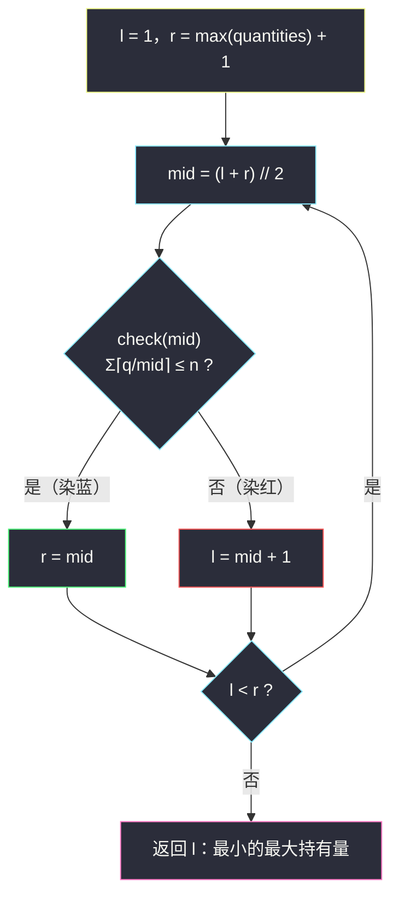
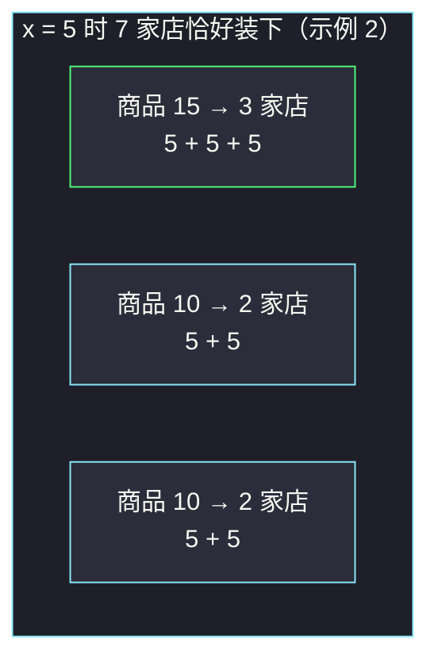

# 分配给商店的最多商品的最小值（二分答案 · 最小化最大值）

## 一、问题描述

给你一个整数 `n` 表示零售商店的数量，再给一个整数数组 `quantities`，其中 `quantities[i]` 表示第 `i` 种商品的件数（共 `m = len(quantities)` 种，题目保证 `m <= n`）。

把所有商品分发到商店，规则如下：

- 每种商品**必须全部分配出去**；
- **每家商店只能持有一种商品**（但可以持有该种商品的多件）；
- **一种商品可以拆给多家商店**。

设 `x` 为分配后「商品数最多的那家商店」所持有的商品数，请最小化 `x`，返回这个最小值。

> 🔗 LeetCode 2064：https://leetcode.cn/problems/minimized-maximum-of-products-distributed-to-any-store/
>
> 数据范围：`1 <= n <= quantities.length <= 10^5`，`1 <= quantities[i] <= 10^5`。

**示例**

```
输入：n = 6, quantities = [11,6]
输出：3
解释：商品 0 分给 4 家店（3+3+3+2），商品 1 分给 2 家店（3+3），共用 6 家，每家最多 3 件。

输入：n = 7, quantities = [15,10,10]
输出：5
解释：15 = 5+5+5（3 家），10 = 5+5（2 家），10 = 5+5（2 家），恰好 7 家，每家最多 5 件。
```

**直观理解**

问的不是「怎么分」，而是「每家店最多拿几件」的**最小值**——这是灵神题单 **§2.4「最小化最大值」** 的招牌句式。套路：不去构造分配方案，而是**猜一个上限 `x`**，验证「每家至多 `x` 件时 `n` 家店够不够用」。猜上限、验证总量，正是二分答案。

---

## 二、暴力解法

`x` 从 `1` 开始逐个试：对每个 `x` 计算全部商品至少需要多少家店，第一次「店数 ≤ n」的 `x` 就是答案。

```python
class Solution:
    def minimizedMaximum(self, n: int, quantities: List[int]) -> int:
        x = 1
        while True:
            need = sum((q + x - 1) // x for q in quantities)   # 至少需要的店数
            if need <= n:
                return x
            x += 1
```

### 复杂度

- **时间**：`O(m * maxQ)`，最坏 `10^5 * 10^5 = 10^10` 量级，必然超时。
- **空间**：`O(1)`。

### 🔴 瓶颈在哪里

「`x` 件上限够不够用」在数轴上又是一刀切：上限太小店不够（红），上限够大店管够（蓝）。逐个枚举浪费了这层结构。

---

## 三、优化探索（核心章节）

> 📚 本题在灵茶题单中属于 **§2.4 最小化最大值**。模板与 §2.1 求最小（见同批 `koko-eating-bananas.md`）一字不差，区别只在「答案的语义」：§2.1 问「最小的速度/除数」，本题问「最小的最大持有量」。

### 3.1 关键转化：固定上限 x，数一数要多少家店

规定每家店最多拿 `x` 件：

- 商品 `q` 至少需要 `⌈q / x⌉` 家店——每家最多贡献 `x` 件，`q` 件至少 `q / x` 家，向上取整；
- 这个下界**可以达到**：前 `⌈q/x⌉ − 1` 家每家拿满 `x` 件，最后一家拿剩下的 `q − x·(⌈q/x⌉ − 1)` 件，余量在 `[1, x]` 内，不越界。

所以全部商品的最少店数为：

```
need(x) = Σ ⌈q / x⌉
```

`check(x)` 就是：`need(x) <= n`。

### 3.2 关键观察：check 关于 x 单调

`x` 越大 → 每个 `⌈q/x⌉` 不增 → `need(x)` 单调不增。于是「`need(x) <= n`」在数轴上**左假右真**：上限太紧，店开不够（红）；上限放松，店管够（蓝）。**要的答案 = 最小的蓝色 x**。


### 3.3 上界为什么取 max(quantities)

`x = max(quantities)` 时每种商品一家店就装下，`need = m`；而题目保证 `m <= n`，所以 `check(maxQ)` **必然为真**——答案落在 `[1, max(quantities)]` 内。

### 3.4 统一模板（求最小）

```
求满足 check(x) 的最小 x（红蓝染色）：
    l = 1, r = max(quantities) + 1     # 左闭右开 [l, r)
    while l < r:
        mid = (l + r) // 2
        if check(mid): r = mid          # mid 蓝：店够，试试更小上限
        else:          l = mid + 1      # mid 红：店不够，放宽上限
    答案 = l
```



**「最小化最大值」的本质**：先给「最大值」设一个假设上限 `x`，把「让最大值尽量小」的优化题，翻转成「验证上限可行」的判定题。判定有单调性 → 二分。§2.5 的「最大化最小值」（#3281）则是同一枚硬币的另一面：先设下限，check 满足时用**求最大**模板（`l = mid`）。

### 3.5 一句话核心

> **「Σ⌈q/x⌉ ≤ n」关于 x 左假右真 → 在 [1, max(quantities)] 上跑「求最小」红蓝模板，最优分配方案自动隐含在计数里。**

---

## 四、代码实现

### Python（主解）

```python
class Solution:
    def minimizedMaximum(self, n: int, quantities: List[int]) -> int:
        def check(x: int) -> bool:
            need = 0
            for q in quantities:
                need += (q + x - 1) // x     # ⌈q/x⌉：商品 q 至少占的店数
                if need > n:                 # 提前退出
                    return False
            return True

        l, r = 1, max(quantities) + 1        # 答案 ∈ [1, max]，check(max) 必真
        while l < r:
            mid = (l + r) // 2
            if check(mid):
                r = mid                      # 店够用，上限还能再压
            else:
                l = mid + 1                  # 店不够，必须放宽
        return l
```

**变量含义**

| 变量 | 含义 |
|------|------|
| `x` / `mid` | 猜测的「单店最大持有量」 |
| `(q + x - 1) // x` | 商品 `q` 在上限 `x` 下至少需要的店数 `⌈q/x⌉` |
| `need` | 全部商品至少需要的店数 |
| `l` / `r` | 红区右边界 / 蓝区左边界（左闭右开 `[l, r)`） |
| 返回值 `l` | 可行的最小上限，即答案 `x` |

### Java（最优解同款写法）

```java
class Solution {
    public int minimizedMaximum(int n, int[] quantities) {
        int l = 1, r = 1;
        for (int q : quantities) r = Math.max(r, q);
        r += 1;                              // 答案 ∈ [1, max]，开区间上界
        while (l < r) {
            int mid = l + (r - l) / 2;       // 防溢出写法
            if (check(quantities, mid, n)) r = mid;
            else l = mid + 1;
        }
        return l;
    }

    // Σ⌈q/x⌉ ≤ n ？
    private boolean check(int[] quantities, int x, int n) {
        long need = 0;                       // 最坏 10^5 × 10^5 = 10^10，超 int
        for (int q : quantities) {
            need += (q + x - 1) / x;
            if (need > n) return false;
        }
        return true;
    }
}
```

**Java 易错**：`need` 最坏可达 `Σq = 10^10`，用 `int` 累加会溢出，必须 `long`（配合「超过 `n` 提前返回」，实际不会真加到这么大）。

---

## 五、具体例子演示

以 `n = 7`、`quantities = [15,10,10]` 端到端走一遍。`max(quantities) = 15`，初始 `l = 1`，`r = 16`。

每轮 check 明细：`⌈15/mid⌉ + ⌈10/mid⌉ + ⌈10/mid⌉`。

| 轮次 | l | r | mid | 三项店数 | 总和 need | ≤ 7 ? | 染色 | 动作 |
|------|---|---|-----|----------|-----------|-------|------|------|
| 1 | 1 | 16 | 8 | 2 + 2 + 2 | 6 | ✓ | 蓝 | `r = 8` |
| 2 | 1 | 8 | 4 | 4 + 3 + 3 | 10 | ✗ | 红 | `l = 5` |
| 3 | 5 | 8 | 6 | 3 + 2 + 2 | 7 | ✓ | 蓝 | `r = 6` |
| 4 | 5 | 6 | 5 | 3 + 2 + 2 | 7 | ✓ | 蓝 | `r = 5` |

`l == r == 5`，循环结束，返回 **5** ✓。

**最优上限 5 对应的真实分配方案**（check 只数了店数，方案由 3.1 的构造保证存在）：



**验证「最小」**：`x = 5` 时 `need = 7 <= 7` 可行；`x = 4` 时 `need = 10 > 7` 不可行——分界恰在 5。

**再看示例 1**：`n = 6`、`quantities = [11,6]`。`x = 3`：`⌈11/3⌉ + ⌈6/3⌉ = 4 + 2 = 6 <= 6` 可行；`x = 2`：`6 + 3 = 9 > 6` 不可行 → 答案 **3** ✓。二分约 `log2(11) ≈ 4` 轮锁定，暴力要从 1 试到 3；数量级一大（`maxQ = 10^5`）暴力直接出局，二分仍是那 `≈ 17` 轮。

---

## 六、复杂度分析

| 方法 | 时间 | 空间 | 说明 |
|------|------|------|------|
| 暴力递增 | `O(m * maxQ)` | `O(1)` | `10^10` 量级超时 |
| 二分答案 | `O(m log maxQ)` | `O(1)` | `log2(10^5) ≈ 17` 轮，每轮 `O(m)` 且可提前退出 |

---

## 七、对比总结

**二分答案四个小节的模板方向**（同一副骨架，四种问法）：

| 小节 | 问法 | check 满足时的动作 | 例题 |
|------|------|--------------------|------|
| §2.1 求最小 | 最小的达标参数 | `r = mid` | #875 珂珂、#1283、#3824、#3453 |
| §2.2 求最大 | 最大的达标参数 | `l = mid` | #2226 分糖果，见同批 `maximum-candies-allocated-to-k-children.md` |
| §2.4 最小化最大值（本篇） | 最小的「最大值」 | `r = mid`（本质仍是求最小） | #2064 |
| §2.5 最大化最小值 | 最大的「最小值」 | `l = mid`（本质仍是求最大） | #3281 范围内整数的最大得分 |

「最小化最大值」与「求最小」共用模板；「最大化最小值」与「求最大」共用模板——**染色看 check，不看问法的形容词**。

**check 对照**（#2064 与最近的两位亲戚）：

| 题 | 二分对象 | check 内容 | 单调方向 |
|----|----------|-----------|----------|
| #2064 本篇 | 单店上限 x | Σ⌈q/x⌉ ≤ n | x 越大店数越少 |
| #875 珂珂 | 速度 k | Σ⌈p/k⌉ ≤ h | 结构完全同构，见 `koko-eating-bananas.md` |
| #1011 送包裹 | 载重 cap | 贪心装载天数 ≤ days | check 从计数升级为贪心，见 `capacity-to-ship-packages-within-d-days.md` |

**易错点**

1. **⌈q/x⌉ 写成 `(q + x - 1) // x`**；漏掉 `- 1` 会把整除的情况多算一家店，答案可能偏大。
2. **上界是 `max(quantities)`**，别写 `sum(quantities)`（能过但白跑几十轮）；也别忘了题目 `m <= n` 的保证正是 `check(max)` 恒真的依据。
3. **Java `need` 用 `long`**；Python 无此虑。
4. **别真去模拟分配**：`need(x)` 只是计数，构造方案（谁拿几件）由「前几家拿满 + 最后一家拿余量」自动保证，写进 check 反而画蛇添足。

**模板（求最小，Python 版）**

```python
def smallest_ok(check, lo, hi):        # 答案 ∈ [lo, hi]，check(hi) 必真
    l, r = lo, hi + 1
    while l < r:
        mid = (l + r) // 2
        if check(mid): r = mid
        else:          l = mid + 1
    return l
```

---

## 八、举一反三

| 题目 | 关系 |
|------|------|
| [410. 分割数组的最大值](https://leetcode.cn/problems/split-array-largest-sum/) | 「最小化最大值」最经典 Hard：二分最大段和，check 换成贪心切分 |
| [1482. 制作 m 束花所需的最少天数](https://leetcode.cn/problems/minimum-number-of-days-to-make-m-bouquets/) | 二分天数 d，check 是滑动窗口计数花束 |
| [1802. 有界数组中指定下标处的最大值](https://leetcode.cn/problems/maximum-value-at-a-given-index-in-a-bounded-array/) | 二分「最大值」，check 变成等差求和判预算 |
| [2226. 每个小孩最多能分到多少糖果](https://leetcode.cn/problems/maximum-candies-allocated-to-k-children/) | 镜像题：**最大化最小值**（§2.2 求最大，`l = mid`），见同批 `maximum-candies-allocated-to-k-children.md` |
| [3281. 范围内整数的最大得分](https://leetcode.cn/problems/maximize-score-of-numbers-in-ranges/) | §2.5 最大化最小值，与本篇互为镜像 |
| [875. 爱吃香蕉的珂珂](https://leetcode.cn/problems/koko-eating-bananas/) | check 完全同构的 §2.1 题型，见同批 `koko-eating-bananas.md` |
| [1011. 在 D 天内送达包裹的能力](https://leetcode.cn/problems/capacity-to-ship-packages-within-d-days/) | 「最小化船的载重」= 最小化最大值的前身，见同批 `capacity-to-ship-packages-within-d-days.md` |

**思想迁移**

- 见到「**最小化最大值 / 最大化最小值**」，第一反应是二分那个 max/min，把优化翻转成判定；判定有单调性就一路通吃。
- check 的形态五花八门（计数、贪心、求和），但**模板一行不改**——这就是灵神把 §2.1～§2.5 归成「二分答案」一家的原因。
- `⌈q/x⌉` 计数是这类题最高频的 check 零件，本篇、#875、#1283、#1870 共用了同一颗螺丝。
- 口诀：**「上限先假想，够用往左抢；店数一数完，最小上限见太阳。」**
