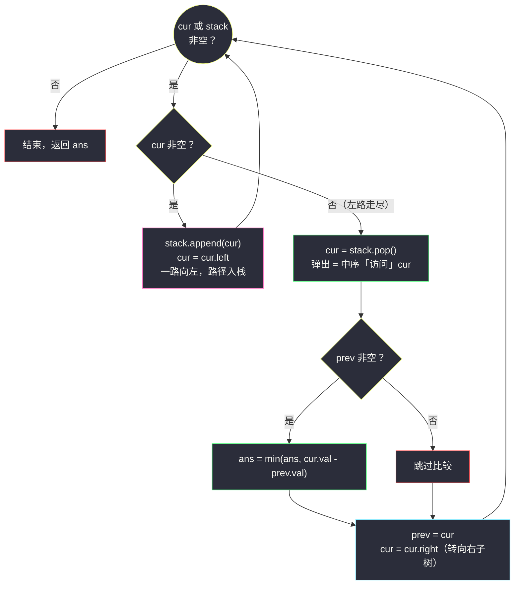
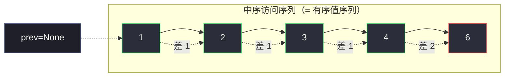

# 530. 二叉搜索树的最小绝对差（Minimum Absolute Difference in BST）

> 题目来源：[https://leetcode.cn/problems/minimum-absolute-difference-in-bst/](https://leetcode.cn/problems/minimum-absolute-difference-in-bst/)
>
> 灵茶题单小节：§2.9 二叉搜索树（难度分 1303）
>
> 姊妹篇：[#783 二叉搜索树节点最小距离](minimum-distance-between-bst-nodes.md)（题面相同、`n ≤ 100`，那篇侧重**为什么中序遍历天然有序**并给出递归实现；本文数据范围大 100 倍，侧重**显式栈非递归中序**与 `prev` 指针技巧）。

## 一、问题描述

给你一棵**二叉搜索树（BST）**的根节点 `root`，返回树中**任意两个不同节点值之间的最小差值**（差值是一个正数，等于两值之差的绝对值）。

**数据范围**：

- 树中节点的数目范围是 `[2, 10⁴]`
- `0 <= Node.val <= 10⁵`

**示例 1**：

```text
输入：root = [4,2,6,1,3]
输出：1
```

**示例 2**：

```text
输入：root = [1,0,48,null,null,12,49]
输出：1
```

**核心思考点**：与 [#783](minimum-distance-between-bst-nodes.md) 一字不差——中序遍历有序，最小差在相邻对。**真正的新问题藏在数据范围里**：`n` 从 `100` 涨到 `10⁴`，一棵斜树的深度可达 `10⁴`，而 Python 默认递归深度上限是 **1000**——递归中序（姊妹篇的主解）在这题可能直接 `RecursionError`。本文的主角因此换成**显式栈的非递归中序**。

## 二、暴力解法

### 思路

`n = 10⁴` 时两两枚举是 `O(n²) ≈ 5 × 10⁷` 对，Python 会超时。更聪明的暴力：**不利用树结构，只把 BST 当「值的集合」**——收集全部值，排序，扫相邻差：

1. 遍历树把所有值收进 `vals`（任意顺序）；
2. `vals.sort()`；
3. 相邻差取最小。

排序把「有序」重新造了出来——代价是 `O(n log n)` 时间与 `O(n)` 空间的数组。

### 代码

```python
class Solution:
    def getMinimumDifference(self, root: Optional[TreeNode]) -> int:
        vals = []                           # 收集所有节点值

        def collect(node):
            if node is None:
                return
            vals.append(node.val)
            collect(node.left)
            collect(node.right)

        collect(root)
        vals.sort()                         # 排序还原有序（注意：递归收集仍受深度限制）
        return min(vals[k+1] - vals[k] for k in range(len(vals) - 1))
```

### 复杂度

- 时间 `O(n log n)`：排序主导。
- 空间 `O(n)`：值数组。

## 三、优化探索

### 两处浪费与一处隐患

1. **排序是重复劳动**：BST 的中序遍历**本来就有序**（证明见姊妹篇 [#783](minimum-distance-between-bst-nodes.md) 第三节），`sort()` 把结构里现成的信息扔掉又重算一遍。
2. **数组没必要**：有序序列的最小差只需「当前值 − 上一个值」，一个 `prev` 指针即可。
3. **递归深度隐患**：上面暴力版的 `collect` 仍是递归——斜树深度 `10⁴` 同样会炸栈。要彻底摆脱递归，需要**显式栈模拟中序**。

### 显式栈中序：把「递归挂起」变成「栈上暂存」

递归中序 `dfs(node)` 的本质是三条指令：走左、访问自己、走右。「走左」是一条**可以延迟兑现的承诺**——把沿途节点压栈，等左路走尽再逐个弹出兑现「访问 + 走右」。状态机如下：



两个指针各司其职：`cur` 是「探路的左手」，`stack` 里躺着「等着被访问的祖先链」。**弹出的瞬间就是中序的访问时刻**——`prev` 比较与更新只发生在这一刻。

> 进阶（了解即可）：**Morris 遍历**还能把 `O(h)` 的栈也省掉——利用叶子空闲的右指针临时指向中序后继（线索化），走完再拆线，空间 `O(1)`；代价是遍历中改树、常数变大。本题 `h ≤ 10⁴`，显式栈已足够，不引入改结构的复杂度。

## 四、代码实现

```python
class Solution:
    def getMinimumDifference(self, root: Optional[TreeNode]) -> int:
        ans = float('inf')                  # 全局最小差
        prev = None                         # 上一个「访问」的节点（prev 指针）
        stack = []                          # 显式栈：待回访的祖先链
        cur = root                          # 探路指针

        while cur or stack:                 # 还有路可探 或 还有账要还
            while cur:                      # 一路向左：沿途全部入栈
                stack.append(cur)
                cur = cur.left
            cur = stack.pop()               # 左路走尽：弹出 = 中序访问它
            if prev is not None:            # 与上一个访问值比较
                ans = min(ans, cur.val - prev.val)
            prev = cur                      # prev 滑到当前节点
            cur = cur.right                 # 转向右子树（右子树里重复整套流程）

        return ans
```

### 细节说明

- **外层条件 `cur or stack`**：`cur` 非空说明还有没探的左路；`stack` 非空说明还有「入过栈但未访问」的祖先。两者都空，整棵树访问完毕。
- **内层 `while cur` 只干一件事**：沿左链下探并压栈。它等价于递归版里连续的 `dfs(node.left)` 调用——只不过「挂起的调用帧」变成了栈里的节点。
- **`pop()` 之后必须 `cur = cur.right` 而不是直接继续弹**：中序是「左-根-右」，根访问完要先去右子树把它的左链重新压一遍，右子树走尽才会轮到更上层的祖先弹出。
- **`prev` 只在「访问时刻」更新**：若在内层压栈循环里也更新，`prev` 会指向「尚未正式访问」的节点，差值就乱了——这是非递归版最容易手滑的点。
- **为什么不会死循环**：每个节点只被压栈一次、弹出一次；`cur = cur.right` 进入的是**新的子树**，其中的节点从未入过栈。总压栈次数 ≤ `n`，循环必然终止。
- **`abs` 依旧不需要**：弹出顺序即中序序，`cur.val - prev.val > 0` 恒成立。

## 五、例子演示

**示例 1**（`root = [4,2,6,1,3]`）的完整栈演化：

```text
      4
    /   \
   2     6
  / \
 1   3
```

| 步骤 | 动作 | 栈（底→顶） | cur | 访问 | prev → 差 → ans |
|---|---|---|---|---|---|
| 1 | 一路向左 | `[4,2,1]` | `None` | — | — |
| 2 | 弹出访问 | `[4,2]` | `1` | **1** | `None` → 跳过 |
| 3 | `cur = 1.right`（空）→ 弹出 | `[4]` | `2` | **2** | `1` → `2-1=1` → `ans=1` |
| 4 | `cur = 2.right = 3`，向左 | `[4,3]` | `None` | — | — |
| 5 | 弹出访问 | `[4]` | `3` | **3** | `2` → `3-2=1` → `ans=1` |
| 6 | `cur = 3.right`（空）→ 弹出 | `[]` | `4` | **4** | `3` → `4-3=1` → `ans=1` |
| 7 | `cur = 4.right = 6`，向左 | `[6]` | `None` | — | — |
| 8 | 弹出访问 | `[]` | `6` | **6** | `4` → `6-4=2` → `ans=1` |
| 9 | `cur = None`，栈空 → 结束 | `[]` | — | — | 返回 `1` ✅ |

注意步骤 6：弹出 `4` 时栈已空，但 `cur = 4.right = 6` 让循环继续——「栈空」不等于「遍历结束」，**外层条件看的是 `cur or stack`**。



栈的最大深度恰为树高 `h`（本例 `h = 3`，栈曾同时容纳 `[4,2,1]`）：**显式栈把递归的调用帧显式化了，空间从「系统递归栈」搬进「自己的列表」——深度风险解除**。

## 六、复杂度分析

- **时间复杂度：`O(n)`**：每个节点恰好入栈、出栈各一次，每次访问做 `O(1)` 比较。
- **空间复杂度：`O(h)`**：栈深 = 树高。平衡 BST 约 `O(log n) ≈ 14`；最坏斜树 `O(n) = 10⁴`——**可接受**，因为它只是列表长度，不消耗递归帧。对比递归版：同样的 `O(h)` 却要消耗系统调用栈，Python 默认上限 1000 帧，斜树必炸。

## 七、对比总结

| 方案 | 时间 | 空间 | 斜树 10⁴ 安全 | 备注 |
|---|---|---|---|---|
| 收集 + 排序 + 相邻差 | `O(n log n)` | `O(n)` | ⚠️ 收集仍递归 | 浪费了 BST 的结构信息 |
| 递归中序 + `prev`（姊妹篇 #783 主解） | `O(n)` | `O(h)` | ❌ `RecursionError` | `n ≤ 100` 时首选 |
| **显式栈中序 + `prev`（本文）** | `O(n)` | `O(h)` | ✅ | 大数据版首选 |
| Morris 线索遍历 | `O(n)` | `O(1)` | ✅ | 遍历中临时改树，常数大 |

| 易错点 | 说明 |
|---|---|
| `prev` 在压栈时更新 | 只能在 `pop()` 访问时刻更新，否则与未访问节点比较 |
| 栈空就退出循环 | 外层须判 `cur or stack`，根的右子树入口在弹出根之后 |
| 弹出后忘转向右子树 | 会连续弹上层祖先，跳过右子树的整条左链 |
| 以为非递归能降到 `O(log n)` | 栈深仍 = 树高，非递归消除的是**递归帧**而非栈本身（`O(1)` 要 Morris） |

**一句话**：显式栈中序 = 把递归的「挂起/恢复」手工搬进列表——`cur` 探路、`stack` 记账、`pop` 即访问；`prev` 游标负责统计。递归与迭代，同一套中序骨架的两副皮囊。

## 八、举一反三

- **#783 二叉搜索树节点最小距离**（站内姊妹篇 [minimum-distance-between-bst-nodes.md](minimum-distance-between-bst-nodes.md)）：小数据版 + 「中序为什么有序」的完整证明，与本文互补成对。
- **#94 二叉树的中序遍历**（https://leetcode.cn/problems/binary-tree-inorder-traversal/）：显式栈中序的原型题——本文的遍历骨架去掉 `prev`/`ans` 统计即是它。
- **#173 二叉搜索树迭代器**（https://leetcode.cn/problems/binary-search-tree-iterator/）：把本文的「栈 + cur」封装成 `next()` 接口，惰性产出有序值——与 #872 的生成器思想合流。
- **#230 二叉搜索树中第 K 小的元素**（https://leetcode.cn/problems/kth-smallest-element-in-a-bst/）：在 `pop()` 处计数，数到 `k` 停——「访问时刻做统计」的又一实例。
- **#98 验证二叉搜索树**（https://leetcode.cn/problems/validate-binary-search-tree/）：把本文的差值比较换成「是否恒正」；大数据版同样建议非递归。
- **#872 叶子相似的树**（站内 [leaf-similar-trees.md](leaf-similar-trees.md)）：递归生成器版在斜树上同样受递归深度限制，「惰性产出 + 手工栈」是它的工程化替身。

> **框架总结**：**Python 树题先看数据范围**——`n` 上千就要对斜树的递归深度心里有数（默认 1000 帧）。显式栈模板（`cur` 探左路 → `pop` 访问 → 转右）适用于一切中序语义的题；「访问时刻」就是挂统计逻辑的挂钩。
