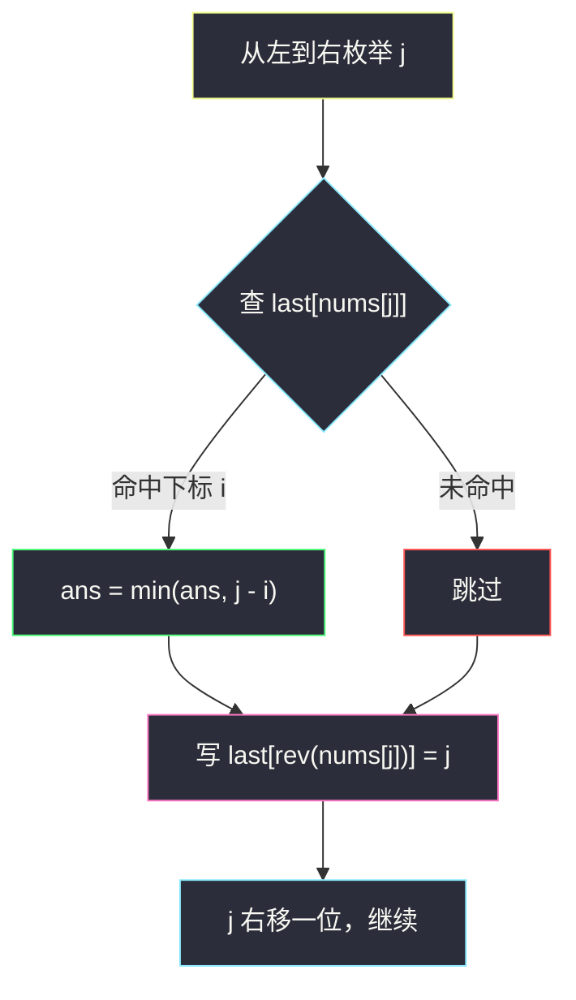
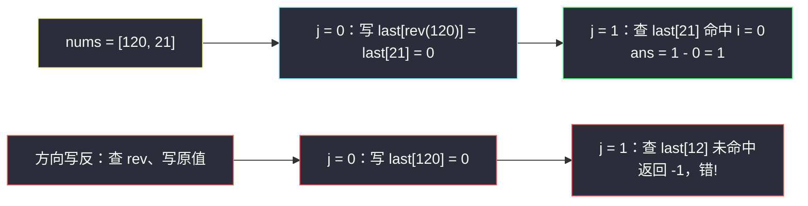

# 镜像对之间最小绝对距离（枚举右，维护左 · 哈希表只存最后出现位置）

## 一、问题描述

给你一个正整数数组 `nums`。

如果一对下标 `(i, j)` 满足 `0 <= i < j < n` 且 `reverse(nums[i]) == nums[j]`，则称之为**镜像对**，其中 `reverse(x)` 表示把 `x` 的十进制数字反转后得到的数（忽略反转后产生的前导零，例如 `reverse(120) = 21`）。

返回**任意一个镜像对**的下标之间的最小绝对距离 `abs(i - j)`；若不存在镜像对，返回 `-1`。

> 🔗 LeetCode 3761：https://leetcode.cn/problems/minimum-absolute-distance-between-mirror-pairs/
>
> 数据范围：`1 <= n <= 10^5` 量级，元素均为正整数。

**示例 1**

```text
输入：nums = [12, 21, 45, 33, 54]
输出：1
解释：镜像对有 (0, 1) 与 (2, 4)：
  reverse(12) = 21 == nums[1]，距离 1；
  reverse(45) = 54 == nums[4]，距离 2。
  最小距离为 1。
```

**示例 2**

```text
输入：nums = [120, 21]
输出：1
解释：reverse(120) = 21 == nums[1]（尾零被忽略），距离 1。
```

**示例 3**

```text
输入：nums = [21, 120]
输出：-1
解释：reverse(21) = 12 != 120，reverse(120) = 21 != 21（下标必须 i < j）。
  注意镜像关系不对称：数组倒过来答案就没了。
```

**直观理解**

这是「**枚举右，维护左**」的最纯粹形态：固定右端点 `j`，问「左边有没有一个 `nums[i]`，反转之后恰好等于 `nums[j]`？离 `j` 最近的那一个在哪？」。这类「距离最小化」的询问只需要一张哈希表存**每个候选值最后出现的下标**——与 [#219 存在重复元素 II](https://leetcode.cn/problems/contains-duplicate-ii/) 找「最近的相等对」同款骨架，唯一的花活是：**写入哈希表的键不是元素本身，而是它的反转值**（方向陷阱，见 3.3）。

---

## 二、暴力解法

双重循环枚举所有 `i < j`，逐对判断 `reverse(nums[i]) == nums[j]`：

```python
class Solution:
    def minDistance(self, nums: List[int]) -> int:
        n = len(nums)
        def rev(x: int) -> int:          # 120 -> 21
            y = 0
            while x:
                y = y * 10 + x % 10
                x //= 10
            return y

        ans = n                          # 哨兵：合法距离最大 n - 1
        for i in range(n):
            r = rev(nums[i])             # rev 结果只需算一次
            for j in range(i + 1, n):
                if nums[j] == r and j - i < ans:
                    ans = j - i
                    break                # j 越小距离越小，内层可提前结束
        return -1 if ans == n else ans
```

（内层 `break` 是一个小剪枝：固定 `i` 时最近的 `j` 一定是第一个命中的。）

### 复杂度

- **时间**：`O(n²)`；`n = 10^5` 时最坏约 `10^10` 次比较，严重超时。
- **空间**：`O(1)`。

### 🔴 瓶颈在哪里

每次都在重新扫描左边，但**左边的信息可以增量维护**：对固定的 `j`，最优搭档是「值等于 `nums[j]` 的最靠左——不对，是最靠右的那个 `rev` 结果」。既然只关心最近的 `i`，就没必要记住所有出现位置，**每个键只留最后一次出现的下标**即可。

---

## 三、优化探索（核心章节）

> 📚 本题在灵茶题单中属于 **§0.1 枚举右，维护左**（常用数据结构 A · 哈希表）。本家族入门可看 [#1512 好数对的数目](https://leetcode.cn/problems/number-of-good-pairs/)（同目录 `number-of-good-pairs.md`）与 [#2364 统计坏数对的数目](https://leetcode.cn/problems/count-number-of-bad-pairs/)（同目录 `count-number-of-bad-pairs.md`），它们用哈希表数「配对个数」；本题维护的是更强的信息——**最后出现位置**，求的是「最小距离」。

### 3.1 观察一：条件不对称，角色要分清

镜像对条件是 `reverse(nums[i]) == nums[j]`：`i` 扮演「被照的物」，`j` 扮演「镜子」。把两边角色写成对称形式：

```text
枚举镜子 j，问：左边哪个 i 的 reverse(nums[i]) 恰好等于 nums[j]？
```

也就是说，`j` 关心的键是 `nums[j]` 这个**原值**，而左边 `i` 挂在哈希表上的名字是 `reverse(nums[i])` 这个**反转值**。

### 3.2 观察二：最小距离 ⟺ 最大的 i

固定 `j` 时距离 `j - i` 要最小，即 `i` 要**尽量大**。左边同一个值可能出现多次，但只有最后一次出现（最靠右的）有用——旧的记录永远不可能更近，直接覆盖。于是哈希表只需维护：

```text
last[v] = 值 v 最近一次出现的下标
```

这就是「枚举右，维护左」在**最小化距离**类问题上的标准形态：不是数个数（`cnt`），而是存位置（`last`），且永远只保留最新的。

### 3.3 关键一步：查询用原值，写入用反转值

每个 `j` 处理时两件事，**顺序和键都要对**：

1. **先查** `last[nums[j]]`：命中说明左边某 `i` 满足 `reverse(nums[i]) == nums[j]`，用 `j - i` 更新答案；
2. **后写** `last[reverse(nums[j])] = j`：把自己挂到「反转值」名下，供未来的右端点 `j'` 查询（`reverse(nums[i]) == nums[j']` 恰好成立）。



**方向搞反的下场**（查询用 rev、写入用原值）：示例 2 `nums = [120, 21]` 会写成 `last[120] = 0`，接着查 `last[reverse(21)] = last[12]` 落空，返回 `-1`——错。正确方向：`j = 0` 写 `last[21] = 0`，`j = 1` 查 `last[21]` 命中，答案 1 ✓。



### 3.4 reverse 的实现：尾零自动消失

数值逐位反转（`y = y * 10 + x % 10`）天然处理前导零：`120 → 021 → 21`，中间的 `021` 在整数意义下就是 `21`，无需特判。也可以用字符串一行流 `int(str(x)[::-1])`，正确性相同，只是数值法更快（本题量级两者皆可过）。

注意 `rev` **不是对合**：`rev(rev(x))` 未必等于 `x`（`rev(120) = 21`，`rev(21) = 12`）——这正是镜像关系不对称的根源，也是示例 3 返回 `-1` 的原因。

### 3.5 一句话核心

> **枚举右端点 `j`：先查 `last[nums[j]]` 拿最近的镜像搭档，再写 `last[rev(nums[j])] = j`——查原值、写反转，先查后写，只存最后。**

---

## 四、代码实现

### Python（主解）

```python
from typing import List

class Solution:
    def minDistance(self, nums: List[int]) -> int:
        def rev(x: int) -> int:            # 120 -> 21，尾零自动消失
            y = 0
            while x:
                y = y * 10 + x % 10
                x //= 10
            return y

        last = {}                          # 键 v -> v 最近一次出现的下标
        ans = len(nums)                    # 哨兵：合法距离最大为 n - 1
        for j, x in enumerate(nums):
            i = last.get(x)                # 先查：左边谁的 reverse 恰好是 x
            if i is not None and j - i < ans:
                ans = j - i
            last[rev(x)] = j               # 后写：挂到反转值名下，供未来查询
        return -1 if ans == len(nums) else ans
```

**变量含义**

| 变量 | 含义 |
|------|------|
| `last` | 哈希表：值 → 该值**最近一次**出现的下标（旧的被覆盖） |
| `last.get(x)` | 左边最靠右的、`rev` 之后等于 `x` 的元素下标 |
| `rev(x)` | 数值反转；`rev` 非对合，方向不可交换 |
| `ans` | 当前最小距离；`len(nums)` 是永不可达的哨兵值 |

**循环不变式**：处理 `j` 之前，`last` 恰好记录 `nums[0..j-1]` 中每个值最后出现的下标。因此 `last.get(x)` 给出的就是与 `j` 配对可达的最小距离；**先查后写**保证 `j` 不会查到自己（回文数如 `33`，`rev(33) = 33`，若先写就会算出距离 0 的假对）。

**字符串版 rev（等价替换）**

```python
def rev(x: int) -> int:
    return int(str(x)[::-1])
```

---

## 五、例子演示

端到端跟踪示例 1：`nums = [12, 21, 45, 33, 54]`，初始 `last = {}`，`ans = 5`（哨兵）。

**逐步跟踪（每步给查询结果、答案、写入后哈希表全貌）**

| j | nums[j] | 先查 last[nums[j]] | 命中? | ans | 后写 last[rev(nums[j])] = j | 写入后 last 全貌 |
|---|---------|--------------------|-------|-----|------------------------------|------------------|
| 0 | 12 | `last.get(12)` = 无 | 否 | 5 | `last[rev(12)=21] = 0` | `{21: 0}` |
| 1 | 21 | `last.get(21)` = 0 | **是** | min(5, 1-0) = **1** | `last[rev(21)=12] = 1` | `{21: 0, 12: 1}` |
| 2 | 45 | `last.get(45)` = 无 | 否 | 1 | `last[rev(45)=54] = 2` | `{21: 0, 12: 1, 54: 2}` |
| 3 | 33 | `last.get(33)` = 无 | 否 | 1 | `last[rev(33)=33] = 3` | `{21: 0, 12: 1, 54: 2, 33: 3}` |
| 4 | 54 | `last.get(54)` = 2 | **是** | min(1, 4-2) = 1 | `last[rev(54)=45] = 4` | `{21: 0, 12: 1, 54: 2, 33: 3, 45: 4}` |

循环结束 `ans = 1`，返回 **1** ✓。两个命中点：`j = 1` 找到镜像 `12`（距离 1），`j = 4` 找到镜像 `45`（距离 2，没能刷新）。

**示例 2 验证**：`nums = [120, 21]`——

| j | nums[j] | 查 | 命中? | ans | 写 |
|---|---------|-----|-------|-----|-----|
| 0 | 120 | 无 | 否 | 2 | `last[21] = 0`（`rev(120) = 21`） |
| 1 | 21 | `last[21]` = 0 | **是** | **1** | `last[12] = 1`（`rev(21) = 12`） |

返回 **1** ✓。

**示例 3 验证**：`nums = [21, 120]`——`j = 0` 写 `last[12] = 0`；`j = 1` 查 `last[120]` 落空，写 `last[21] = 1`；`ans` 保持哨兵，返回 **-1** ✓。注意 `j = 0` 时若先写后查也不会误命中（`rev(21) = 12 != 21`），但回文数情形（如 `nums = [33, 33]`）就必须靠「先查后写」避免把 `j` 配给自己——统一先查后写最稳。

---

## 六、复杂度分析

| 方法 | 时间 | 空间 | 说明 |
|------|------|------|------|
| 暴力双循环 | `O(n²)` | `O(1)` | `n = 10^5` 超时 |
| 枚举右维护左（主解） | `O(n · d)` | `O(n)` | `d` 为元素十进制位数（量级 ≤ 10，视作常数即 `O(n)`） |

- **时间**：每个 `j` 做一次哈希查询 + 一次 `rev` 计算（`d` 次除法取模）+ 一次哈希写入，总计线性量级。
- **空间**：哈希表最多存 `n` 个键（每个 `rev` 值至多一条最新记录），`O(n)`。

---

## 七、对比总结

**「枚举右，维护左」家族的哈希表分工**：

| 子家族 | 哈希表存什么 | 代表题 |
|--------|--------------|--------|
| 数配对个数 | `cnt[v]` = 左边 v 出现次数 | #1512 / #2364（`count-number-of-bad-pairs.md`） |
| 求最小距离 | `last[v]` = 左边 v **最后**出现的下标 | #219、本题 |
| 求前缀信息 | `cnt` + 边扫边算（前缀和哈希） | #560 / #974 |
| 左边结构升级 | 树状数组代替哈希（要按值求和） | #315、§8.2 逆序对 |

**易错点**

1. **方向别搞反**：查询键是**原值** `nums[j]`，写入键是**反转值** `rev(nums[j])`。一句话记忆：「镜子查自己（原值），登记照出的像（反转值）」。
2. **先查后写**：回文数（`rev(x) == x`）会让 `j` 的写入键与查询键相同，颠倒顺序会算出假距离 0。
3. **只存最后出现位置**：存「所有位置列表 + 二分」也能做（`O(n log n)`），但最小距离问题里旧位置永远无用，覆盖即可。
4. **rev 非对合**：`(i, j)` 是镜像对不代表 `(j, i)` 也是（示例 3），别脑补对称性去「双向都查」。
5. 不存在镜像对时返回 `-1`：用哨兵 `ans = n`（合法距离上界是 `n - 1`）判断，避免额外布尔标记。

**模板（最小距离版 · 枚举右维护左）**

```python
last = {}                          # 键 -> 最后出现的下标
ans = 哨兵
for j, x in enumerate(nums):
    i = last.get(x)                # 先查：左边的搭档在哪
    if i is not None:
        ans = min(ans, j - i)      # 只关心最近 ⇒ 只存最后 ⇒ 一查即最优
    last[<x 的登记键>] = j         # 后写：本题登记键 = rev(x)
```

---

## 八、举一反三

| 题目 | 关系 |
|------|------|
| [219. 存在重复元素 II](https://leetcode.cn/problems/contains-duplicate-ii/) | 同骨架鼻祖：`last[v]` 判 `j - i <= k`，本题把「相等」换成「反转相等」 |
| [220. 存在重复元素 III](https://leetcode.cn/problems/contains-duplicate-iii/) | 距离 + 值域双重限制，哈希升级成滑动窗口 + 有序集合 / 桶 |
| [1814. 统计一个数组中好对子的数目](https://leetcode.cn/problems/count-nice-pairs-in-an-array/) | rev 家族姊妹题：key = `nums[k] + rev(nums[k])`，数配对个数 |
| [1512. 好数对的数目](https://leetcode.cn/problems/number-of-good-pairs/) | 家族入门，同目录 `number-of-good-pairs.md` |
| [2364. 统计坏数对的数目](https://leetcode.cn/problems/count-number-of-bad-pairs/) | 条件变形 + 正难则反，同目录 `count-number-of-bad-pairs.md` |
| [1010. 总持续时间可被 60 整除的歌曲](https://leetcode.cn/problems/pairs-of-songs-with-total-durations-divisible-by-60/) | 余数互补配对计数 |
| [307. 区域和检索 - 数组可修改](https://leetcode.cn/problems/range-sum-query-mutable/) | 「维护左」的另一种载体：同批 `range-sum-query-mutable.md`（树状数组） |
| [1850. 邻位交换的最小次数](https://leetcode.cn/problems/minimum-adjacent-swaps-to-reach-the-kth-smallest-number/) | 同批 `minimum-adjacent-swaps-to-reach-the-kth-smallest-number.md`，逆序对计数本质也是「枚举右维护左」 |

**思想迁移**

- 求配对**最小距离**：哈希表存「最后出现位置」，一查即最优——不要存全部位置。
- 配对条件含函数（`rev`、`rev + 自身`、移项变形）时，把「左边登记的键」变成函数作用后的结果，右边用原值查——**键要按「谁问谁答」的方向设计**。
- 哈希表只能答「有没有 / 最近在哪」；要按**值的大小**统计（比它大的有几个），就升级为树状数组 / 归并——这正是 §8.1、§8.2 的主线。
- 口诀：**「最近距离存最后，查原值、写反转；先查后写防自配，不对称别脑补。」**
