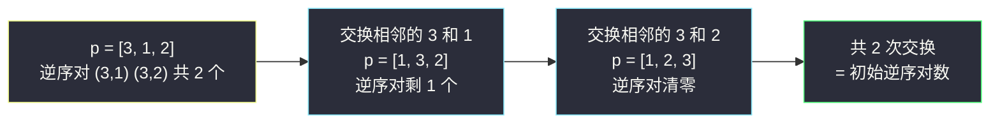
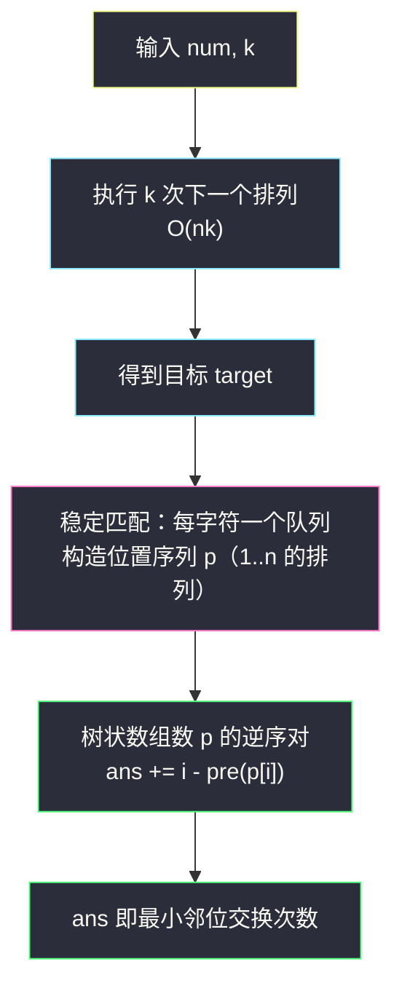

# 邻位交换的最小次数（下一个排列 + 树状数组数逆序对）

## 一、问题描述

给你一个表示大整数的字符串 `num`，和一个整数 `k`。你可以对 `num` 执行任意次**邻位交换**（交换相邻两个数字）。

「第 `k` 个最小排列」定义：对 `num` **连续执行 `k` 次「下一个排列」操作**得到的结果（即比 `num` 大的排列中第 `k` 小的那个）。

返回把 `num` 变成第 `k` 个最小排列所需的**最小邻位交换次数**。

> 🔗 LeetCode 1850：https://leetcode.cn/problems/minimum-adjacent-swaps-to-reach-the-kth-smallest-number/
>
> 数据范围：`2 <= num.length <= 1000`，`1 <= k <= 1000`，`num` 只包含数字。

**示例 1**

```text
输入：num = "5489355142", k = 4
输出：2
解释：第 4 个最小排列是 "5489355421"，5489355142 -> 5489355421 最少交换 2 次。
```

**示例 2**

```text
输入：num = "11112", k = 4
输出：4
解释：第 4 个最小排列是 "21111"，需要把末尾的 2 一路换到最前面，共 4 次。
```

**直观理解**

这道题是两块积木的拼装题：

1. **目标是谁**——连续 `k` 次「下一个排列」（[#31 下一个排列](https://leetcode.cn/problems/next-permutation/) 的模板复用）；
2. **最少换几次**——两个字符串之间的最小邻位交换次数，本质是一个**逆序对计数**问题，用灵茶 §8.1 的树状数组（见同批 `range-sum-query-mutable.md`）加速到 `O(n log n)`。

---

## 二、暴力解法

第一步怎么都绕不开：先执行 `k` 次「下一个排列」拿到目标串 `target`（每次 `O(n)`，共 `O(nk)`，`n, k <= 1000` 完全可过）。

第二步暴力：贪心**逐位就位**——第 `i` 位要对齐 `target[i]`，就在当前串里从 `i` 开始向右找第一个等于 `target[i]` 的字符，把它一路邻位交换挪到位置 `i`：

```python
class Solution:
    def getMinSwaps(self, num: str, k: int) -> int:
        n = len(num)
        target = list(num)
        for _ in range(k):                    # 第一步：k 次下一个排列
            self._next_permutation(target)

        b = list(num)                         # 第二步：从 num 逐步就位到 target
        ans = 0
        for i in range(n):
            j = i
            while b[j] != target[i]:          # 找最靠前的同字符（稳定匹配）
                j += 1
            while j > i:                      # 邻位交换冒泡到位置 i
                b[j], b[j - 1] = b[j - 1], b[j]
                j -= 1
                ans += 1
        return ans

    # _next_permutation 模板与第四章主解完全同款，此处略
```

### 复杂度

- **时间**：`O(nk + n²)`；`n = k = 1000` 时约 `2 * 10^6`，能过，但 `n` 放大到 `10^5` 就死。
- **空间**：`O(n)`。

### 🔴 瓶颈在哪里

第二步的「逐位找 + 冒泡」是 `O(n²)`：每挪一个字符都要线性扫一遍。注意到交换次数其实**不用模拟出来**——它有一个漂亮的封闭形式：逆序对个数。

---

## 三、优化探索（核心章节）

> 📚 本题在灵茶题单中属于 **§8.2 逆序对**（数据结构篇 · 树状数组求逆序对），同时复用 §8.1 树状数组模板（同批 `range-sum-query-mutable.md` 讲透了 lowbit 与建树）与「下一个排列」模板（#31）。

### 3.1 第一步：下一个排列（#31 模板）

要「恰好大一点点」的排列：从右往左找**第一个升位** `a[i] < a[i+1]`（其后是递减尾巴），再从右往左找**第一个大于 `a[i]` 的数 `a[j]`**（尾巴中最小的大者），交换二者，最后把尾巴反转成升序——尾巴从「最大排列」变成「最小排列」，整体恰好变大最少。找不到升位说明已是最大排列（本题保证 `k` 步内不会遇到）。

### 3.2 第二步：最小邻位交换次数 = 逆序对数

先看无重复字符的干净情形。把**目标** `target` 的每个字符映射到它在**原串** `num` 中的位置，得到位置序列 `p`（此时 `p` 是 `0..n-1` 的一个排列）。

```text
num    = 5 4 8 9 3 5 5 1 4 2     （下标 0..9）
target = 5 4 8 9 3 5 5 4 2 1
p      = 0 1 2 3 4 5 6 8 9 7     （target 每个字符来自原串哪个位置）
```

**定理**：`num` 变成 `target` 的最小邻位交换次数 = `p` 中逆序对的个数（`i < j` 但 `p[i] > p[j]` 的对数）。

两面证明（都是一句话）：

- **下界**：一次邻位交换只交换相邻两个元素，`p` 的逆序对数每次**至多变化 1**；目标是逆序对清零（变成 `0,1,...,n-1`），所以至少要换「初始逆序对数」次。
- **上界**：只要还有逆序对，就一定存在**相邻**的逆序对（`p[i] > p[i+1]`），交换它恰好让总数减 1；照此逐步消除即可达到下界。



### 3.3 重复字符：稳定匹配

本题 `num` 可含重复数字（示例 2 全是 1 和 2）。约定：`target` 中某字符**第 `t` 次出现**，对应原串中该字符**第 `t` 次出现**的位置（同字符按出现顺序一一配对，即「稳定匹配」）。实现上每个字符开一个队列，按序 `popleft` 即可。

为什么稳定匹配最优：相同字符之间怎么互换最终串都一样，但非稳定配对会**人为制造交叉**（多出逆序对），白白多换。稳定匹配是所有合法配对中交叉最少的那种。

于是流程串成一条线：



### 3.4 树状数组数逆序对（§8.2 核心）

`p` 是 `1..n` 的排列，值就是「位置」——**天然离散化完毕，无需排序去重**。从左到右枚举 `p[i]`，树状数组维护「左边已出现过的值」的计数（本质还是「枚举右，维护左」，只是左边信息用树状数组而不是哈希表，因为它要按值前缀求和）：

```text
ans += i - pre(p[i])      # 左边已插入 i 个，其中大于 p[i] 的都和它构成逆序对
add(p[i], 1)              # 把 p[i] 登记进树状数组
```

（等价写法是从右往左数「右边比它小的」：`ans += pre(p[i] - 1)`，两者互为镜像。）

### 3.5 一句话核心

> **先 `k` 次 next permutation 定目标，再稳定匹配得到位置排列 `p`，答案 = `p` 的逆序对数——每次邻位交换恰好消灭一个逆序对。**

---

## 四、代码实现

### Python（主解）

```python
from collections import defaultdict, deque

class Solution:
    def getMinSwaps(self, num: str, k: int) -> int:
        n = len(num)

        # 第一步：执行 k 次下一个排列，得到目标 target
        target = list(num)
        for _ in range(k):
            self._next_permutation(target)

        # 第二步：稳定匹配，构造位置序列 p（0 起下标 +1 转 1 起）
        pos = defaultdict(deque)                # 字符 -> 出现下标的队列
        for i, ch in enumerate(num):
            pos[ch].append(i + 1)
        p = [pos[ch].popleft() for ch in target]

        # 第三步：树状数组数 p 的逆序对
        c = [0] * (n + 1)

        def add(i: int) -> None:
            while i <= n:
                c[i] += 1
                i += i & -i

        def pre(i: int) -> int:                 # 值域上 <= i 的已插入个数
            s = 0
            while i > 0:
                s += c[i]
                i -= i & -i
            return s

        ans = 0
        for i, v in enumerate(p):
            ans += i - pre(v)                   # 左边比 v 大的个数
            add(v)
        return ans

    @staticmethod
    def _next_permutation(a: list) -> None:
        n = len(a)
        i = n - 2
        while i >= 0 and a[i] >= a[i + 1]:      # 从右找第一个升位
            i -= 1
        if i >= 0:
            j = n - 1
            while a[j] <= a[i]:                 # 从右找第一个大于 a[i] 的
                j -= 1
            a[i], a[j] = a[j], a[i]
        a[i + 1:] = a[i + 1:][::-1]             # 后缀反转成升序（最小）
```

**变量含义**

| 变量 | 含义 |
|------|------|
| `target` | `num` 连续 `k` 次下一个排列的结果 |
| `pos[ch]` | 字符 `ch` 在原串中的下标队列（升序） |
| `p[i]` | `target[i]` 稳定匹配到原串的下标（1 起） |
| `c` / `pre(v)` | 树状数组：已插入的值中 ≤ `v` 的个数 |
| `i - pre(v)` | 左边已插入 `i` 个里严格大于 `v` 的个数 |

**循环不变式**：处理 `p[i]` 前，树状数组恰好登记了 `p[0..i-1]`，因此 `i - pre(v)` 就是「左边大于当前值」的逆序对贡献——先查后插，不会自己配自己。

---

## 五、例子演示

端到端跟踪示例 1：`num = "5489355142"`，`k = 4`。

**第 1 步：4 次「下一个排列」（每步给升位 i、交换位 j、结果）**

| 次数 | 当前串 | 升位 i（a[i]<a[i+1]） | 交换 j（右起第一个 > a[i]） | 交换并反转后缀后 |
|------|--------|------------------------|------------------------------|-------------------|
| 1 | `5489355142` | 7（`1 < 4`） | 9（`2 > 1`） | `5489355214` |
| 2 | `5489355214` | 8（`1 < 4`） | 9 | `5489355241` |
| 3 | `5489355241` | 7（`2 < 4`） | 8 | `5489355412` |
| 4 | `5489355412` | 8（`1 < 2`） | 9 | `5489355421` |

得到 `target = "5489355421"`。

**第 2 步：稳定匹配构造 p**（原串队列：`'5':[1,6,7]`，`'4':[2,9]`，`'8':[3]`，`'9':[4]`，`'3':[5]`，`'1':[8]`，`'2':[10]`，均已 +1 转 1 起）

| i | target[i] | 队列弹出 | p[i] |
|---|-----------|----------|------|
| 0 | 5 | `'5'` 队首 1 | 1 |
| 1 | 4 | `'4'` 队首 2 | 2 |
| 2 | 8 | `'8'` 队首 3 | 3 |
| 3 | 9 | `'9'` 队首 4 | 4 |
| 4 | 3 | `'3'` 队首 5 | 5 |
| 5 | 5 | `'5'` 队首 6 | 6 |
| 6 | 5 | `'5'` 队首 7 | 7 |
| 7 | 4 | `'4'` 队首 9 | 9 |
| 8 | 2 | `'2'` 队首 10 | 10 |
| 9 | 1 | `'1'` 队首 8 | 8 |

`p = [1, 2, 3, 4, 5, 6, 7, 9, 10, 8]`——只有最后两个「乱了序」。

**第 3 步：树状数组数逆序对（每步给贡献与插入后的桶状态 c[1..10]）**

| i | v = p[i] | 左边已插入 | pre(v)（≤ v 的个数） | 贡献 | 插入后 c[1..10] |
|---|----------|------------|----------------------|------|------------------|
| 0 | 1 | 0 | 0 | 0 | `1 1 0 1 0 0 0 1 0 0` |
| 1 | 2 | 1 | 1 | 0 | `1 2 0 2 0 0 0 2 0 0` |
| 2 | 3 | 2 | 2 | 0 | `1 2 1 3 0 0 0 3 0 0` |
| 3 | 4 | 3 | 3 | 0 | `1 2 1 4 0 0 0 4 0 0` |
| 4 | 5 | 4 | 4 | 0 | `1 2 1 4 1 1 0 5 0 0` |
| 5 | 6 | 5 | 5 | 0 | `1 2 1 4 1 2 0 6 0 0` |
| 6 | 7 | 6 | 6 | 0 | `1 2 1 4 1 2 1 7 0 0` |
| 7 | 9 | 7 | 7 | 0 | `1 2 1 4 1 2 1 7 1 1` |
| 8 | 10 | 8 | 8 | 0 | `1 2 1 4 1 2 1 7 1 2` |
| 9 | 8 | 9 | 7（`pre(8) = c[8]`，一步命中） | **2** | `1 2 1 4 1 2 1 8 1 2` |

`i = 9` 这步：左边已插 9 个值 `1..7, 9, 10`，其中大于 8 的有 `9` 和 `10` 两个——对应两个逆序对 `(9, 8)`、`(10, 8)`，即 `p` 里的 `(8 位置的 9, 10)` 与结尾的 `8` 交叉。

**答案 = 0 + ... + 0 + 2 = 2** ✓ 与官方输出一致。

**示例 2 快速验证**：`"11112"` 执行 4 次 → `12111 → 11211 → 12111(重排后) → ... → 21111`，`target = "21111"`。稳定匹配：`'2'` 的下标 5，四个 `'1'` 依次取下标 `1, 2, 3, 4`，`p = [5, 1, 2, 3, 4]`。逆序对：`5` 与后面 4 个数各构成一对，共 **4** ✓。

---

## 六、复杂度分析

| 方法 | 时间 | 空间 | 说明 |
|------|------|------|------|
| 暴力（贪心逐位就位） | `O(nk + n²)` | `O(n)` | `n = k = 1000` 约 `2 * 10^6`，能过 |
| 主解（树状数组） | `O(nk + n log n)` | `O(n)` | 第二步压掉一个 `n`，放大到 `n = 10^5` 也稳 |

- **时间**：`k` 次下一个排列每次 `O(n)`；匹配 `O(n)`；逆序对计数 `n` 次树状数组操作各 `O(log n)`。
- **空间**：`target`、`pos` 队列、`p`、树状数组 `c` 均为 `O(n)`。

（第一步的 `O(nk)` 还能再优化——换成类似阶乘进位制的跳跃法，但涉及重复字符时实现繁琐，且 `k <= 1000` 下毫无必要。）

---

## 七、对比总结

**本题两块积木的分工**：求目标用 `k` 次 next permutation（`O(nk)`，够用不换）；算交换数用稳定匹配 + 树状数组逆序对（把暴力第二步的 `O(n²)` 压成 `O(n log n)`）。

**易错点**

1. **重复字符必须稳定匹配**：同一个字符不能乱配——`popleft` 队列保证「第 t 次出现配第 t 次出现」，否则会多算逆序对。
2. **逆序对的方向**：`i - pre(v)` 数的是「左边比我大」；若写成 `pre(v)` 会数成「左边比我小」（那是顺序对）。
3. **next permutation 边界**：找不到升位时 `i = -1`，后缀反转仍要执行（整体变最小排列）；本题保证不触发。
4. **树状数组 1 起**：`p` 构造时下标统一 `+1`，复用 §8.1 模板时别再偏移一次。
5. 比较字符时用 `>=` / `<=`（处理重复字符），严格不等号在有重复时会把「相等跳过」逻辑写错。

---

## 八、举一反三

| 题目 | 关系 |
|------|------|
| [31. 下一个排列](https://leetcode.cn/problems/next-permutation/) | 积木一的单机版，必须先练熟 |
| [556. 下一个更大元素 III](https://leetcode.cn/problems/next-greater-element-iii/) | 下一个排列套在整数上，注意溢出判断 |
| [60. 排列序列](https://leetcode.cn/problems/permutation-sequence/) | 「第 k 个排列」的另一种问法：阶乘进位制直接构造 |
| [315. 计算右侧小于当前元素的个数](https://leetcode.cn/problems/count-of-smaller-numbers-after-self/) | 积木二的裸题：离散化 + 树状数组 |
| [493. 翻转对](https://leetcode.cn/problems/reverse-pairs/) | 逆序对变式（`2x` 判定），归并或树状数组均可 |
| [775. 全局倒置与局部倒置](https://leetcode.cn/problems/global-and-local-inversions/) | 逆序对概念题：全局逆序 vs 相邻逆序 |
| [剑指 Offer 51. 数组中的逆序对](https://leetcode.cn/problems/shu-zu-zhong-de-ni-xu-dui-lcof/) | 逆序对入门首选（归并写法） |
| [307. 区域和检索 - 数组可修改](https://leetcode.cn/problems/range-sum-query-mutable/) | 同批 `range-sum-query-mutable.md`：本篇树状数组的根基篇，先读它 |

**思想迁移**

- 「最小邻位交换把 A 变成 B」**= 匹配位置序列的逆序对数**——这是一个可背的结论，出现「相邻交换次数」字样就往逆序对上想。
- 逆序对两条腿：**树状数组**（离散化后数左边/右边比它大/小的个数）与**归并排序**（merge 时数跨区间对）。前者好写好记，后者不改值域，现场按熟练度选。
- 口诀：**「定目标靠 next perm，算交换数逆序对；相邻一换灭一逆，稳定匹配不添乱。」**
