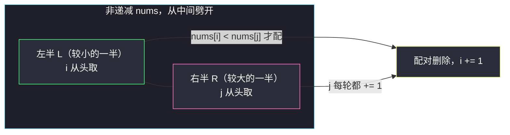

# 删除数对后的最小数组长度（排序对半配对 · 众数下界）

## 一、问题描述

给你一个下标从 0 开始的**非递减**整数数组 `nums`。

你可以执行以下操作任意次（含 0 次）：

- 选择两个下标 `i` 和 `j`，满足 `nums[i] < nums[j]`；
- 将 `nums` 中下标 `i` 和 `j` 处的元素删除，剩余元素按原顺序重排、下标重新编号。

请返回执行任意次操作后 `nums` 的**最小**长度。

> 🔗 LeetCode 2856：https://leetcode.cn/problems/minimum-array-length-after-pair-removals/
>
> 数据范围：`1 <= nums.length <= 10^5`，`1 <= nums[i] <= 10^9`，`nums` 非递减。

**示例 1**

```
输入：nums = [1,2,3,4]
输出：0
解释：删 (1,2)、(3,4)，数组清空。
```

**示例 2**

```
输入：nums = [1,1,2,2,3,3]
输出：0
解释：删 (1,2)、(1,3)、(2,3)，数组清空。
```

**示例 3**

```
输入：nums = [1000000000,1000000000]
输出：2
解释：两数相等，不满足 nums[i] < nums[j]，一个都删不掉。
```

**示例 4**

```
输入：nums = [2,3,4,4,4]
输出：1
解释：删 (2,4)、(3,4)，剩 [4]。
```

**直观理解**

数组**已经有序**，所以任何一对 `(nums[i], nums[j])`（`i < j`）能否删除只取决于两值是否**严格不等**。问题等价于：把元素配成尽量多的对，每对两值不同（小配大），求剩下的元素个数。这是灵茶题单 **§1.8 相邻不同**（不同才能配对）的代表题：**排序后从"小的一半"和"大的一半"两端配对**，而当某个值出现次数超过一半时，配对被"值相同"卡住，剩余个数由众数出现次数直接决定。

---

## 二、暴力解法

### 2.1 乱删的教训：删除顺序影响结果

最直觉的模拟是"每轮找到第一个可删对就删"：

```python
class Solution:
    def minLengthAfterRemovals(self, nums: List[int]) -> int:
        arr = nums[:]
        changed = True
        while changed:
            changed = False
            for i in range(len(arr)):
                for j in range(i + 1, len(arr)):
                    if arr[i] < arr[j]:
                        arr.pop(j); arr.pop(i)     # 删掉这一对
                        changed = True
                        break
                if changed: break
        return len(arr)
```

但**乱删不最优**。反例 `nums = [1,1,1,2,3]`：先删 `(2,3)`（它们排在最后被外层先扫到时未必先删，但假设某轮删了它）剩 `[1,1,1]`，长度 3；而先删 `(1,2)`、再删 `(1,3)` 剩 `[1,1]`，长度 2。删除顺序必须讲究。

### 2.2 DFS 枚举所有删除序列

```python
class Solution:
    def minLengthAfterRemovals(self, nums: List[int]) -> int:
        def dfs(arr):
            best = len(arr)
            for i in range(len(arr)):
                for j in range(i + 1, len(arr)):
                    if arr[i] < arr[j]:
                        nxt = arr[:i] + arr[i+1:j] + arr[j+1:]
                        best = min(best, dfs(nxt))
            return best
        return dfs(nums)
```

- **时间**：状态是"剩余子序列"，最坏 `O(2^n)` 级别，`n = 10^5` 直接爆炸。
- **空间**：递归栈 + 子序列拷贝，同样指数级。

### 🔴 瓶颈在哪里

配对能否成立只看**两个值是否不等**，与顺序、位置无关——这提示把问题从"序列"抽象成"多重集合的配对"，用计数和排序结构一次性求出最大配对数，而不是一步步模拟删除。

---

## 三、优化探索（核心章节）

> 📚 本题在灵茶题单中属于 **§1.8 相邻不同**：配对的唯一障碍是"值相等"（相邻相同的元素不能互配）。讲法对齐灵神模板：**排序后小的一半配大的一半**；出现次数超过一半的众数会顶出下界 `2*cnt - n`。

### 3.1 下界：众数卡住配对数

设某值 `v` 出现 `cnt` 次。每删一对，至多消耗**一个** `v`（另一元素必须与 `v` 不等），而全场非 `v` 元素只有 `n - cnt` 个，所以配对数 `m <= n - cnt`，剩余长度：

```text
剩余 >= n - 2(n - cnt) = 2*cnt - n
```

取 `v` 为众数（`cnt` 最大）即得最强下界。另外剩余长度与 `n` 同奇偶，故剩余 >= `n % 2`。**下界 = max(n % 2, 2*cnt - n)**（当 `2*cnt <= n` 时退化为 `n % 2`）。

示例 4 中众数 `4` 出现 3 次，`2*3 - 5 = 1`，恰好是答案：每个非 4 元素（`2` 和 `3`）各能陪一个 `4` 配成一对，共 2 对，剩下孤零零一个 `4` 谁也配不上。

### 3.2 上界构造：排序对半配对（交换论证）

把数组从中间劈开：左半 `L = nums[0..⌈n/2⌉)`（较小的一半），右半 `R = nums[⌈n/2⌉..n)`。



**为什么"小配大"不劣（交换论证）**：设最优方案中某对 `(a, b)` 两元素都来自左半，而右半有元素 `c` 未配对（配对数 `m <= ⌊n/2⌋ <= |R|`，若左半元素"内耗"则右半必有闲置）。因 `a < b <= c`（`b` 在左半、`c` 在右半），可重组为 `(a, c)`——仍然合法，配对数不减。反复重组后，**存在全部跨中线的最优方案**。跨中线方案中配对数不超过右半元素数 `⌊n/2⌋`，而贪心逐个让最小的未配左元素去够当前右元素，恰好取得该情形下的最大匹配。

### 3.3 双指针模板与"配不上时 j 前进"

```text
i = 0                       # 左半指针（也是已配对数）
for j in range(⌈n/2⌉, n):   # 右半指针，每轮前进
    if nums[i] < nums[j]:
        i += 1              # 配对成功：消耗一个左元素
    # 配不上（nums[i] == nums[j]）：j 前进，i 原地等待更大的搭档
return n - 2 * i
```

配不上意味着 `nums[i] == nums[j]`（非递减下 `nums[i] <= nums[j]`），此时中间隔着一堵"相等的墙"。让 `j` 继续向右找更大的值，`i` 留在原地——`i` 是当前最小的未配元素，它配后面更大的 `j'` 与配当前 `j` 一样只算一对，把它消耗在这里不亏。

### 3.4 等价捷径：直接数众数

双指针结果恒等于 `max(n % 2, 2*cnt - n)`（`cnt` 为众数出现次数）：`2*cnt <= n` 时总能配到只剩奇偶性允许的余数；否则众数配不完，剩余恰为 `2*cnt - n`。于是还有个 `O(n)` 计数写法（连数组有序都不需要）：

```python
from collections import Counter

class Solution:
    def minLengthAfterRemovals(self, nums: List[int]) -> int:
        n = len(nums)
        cnt = max(Counter(nums).values())
        return max(n % 2, 2 * cnt - n)
```

两种写法互相印证：双指针是"对半配对"的通用模板（可迁移到 #2576 等），计数版是本题的特化捷径。

### 3.5 一句话核心

> **小半配大半，能配就消耗一个最小者；配不上就让大者继续前进。众数超半时，剩余 = 2·cnt − n。**

---

## 四、代码实现

### Python（主解：对半双指针）

```python
class Solution:
    def minLengthAfterRemovals(self, nums: List[int]) -> int:
        n = len(nums)
        i = 0                                  # 已配对数 = 已消耗的左元素数
        for j in range((n + 1) // 2, n):       # j 扫右半
            if nums[i] < nums[j]:              # 能配：小配大
                i += 1
            # 配不上：nums[i] == nums[j]，j 前进找更大的搭档
        return n - 2 * i
```

**变量含义**

| 变量 | 含义 |
|------|------|
| `i` | 左半指针，同时是成功配对数 |
| `(n + 1) // 2` | 右半起点（⌈n/2⌉），保证左半元素不多于右半 |
| `nums[i] < nums[j]` | 配对合法性（非递减下即"两值不等"） |
| `n - 2 * i` | 剩余长度：每个配对删 2 个 |

题目保证输入已排序；若拿到的无序，先 `sort()`（不影响复杂度量级）。

---

## 五、具体例子演示

### 示例 1：nums = [1,2,3,4]（n = 4，右半从 ⌈4/2⌉ = 2 开始）

| 轮 | i | nums[i] | j | nums[j] | 决策 | 已配对 |
|----|---|---------|---|---------|------|--------|
| 1 | 0 | 1 | 2 | 3 | `1 < 3` ✓ 配对 (1,3)，`i → 1` | 1 |
| 2 | 1 | 2 | 3 | 4 | `2 < 4` ✓ 配对 (2,4)，`i → 2` | 2 |

`j` 到 4 越界结束，剩余 `4 - 2*2 = 0` ✓（实际方案 `(1,2),(3,4)` 同样全删，配对方式不唯一，数量唯一）。

### 示例 4：nums = [2,3,4,4,4]（n = 5，右半从 ⌈5/2⌉ = 3 开始）

| 轮 | i | nums[i] | j | nums[j] | 决策 | 已配对 | 剩余状态 |
|----|---|---------|---|---------|------|--------|-----------|
| 1 | 0 | 2 | 3 | 4 | `2 < 4` ✓ 配 (2,4)，`i → 1` | 1 | `[3,4,4]` |
| 2 | 1 | 3 | 4 | 4 | `3 < 4` ✓ 配 (3,4)，`i → 2` | 2 | `[4]` |

剩余 `5 - 2*2 = 1` ✓。计数版验证：众数 4 出现 3 次，`max(5 % 2, 2*3 - 5) = max(1, 1) = 1` ✓。

### 相等的墙：nums = [1,1,1,2]（n = 4）

| 轮 | i | nums[i] | j | nums[j] | 决策 | 已配对 | 剩余状态 |
|----|---|---------|---|---------|------|--------|-----------|
| 1 | 0 | 1 | 2 | 1 | `1 < 1` ✗ **跳过**（j 前进，i 原地等） | 0 | `[1,1,1,2]` |
| 2 | 0 | 1 | 3 | 2 | `1 < 2` ✓ 配 (1,2)，`i → 1` | 1 | `[1,1]` |

剩余 `4 - 2 = 2` ✓。三个 `1` 只有一个能配到外面的 `2`，众数下界 `2*3 - 4 = 2` 恰好顶满。第 1 轮展示的"跳过"正是 §3.3 说的：`j = 2` 处是一堵与 `nums[0]` 相等的墙，硬凑无意义，让 `j` 去找更大的 `2`。

---

## 六、复杂度分析

| 方法 | 时间 | 空间 |
|------|------|------|
| DFS 枚举删除序列 | 指数级 | 指数级 |
| **对半双指针** | **`O(n)`** | **`O(1)`** |
| 计数捷径 | `O(n)` | `O(n)`（哈希表） |

- **时间**：`i`、`j` 各自单调前进，一趟扫描 `O(n)`；输入本身有序，连排序都省了。
- **空间**：双指针版 `O(1)`；计数版需要哈希表 `O(n)`。

---

## 七、对比总结

**方法演进**：模拟乱删（顺序敏感，非最优）→ DFS 枚举（指数）→ 对半双指针（`O(n)`）。本质是把"删除的动态过程"静态化成"最大配对数"问题。

**双指针版与计数版的取舍**

| 维度 | 对半双指针 | 众数计数 |
|------|-----------|----------|
| 是否要求有序 | 需要（本题已给） | 不需要 |
| 可迁移性 | 高（对半配对是通用模板） | 低（依赖"仅等值不可配"） |
| 空间 | `O(1)` | `O(n)` |

**易错点**

1. **右半起点是 `⌈n/2⌉`**：`(n + 1) // 2`。写成 `n // 2` 在 `n` 为奇数时左半会比右半多一个元素，虽然多数情况碰巧不影响结果，但模板就不再对齐"每对恰用一个右元素"的证明。
2. **配不上时动 `j` 不动 `i`**：写成 `i += 1` 会把宝贵的最小元素白白扔掉；`i` 必须留给后面更大的 `j`。
3. **条件是严格小于**：`nums[i] < nums[j]`，相等不可删（示例 3：两个 `10^9` 谁也动不了谁）。
4. **别把答案写成 `n % 2` 就完事**：只有 `2*cnt <= n` 时才退化为奇偶余数；众数超半必须给 `2*cnt - n` 留位置。
5. 输入**已排序**是本题白送的条件，双指针版不要再 `sort()`；若误删排序反而多花 `O(n log n)`。

---

## 八、举一反三

| 题目 | 关系 |
|------|------|
| [2576. 求出最多标记下标](https://leetcode.cn/problems/find-the-maximum-number-of-marked-indices/) | 最亲缘：配对约束换成 `2*nums[i] <= nums[j]`，同样排序对半双指针，见同目录 `find-the-maximum-number-of-marked-indices.md` |
| [169. 多数元素](https://leetcode.cn/problems/majority-element/) | 众数视角的另一面：`2*cnt - n > 0` 正是"多数元素存在"的判据 |
| [1047. 删除字符串中的所有相邻重复项](https://leetcode.cn/problems/remove-all-adjacent-duplicates-in-string/) | 同为"消去配对"家族，但约束是**相邻相同**才删（栈消去），与本题"不同才删"正好相反 |
| [870. 优势洗牌](https://leetcode.cn/problems/advantage-shuffle/) | 排序配对的进阶形态（灵茶题单 §1.3），双序列田忌赛马 |

**思想迁移**

- 有序数组上的配对问题，先想**对半分**：每对"用一个小的 + 一个大的"，跨中线配对不劣是万金油交换论证。
- 配对受限的元凶往往是**重复值**：先数众数 `cnt`，`2*cnt` 与 `n` 的大小关系通常直接给出答案的形状（全消 / 剩奇偶余数 / 剩 `2*cnt - n`）。
- 口诀：**"小半配大半，撞墙等后伴；众数若过半，二倍减 n 断。"**
