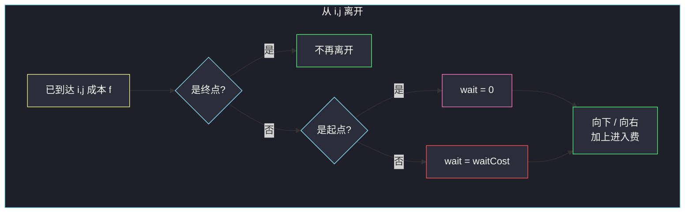

# 3603. 交替方向的最小路径代价 II（Minimum Cost Path with Alternating Directions II）

> 题目来源：[https://leetcode.cn/problems/minimum-cost-path-with-alternating-directions-ii/](https://leetcode.cn/problems/minimum-cost-path-with-alternating-directions-ii/)
>
> 灵茶题单小节定位：§2.1 基础（网格路径 DP；到达格子的步数由坐标钉死）

## 一、问题描述

给你两个整数 `m` 和 `n`，表示网格的行数和列数。进入单元格 `(i, j)` 的成本为 `(i + 1) * (j + 1)`。另给二维数组 `waitCost`，`waitCost[i][j]` 是在该格**等待**的成本。

路径从第 1 秒进入 `(0, 0)` 并支付入场费开始。每一步遵循交替规则：

- **奇数秒**：必须向右或向下移动到相邻格子，并支付进入成本。
- **偶数秒**：必须原地等待恰好 1 秒，并支付 `waitCost[i][j]`。

返回到达右下角 `(m - 1, n - 1)` 的最小总成本。到达终点的那一步是**移动**，不必再在终点等待。

**数据范围**：

- `1 <= m, n <= 10⁵`
- `2 <= m * n <= 10⁵`
- `waitCost.length == m`，`waitCost[0].length == n`
- `0 <= waitCost[i][j] <= 10⁵`

格子总数 ≤ `10⁵`，按格 DP 即可；不能再乘一层时间状态。

**示例 1**：

```text
输入：m = 1, n = 2, waitCost = [[1, 2]]
输出：3
解释：
- 第 1 秒已在 (0,0)，入场费 1*1 = 1
- 第 1 秒向右到 (0,1)，进入成本 1*2 = 2
无需等待，总成本 1+2 = 3。
```

**示例 2**：

```text
输入：m = 2, n = 2, waitCost = [[3,5],[2,4]]
输出：9
解释：
- 入场 (0,0) 成本 1
- 第 1 秒向下到 (1,0)，成本 2
- 第 2 秒在 (1,0) 等待，支付 2
- 第 3 秒向右到 (1,1)，成本 4
总计 1+2+2+4 = 9。
```

**示例 3**：

```text
输入：m = 2, n = 3, waitCost = [[6,1,4],[3,2,5]]
输出：16
解释：路径 (0,0)→(0,1)→(1,1)→(1,2)，
成本 1+2 + wait 1 + 4 + wait 2 + 6 = 16。
```

**核心思考点**：只能右/下，到达 `(i, j)` 的移动次数恒为 `i+j`。移动发生在奇数秒，因此到达时刻的奇偶由位置决定，**状态只需记格子**。等待次数 = 路径上的中间格数（不含起点、终点）。

## 二、暴力解法

### 思路

只能右或下，从 `(0,0)` DFS/BFS 枚举全部路径。每条路径的代价 = 沿途所有格子的进入成本 + 除起点、终点外每个格子的 `waitCost`。起点在第 1 秒立刻移动，不支付 `waitCost[0][0]`；终点到达即停，不支付 `waitCost[m-1][n-1]`。

### 代码

```python
def minCostBrute(m: int, n: int, waitCost: list[list[int]]) -> int:
    best = 10**18

    def dfs(i: int, j: int, cost: int) -> None:
        if i == m - 1 and j == n - 1:
            best_ref[0] = min(best_ref[0], cost)
            return
        wait = 0 if (i == 0 and j == 0) else waitCost[i][j]
        if i + 1 < m:
            dfs(i + 1, j, cost + wait + (i + 2) * (j + 1))
        if j + 1 < n:
            dfs(i, j + 1, cost + wait + (i + 1) * (j + 2))

    best_ref = [best]
    dfs(0, 0, 1)                      # 起点入场费恒为 1
    return best_ref[0]
```

### 复杂度

- 时间：路径数 `C(m+n-2, m-1)`，最坏指数级。
- 空间：`O(m+n)` 递归栈。
- `m*n = 10⁵` 时不可用，仅作对拍。

## 三、优化探索

### 3.1 步数被坐标钉死，不必把时间放进状态 ⭐

从 `(0,0)` 到 `(i,j)` 恰好 `i+j` 次移动。第 `k` 次移动落在第 `2k-1` 秒（奇数）。到达非终点后下一秒必是偶数，必须等待再走。因此每个格子上的「等待与否」没有选择：**起点不等，中间格必等一次，终点不等**。

### 3.2 转移：离开当前格时才付等待 ⭐⭐

`f[i][j]` = **到达** `(i,j)` 的最小总成本（含该格进入费，不含在该格等待）。

从 `(i,j)` 离开（若它不是终点）：

```text
wait = 0           若 (i,j) 是起点
wait = waitCost[i][j]   否则
向下：f[i+1][j] ← f[i][j] + wait + (i+2)*(j+1)
向右：f[i][j+1] ← f[i][j] + wait + (i+1)*(j+2)
```

按行、列升序枚举，右/下的前驱一定已经算完。

### 3.3 waitCost 的两个「死格」⭐

`waitCost[0][0]` 与 `waitCost[m-1][n-1]` 在最优路径上**从未被支付**（题目 `m*n ≥ 2` 保证起终点不同）。示例 1 的 `waitCost[0][1]=2` 也没用，因为那是终点。



核心一句：**代价 = 路径进入费之和 + 中间格等待费；等待次数由路径长度唯一确定。**

## 四、代码实现

### 主解：按格 DP

```python
class Solution:
    def minCost(self, m: int, n: int, waitCost: List[List[int]]) -> int:
        INF = 10**18
        f = [[INF] * n for _ in range(m)]
        f[0][0] = 1                       # (0+1)*(0+1)
        for i in range(m):
            for j in range(n):
                if i == m - 1 and j == n - 1:
                    continue
                wait = 0 if i == 0 and j == 0 else waitCost[i][j]
                if i + 1 < m:
                    f[i + 1][j] = min(
                        f[i + 1][j],
                        f[i][j] + wait + (i + 2) * (j + 1),
                    )
                if j + 1 < n:
                    f[i][j + 1] = min(
                        f[i][j + 1],
                        f[i][j] + wait + (i + 1) * (j + 2),
                    )
        return f[m - 1][n - 1]
```

也可以写成「进入费在到达时付、等待费在来边上付」：

```text
f[i][j] = (i+1)*(j+1) + min(
    从上方来：f[i-1][j] + wait_leave(i-1, j),
    从左方来：f[i][j-1] + wait_leave(i, j-1)
)
wait_leave(x,y) = 0 若 (x,y) 是起点，否则 waitCost[x][y]
```

两种写法同一套转移，只是把 `+ wait + 进入费` 拆到前驱或当前格。

### 细节说明

- **进入费公式**用 1-based 行列号：`(i+1)*(j+1)`，向下走进 `(i+1,j)` 即 `(i+2)*(j+1)`。
- **单行 / 单列**：只有一条路径，DP 仍正确（示例 1 即单行）。
- **不必 Dijkstra**：边权非负且 DAG（只右下），拓扑 DP 即可。
- 答案上界：格子最多 `10⁵` 个，进入费与等待费均 ≤ `10¹⁰` 量级，用 64 位。
- **`waitCost[0][0]` 与终点等待永远不进答案**。若在终点再加一次等待，示例 2 会变成 9+4=13，与官方不符。
- 移动次数 `k = m+n-2`，等待次数 = `k-1`（每步移动前除起点外都先等）；这些次数由路径长度决定，不随走法改变，变的只是「在哪些中间格付钱」。

## 五、例子演示

**示例 2：`m = 2, n = 2, waitCost = [[3,5],[2,4]]`**

进入费：`(0,0)=1, (0,1)=2, (1,0)=2, (1,1)=4`。

| 离开格 | wait | 转移 | 到达成本 |
|--------|------|------|----------|
| (0,0) | 0 | 下 → (1,0) | 1+0+2=**3** |
| (0,0) | 0 | 右 → (0,1) | 1+0+2=**3** |
| (1,0) | 2 | 右 → (1,1) | 3+2+4=**9** |
| (0,1) | 5 | 下 → (1,1) | 3+5+4=12 |

`f[1][1] = min(9, 12) = 9` ✅。走下方再等 2，优于走右再等 5。

**示例 3：`m = 2, n = 3`**

| 格 | f | 关键转移 |
|----|-----|----------|
| (0,0) | 1 | 起点 |
| (0,1) | 1+0+2=3 | |
| (1,0) | 1+0+2=3 | |
| (1,1) | min(3+1+4, 3+3+4)=**8** | 从 (0,1) 等 1 更优 |
| (0,2) | 3+1+3=7 | |
| (1,2) | min(8+2+6, 7+4+6)=**16** | |

官方路径 (0,0)→(0,1)→(1,1)→(1,2) 正是 1+2+1+4+2+6=16 ✅。

**示例 1**：唯一转移 `(0,0)→(0,1)`，wait=0，`1+2=3` ✅。终点 `(0,1)` 的 `waitCost=2` 不付。

**单列 `m=3, n=1, waitCost=[[9],[2],[8]]`**：唯一路径 (0,0)→(1,0)→(2,0)。

```text
进入费 1 + 2 + 3 = 6
只在中间格 (1,0) 等待 2
答案 8
```

起点 `waitCost[0][0]=9`、终点 `8` 都丢弃。时钟：秒 1 下移，秒 2 等待，秒 3 再下移到达终点。

## 六、复杂度分析

设网格有 `m` 行 `n` 列，`N = m·n`：

- **时间复杂度：`O(N)`**——每格常数次出边。
- **空间复杂度：`O(N)`**——DP 表。可压成两行，非必需。

## 七、对比总结

| 维度 | 枚举路径 | 主解按格 DP |
|------|----------|-------------|
| 时间 | 组合数指数 | `O(m n)` |
| 时间维 | 显式模拟秒 | **被 i+j 吸收** |
| 易错 | 起终点是否等待 | 起点 wait=0、终点不离开 |

**套路归纳**：交替「动 / 停」一旦与步数奇偶绑定，网格最短路的状态就坍缩成坐标。先问「到达这个格子时，时钟被什么钉死？」——曼哈顿步数、奇偶、余数 k，都能把时间维消掉。进入费与等待费分摊到「到达」和「离开」两次事件上，避免在终点多等一次。

## 八、举一反三

1. **[64. 最小路径和](https://leetcode.cn/problems/minimum-path-sum/)**：同样只右下，没有等待层。
2. **[2304. 网格中的最小路径代价](https://leetcode.cn/problems/minimum-path-cost-in-a-grid/)**：同目录网格 DP，转移多一维「从哪一列来」。
3. **[174. 地下城游戏](https://leetcode.cn/problems/dungeon-game/)**：右下路径，但优化目标从终点倒推。
4. **[1368. 使网格图至少有一条有效路径的最小代价](https://leetcode.cn/problems/minimum-cost-to-make-at-least-one-valid-path-in-a-grid/)**：方向被格子改写，0-1 BFS。
5. **[1594. 矩阵的最大非负积](https://leetcode.cn/problems/maximum-non-negative-product-in-a-matrix/)**：同目录右下 DP，负数乘法要双状态。

**同族互引**：`minimum-path-cost-in-a-grid.md` 是「每步选下一列」；本题是「步数奇偶强制等待」。两篇合看网格路径 DP 的两种加料方式。
