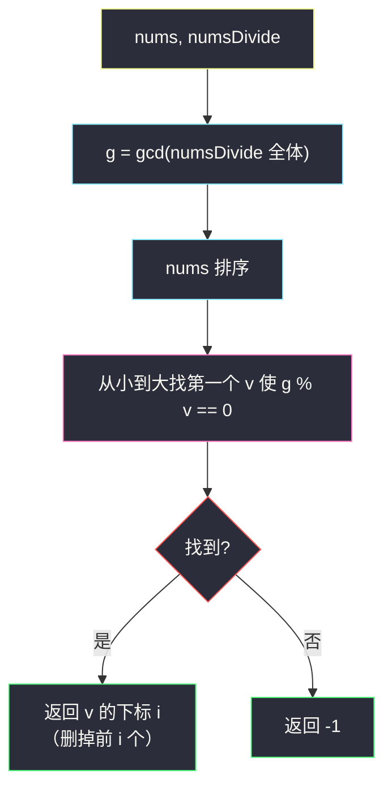

# 2344. 使数组可以被整除的最少删除次数（Minimum Deletions to Make Array Divisible）

> 题目来源：[https://leetcode.cn/problems/minimum-deletions-to-make-array-divisible/](https://leetcode.cn/problems/minimum-deletions-to-make-array-divisible/)
>
> 灵茶题单小节定位：§1.6 最大公约数（GCD）

## 一、问题描述

给你两个正整数数组 `nums` 和 `numsDivide`。你可以从 `nums` 中删除任意数目的元素。

请你返回使 `nums` 中**最小**元素可以整除 `numsDivide` 中所有元素的**最少**删除次数。如果无法得到这样的元素，返回 `-1`。

如果 `y % x == 0`，那么我们说整数 `x` 整除 `y`。

**数据范围**：

- `1 <= nums.length, numsDivide.length <= 10⁵`
- `1 <= nums[i], numsDivide[i] <= 10⁹`

**示例 1**：

```text
输入：nums = [2,3,2,4,3], numsDivide = [9,6,9,3,15]
输出：2
解释：nums 中最小元素是 2，无法整除全部。
删除两个 2 得 nums = [3,4,3]，最小元素 3 可整除 9,6,9,3,15 全部。
```

**示例 2**：

```text
输入：nums = [4,3,6], numsDivide = [8,2,6,10]
输出：-1
解释：无法使 nums 的最小元素整除 numsDivide 的所有元素。
```

**核心思考点**：「整除 `numsDivide` 全部元素」的 `x` 恰好是 `g = gcd(numsDivide)` 的**因子**。所以问题变成：删除若干元素后，让剩下的最小值是 `g` 的因子。把 `nums` 排序，第一个是 `g` 因子的元素之前的元素全删——答案就是它在排序数组中的下标。判「`g` 的因子」不必枚举因子，`g % v == 0` 一步到位。

## 二、暴力解法

### 思路

按题意逐步删：每次删掉 `nums` 的最小元素（删除次数 +1），再看新最小元素能否整除 `numsDivide` 全部（逐个 `%` 检查）；删光仍不行返回 `-1`。等价实现：`nums` 排序后对每个元素检查整除性，第一个通过的前面全删。

### 代码

```python
def minOperationsBrute(nums: list[int], numsDivide: list[int]) -> int:
    for i, v in enumerate(sorted(nums)):
        if all(d % v == 0 for d in numsDivide):   # 逐个检查整除
            return i
    return -1
```

### 复杂度

- 时间：`O(n log n + n·m)`——排序 + 每个候选 `O(m)` 检查。`n = m = 10⁵` 时最坏 `10¹⁰` 次取模，超时。
- 空间：`O(1)`。小数据可作对拍基准。

## 三、优化探索

### 3.1 核心转化：整除全体 ⇔ 整除 gcd ⭐

设 `g = gcd(numsDivide)`。

- **`x` 整除每个 `numsDivide[i]` ⇒ `x` 整除 `g`**：`x` 整除各元素则整除其任意组合，特别地整除最大公约数（g 是各元素的整系数线性组合）；
- **`x` 整除 `g` ⇒ `x` 整除每个 `numsDivide[i]`**：`g | numsDivide[i]` 与 `x | g` 传递。

于是「能否整除全部」的 `O(m)` 检查压缩成 `g % x == 0` 的 `O(1)` 检查——一次 gcd 预处理，查询免费。这与「公因子集 = gcd 的因子集」（`number-of-common-factors.md`）是同一条定理的两面。

### 3.2 删除策略：排序后找第一个 g 的因子 ⭐⭐

删除只能让**最小值变大**（删掉最小元素后最小值取自剩余元素）。要让「最小元素是 `g` 的因子」：

- 答案元素必然是 `nums` 中**某个**是 `g` 因子的值 `v`；
- 要让 `v` 成为最小值，必须删掉所有 `< v` 的元素——排序后即 `v` 所在位置之前的全部；
- 保留**最大**的可行因子能让删除数最少？不——**保留最小的可行因子**删除数最少：排序后第一个可行元素之前的元素个数就是候选中的最小删除数，更大的可行因子只会要求删得更多。

所以：排序 `nums`，返回第一个满足 `g % v == 0` 的下标 `i`；全是不可行元素则 `-1`。



### 3.3 替代实现：不排序，因子枚举（进阶视野）

另一条路：枚举 `g` 的全部因子（`O(√g)`，`g ≤ 10⁹` 即 ~31623 次循环），把因子放进哈希集合；再扫一遍 `nums`，统计「值在集合中的元素」里最小的一个，删除数 = 严格小于它的元素个数。免去排序（`O(n)` 而非 `O(n log n)`），总复杂度 `O(m log V + √g + n)`。两种实现都优秀，排序版代码更短，作为主解。

## 四、代码实现

### 主解：gcd + 排序找因子

```python
from math import gcd
from functools import reduce

class Solution:
    def minOperations(self, nums: List[int], numsDivide: List[int]) -> int:
        g = reduce(gcd, numsDivide)          # numsDivide 全体的 gcd
        nums.sort()
        for i, v in enumerate(nums):
            if g % v == 0:                   # v 是 g 的因子 ⇔ v 整除 numsDivide 全体
                return i                     # 删掉前 i 个更小元素
        return -1
```

### 进阶实现：因子集合 + 一遍扫描（不排序）

```python
from math import gcd, isqrt

class Solution:
    def minOperations(self, nums: List[int], numsDivide: List[int]) -> int:
        g = 0
        for d in numsDivide:
            g = gcd(g, d)
        # 枚举 g 的全部因子
        fac = set()
        for d in range(1, isqrt(g) + 1):
            if g % d == 0:
                fac.add(d)
                fac.add(g // d)
        best = min((v for v in nums if v in fac), default=0)
        if best == 0:
            return -1
        return sum(v < best for v in nums)
```

### 细节说明

- **`reduce(gcd, numsDivide)`**：`gcd(0, x) = x`，空数组不会出现（长度 ≥ 1），初值可省。
- **`g % v == 0` 而非 `v % g == 0`**：方向别搞反——要 `v` 整除 `g`（v 是较小的因子），余数在 `g` 这边。
- **重复元素**：排序后重复的可行因子返回**第一个**下标，删除数自动最小（后续重复值不用删）。
- **`nums[i] ≤ 10⁹` 但 `g % v` 无溢出问题**（Python 大整数；Java 用 `long` 或注意 `10⁹ × 10⁹` 内 `int` 相乘不涉及，仅取模安全）。
- **为什么不怕「删太狠」**：题目只要求最小元素可行，多保留大于 `v` 的元素零成本——删除数由 `< v` 的元素个数唯一决定。

## 五、例子演示

**示例 1 端到端：nums = [2,3,2,4,3], numsDivide = [9,6,9,3,15]**

| 步骤 | 计算 | 结果 |
|---|---|---|
| 求 g | `gcd(9,6)=3` → `gcd(3,9)=3` → `gcd(3,3)=3` → `gcd(3,15)=3` | `g = 3` |
| 排序 nums | `[2, 2, 3, 3, 4]` | |
| 找因子 | `v=2`: `3 % 2 = 1` ✗；`v=2`: ✗；`v=3`: `3 % 3 = 0` ✓ | 下标 `i = 2` |

返回 **2** ✅——删掉两个 2，剩下 `[3, 3, 4]` 最小元素 3 整除 `9/6/9/3/15` 全部（9=3×3、6=3×2、15=3×5）。

**示例 2 端到端：nums = [4,3,6], numsDivide = [8,2,6,10]**

| 步骤 | 计算 | 结果 |
|---|---|---|
| 求 g | `gcd(8,2)=2` → `gcd(2,6)=2` → `gcd(2,10)=2` | `g = 2` |
| 排序 nums | `[3, 4, 6]` | |
| 找因子 | `2 % 3 = 2` ✗；`2 % 4 = 2` ✗；`2 % 6 = 2` ✗ | 无 |

返回 **-1** ✅——`g = 2` 的因子是 {1, 2}，`nums` 全不沾边。

**含 1 的自造例子：nums = [7, 1, 5], numsDivide = [4, 6]**：`g = gcd(4,6) = 2`；排序 `[1, 5, 7]`；`v=1`: `2 % 1 == 0` ✓ 下标 0——**返回 0**（最小元素 1 整除一切，一个都不用删）。`1` 是任何 `g` 的因子，这永远是「白送」情形。

**进阶版演示（因子集合路径）**：`g = 12` 时枚举 `d ≤ ⌊√12⌋ = 3`：`d=1` 收 {1,12}、`d=2` 收 {2,6}、`d=3` 收 {3,4}——集合 {1,2,3,4,6,12} 与定义枚举完全一致，成对收集是关键。

## 六、复杂度分析

设 `n = len(nums)`，`m = len(numsDivide)`，`V = 10⁹`：

- **主解时间：`O(m log V + n log n)`**
  - gcd 链：`O(m log V)`（每个辗转相除 `O(log V)`）；
  - 排序 `O(n log n)` + 线性扫描 `O(n)`。
- **进阶版时间：`O(m log V + √g + n)`**——因子枚举 `O(√g)`，免排序。
- **空间**：主解 `O(1)`（原地排序）；进阶版 `O(√g)` 因子集合。

## 七、对比总结

| 维度 | 暴力（逐元素检查整除） | 主解（gcd + 排序） | 进阶（因子集合） |
|---|---|---|---|
| 时间 | `O(n log n + n·m)` | `O(m log V + n log n)` | `O(m log V + √g + n)` |
| 空间 | `O(1)` | `O(1)` | `O(√g)` |
| 10⁵ 规模 | 超时 | 毫秒级 | 毫秒级 |
| 关键转化 | 无 | 检查压缩 `O(m)→O(1)` | 查询视角反转 |

**套路归纳**：「能整除一堆数」的判定永远先算**这堆数的 gcd**——`x` 整除全体 ⇔ `x` 整除 `gcd`，一次预处理把逐项检查变 `O(1)`。再叠加「最小值只受删除影响 ⇒ 排序后找第一个可行位」的贪心，删除类问题落到下标计数。Hard 难度其实只在「想到 gcd」这一步，之后的实现是 Easy 级别——数论转化型 Hard 的典型面目。

## 八、举一反三

1. **[2427. 公因子的数目](https://leetcode.cn/problems/number-of-common-factors/)**：「x 整除 a、b ⇔ x 整除 gcd(a,b)」的最小载体，本批姊妹篇。
2. **[2654. 使数组所有元素变成 1 的最少操作次数](https://leetcode.cn/problems/minimum-number-of-operations-to-make-all-array-elements-equal-to-1/)**：本批 `minimum-number-of-operations-to-make-all-array-elements-equal-to-1.md`——gcd 操作不变量 + 最短达标窗口，与本题合成 §1.6 双联。
3. **[1497. 检查数组对是否可以被 k 整除](https://leetcode.cn/problems/check-if-array-pairs-divisible-by-k/)**：余数配对判整除，整除家族的另一支。
4. **[1819. 序列中不同最大公约数的数目](https://leetcode.cn/problems/number-of-different-subsequences-gcds/)**：把「gcd 的因子」思想推到子数组 gcd 全集，Hard 进阶。
5. **[878. 第 N 个神奇数字](https://leetcode.cn/problems/nth-magical-number/)**：lcm 与二分结合，整除计数的高阶应用。

**同族互引**：灵茶题单 §1.6「最大公约数」以本题（Hard）与 #2654（Medium）收官；GCD 子数组维护的究极形态见 `number-of-subarrays-with-gcd-equal-to-k.md`（#2447，GCD LogTrick）。
