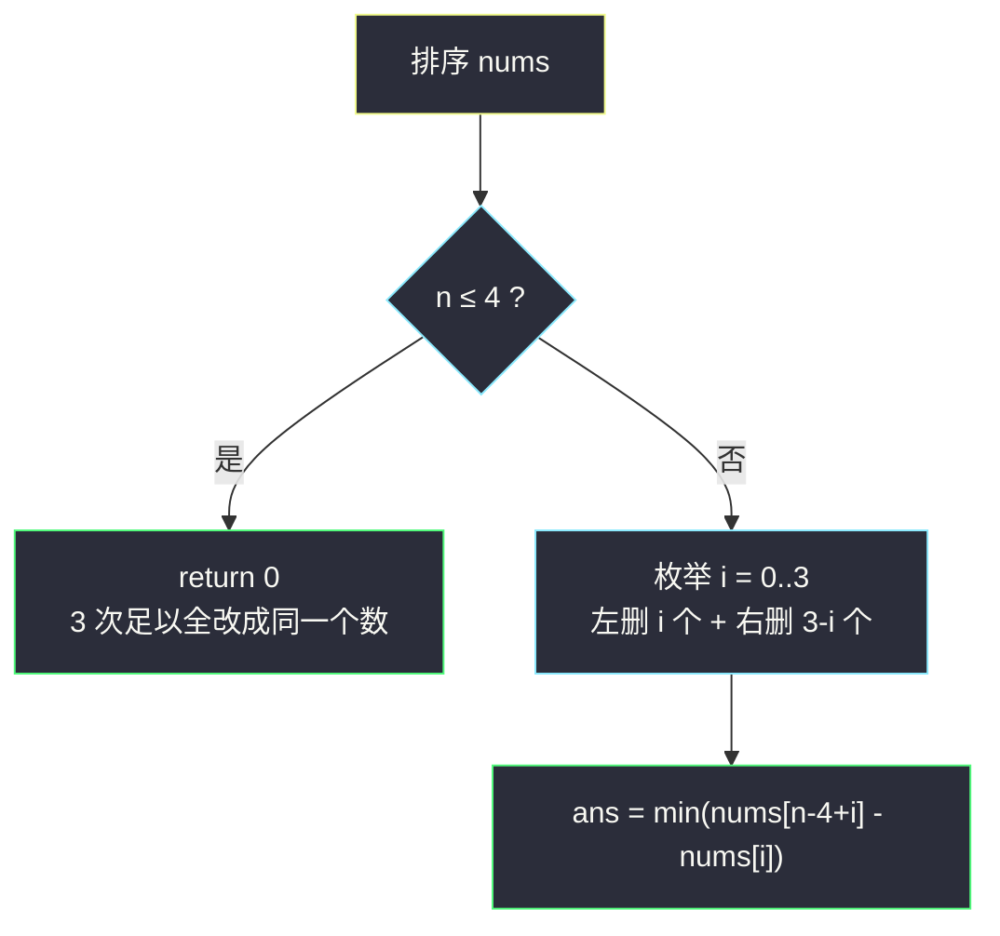
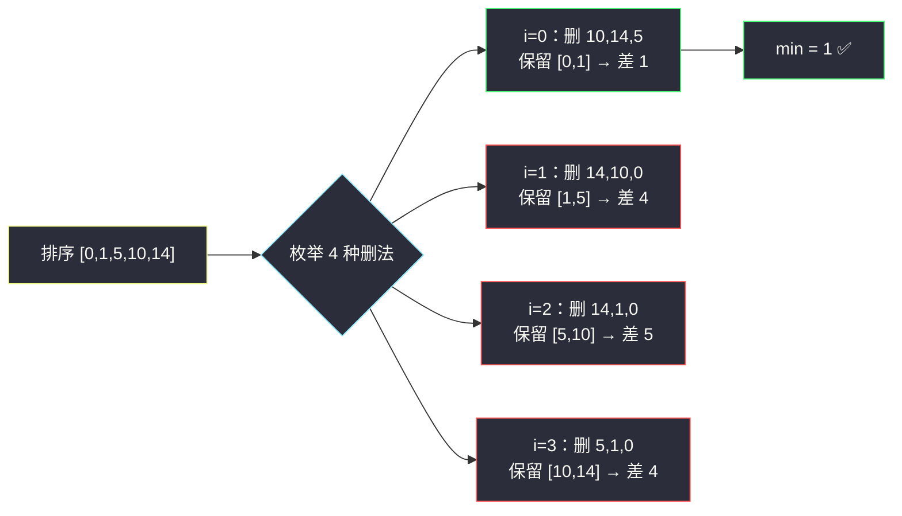

# 三次操作后最大值与最小值的最小差（排序 · 删端点枚举）

## 一、问题描述

给你一个数组 `nums`。一次操作中，你可以选择 `nums` 中的**任意一个元素**，并将它改变为**任意值**（多次操作可以作用于同一个元素）。最多执行 **3 次** 操作。

返回执行操作后，`nums` 中最大值与最小值的差的最小值。

> 🔗 LeetCode 1509：https://leetcode.cn/problems/minimum-difference-between-largest-and-smallest-value-in-three-moves/
>
> 数据范围：`1 <= nums.length <= 10^5`，`-10^9 <= nums[i] <= 10^9`。

**示例 1**

```
输入：nums = [1,5,0,10,14]
输出：1
解释：把 5、10、14 都改成 0 或 1，数组变成 [1,x,0,x,x]，最大值 1、最小值 0，差为 1。
```

**示例 2**

```
输入：nums = [5,3,2,4]
输出：0
解释：n = 4，只需 3 次操作即可把其余三个数都改成剩下的那个数，数组元素全相等。
```

**示例 3**

```
输入：nums = [3,100,20]
输出：0
解释：n = 3 ≤ 4，3 次操作足以让所有元素相等。
```

**直观理解**

「把一个数改成任意值」最暴力的用途是：**把它从极值的计算中抹掉**。极值（max 与 min）只由数组中最大、最小的那几个数决定——所以 3 次操作的最优用法必然是：改掉最小端的一些数 + 最大端的一些数，让剩下的数挤得更紧。这是「从最小/最大开始」贪心的删除版。

---

## 二、暴力解法

「改掉一个数」在极值计算里等价于「删掉一个数」（改成保留区间内的任何值都不影响 max/min）。于是暴力 = 枚举删哪 3 个数（不足 3 个就全删），对每种组合求剩余数组的 max − min：

```python
class Solution:
    def minDifference(self, nums: List[int]) -> int:
        n = len(nums)
        if n <= 4:
            return 0
        ans = inf
        for a, b, c in combinations(range(n), 3):    # 枚举删除的下标组合
            rest = [x for i, x in enumerate(nums) if i not in (a, b, c)]
            ans = min(ans, max(rest) - min(rest))
        return ans
```

### 复杂度

- **时间**：`O(n^4)`——组合数 `C(n,3)` 约 `n^3/6` 种，每种还要 `O(n)` 重建并统计极值，`n = 10^5` 时天方夜谭。
- **空间**：`O(n)`（临时数组）。

### 🔴 瓶颈在哪里

绝大多数删除组合毫无意义：删掉一个**中间值**根本不影响 max − min。真正有影响力的只有数组**两端**的那几个数——最优解必然在「删最小端 i 个 + 最大端 3 − i 个」里，把搜索空间从 `C(n,3)` 压到 4 种。

---

## 三、优化探索（核心章节）

> 📚 本题在灵茶题单中属于 **§1.1 从最小/最大开始贪心**（贪心① A 路）：能改的就改两端——排序后从最小/最大那一头开始删，枚举左右配比。

### 3.1 两个关键转化

**转化一：改值 = 删除。**
把一个元素改成「任意值」，最优做法是让它落在保留元素的最小值与最大值之间，从而完全退出极值竞争。等价地，把它从数组中删掉。

**转化二：改的必然是端点。**
排序后，中间元素不影响 max − min；花一次操作改中间值毫无收益（改成区间外的值反而更糟）。因此 3 次操作全部花在**最小端与最大端**：左删 `i` 个、右删 `3 - i` 个，`i = 0,1,2,3`，共 4 种方案。

### 3.2 四种删法

排序后保留的是一段连续区间 `[i, n-4+i]`（左删 `i` 个、右删 `3-i` 个）：

| i（左删） | 3−i（右删） | 保留区间 | 差值 |
|-----------|------------|----------|------|
| 0 | 3 | `[0, n-4]` | `nums[n-4] - nums[0]` |
| 1 | 2 | `[1, n-3]` | `nums[n-3] - nums[1]` |
| 2 | 1 | `[2, n-2]` | `nums[n-2] - nums[2]` |
| 3 | 0 | `[3, n-1]` | `nums[n-1] - nums[3]` |

统一写成 `nums[n-4+i] - nums[i]`，取四种的最小值。



### 3.3 为什么枚举 4 种就够了（交换论证）

设某个最优方案删掉的 3 个元素中有一个**中间元素** `x`（排序后既不在最小端也不在最大端的删除链上）。把 `x` 换成当前尚未被删的某个端点元素 `y`：

- 若 `y` 在区间内部（未删），删除 `y` 后保留区间的 max 只减不增、min 只增不减，差值不增；
- 端点的删除总是连续的（删两个最小值的中间空一个不影响结果——等价于删「最小的那 2 个」），所以最优方案总能调整为「左删连续 i 个 + 右删连续 3−i 个」。

四种 `i` 恰好覆盖所有左右配比，取最小即最优。

### 3.4 边界：n ≤ 4 直接返回 0

`n ≤ 4` 时，至多改 `n − 1 ≤ 3` 个数就能让所有元素相等（都改成剩下的那个），差值为 0。此时 `n − 4 + i` 会出现负下标，必须特判。

### 3.5 一句话核心

> **改值即删除，删除必在端点：排序后左删 i、右删 3−i，四种配比取最小。**

---

## 四、代码实现

### Python（主解）

```python
class Solution:
    def minDifference(self, nums: List[int]) -> int:
        n = len(nums)
        if n <= 4:
            return 0
        nums.sort()
        return min(nums[n - 4 + i] - nums[i] for i in range(4))
```

**展开版（现场更好想）**

```python
class Solution:
    def minDifference(self, nums: List[int]) -> int:
        n = len(nums)
        if n <= 4:
            return 0
        nums.sort()
        ans = inf
        for i in range(4):                    # 左删 i 个，右删 3-i 个
            ans = min(ans, nums[n - 4 + i] - nums[i])
        return ans
```

**变量含义**

| 变量 | 含义 |
|------|------|
| `i` | 左端删除的元素个数（0..3） |
| `nums[i]` | 保留区间的最小值 |
| `nums[n-4+i]` | 保留区间的最大值（总共保留 n−4 个） |

**不变式**：循环变量 `i` 遍历全部 4 种「左/右」删除配比，`nums[n-4+i] - nums[i]` 恰是该配比下的 max − min（中间元素不影响极值）。

### Java（可选对照）

```java
class Solution {
    public int minDifference(int[] nums) {
        int n = nums.length;
        if (n <= 4) return 0;
        Arrays.sort(nums);
        int ans = Integer.MAX_VALUE;
        for (int i = 0; i < 4; i++) {
            ans = Math.min(ans, nums[n - 4 + i] - nums[i]);
        }
        return ans;
    }
}
```

**进阶（不排序的 O(n) 做法）**：答案只用到「最小 4 个 + 最大 4 个」共 8 个数——用一次线性扫描维护这 8 个值即可把 `O(n log n)` 的排序优化掉。数据规模下不必要，知道即可。

---

## 五、具体例子演示

### 示例 1 端到端：`nums = [1,5,0,10,14]`

排序得 `[0,1,5,10,14]`，`n = 5`。左删 `i` 个、右删 `3-i` 个，保留下标区间 `[i, n-4+i]`（共 `n-3` 个元素）：

| i（左删 i 个） | 右删 3−i 个 | 保留元素 | 差值 nums[n−4+i] − nums[i] |
|----------------|------------|---------|---------------------------|
| 0 | 3 | `[0,1]` | `nums[1] − nums[0] = 1 − 0 = 1` |
| 1 | 2 | `[1,5]` | `nums[2] − nums[1] = 5 − 1 = 4` |
| 2 | 1 | `[5,10]` | `nums[3] − nums[2] = 10 − 5 = 5` |
| 3 | 0 | `[10,14]` | `nums[4] − nums[3] = 14 − 10 = 4` |

四种方案取最小 → **1**（左删 0 个、右删 3 个：把 5、10、14 改成 [0,1] 内的值，如全改 1）。

**逐步跟踪（排序后每一步的选择过程）**

| 步 | 当前候选方案 | 选择 | 剩余未比较方案 | 当前最优 ans |
|----|-------------|------|----------------|--------------|
| 1 | i=0：左 0 + 右 3 | 差 1 | {1,2,3} | 1 |
| 2 | i=1：左 1 + 右 2 | 差 4 | {2,3} | 1 |
| 3 | i=2：左 2 + 右 1 | 差 5 | {3} | 1 |
| 4 | i=3：左 3 + 右 0 | 差 4 | 空 | **1** |

### 更长的例子对照：`nums = [1,5,6,7,8,9]`

排序不变，`n = 6`，保留区间 `[i, n-4+i]` 共 `n-3 = 3` 个元素：

| i | 保留元素 | 差值 |
|---|---------|------|
| 0 | `[1,5,6]` | `nums[2] − nums[0] = 6 − 1 = 5` |
| 1 | `[5,6,7]` | `nums[3] − nums[1] = 7 − 5 = 2` |
| 2 | `[6,7,8]` | `nums[4] − nums[2] = 8 − 6 = 2` |
| 3 | `[7,8,9]` | `nums[5] − nums[3] = 9 − 7 = 2` |

答案 **2**：把 1、5、6 都改到 [7,9] 之间（或左 1 右 2 等对称方案）。



---

## 六、复杂度分析

| 方法 | 时间 | 空间 | 说明 |
|------|------|------|------|
| 组合枚举（暴力） | `O(n^4)` | `O(n)` | `C(n,3)` 组合 × 每组 `O(n)` 统计 |
| 排序 + 枚举 4 种（主解） | `O(n log n)` | `O(1)` | 排序主导，枚举常数 4 |
| 线性选 8 个最值（进阶） | `O(n)` | `O(1)` | 只需最小/最大各 4 个 |

空间上排序均为原地；进阶版完全不用排序。

---

## 七、对比总结

**本题与 #3074 是灵茶 §1.1 的一对姊妹**：都是排序后从端点动手——一个是「从最大开始装」（覆盖总量），一个是「从两端开始删」（收紧极值）。

**方法谱系**

| 视角 | 做法 |
|------|------|
| 改值 → 删除 | 把「改成任意值」翻译成「退出极值竞争」 |
| 删中间无用 | 交换论证：删端点不劣于删中间 |
| 端点删除连续 | 左删 i + 右删 3−i，i = 0..3，4 种枚举 |

**易错点**

1. **忘记 `n ≤ 4` 特判**：`n - 4 + i` 会变成负下标（Python 取到尾部元素，答案悄悄出错；Java 直接越界）；
2. 以为 3 次操作必须作用在**不同**元素——题目允许作用于同一元素，但这没有意义（改两次 = 改一次），最优解自然是改至多 3 个不同元素；反过来 `n = 4` 时正是靠「改 3 个留 1 个」把答案做成 0；
3. 枚举写成 `range(3)` 漏掉「全删右端」的方案 `i = 3`；
4. 差值方向写反（`nums[i] - nums[n-4+i]` 得负数），`min` 会返回错误结果。

**模板（排序 + 删端点，Python）**

```python
nums.sort()
n = len(nums)
if n <= k + 1:                 # k 次操作足以抹平一切
    return 0
return min(nums[n - 1 - (k - i)] - nums[i] for i in range(k + 1))
```

（k = 3 时即 `nums[n-4+i] - nums[i]`。）

---

## 八、举一反三

| 题目 | 关系 |
|------|------|
| [3074. 重新分装苹果](https://leetcode.cn/problems/apple-redistribution-into-boxes/) | 同属 §1.1 互引姊妹篇，见同目录 `apple-redistribution-into-boxes.md`：排序后从最大开始装 |
| [948. 令牌放置](https://leetcode.cn/problems/bag-of-tokens/) | 排序 + 双端决策（最小端得分、最大端回血），同款「两端动手」 |
| [632. 最小区间](https://leetcode.cn/problems/smallest-range-covering-elements-from-k-lists/) | k 个有序列表各取一个数最小化 max − min，端点收紧思想的多序列放大版 |
| [1679. K 和数对的最大数目](https://leetcode.cn/problems/max-number-of-k-sum-pairs/) | 排序后两端配对（§1.2/§1.3 的配对味道） |
| [1833. 雪糕的最大数量](https://leetcode.cn/problems/maximum-ice-cream-bars/) | 「从最小开始」的买法贪心，与本篇的删法互为镜像 |

**思想迁移**

- 看到「把若干个数改成任意值」，先翻译成「从极值竞争中**删除**」；
- 极值类问题的操作永远优先花在**端点**（当前最小/最大）上，中间元素动不动无收益；
- 口诀：**「改值即删除，动手必端点；左右共三次，四种枚举完。」**
