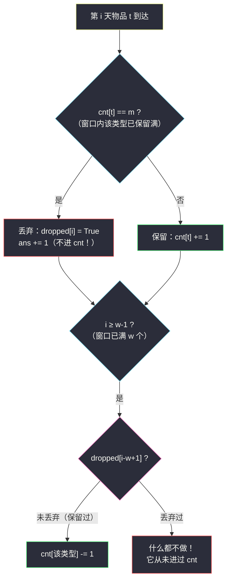
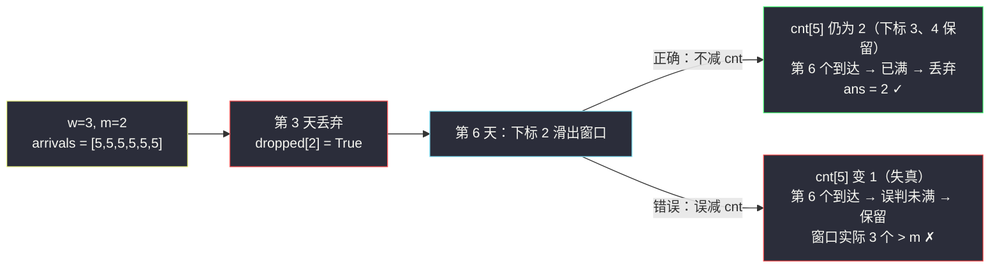

# 使库存平衡的最少丢弃次数（定长滑窗 · 出窗护计数）

## 一、问题描述

给定整数 `w`、`m` 和数组 `arrivals`，其中 `arrivals[i]` 表示第 `i` 天到达的物品类型（天数从 `1` 开始计）。

每个物品在到达当天必须做出决定：**保留** 或 **丢弃**（只能当天丢，过后不能反悔）。物品一经保留就会一直存在，影响后续约束。

对每一天 `i`，要求最近 `w` 天的窗口 `[max(1, i-w+1), i]` 内**被保留**的物品中，每种类型至多出现 `m` 次。

> 换句话说：如果第 `i` 天的物品保留下来后，会导致某种类型在该窗口内出现超过 `m` 次，那么它必须被丢弃。

返回最少需要丢弃的物品数。

> 🔗 LeetCode 3679：https://leetcode.cn/problems/minimum-discards-to-balance-inventory/
>
> 数据范围：`n = len(arrivals)`、`w`、`m` 均可达 `10^5` 量级（以题目页面为准），`arrivals[i]` 为任意整数（类型编号可能很大，用哈希表计数）。

**示例**

```
输入：arrivals = [1,2,1,3,1], w = 4, m = 2
输出：0
解释：任何一天的窗口内，类型 1 最多出现 2 次（第 1、3 天各一个，
     第 5 天到达时第 1 天的物品已滑出窗口），全部保留即可。
```

**直观理解**

这是一道「**定长滑动窗口 + 哈希计数**」的进阶题（灵茶题单 §1.2 进阶）。窗口长度固定为 `w`，每天有一进一出；特殊的坑在于：**被丢弃的物品从未进入计数，滑出窗口时也绝不能再减计数**——这是本题与普通定长滑窗最大的差异。

---

## 二、暴力解法

按天模拟，贪心决定保留/丢弃：物品能保留就保留（保留后窗口内同类型计数不超过 `m` 就保留）。判断时**重新扫描**整个窗口统计同类型保留数。

```python
class Solution:
    def minDiscards(self, w: int, m: int, arrivals: List[int]) -> int:
        n = len(arrivals)
        keep = [False] * n                 # 每天的最终决策
        ans = 0
        for i in range(n):
            t = arrivals[i]
            same = 0                       # 窗口内已保留的同类型个数
            for j in range(max(0, i - w + 1), i):
                if keep[j] and arrivals[j] == t:
                    same += 1
            if same < m:                   # 加上自己后不超过 m，可以保留
                keep[i] = True
            else:
                ans += 1                   # 保留必超 m，被迫丢弃
        return ans
```

### 复杂度

- **时间**：`O(n·w)`（每天重扫最多 `w` 个历史物品）。
- **空间**：`O(n)`。

### 🔴 瓶颈在哪里

`n`、`w` 同为 `10^5` 量级时最坏 `10^10` 次比较，必然超时。瓶颈在于：窗口每步只变化**一进一出**两个位置，重新扫描整窗是浪费——窗口计数应该**增量维护**。

---

## 三、优化探索（核心章节）

> 📚 本题在灵茶题单中属于 **§1.2 进阶（定长滑动窗口 · 进阶练习）**。灵神定长滑窗的三步曲是「**入 - 更新 - 出**」：新元素入窗、在窗口恰好为 `w` 个的时刻更新答案、再把即将滑出的位置吐掉。本题的「更新」就是当天到达物品的保留/丢弃判断。

### 3.1 贪心策略：能保留就保留

为什么「能保留就保留」是最优的？两个观察：

1. **类型之间互相独立**：每种类型的约束只涉及该类型自身，保留一个类型 `t` 的物品永远不会挤占其它类型的名额。
2. **保留合法物品不会让答案变差**：物品 `X` 只在它存活期的窗口里占用一个名额。如果保留 `X` 导致之后某个同类型的 `Y` 被迫丢弃，那么换成「丢 `X` 留 `Y`」也恰好是一次丢弃——两种命运丢弃数相同，贪心不会吃亏（严格证明可用交换论证逐个调整最优解，使其与贪心的决策序列一致）。

于是策略唯一：**到达时窗口内同类型保留数已是 `m` 就丢弃，否则保留**。

### 3.2 增量维护：哈希计数 + 丢弃标记

把暴力里「每天重扫窗口」换成哈希表 `cnt` 增量维护**被保留**物品的类型计数，并额外用布尔数组 `dropped[i]` 记录第 `i` 天的物品是否被丢弃。

「入 - 更新 - 出」三步（0-indexed，第 `i` 天窗口为 `[max(0, i-w+1), i]`）：



### 3.3 两个必踩的坑

**坑一：判断时机。** 丢弃判断必须发生在「该滑出的旧元素已经离开窗口」之后。以灵神「入 - 更新 - 出」为例：上一轮末尾已吐掉 `arrivals[i-w]`，本轮入窗时窗口恰为 `[i-w+1, i]` 共 `w` 个，此时判断 `cnt[t] == m` 才是当天真正的约束。若把「出」放到判断之后（或干脆漏掉出窗），窗口里残留着早已滑出的老物品，会**误判已满而多丢**。

反例：`arrivals = [1,1,1]`、`w = 2`、`m = 1`，正确答案是 `1`（保留第 1、3 个，丢第 2 个）。若第 3 天判断时第 1 天的物品还没出窗，会看到 `cnt[1] = 1` 误以为已满，把第 3 个也丢掉，错成 `2`。

**坑二：丢弃的物品出窗不能减计数。** 丢弃的物品从未执行过 `cnt[t] += 1`，那么当它滑出窗口时，自然也不该执行 `cnt[t] -= 1`。若统一无脑减：

- `cnt` 被减得比真实值**偏小**，后续同类型到达时误判「还没满」而保留，窗口内实际保留数**超过 `m`**，答案错、约束也违反；
- 更隐蔽的是：错误可能在丢弃发生后很多步才显现，对拍小数组都未必能撞出来。



### 3.4 一句话核心

> **定长窗口一进一出，计数只统计「保留」的物品：进窗时满 `m` 才丢、丢了不进表；出窗时只有保留过的才减表。**

---

## 四、代码实现

### Python（主解：定长滑窗 + 哈希计数 + 丢弃标记）

```python
class Solution:
    def minDiscards(self, w: int, m: int, arrivals: List[int]) -> int:
        n = len(arrivals)
        cnt = defaultdict(int)        # 窗口内「被保留」物品的类型计数
        dropped = [False] * n         # dropped[i]：第 i 天物品是否被丢弃
        ans = 0
        for i, t in enumerate(arrivals):
            # 1. 入 + 更新（此时窗口恰为 [i-w+1, i] 共 w 个）
            if cnt[t] == m:           # 该类型已保留满 m 个，再留必超
                dropped[i] = True
                ans += 1              # 丢弃的物品不进 cnt
            else:
                cnt[t] += 1
            # 3. 出：把 i-w+1 吐掉，为明天腾位置
            if i >= w - 1:
                j = i - w + 1
                if not dropped[j]:    # 只有「保留过」的才减计数！
                    cnt[arrivals[j]] -= 1
        return ans
```

（方法名以题目页面为准，核心逻辑就是这三个输入参数。）

**变量含义**

| 变量 | 含义 |
|------|------|
| `cnt` | 窗口内**被保留**物品各类型的计数（丢弃的不算） |
| `dropped[i]` | 第 `i` 天物品是否被丢弃，出窗时的「免减通行证」 |
| `cnt[t] == m` | 保留 `t` 后将变成 `m+1` 超限 → 必须丢弃 |
| `i - w + 1` | 本轮结束后要滑出窗口的下标（`0-indexed`） |

**循环不变式**：处理完第 `i` 天后，`cnt` 恰好等于窗口 `[i-w+2, i+1]`（明天的窗口）内被保留物品的类型计数。

### Java（最优解同款写法）

```java
class Solution {
    public int minDiscards(int w, int m, int[] arrivals) {
        int n = arrivals.length;
        Map<Integer, Integer> cnt = new HashMap<>();
        boolean[] dropped = new boolean[n];
        int ans = 0;
        for (int i = 0; i < n; i++) {
            int t = arrivals[i];
            // 入 + 更新
            if (cnt.getOrDefault(t, 0) == m) {
                dropped[i] = true;
                ans++;
            } else {
                cnt.merge(t, 1, Integer::sum);
            }
            // 出
            if (i >= w - 1) {
                int j = i - w + 1;
                if (!dropped[j]) {
                    cnt.merge(arrivals[j], -1, Integer::sum);
                }
            }
        }
        return ans;
    }
}
```

若类型编号值域很小（如 `1 <= arrivals[i] <= 10^5`），把 `HashMap` 换成数组计数更快。

---

## 五、具体例子演示

以示例 `arrivals = [1,2,1,3,1]`、`w = 4`、`m = 2` 端到端走一遍（下标 0 起）。

| i | 到达 t | cnt[t] 判断 | 动作 | cnt 状态 | 出窗 j=i-3 | 出窗动作 | ans |
|---|--------|-------------|------|----------|------------|----------|-----|
| 0 | 1 | 0 < 2 | 保留，cnt{1:1} | {1:1} | — | — | 0 |
| 1 | 2 | 0 < 2 | 保留，cnt{2:1} | {1:1, 2:1} | — | — | 0 |
| 2 | 1 | 1 < 2 | 保留，cnt{1:2} | {1:2, 2:1} | — | — | 0 |
| 3 | 3 | 0 < 2 | 保留，cnt{3:1} | {1:2, 2:1, 3:1} | 0（保留过） | cnt{1:1} | 0 |
| 4 | 1 | 1 < 2 | 保留，cnt{1:2} | {1:2, 2:0, 3:1} | 1（保留过） | cnt{2:0} | **0** ✓ |

第 4 天是关键：到达时第 0 天的物品已出窗（第 3 天末尾吐掉），`cnt[1]` 只剩 `1`，所以第 4 个类型 `1` 可以保留，最终窗口 `[1..4]` 内类型 `1` 恰好 `2` 个，不超 `m`。

**再看一个发生丢弃的例子**：`arrivals = [1,1,1]`、`w = 2`、`m = 1`。

| i | 到达 t | cnt[t] 判断 | 动作 | 出窗 j=i-1 | 出窗动作 | ans |
|---|--------|-------------|------|------------|----------|-----|
| 0 | 1 | 0 < 1 | 保留，cnt{1:1} | — | — | 0 |
| 1 | 1 | 1 == 1 → 满 | **丢弃**，dropped[1]=True | 0（保留过） | cnt{1:0} | 1 |
| 2 | 1 | 0 < 1 | 保留，cnt{1:1} | 1（**丢弃过**） | **不减**（它没进过 cnt） | **1** ✓ |

第 2 天出窗时下标 1 是被丢弃的物品——这正是「出窗护计数」的用武之地：若误减，`cnt[1]` 会变成 `-1`，虽然本例答案侥幸不变，但计数从此失真，窗口更长时必然出错（见 3.3 节第二个坑的 `[5,5,5,5,5,5]` 例子）。

---

## 六、复杂度分析

| 方法 | 时间 | 空间 | 说明 |
|------|------|------|------|
| 暴力逐天重扫 | `O(n·w)` | `O(n)` | 每天扫整个窗口 |
| 定长滑窗 + 哈希 | `O(n)` | `O(n)` | 每天恰好一进一出，哈希均摊 `O(1)` |

（空间：`dropped` 数组 `O(n)` + 哈希表 `O(min(n, 类型数))`；若类型值域小可降到 `O(n + U)`。）

---

## 七、对比总结

**与普通定长滑窗的差异**

| 维度 | 普通定长滑窗（如求定长最大和） | 本题 |
|------|-------------------------------|------|
| 入窗 | 无条件入 | **有条件入**：满 `m` 则丢、不进计数 |
| 出窗 | 无条件出（减计数） | **看标记出**：丢弃过的不减计数 |
| 更新 | 窗口满 `w` 时统计答案 | 答案在「被迫丢弃」时累加 |
| 代表 | 见同目录 `maximum-sum-of-distinct-subarrays-with-length-k.md` | 进阶：计数与决策耦合 |

**易错点清单**

1. 判断 `cnt[t] == m` 时窗口必须恰为最近 `w` 天（「出」不能滞后）。
2. 丢弃的物品**不进** `cnt`。
3. 丢弃的物品滑出时**不减** `cnt`（2 和 3 是一对，进多少才出多少）。
4. 类型编号可能很大，用哈希表而非定长数组。
5. `i >= w - 1` 才开始出窗（窗口先填满）。

**模板（定长滑窗 · 条件入窗版，Python 版）**

```python
cnt = defaultdict(int)
dropped = [False] * n
ans = 0
for i, t in enumerate(arrivals):
    if cnt[t] == m:               # 满了，被迫丢
        dropped[i] = True
        ans += 1
    else:                         # 没满，保留
        cnt[t] += 1
    if i >= w - 1:                # 出（护计数）
        j = i - w + 1
        if not dropped[j]:
            cnt[arrivals[j]] -= 1
```

---

## 八、举一反三

| 题目 | 关系 |
|------|------|
| [2841. 长度为 K 的子数组中的最大和](https://leetcode.cn/problems/maximum-sum-of-distinct-subarrays-with-length-k/) | 定长滑窗基础版「入-更新-出」，见同目录 `maximum-sum-of-distinct-subarrays-with-length-k.md`，先做它 |
| [438. 找到字符串中所有字母异位词](https://leetcode.cn/problems/find-all-anagrams-in-a-string/) | 定长 + 哈希计数的鼻祖题，出窗减计数的正反两面 |
| [567. 字符串的排列](https://leetcode.cn/problems/permutation-in-string/) | 438 的判定版，同样练「出窗减计数」的手感 |
| [1052. 爱生气的书店老板](https://leetcode.cn/problems/grumpy-bookstore-owner/) | 定长窗口 + 窗外累加的变体 |
| [1461. 检查一个字符串是否包含所有长度为 K 的二进制子串](https://leetcode.cn/problems/check-if-a-string-contains-all-binary-codes-of-size-k/) | 定长窗口 + 哈希集合去重的另一形态 |

**思想迁移**

- 「窗口内的约束 + 每步一进一出」永远优先想**增量维护**，不要重扫窗口。
- 当窗口内的元素有「生效/不生效」两种状态（本题：保留/丢弃），出窗逻辑必须与入窗逻辑**互为镜像**——进了表的才出表。
- 口诀：**「满则丢，丢不进表；出窗时，认准标记；进多少，才出多少。」**
