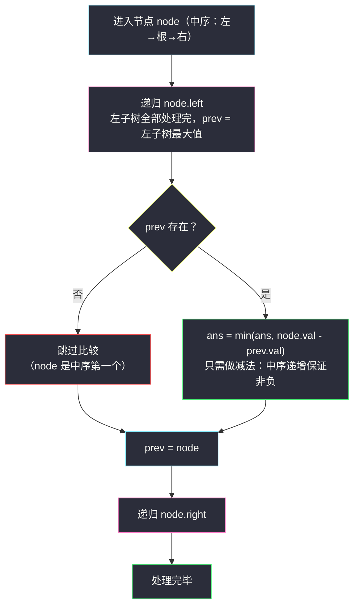
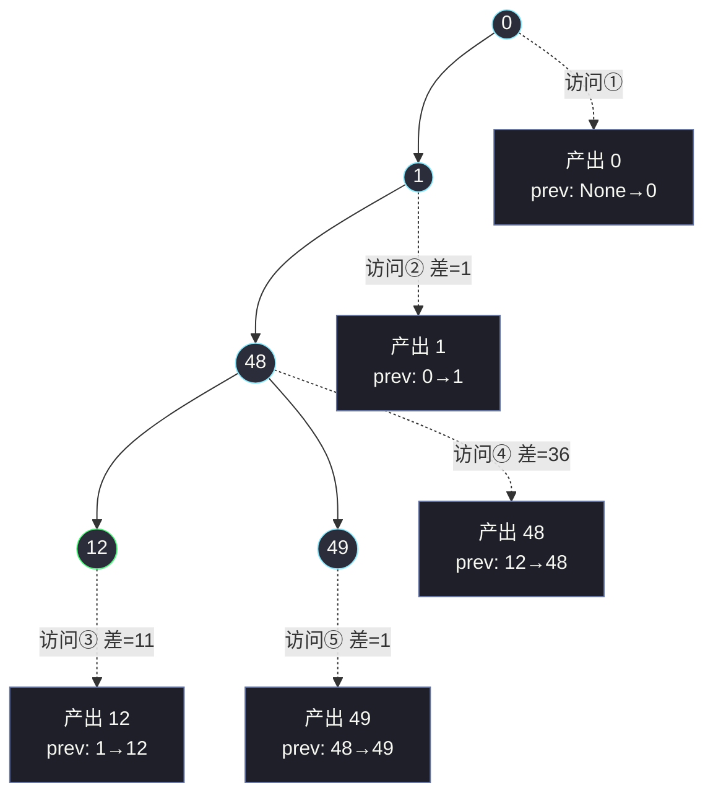

# 783. 二叉搜索树节点最小距离（Minimum Distance Between BST Nodes）

> 题目来源：[https://leetcode.cn/problems/minimum-distance-between-bst-nodes/](https://leetcode.cn/problems/minimum-distance-between-bst-nodes/)
>
> 灵茶题单小节：§2.9 二叉搜索树（难度分 530）
>
> 姊妹篇：[#530 二叉搜索树的最小绝对差](minimum-absolute-difference-in-bst.md)（题面相同、数据范围更大，那篇侧重**非递归中序**实现，本文侧重**为什么中序遍历天然有序**）。

## 一、问题描述

给你一棵**二叉搜索树（BST）**的根节点 `root`，返回树中**任意两个不同节点值之间的最小差值**。

差值是一个正数，其数值等于两值之差的绝对值。

**数据范围**：

- 树中节点的数目范围是 `[2, 100]`
- `0 <= Node.val <= 10⁵`

**示例 1**：

```text
输入：root = [4,2,6,1,3]
输出：1
解释：中序序列 [1,2,3,4,6]，最小差出现在相邻的 1,2 或 2,3 或 3,4。
```

**示例 2**：

```text
输入：root = [1,0,48,null,null,12,49]
输出：1
解释：中序序列 [0,1,12,48,49]，最小差是 1（0 与 1、48 与 49 都差 1）。
```

**核心思考点**：`n ≤ 100` 意味着两两枚举都能过，但这题真正想教的是 BST 的本质性质——**中序遍历 = 有序序列**。一旦把「树上任意两值的差」转化成「有序数组上任意两数的差」，问题的结构立刻变简单：有序数组的最小差**必然出现在相邻对之间**。

## 二、暴力解法

### 思路

不管树的形状，把所有节点值倒进数组，按定义「任意两个不同节点」枚举：

1. 遍历树收集全部值到 `vals`；
2. 双重循环枚举所有数对 `(vals[i], vals[j])`，取 `|差|` 的最小值。

### 代码

```python
class Solution:
    def minDiffInBST(self, root: Optional[TreeNode]) -> int:
        vals = []                           # 收集所有节点值

        def dfs(node):
            if node is None:
                return
            vals.append(node.val)           # 收集（什么顺序无所谓）
            dfs(node.left)
            dfs(node.right)

        dfs(root)
        ans = float('inf')
        for i in range(len(vals)):          # 两两枚举 O(n²)
            for j in range(i + 1, len(vals)):
                ans = min(ans, abs(vals[i] - vals[j]))
        return ans
```

### 复杂度

- 时间 `O(n²)`：`n ≤ 100`，最多 `100 × 99 / 2 = 4950` 对，轻松通过。
- 空间 `O(n)`：值数组 + 递归栈。

## 三、优化探索

### BST 到底给了我们什么

BST 的定义是**每个节点**都满足：左子树所有值 `<` 根值 `<` 右子树所有值。把这条规则沿递归结构展开，会发现一个全局结论：

**中序遍历（左 → 根 → 右）访问到的值序列严格递增。**

直观证明（对任意子树归纳）：中序先产出左子树的全部值——由 BST 定义它们都小于根；接着产出根；再产出右子树全部值——都大于根。子树内部同理递归。于是「左块的最大值 < 根 < 右块的最小值」，整条序列严格递增。

### 有序序列的最小差在相邻对

设中序序列为 `a₁ < a₂ < … < aₙ`。任取 `i < j`：

```text
a_j - a_i = (a_{i+1} - a_i) + (a_{i+2} - a_{i+1}) + … + (a_j - a_{j-1})
```

即**任意两数之差 = 路径上所有相邻差之和**，而每段相邻差都是正数，所以 `a_j - a_i ≥ max` 段 ≥ 其中任何一段相邻差。换句话说：**任何「跨着比」的差，都不小于把它拆开后的某段相邻差**。最小差只可能出现在相邻对 `(a_k, a_{k+1})` 中。

于是算法变成：**中序遍历一遍，只用一个变量记住「上一个访问到的节点」，每步算当前值与上一值的差**——连数组都不需要。



`prev` 是一个**滑动窗口大小恒为 1 的游标**：中序每访问一个新节点，它与 `prev` 恰好是序列中的一对相邻值。

## 四、代码实现

```python
class Solution:
    def minDiffInBST(self, root: Optional[TreeNode]) -> int:
        ans = float('inf')                  # 全局最小差
        prev = None                         # 中序遍历中上一个「访问」的节点

        def dfs(node):
            nonlocal ans, prev
            if node is None:
                return
            dfs(node.left)                  # ① 先走左子树
            if prev is not None:            # ② 访问根：与上一个值比较
                ans = min(ans, node.val - prev.val)
            prev = node                     #    游标滑到当前节点
            dfs(node.right)                 # ③ 再走右子树

        dfs(root)
        return ans
```

### 细节说明

- **减法不用 `abs`**：中序序列严格递增，`node.val - prev.val > 0` 恒成立，直接减即可——这本身就是「序列有序」的体现。
- **`prev` 存节点还是存值**：都可以。存值 `prev_val` 同样一行更新；存节点是为了与姊妹篇 [#530](minimum-absolute-difference-in-bst.md) 的「`prev` 指针技巧」表述统一——在那里，`prev` 指向显式栈弹出的节点。
- **`nonlocal` 的必要性**：`ans`、`prev` 在闭包内被赋值（非只读），Python 要求显式声明 `nonlocal` 才能绑定外层变量。
- **第一个节点跳过比较**：中序第一个节点没有「上一个」，`prev is None` 分支保证不误比。因为节点数 ≥ 2，`ans` 一定被更新过，无需担心返回 `inf`。
- **为什么不需要回溯/恢复**：`prev` 是「中序游标」，它只在访问节点时前进、从不后退——与回溯算法里「进入/退出时增删」的状态变量（如路径栈）完全不同。

## 五、例子演示

**示例 2**（`root = [1,0,48,null,null,12,49]`）：

```text
        1
      /   \
     0     48
          /  \
        12    49
```

中序访问顺序：`0 → 1 → 12 → 48 → 49`（注意：**不是层序** `1,0,48,12,49`）。逐个访问时 `(prev, 当前, 差, ans)` 的演化：

| 步骤 | 访问节点 | prev（访问前） | 差值 | ans |
|---|---|---|---|---|
| 1 | `0`（最左下） | `None` | —（跳过） | `inf` |
| 2 | `1`（0 的父） | `0` | `1 - 0 = 1` | `1` |
| 3 | `12`（右子树最左） | `1` | `12 - 1 = 11` | `1` |
| 4 | `48`（12 的父） | `12` | `48 - 12 = 36` | `1` |
| 5 | `49`（48 的右孩子） | `48` | `49 - 48 = 1` | `1` |

返回 `1` ✅。**步骤 3 值得细看**：从 `1` 走到 `12`，树上的路径是「上行到根、再下行进入右子树的最左链」——中序的访问顺序跨越了树的结构，但值依然严格递增（`1 < 12`），这就是 BST 保证的「结构无序、中序有序」。



树结构（上方圆节点）与中序产出流（下方方块）分离：访问编号 ①-⑤ 完全脱离「层」的直觉，严格按「左-根-右」的递归顺序推进。

## 六、复杂度分析

- **时间复杂度：`O(n)`**：每个节点恰好访问一次，每次访问做 `O(1)` 的比较与更新。对比暴力 `O(n²)`。
- **空间复杂度：`O(h)`**：递归栈深度 = 树高。`n ≤ 100` 最坏斜树深度 100，无压力（姊妹篇 #530 的 `n ≤ 10⁴` 才需要认真对待递归深度，见彼篇）。

## 七、对比总结

| 方案 | 思路 | 时间 | 空间 | 用到 BST 了吗 |
|---|---|---|---|---|
| 暴力两两枚举 | 收集值 + 数对枚举 | `O(n²)` | `O(n)` | ❌ 普通树也能做 |
| 收集 + 排序 + 相邻差 | 值数组排序后扫一遍 | `O(n log n)` | `O(n)` | ⚠️ 隐式（排序还原了中序序） |
| **中序 + prev 游标** | 遍历与统计一次完成 | `O(n)` | `O(h)` | ✅ 有序性内建于遍历顺序 |

| 易错点 | 说明 |
|---|---|
| 用层序/先序收集值再比相邻 | 只有**中序**才有序，层序 `[1,0,48,12,49]` 的相邻差全是噪音 |
| `abs` 与减法混用出错 | 中序递增保证 `node.val - prev.val > 0`，直接减；混着写容易掩盖「序列是否真有序」的 bug |
| `prev` 忘了在访问后更新 | 差值会与「上上个」比较，典型手误 |
| 以为要比较所有「祖先-后代」对 | 有序序列的相邻性已经覆盖：任何跨层对的差都不小于某相邻差 |

**一句话**：BST 把「排序」这件事**预先织进了结构里**——中序遍历是无成本的 `sort()`，最小差问题在树上瞬间退化成数组上的线性扫描。

## 八、举一反三

- **#530 二叉搜索树的最小绝对差**（站内姊妹篇 [minimum-absolute-difference-in-bst.md](minimum-absolute-difference-in-bst.md)）：同一道题的大数据版（`n ≤ 10⁴`），用**显式栈非递归中序**实现，顺带讨论递归深度风险——两篇合看完整覆盖「中序 + prev」的两副面孔。
- **#98 验证二叉搜索树**（https://leetcode.cn/problems/validate-binary-search-tree/）：反向使用「中序有序」——遍历中检查相邻差是否恒为正，是本文性质最经典的应用。
- **#230 二叉搜索树中第 K 小的元素**（https://leetcode.cn/problems/kth-smallest-element-in-a-bst/）：中序遍历数到第 `k` 个即停，「有序序列按下标取值」。
- **#501 二叉搜索树中的众数**（https://leetcode.cn/problems/find-mode-in-binary-search-tree/）：中序把相等值聚成相邻段，段长统计替代哈希计数。
- **#2476 二叉搜索树最近节点查询**（站内 [closest-nodes-queries-in-a-binary-search-tree.md](closest-nodes-queries-in-a-binary-search-tree.md)）：中序展开成数组 + 二分回答查询——「中序 = 排序数组」的另一处落地。
- **#987 / 网格 DFS 族**（站内 `detect-cycles-in-2d-grid.md`）：树的中序是「访问顺序携带结构信息」的最小样例；网格 DFS 的访问顺序同样由递归结构决定，可对照体会。

> **框架总结**：**见到 BST，先默念「中序 = 有序数组」**——求最值差、验证、第 k 小、众数、前驱后继，全部是这条性质的变奏。中序 + 一个游标（`prev`/计数器/候选值）是通用武器。
