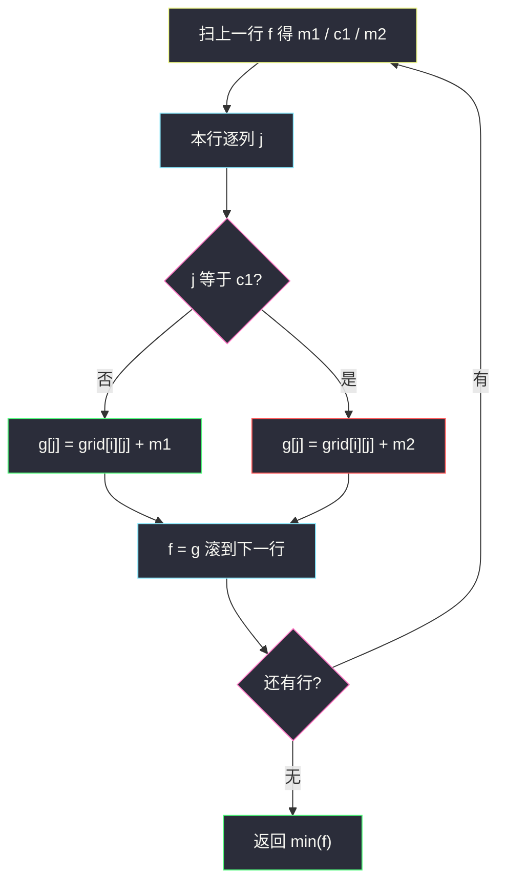
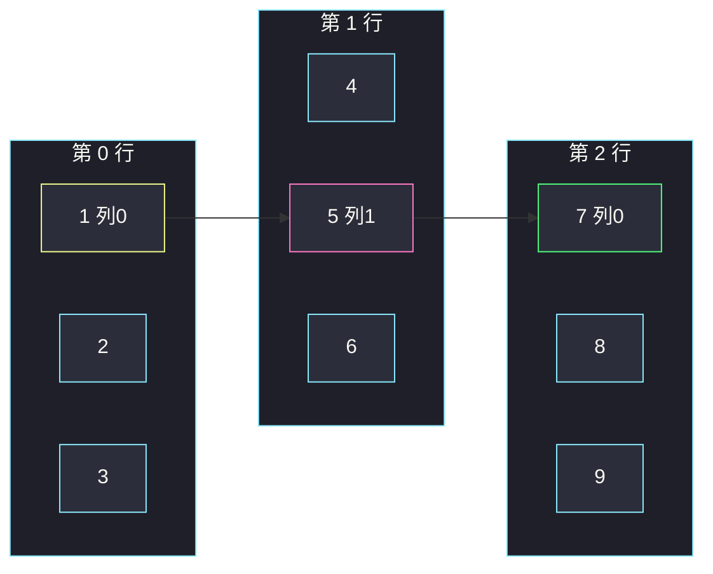

# 1289. 下降路径最小和 II（Minimum Falling Path Sum II）

> 题目来源：[https://leetcode.cn/problems/minimum-falling-path-sum-ii/](https://leetcode.cn/problems/minimum-falling-path-sum-ii/)
>
> 灵茶题单小节定位：§2.1 基础（网格 DP · 逐行转移 · 最小/次小）

## 一、问题描述

给你一个 `n x n` 整数矩阵 `grid`，请你返回**非零偏移下降路径**数字和的最小值。

**非零偏移下降路径**定义为：从 `grid` 的每一行各选一个数字，且按行序选出来的数字中，**相邻两行不在同一列**。

和 [#931 下降路径最小和](https://leetcode.cn/problems/minimum-falling-path-sum/) 的差别：931 每步只能落到下一行的相邻三列（`j-1 / j / j+1`）；本题反过来——下一行**任意列都可以**，唯独**不能**再选当前这一列。

**数据范围**：

- `n == grid.length == grid[i].length`
- `1 <= n <= 200`
- `-99 <= grid[i][j] <= 99`

**示例 1**：

```text
输入：grid = [[1,2,3],[4,5,6],[7,8,9]]
输出：13
解释：所有合法路径里和最小的是 [1,5,7]，和为 13。
```

**示例 2**：

```text
输入：grid = [[7]]
输出：7
```

**核心思考点**：阶段 = 行。`f[i][j]` = 落到 `(i, j)` 的最小路径和，转移要枚举上一行所有 `k ≠ j`，朴素 `O(n³)`。观察：对固定的 `j`，上一行的最优来源几乎总是「上一行全局最小」；只有 `j` 恰好是最小所在列时，才改用**次小**。每行维护 `(最小, 次小, 最小列号)`，内层从 `O(n)` 降到 `O(1)`，总时间 `O(n²)`。格子可负，不能把「最小」理解成绝对值。

## 二、暴力解法

### 思路

从第一行每个起点出发，DFS 枚举下一行所有「与上一列不同」的列，走到第 `n` 行结算。路径条数 `n^n`。

另备一版朴素 DP：`g[j] = grid[i][j] + min(f[k] for k != j)`，作为对拍的第二基准（`O(n³)`，`n ≤ 40` 仍轻松）。

### 代码

```python
def minFallingPathSumDfs(grid: list[list[int]]) -> int:
    n = len(grid)
    best = 10 ** 18

    def dfs(row: int, prev: int, acc: int) -> None:
        nonlocal best
        if row == n:
            best = min(best, acc)
            return
        for c in range(n):
            if c != prev:
                dfs(row + 1, c, acc + grid[row][c])

    dfs(0, -1, 0)          # 第一行任意列，prev 用 -1 表示无限制
    return best


def minFallingPathSumN3(grid: list[list[int]]) -> int:
    n = len(grid)
    f = grid[0][:]
    INF = 10 ** 9
    for i in range(1, n):
        g = [INF] * n
        for j in range(n):
            g[j] = grid[i][j] + min(f[k] for k in range(n) if k != j)
        f = g
    return min(f)
```

### 复杂度

- DFS：时间 `O(n^n)`，`n = 200` 不可用；对拍缩到 `n ≤ 4`。
- 朴素 DP：时间 `O(n³)`，空间 `O(n)`。`n = 200` 时约 8×10⁶ 次，Python 勉强，但题单要求写出 `O(n²)`。

## 三、优化探索

### 3.1 阶段化：逐行、禁同列 ⭐

只能向下走、每行恰选一格，到达 `(i, j)` 后，未来只依赖「当前列是 j」——无后效。

```text
f[i][j] = grid[i][j] + min { f[i-1][k] | k ≠ j }
答案 = min_j f[n-1][j]
f[0][j] = grid[0][j]
```

第一行没有「上一列」约束，直接等于格子本身。

### 3.2 最小 / 次小：内层 O(n) → O(1) ⭐⭐

设上一行 `f` 的最小值是 `m1`、列号 `c1`，次小值是 `m2`（来自**另一列**）。落到本行列 `j`：

- `j ≠ c1`：最优来源就是 `m1`（那一列合法）；
- `j == c1`：不能再用 `m1`，改用 `m2`。

```text
g[j] = grid[i][j] + (m2 if j == c1 else m1)
```

为什么次小一定合法？`m2` 取自 `k ≠ c1` 的某一列；当 `j == c1` 时，来源列 `≠ j`，恰好可用。`n ≥ 2` 时上一行至少两列，`m2` 必存在；`n = 1` 根本不会走进「从上一行转移」的循环。

`m1 == m2` 完全合法：两个不同列同为最小，禁掉其中一列还有另一列顶上。扫描时「先更新最小、再把旧最小降成次小」即可，不必单独存次小列号。

格子取值 `[-99, 99]`，路径和可为负——比较用真实数值，不要取绝对值，也不要提前 `max(0, ·)`。

### 3.3 和 931 / 2304 的对照

| 题 | 下一行列的合法集 | 优化 |
|---|---|---|
| 931 下降路径 I | `{j-1, j, j+1}` | 三邻居，已经 `O(n²)` |
| 1289 下降路径 II | `{0..n-1} \ {j}` | 最小/次小，`O(n²)` |
| 2304 网格最小路径代价 | 任意列，但边权看**源格的值** | 一般要 `O(m n²)`；仅当边权与源无关才能套最小/次小 |

本题边权恒为「目标格子的值」、与来源无关，所以「上一行的排序统计量」对所有目标列共享——这是能把内层打掉的根本原因。



## 四、代码实现

### 主解：逐行最小 / 次小

```python
class Solution:
    def minFallingPathSum(self, grid: list[list[int]]) -> int:
        n = len(grid)
        f = grid[0][:]                       # 第一行：无偏移约束
        INF = 10 ** 9
        for i in range(1, n):
            m1 = m2 = INF
            c1 = -1
            for j, v in enumerate(f):        # 上一行最小、次小
                if v < m1:
                    m2, m1, c1 = m1, v, j
                elif v < m2:
                    m2 = v
            g = [0] * n
            for j in range(n):
                g[j] = grid[i][j] + (m2 if j == c1 else m1)
            f = g
        return min(f)
```

### 细节说明

- **`n = 1`**：`for i in range(1, n)` 不进入，直接 `min(grid[0])`，对齐示例 2。
- **次小初值 `INF`**：`n ≥ 2` 时循环结束 `m2` 一定被真实值覆盖；不要写成 `m2 = m1` 的拷贝初始化，否则会在「全表同一个候选」时把最小列自己当成次小。
- **并列最小**：`[3, 3, 5]` 扫完 `m1=3, c1=0, m2=3`。第二列 `v == m1` 走不到 `if v < m1`，但此时 `m2` 仍是 `INF`，`elif v < m2` 成立，次小被写成 3。不要写成 `elif v < m1`（那进不去）。`elif v <= m2` 也可以。

- **滚动**：`g` 不能原地写在 `f` 上，算 `g[j]` 还要读整行旧 `f`。
- **不要改输入**：有的写法把 `grid[i]` 就地累加上一行，对拍和多次调用会脏数据，主解另开 `g`。

## 五、例子演示

**示例 1：`grid = [[1,2,3],[4,5,6],[7,8,9]]`**

第 0 行结束后 `f = [1, 2, 3]`。`m1=1, c1=0, m2=2`。

| 本行列 j | 格子 | 来源 | g[j] |
|---|---|---|---|
| 0 | 4 | j==c1，用次小 2 | **6** |
| 1 | 5 | 用最小 1 | **6** |
| 2 | 6 | 用最小 1 | **7** |

`f = [6, 6, 7]`。并列最小：扫完 `m1=6, c1=0, m2=6`。

| 本行列 j | 格子 | 来源 | g[j] |
|---|---|---|---|
| 0 | 7 | 用次小 6（列 1） | **13** |
| 1 | 8 | 用最小 6（列 0） | **14** |
| 2 | 9 | 用最小 6 | **15** |

`min = 13`，对应路径 `1 → 5 → 7`（列 `0 → 1 → 0`），与官方一致。



**负数行**：`[[-10, 5], [3, -4]]`。`f=[-10, 5]`，`m1=-10, c1=0, m2=5`。第二行：`g[0]=3+5=8`，`g[1]=-4+(-10)=-14`。答案 `-14`（路径 `-10 → -4`，列 `0 → 1`）。若误用绝对值会得到错答案。

**示例 2**：`[[7]]` → `7`。

**对拍**：`n ≤ 4`、值域 `[-20, 20]`，DFS 与 `O(n³)`、主解三方对照 400 组；另用 `O(n³)` 把 `n` 放到 12、再 100 组。必含 `n=1`、全相等、全负、第一列全是最小（专门打「次小列」）。

## 六、复杂度分析

设 `n` 为边长：

- **时间复杂度：`O(n²)`**——每行扫一遍求最小/次小 `O(n)`，再填一行 `O(n)`，共 `n` 行。
- **空间复杂度：`O(n)`**——滚动一行。若就地复用 `grid` 可降到 `O(1)` 额外空间，不推荐。

## 七、对比总结

| 维度 | DFS | 朴素 DP | 主解最小/次小 |
|---|---|---|---|
| 时间 | `O(n^n)` | `O(n³)` | `O(n²)` |
| 转移 | 枚举路径 | 枚举上一列 | 只看两个候选 |
| n=200 | 不可用 | Python 边缘 | 轻松 |

**易错点**：

1. 并列最小时次小没更新——`elif` 必须能在 `v == m1` 时写入 `m2`。
2. `n=1` 没有次小，却去取 `m2`。
3. 和 931 搞反约束：本题**禁止同列**，不是「只能邻列」。
4. 格子可负，初始化不能用 `0`。

**套路归纳**：网格逐行、目标列共享同一套「来源统计量」时，用最小/次小（或最小/最大）把 `O(n)` 枚举压成 `O(1)`。来源代价一旦依赖「从哪一列来、格子值是多少」（如 2304 的 `moveCost`），统计量就不能全局共享，回到 `O(n²)` 逐对转移。

## 八、举一反三

1. **[931. 下降路径最小和](https://leetcode.cn/problems/minimum-falling-path-sum/)**：邻三列版本，入门网格下降。
2. **[2304. 网格中的最小路径代价](https://leetcode.cn/problems/minimum-path-cost-in-a-grid/)**：同目录 `minimum-path-cost-in-a-grid.md`，边权看源值，一般不能套最小/次小。
3. **[64. 最小路径和](https://leetcode.cn/problems/minimum-path-sum/)**：只向右/下，二维前缀型网格 DP。
4. **[265. 粉刷房子 II](https://leetcode.cn/problems/paint-house-ii/)**：相邻房子不同色 = 本题「相邻行不同列」，同一套最小/次小。
5. **[1594. 矩阵的最大非负积](https://leetcode.cn/problems/maximum-non-negative-product-in-a-matrix/)**：同目录 `maximum-non-negative-product-in-a-matrix.md`，网格 DP 但乘法要 min/max 双状态。

**同族互引**：§2.1 网格基础收官。和 `minimum-path-cost-in-a-grid.md` 对照「何时能省掉内层枚举」；和 `maximum-difference-score-in-a-grid.md` 对照「望远镜化简 vs 逐格转移」。
