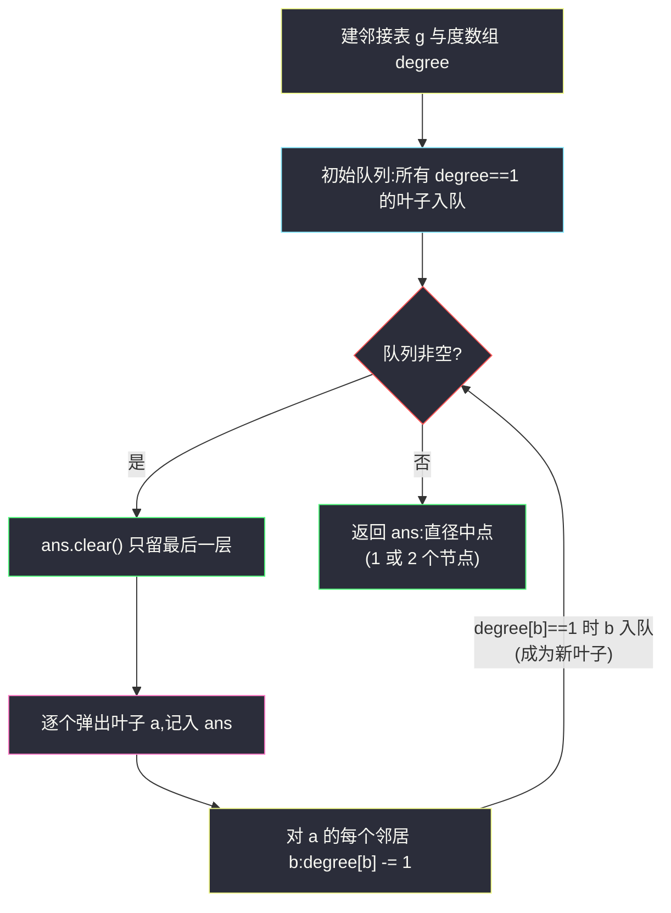

# 310. 最小高度树(Minimum Height Trees)

> 🔗 LeetCode 310:https://leetcode.cn/problems/minimum-height-trees/
>
> 📚 灵茶题单小节：§「树的直径与中心」相关练习(拓扑剥叶经典题)

## 一、问题描述

树是一个无向图,其中任何两个顶点只通过一条路径连接;换句话说,没有简单环路的连通图就是一棵树。给你一棵包含 `n` 个节点的树,节点标记为 `0` 到 `n - 1`,以及 `n - 1` 条无向边 `edges`,其中 `edges[i] = [ai, bi]` 表示节点 `ai` 与 `bi` 之间有一条边。

可以选择树中**任意一个节点作为根**。当选择节点 `x` 作为根时,设结果树的高度为 `h`(根节点到叶子节点最长向下路径上的**边数**)。在所有可能的树中,高度最小的被称为**最小高度树**。

请找到**所有的**最小高度树,按任意顺序返回它们的根节点标签列表。

**示例 1**

```text
输入:n = 4, edges = [[1,0],[1,2],[1,3]]
输出:[1]
解释:当根是标签为 1 的节点时,树的高度是 1,这是唯一的最小高度树。
```

**示例 2**

```text
输入:n = 6, edges = [[3,0],[3,1],[3,2],[3,4],[5,4]]
输出:[3,4]
```

> 数据范围:`1 <= n <= 2 * 10^4`,给定的输入保证是一棵树(无重边、连通、无环)。

**直观理解**

同一条项链,握住中间提起最稳;根也一样——**根越"居中",树越矮**。答案集合的大小只有两种可能:恰好 `1` 个(中心落在某个节点上)或恰好 `2` 个(中心落在一条边上,边两端并列)。为什么不会更多?直觉上,把根往"最远叶子"的方向挪一步,离那片叶子近了,但只要不越过中点,高度就不会变大;而中点只有一到两个候选——后文用直径严格论证。

## 二、暴力解法

最直接的做法:对**每个节点**分别作为根做一次 BFS,求出以它为根的树高度,再取全局最小值对应的节点集合。

```python
class Solution:
    def findMinHeightTrees(self, n: int, edges: List[List[int]]) -> List[int]:
        g = [[] for _ in range(n)]
        for a, b in edges:
            g[a].append(b)                    # 无向图,双向建边
            g[b].append(a)

        def height(root: int) -> int:
            """以 root 为根,BFS 求树高度(最长向下路径的边数)"""
            q = deque([(root, -1)])           # (当前节点, 父节点) 防止走回头路
            h = 0
            while q:
                h += 1                        # 又向下扩了一层
                for _ in range(len(q)):
                    x, fa = q.popleft()
                    for y in g[x]:
                        if y != fa:           # 不回头
                            q.append((y, x))
            return h - 1                      # 空队列多加了一层,减掉

        best = min(height(x) for x in range(n))
        return [x for x in range(n) if height(x) == best]
```

### 复杂度

- 时间:`O(n^2)`——每个节点一次 BFS,每次 `O(n)`,`n = 2 * 10^4` 时约 4 亿次操作,会超时。
- 空间:`O(n)`。

## 三、优化探索

### 关键观察:答案必在直径中点上

把树中**最长的一条路径**(边数 `D`)称为树的**直径**。设直径两端为 `u`、`v`:

1. **以直径中点 `c` 为根,高度恰为 `⌈D / 2⌉`**——直径两条半链各贡献 `⌈D / 2⌉` 条边,而其它分支都挂在直径链上,长度不可能超过半链(否则那条链加上它能拼出更长的直径,矛盾)。
2. **以任何其它节点 `x` 为根,高度 ≥ `⌈D / 2⌉`**——`x` 到直径两端 `u`、`v` 中至少一端的距离 ≥ `⌈D / 2⌉`,而那一段就是以 `x` 为根时的一条向下路径。

于是**最小高度树的根 = 直径的中点**:`D` 为偶数时中点是唯一节点;`D` 为奇数时中点落在一条边上,边两端都是答案——这解释了为什么答案集合大小 ≤ 2。

### 从外向内剥:不用显式求直径

求直径的标准做法是两次 BFS(任一点出发找最远点 `u`,再从 `u` 出发找最远点 `v`)。但本题只要中点,可以更省事——**剥洋葱**:

- 反复删除当前**度为 1 的节点**(叶子),同一批叶子一起删;
- 每删一层,所有剩余节点的深度整体减 1,直径减 2;
- 剥到只剩最后一层(1 或 2 个节点)时,它就是直径中点。

为什么最后一层一定 ≤ 2 个节点?若剩余 ≥ 3 个节点,它仍是一棵树,树至少有两个叶子(度为 1 的节点),还能继续剥,与"最后一层"矛盾。

还有一个更隐蔽的正确性问题:**同层叶子为什么可以整批删而不互相干扰?** 剥掉一片叶子可能让邻居度数降到 1,变成"新叶"——若立刻去删它,层与层就混了。答案在度数守恒:同层两片叶子不相邻(它们各自的邻居度数 ≥ 2 才会在队列外),删这一层不改变"谁属于下一层";新叶度数刚刚降为 1,只会被**下一轮** `while` 收割。这也是下文代码里 `if degree[b] == 1` 入队条件必须严格等于 1(而非 ≤ 1)的原因:度数降为 0 的中心节点不应再入队。



### 另一条路:换根 DP

求出以 0 为根各子树高度 `down[x]`,再自顶向下传递"从父侧能得到的最大高度" `up[x]`,两者拼出任意根的高度 `h[x] = max(down[x], up[x])`,一次 DFS + 一次 BFS 完成,同样 `O(n)`。具体地,`down[x]` 由孩子取最大加一;`up[x]` 要看父节点 `p` 除 `x` 外其它分支的最长链——若 `x` 恰在 `p` 的最长链上,则要取**次长链**,否则取最长链再加一。换根的动机:相邻两根的高度只差局部结构,重算整树是浪费;把"换根一步"的增量算清楚,任意根的高度就都能 O(1) 续推。它比剥叶"重"(要维护最长/次长防串扰),但能一次性得到每个节点作为根的高度表,信息更全;本题只要中心,剥叶更轻。换根思想在"树上换根"一族(如 #834 树中距离之和)中是通用的,放在第八章延伸。

### 剥叶的常见错误清单

- **漏掉 `n == 1` 特判**:没有边,度数全 0,初始队列为空,循环不执行,返回空列表——正确答案是 `[0]`。
- **`ans.clear()` 放错位置**:若放在层内(每弹出一个节点清一次),最终只剩同层最后一个节点;若忘了清空,返回的是**所有被剥过的叶子**。正确时机是"每层开始前"。
- **无向边只建单向**:`g[a].append(b)` 后忘记 `g[b].append(a)`,度数与邻接不一致,剥叶中途断链。
- **用 `while q: ... q.pop()` 单点弹**:不按层处理会把"新叶"提前混入当前层,得到的中心偏移——必须 `for _ in range(len(q))` 固定当前层快照。

## 四、代码实现

```python
class Solution:
    def findMinHeightTrees(self, n: int, edges: List[List[int]]) -> List[int]:
        if n == 1:                            # 单节点树,特判(没有边,度为 0)
            return [0]

        g = [[] for _ in range(n)]            # 邻接表
        degree = [0] * n                      # 度数数组
        for a, b in edges:
            g[a].append(b)                    # 无向边双向记录
            g[b].append(a)
            degree[a] += 1
            degree[b] += 1

        q = deque(i for i in range(n) if degree[i] == 1)   # 初始叶子层
        ans = []
        while q:
            ans.clear()                       # 关键:每层开始时清空,只保留最后一层
            for _ in range(len(q)):           # 当前层整批处理
                a = q.popleft()
                ans.append(a)                 # 先记入,若还有下一层则会被 clear
                for b in g[a]:
                    degree[b] -= 1            # 删掉叶子 a 后邻居度数减一
                    if degree[b] == 1:        # 度数降到 1:成为新叶子
                        q.append(b)
        return ans
```

**细节说明**

- **`ans.clear()` 的时机**:在处理每一层**之前**清空。循环结束后 `ans` 恰好保存最后一层(被删前度 ≤ 1 的剩余节点)——剥到不能剥时,最后一轮写入的就是答案,此前各层自然被覆盖。
- **为什么按"层"处理**:`for _ in range(len(q))` 固定当前队列长度,保证同层叶子被一起删除——这与多源 BFS 的层次扩散完全同构:把所有叶子视为**同一批源点**,逐层向中心收缩。
- **终止性**:每删一层,剩余节点度数单调下降,剩余子图始终是树;最终剩 1 个节点(度 0,不再入队)或 2 个节点(互为邻居,度同时降为 1 后一起入队,再互相减到 0),队列空,循环结束。
- **n == 1 特判**:没有边,所有节点度数为 0,初始化队列为空会直接返回 `[]`,而正确答案是 `[0]`。
- **不会提前终止漏解**:剥叶过程与"直径减 2"同步,答案节点恰好是最后被剥的一层,不会在中间层出现。

## 五、例子演示

用**示例 2** 端到端走一遍:`n = 6, edges = [[3,0],[3,1],[3,2],[3,4],[5,4]]`。

初始度数:

| 节点 | 0 | 1 | 2 | 3 | 4 | 5 |
|---|---|---|---|---|---|---|
| 度数 | 1 | 1 | 1 | 4 | 2 | 1 |

**第 1 轮剥叶**(队列 = {0,1,2,5},四个叶子):

| 步骤 | 弹出 | 邻居度数变化 | 新入队 |
|---|---|---|---|
| 1 | 0 | degree[3]: 4→3 | 无 |
| 2 | 1 | degree[3]: 3→2 | 无 |
| 3 | 2 | degree[3]: 2→1 | **3** |
| 4 | 5 | degree[4]: 2→1 | **4** |

本轮 `ans = [0,1,2,5]`,但因为有下一轮,会在第 2 轮开始时被清空。

**第 2 轮剥叶**(队列 = {3,4}):

| 步骤 | 弹出 | 邻居度数变化 | 新入队 |
|---|---|---|---|
| 1 | 3 | degree[4]: 1→0 | 无 |
| 2 | 4 | degree[3]: 1→0 | 无 |

本轮 `ans = [3,4]`,队列已空,循环结束,返回 `[3,4]`——与官方输出一致。

```mermaid
flowchart TB
    subgraph round1["第 1 轮:剥掉外围四片叶子"]
        direction TB
        L0["0(度1)"] --- N3a["3(度4)"]
        L1["1(度1)"] --- N3a
        L2["2(度1)"] --- N3a
        N3a --- N4a["4(度2)"]
        L5["5(度1)"] --- N4a
    end
    subgraph round2["第 2 轮:只剩中心链 3-4"]
        direction TB
        N3b["3(度1)"] --- N4b["4(度1)"]
    end
    round1 ==>|"剥去 0,1,2,5 后"| round2
    style L0 fill:#2b2d3a,stroke:#ff5555,color:#f8f8f2
    style L1 fill:#2b2d3a,stroke:#ff5555,color:#f8f8f2
    style L2 fill:#2b2d3a,stroke:#ff5555,color:#f8f8f2
    style L5 fill:#2b2d3a,stroke:#ff5555,color:#f8f8f2
    style N3a fill:#2b2d3a,stroke:#8be9fd,color:#f8f8f2
    style N4a fill:#2b2d3a,stroke:#8be9fd,color:#f8f8f2
    style N3b fill:#2b2d3a,stroke:#50fa7b,color:#f8f8f2
    style N4b fill:#2b2d3a,stroke:#50fa7b,color:#f8f8f2
    style round1 fill:#1e1f29,stroke:#6272a4
    style round2 fill:#1e1f29,stroke:#6272a4
```



对照直径视角:本树直径是 `0-3-4-5`,长 `D = 3`(奇数),中点落在边 `3-4` 上,两端 `3` 与 `4` 都是答案——两种理解互相印证。

边界用例速查(可作为提交前的自测清单):

| 用例 | 输入 | 期望输出 | 考点 |
|---|---|---|---|
| 单节点 | `n=1, edges=[]` | `[0]` | 特判分支 |
| 双节点 | `n=2, edges=[[0,1]]` | `[0,1]` | 双中心(直径 1,中点在边上) |
| 链(奇长) | 0-1-2 | `[1]` | 单中心 |
| 链(偶长) | 0-1-2-3 | `[1,2]` | 双中心 |
| 星形 | 中心连 6 叶 | `[中心]` | 一轮剥完 |

再看**示例 1** `n = 4, edges = [[1,0],[1,2],[1,3]]`:

| 轮次 | 队列(叶子) | 动作 | 剩余 |
|---|---|---|---|
| 初始 | — | 度数:0/1/2/3 各为 1,1 为 4 | {0,1,2,3} |
| 第 1 轮 | {0,2,3} | 依次弹 0(度3:4→3)、2(3→2)、3(2→1 入队) | {1} |
| 第 2 轮 | {1} | 弹 1,无邻居可减 | {} |

第 2 轮 `ans = [1]`,返回 `[1]`。直径 `0-1-2` 长 2(偶数),中点恰是节点 1——单一中心场景与直径论证再次吻合。

## 六、复杂度分析

- 时间:`O(n)`。每个节点恰好在度数降为 1 时入队一次、出队一次;每条边在两端各被遍历一次,总工作量与点数边数同阶(树中边数 = `n - 1`)。更细的账:初始化建图 `O(n)`;主循环里每个节点出队时扫描其邻接表一次,所有节点邻接表长度之和 = 2(n-1),故循环总代价 `O(n)`——建图与剥叶都是线性,没有隐藏的对数因子。
- 空间:`O(n)`。邻接表存 `2(n-1)` 条有向记录,度数数组与队列均为 `O(n)`;队列峰值在最坏时(星形图第一轮)接近 `n - 1`。

### 正确性问答

**问:剥叶会不会把答案节点提前剥掉?** 不会。答案(直径中点)到任一叶的距离 ≥ 到直径两端的距离 ≥ `⌈D/2⌉`,而每轮剥叶只移除离当前中心 ≤ 当前半径的节点——中心永远是最后被够到的那批。

**问:若树是链(每个节点度 ≤ 2),剥叶会不会一次剥两个端点导致僵局?** 恰恰相反,链是最好剥的:两端同时入队、同步向中间收缩,最后剩 1 个(奇长)或 2 个(偶长)节点,与直径中点论证严格一致。

**问:能否用两次 BFS 求直径后手动找中点代替剥叶?** 可以,同为 `O(n)`:任取点 BFS 得最远点 u,再从 u BFS 得最远点 v,u→v 路径长即直径,沿路径走 `⌈D/2⌉` 步即中点(需要记录前驱重建路径)。代码量比剥叶略多(要复原路径),但能顺带得到直径端点。

## 七、对比总结

| 解法 | 时间 | 空间 | 思路要点 | 适用场景 |
|---|---|---|---|---|
| 逐点 BFS(暴力) | `O(n^2)` | `O(n)` | 每个节点求一次高度 | `n <= 10^3` 的对拍基准 |
| 拓扑剥叶(本文) | `O(n)` | `O(n)` | 从外向内分层删叶,剩最后一层即中心 | 首选;只关心"中心",不需要具体直径端点 |
| 两次 BFS 求直径再取中点 | `O(n)` | `O(n)` | 显式找出直径两端 `u, v` 再走中点 | 需要直径端点/长度本身时 |
| 换根 DP | `O(n)` | `O(n)` | `down/up` 两次遍历拼出任意根的高度 | 需要所有节点各自的高度时(信息更全) |

一句话:**要中心用剥叶,要端点用两次 BFS,要全图信息用换根**。

## 八、举一反三

- [207. 课程表](https://leetcode.cn/problems/course-schedule/):同样的"度数减一入队"拓扑套路,从"剥叶子"变成"剥无先修依赖的课程",本题是该技巧在无向树上的镜像应用。
- [802. 找到最终的安全状态](https://leetcode.cn/problems/find-eventual-safe-states/):拓扑排序反向剥点的又一变体(剥出度为 0 的终点)。
- [834. 树中距离之和](https://leetcode.cn/problems/sum-of-distances-in-tree/):换根 DP 的代表作,配合本文第七章的对比食用,体会"换根族"与"剥叶族"的分野。
- [1245. 树的直径](https://leetcode.cn/problems/tree-diameter/):两次 BFS/DFS 显式求直径,是"直径中点"论证的另一半拼图。
- 本站延伸阅读:[地图分析(多源 BFS)](./as-far-from-land-as-possible.md) 与 [地图最高点](./map-of-highest-peak.md)——"所有源点同时入队、逐层扩散"的层次 BFS 家族,与本文的"所有叶子同时入队、逐层收缩"一脉相承,一个向外扩、一个向内收。
