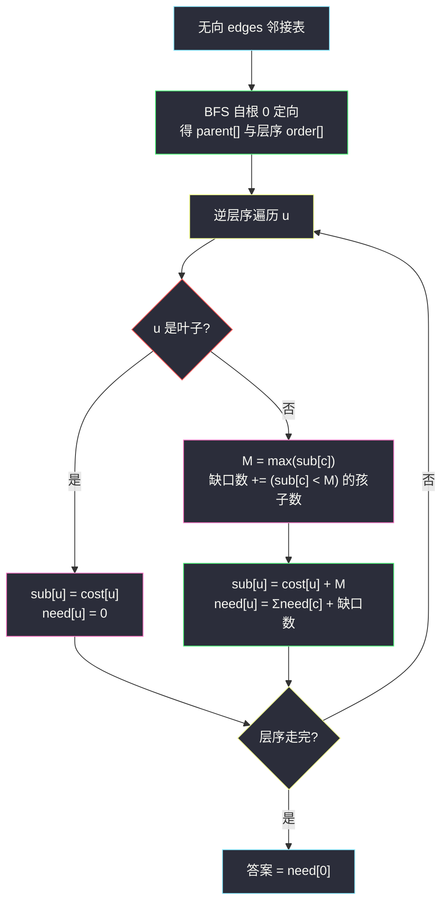
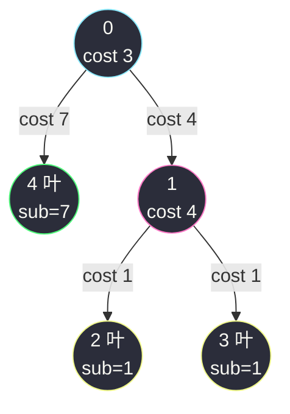

# 3593. 使叶子路径成本相等的最小增量(Minimum Increments to Equalize Leaf Paths)

> 🔗 LeetCode 3593:https://leetcode.cn/problems/minimum-increments-to-equalize-leaf-paths/
>
> 📚 灵茶题单小节:§ 无向树定向 + 逆层序树形 DP(难度分 1896)
>
> 同族文章:[#3249 统计好节点的数目](count-the-number-of-good-nodes.md)(同为"无向边表 → BFS 定向 → 逆层序统计"三步曲)、[#979 在二叉树中分配硬币](distribute-coins-in-binary-tree.md)(树形 DP 把子树信息向上合并,那篇合并"净盈亏",本文合并"子路径公共得分与修改计数")。

## 一、问题描述

给你一个整数 `n`,以及一棵**以节点 0 为根**的无向树,包含 `n` 个节点,编号 `0` 到 `n - 1`,由长度 `n - 1` 的二维数组 `edges` 表示,`edges[i] = [uᵢ, vᵢ]` 表示节点 `uᵢ` 与 `vᵢ` 之间有一条边。

每个节点 `i` 有一个关联的成本 `cost[i]`,表示**经过该节点**的成本。**路径得分**定义为路径上**所有节点成本的总和**。

你的目标:通过给**任意数量的节点增加成本**(每次可增加任意非负值),使得**所有从根到叶子的路径得分相等**。返回需要增加成本的**节点数的最小值**。

**示例 1**

```text
输入:n = 3, edges = [[0,1],[0,2]], cost = [2,1,3]
输出:1
解释:两条根到叶路径的得分:0→1 为 2+1=3,0→2 为 2+3=5。
把节点 1 的成本增加 2,两条路径得分同为 5,只需修改 1 个节点。
```

**示例 2**

```text
输入:n = 3, edges = [[0,1],[1,2]], cost = [5,1,4]
输出:0
解释:只有一条根到叶路径 0→1→2(得分 10),单路径天然相等,无需修改。
```

**示例 3**

```text
输入:n = 5, edges = [[0,4],[0,1],[1,2],[1,3]], cost = [3,4,1,1,7]
输出:1
解释:三条路径得分:0→4 为 10,0→1→2 与 0→1→3 均为 8。
把节点 1 成本 +2,三条路径全部变为 10,修改节点数为 1。
```

> 数据范围:`2 <= n <= 5 * 10⁴`,`1 <= cost[i] <= 10⁹`;题目保证 `edges` 构成一棵合法的树。

**直观理解**:成本挂在**节点**上,所以改一个节点 `u` 的成本,会**同时抬高所有经过 `u` 的根叶路径**——这是"批量上调"而非"单条微调"。想最省节点数,就要让每次修改尽可能"一石多鸟":在分叉口的上游加,能同时补齐多条子路径的缺口。反过来,**缺口出现在哪、最小需要几个节点**,恰好由子树结构逐层决定——天然的树形 DP 气味。

## 二、暴力解法

先做语义直译的笨办法:显式收集**每条**根到叶路径(节点序列与得分),把每条路径的得分都拔到全局最大值 `T`。检查每个"缺口"该由哪个节点补时,穷举所有修改方案在小树上验证——本文给出可跑的**自顶向下记忆化**版本(与主解的逆层序迭代互为独立实现,对拍用):

```python
from functools import lru_cache

class Solution:
    def minIncrease(self, n: int, edges: List[List[int]], cost: List[int]) -> int:
        g = [[] for _ in range(n)]
        for u, v in edges:
            g[u].append(v)
            g[v].append(u)
        children = [[] for _ in range(n)]
        seen = [False] * n
        seen[0] = True
        order = [0]
        for u in order:                        # 借列表生长做迭代 DFS/BFS
            for w in g[u]:
                if not seen[w]:
                    seen[w] = True
                    children[u].append(w)
                    order.append(w)

        @lru_cache(maxsize=None)
        def solve(u):                          # 返回 (子路径公共得分, 最少修改数)
            if not children[u]:                # 叶子:公共得分就是自身成本
                return cost[u], 0
            subs = [solve(c) for c in children[u]]
            top = max(s for s, _ in subs)      # 只能加不能减 → 对齐到最大
            extra = sum(1 for s, _ in subs if s < top)
            return cost[u] + top, sum(f for _, f in subs) + extra

        return solve(0)[1]
```

### 复杂度

- 时间:`O(n)`——每个节点求解一次(记忆化),但 `lru_cache` 常数大且**递归深度 = 树高**,链形树 5 万层直接 `RecursionError`。
- 空间:`O(n)`(缓存 + 递归栈)。

这个版本把"子路径公共得分"与"修改数"捆成一个元组向上递归,思路正确,但作为主解有两处硬伤:递归爆栈、缓存哈希开销。真正的问题在于——**它已经把 DP 方程写出来了,却还没解释为什么对齐目标是"孩子公共得分的最大值"、为什么每个缺口恰好一个节点**。这些想透了,迭代化只是体力活。

## 三、优化探索

### 观察 1:只能加不能减 → 缺口天然指向"对齐到最大"

每次修改是"增加任意非负值",得分只能升不能降。设在节点 `u` 处要统一其子树内所有叶路径"从 `u` 出发"的得分:

- 若各孩子的子路径公共得分参差不齐,低于最大值 `M` 的孩子必须被抬高到 `M`;
- 目标定得比 `M` 更高只会多花力气,不省节点——**对齐目标取 `M` 是无损的**。

于是"路径得分相等"这个全局条件,被逐层分解为"每个节点把孩子们对齐到 max"的局部条件。

### 观察 2:补一个缺口恰好一个节点,且必须补在孩子自己身上

孩子 `c` 的子路径得分整体差 `M − sub(c)`。有哪些"补法"?

- **改 `c` 自身**:它子树内所有叶路径同时 +δ,一步补齐——1 个节点,且**只影响 `c` 的子树**,不干扰兄弟;
- **改 `c` 子树内部**:子树内部已经对齐,再改内部任一节点会破坏内部相等,除非把"每个叶到该节点的路径"都等量补——远多于 1 个节点;
- **改 `c` 的祖先**:增益会波及兄弟子树,兄弟并不需要同样的增量,反而制造新缺口。

结论:**每个"低于 max 的孩子"唯一最优动作是在孩子节点自身上加到 max,代价恰好 1**。DP 方程定型:

```text
sub(u) = cost[u] + max(sub(c) for c in children(u))
need(u) = Σ need(c) + #{c : sub(c) < max}
```

根节点无需再对齐(它上面没有更远的祖先比较),`need(0)` 即答案。

### 观察 3:防爆栈——BFS 定向 + 逆层序

`n ≤ 5 × 10⁴` 的链形树递归必炸。套路与 [#3249](count-the-number-of-good-nodes.md) 完全一致:先 BFS 把无向边表定向成父指针与层序,再**按层序的逆序**逐节点结算——孩子必然先于父亲处理完,`sub`/`need` 两张一维数组就地滚动,零递归零缓存。

### 观察 4:交换论证——为什么"每个缺口一个节点"不能更省

有读者会问:能否用**一个节点同时补齐两个孩子的缺口?比如改父节点 `u` 自身**,让两个孩子同升?改 `u` 确实同时抬两条子路径,但两个孩子原本都低于 max、缺口不同时,抬同一个量只能对齐其中一个;且改 `u` 后 `u` 自身也成为"被修改节点",计数 +1,与分别改两个孩子(计 2)相比,只有当**两个孩子缺口恰好相等**时,改 `u` 同样计 1 就能双双补齐——但这真的更优吗?注意改 `u` 抬高的是"`u` 到叶"的得分,而两个孩子对齐到 `max` 后,`sub(u) = cost[u] + max` 向上传给父级;改 `u` 等价于把同样的增量叠加在更高层,反而会破坏 `u` 与其兄弟的对齐关系,在父级制造新缺口——得不偿失。形式化地说:每个"低于 max 的孩子"的缺口**必须**在它自己的子树外一个节点处吸收,而唯一不产生外部性的位置就是孩子自身;缺口之间互相独立,故总数 = 缺口数,没有更省方案。这一论证与 [#979](distribute-coins-in-binary-tree.md) 的"每条边的流量独立"一脉相承——**树形 DP 的计数下界,往往就是逐边/逐点独立性的直接推论**。



## 四、代码实现

```python
class Solution:
    def minIncrease(self, n: int, edges: List[List[int]], cost: List[int]) -> int:
        g = [[] for _ in range(n)]
        for u, v in edges:
            g[u].append(v)
            g[v].append(u)

        # ---- BFS 定向:父指针 + 层序 ----
        parent = [-1] * n
        order = [0]
        seen = [False] * n
        seen[0] = True
        head = 0
        while head < len(order):
            u = order[head]; head += 1
            for w in g[u]:
                if not seen[w]:
                    seen[w] = True
                    parent[w] = u
                    order.append(w)

        children = [[] for _ in range(n)]
        for v in order[1:]:
            children[parent[v]].append(v)

        # ---- 逆层序 DP:sub = 子路径公共得分, need = 最少修改节点数 ----
        sub = cost[:]                      # 叶子处即 cost,无需特判
        need = [0] * n
        for u in reversed(order):
            kids = children[u]
            if not kids:
                continue                   # 叶:sub/need 已就位
            top = 0
            for c in kids:
                if sub[c] > top:
                    top = sub[c]
            gap = 0
            for c in kids:
                need[u] += need[c]
                if sub[c] < top:
                    gap += 1
            need[u] += gap
            sub[u] = cost[u] + top
        return need[0]
```

### 细节说明

- **`sub = cost[:]` 的就地滚动**:叶子从不被 `sub[u] = ...` 覆盖,初始值即终值;内部节点在**所有孩子结算完后**才覆盖——逆层序保证这一点。
- **两趟循环代替 `max`/生成式**:乍看啰嗦,实则把"找 max"与"数缺口"合并进同一轮孩子扫描的第二次遍历,避免对 `kids` 多次完整扫描;小优化,但 `5 × 10⁴` 节点下点滴皆收入。
- **根无需对齐**:`need[0]` 只汇总孩子们的对齐代价;根自己加成本只会整体抬高所有路径,不改变任何缺口结构(全局目标从 `T` 平移到 `T + c` 而已)。
- **单边树(链)自动得 0**:链上每个内部节点只有一个孩子,`sub[c] == top` 恒成立,缺口数为 0——与示例 2 的"单路径天然相等"互印证。
- **`cost[i] ≤ 10⁹` 求和上限**:`sub` 最大约 `5 × 10⁴ × 10⁹ = 5 × 10¹³`,Python 大整数无压力;C++/Java 需 `long long`/`long`。

## 五、例子演示

**示例 3** `n = 5, edges = [[0,4],[0,1],[1,2],[1,3]], cost = [3,4,1,1,7]` 全流程:



BFS 定向(邻接表按输入顺序):`order = [0, 4, 1, 2, 3]`,`children[0] = [4, 1]`,`children[1] = [2, 3]`。

逆层序结算:

| 步骤 | 节点 | 类型 | 孩子的 sub | top | 缺口数 | sub[u] | need[u] |
|---|---|---|---|---|---|---|---|
| 1 | 3 | 叶 | — | — | — | 1 | 0 |
| 2 | 2 | 叶 | — | — | — | 1 | 0 |
| 3 | 1 | 内部 | [1, 1] | 1 | 0(两叶齐平) | 4 + 1 = 5 | 0 |
| 4 | 4 | 叶 | — | — | — | 7 | 0 |
| 5 | 0 | 内部根 | [7, 5] | 7 | 1(孩子 1 低 2) | — | **0 + 0 + 1 = 1** ✅ |

即"在节点 1 上加 2",与官方解释一字不差。

**示例 1** 同法:`children[0] = [1, 2]`,叶 `sub = [1, 3]`,top = 3 缺口 1,`need[0] = 1` ✅(在节点 1 上加 2)。**示例 2** 链形,缺口恒 0,`need[0] = 0` ✅。

### 常见错误清单

- **把"最小总增量"当答案**:本题求的是**被修改的节点数**最少,不是增量总和最少——改一个节点可以一口气加任意大,缺口大小本身不进目标函数,只有"改了几个节点"计数。
- **对齐目标取全局平均或首孩子**:只能加不能减,低于最大值的孩子都必须抬;取平均会让"高于平均"的孩子无法下压,直接错。
- **在缺口孩子的子树内部找节点补**:破坏子树内部已对齐的结构,代价高于 1;缺口的最优补丁永远打在孩子节点自身。
- **忘了根也可以是叶**:`n = 1` 退化(题目范围 `n ≥ 2` 不会出现,但 `n = 2` 时若 1 是 0 的孩子,处理正确即得 0 或 1,无需特判)。
- **递归版直接上 `5 × 10⁴`**:链形树爆栈;逆层序迭代才是无环境假设的写法。

**边界用例速查**:

| 用例 | 输入 | 期望 | 考点 |
|---|---|---|---|
| 链(单路径) | 示例 2 | 0 | 单叶天然相等 |
| 全等叶星形 | `cost` 全同 | 0 | 无缺口 |
| 双层缺口 | 见上文手工例 | 2 | 逐层独立计数 |
| 深为 2 全缺口 | 根带 `d` 个低值孩子 | `d - 1` | max 对齐只补低于者 |
| 链形 5 万节点 | 随机 cost | 0 | 逆层序迭代栈安全 |

注意"深为 2 全缺口"一行:`d` 个孩子里最高的那个是 max 本尊,其余 `d - 1` 个才是缺口——max 不需要改自己,改的是"以它为基准的落后者"。

## 六、复杂度分析

- **时间:`O(n)`**——BFS 定向一趟 + 逆层序结算一趟,每个节点、每条边各常数次访问。
- **空间:`O(n)`**——邻接表、层序、父子结构、`sub`/`need` 两数组,共五个线性结构。

## 七、对比总结

| 解法 | 时间 | 空间 | 栈安全 | 备注 |
|---|---|---|---|---|
| 递归记忆化返回 (sub, need) 元组 | `O(n)` | `O(n)` | ❌ 链形爆栈 | 语义清晰,只适合小数据 |
| **BFS 定向 + 逆层序滚动数组(本文)** | `O(n)` | `O(n)` | ✅ | 5 万节点无条件通过 |

| 易错点 | 说明 |
|---|---|
| 目标函数 | 数"改了几个节点",不是增量总和 |
| 对齐目标 | 孩子公共得分的最大值,取平均必错 |
| 修改位置 | 缺口打在孩子自身,进子树或上祖先都更贵 |

**一句话**:"只能加不能减"把对齐目标钉死在 max,缺口又只能在孩子节点自身一次补齐——**方程 `sub = cost + max(孩子)`,`need = Σneed + 低于 max 的孩子数`,两行就是全部**。

## 八、举一反三

- [#3249 统计好节点的数目](count-the-number-of-good-nodes.md)(站内):同一副"无向边表 → BFS 定向 → 逆层序"骨架,那篇数子树大小,本文 DP 子路径得分——换汤不换药。
- [#979 在二叉树中分配硬币](distribute-coins-in-binary-tree.md)(站内):同样是"把子树信息打包上抛"的树形 DP,那篇抛净盈亏、这篇抛"公共得分 + 修改计数"二元组。
- [#1372 二叉树中的最长交错路径](longest-zigzag-path-in-a-binary-tree.md)(站内):路径状态随遍历携带的另一面——单遍 DFS 状态自包含型,与本文"定向 + 逆序结算"型互为补充。
- [#968 监控二叉树](https://leetcode.cn/problems/binary-tree-cameras/):最小化"放置节点数"的树形 DP 三状态经典,与本文"最小化修改节点数"目标同型,状态更多维。
- [#3373 连接两棵树后最大目标节点数目 II](https://leetcode.cn/problems/maximize-the-number-of-target-nodes-after-connecting-trees-ii/):同期姊妹题,把"距离 ≤ k"计数做到 `O(n)` 换根,树形 DP 的计数变体。

> **框架总结**:树上"所有根叶路径满足同一性质"的问题,几乎都能按**逐节点对齐孩子**分解;目标函数是计数时,先问"每个局部缺口最少要几个节点"——通常答案是 0 或 1,DP 方程随之免费送出。
