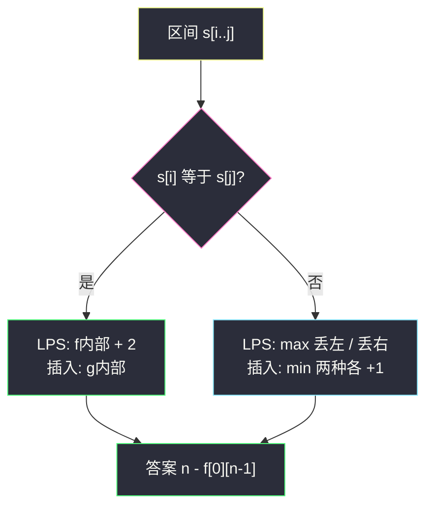

# 1312. 让字符串成为回文串的最少插入次数（Minimum Insertion Steps to Make a String Palindrome）

> 题目来源：[https://leetcode.cn/problems/minimum-insertion-steps-to-make-a-string-palindrome/](https://leetcode.cn/problems/minimum-insertion-steps-to-make-a-string-palindrome/)
>
> 灵茶题单小节定位：§8.1 最长回文子序列

## 一、问题描述

给你一个字符串 `s`，每一次操作都可以在**任意位置插入任意字符**。返回让 `s` 成为回文串的**最少操作次数**。

回文串：正读和反读相同。

**数据范围**：

- `1 <= s.length <= 500`
- `s` 只含小写字母

**示例 1**：

```text
输入：s = "zzazz"
输出：0
解释：已经是回文，不用插。
```

**示例 2**：

```text
输入：s = "mbadm"
输出：2
解释：可以变成 "mbdadbm" 或 "mdbabdm"。
```

**示例 3**：

```text
输入：s = "leetcode"
输出：5
解释：插入 5 个字符后变成 "leetcodocteel"。
```

**核心思考点**：已经是回文的那一段骨架，插字符时应尽量保留。骨架 = **最长回文子序列（LPS）**。剩下 `n - LPS` 个字符各自缺一个镜像，每个补一次插入，不能更少。于是答案恒等于 `n - LPS(s)`。把 [#516](https://leetcode.cn/problems/longest-palindromic-subsequence/) 的区间 DP 写对，本题就结束了。也可以直接对「最少插入」做区间 DP，二者代数等价。

## 二、暴力解法

### 思路

枚举 `s` 的每个子序列，判断是否回文，取最长长度 `L`，返回 `n - L`。子序列用比特掩码，相对顺序自动保持。与主解的区间 DP 独立（暴力在子集上检查，主解在下标区间上转移）。

### 代码

```python
def minInsertionsBrute(s: str) -> int:
    n = len(s)
    best = 0
    for mask in range(1, 1 << n):
        t = [s[i] for i in range(n) if mask >> i & 1]
        if t == t[::-1]:
            best = max(best, len(t))
    return n - best
```

### 复杂度

- 时间：`O(2^n · n)`。`n = 500` 不可用；对拍缩到 `n ≤ 10`。
- 空间：`O(n)`。

## 三、优化探索

### 3.1 为什么答案是 n - LPS ⭐⭐

任意回文串都可以看成「一对对镜像字符 + 可选的中心」。`s` 里已经能配成回文的最长子序列长度是 `L = LPS(s)`。要把整串变成回文：

- 这 `L` 个字符**原样保留**，作为最终回文的骨架（相对顺序不变）；
- 其余 `n - L` 个字符，每一个都在骨架的「另一侧」缺一个配对。在合适位置插入它的镜像，恰好补上。

少插一个，必有一个原字符没有镜像，结果不是回文；多插没有必要。所以最少插入次数 = `n - L`。

示例 2：`"mbadm"` 的 LPS 是 `"mam"` 或 `"mdm"`（长度 3），`5 - 3 = 2`。保留 `"mam"` 时，剩下的 `b、d` 各插一次，得到 `"mbdadbm"` 这类串。

这也解释了「已经是回文 ⇒ LPS = n ⇒ 插 0 次」。

### 3.2 LPS 区间 DP ⭐⭐

`f[i][j]` = 子串 `s[i..j]` 的最长回文子序列长度。

- 空区间 / 越界：0（下三角保持 0）。
- `i == j`：单个字符，`f[i][i] = 1`。
- `s[i] == s[j]`：两端能配对，`f[i][j] = f[i+1][j-1] + 2`。
- 否则：至少丢一端，`f[i][j] = max(f[i+1][j], f[i][j-1])`。

长度 2 且两端相等时，`f[i+1][j-1] = f[j][i]` 落在下三角，值为 0，于是 `0 + 2 = 2`，不必特判。

填表顺序：`i` 从大到小、`j` 从小到大（先算短的内部），或按区间长度 `len = 2..n` 枚举。

`s` 与 `s[::-1]` 的 LCS 也等于 LPS——同一套「两端配或不配」，只是一个写在区间上，一个写在双串前缀上。

### 3.3 直接对插入次数 DP（等价形式）

`g[i][j]` = 把 `s[i..j]` 变成回文的最少插入：

- `s[i] == s[j]`：两端已经配对，`g[i][j] = g[i+1][j-1]`；
- 否则：在左侧插 `s[j]`，或在右侧插 `s[i]`，`g[i][j] = min(g[i+1][j], g[i][j-1]) + 1`。

和 LPS 的关系：`g[i][j] = (j - i + 1) - f[i][j]`。两端相等时两边同时减 2 个骨架、长度减 2，插入数不变；两端不等时 `max` 变 `min` 再 `+1`，正好对上。两种写法选一个默写即可，题单本节跟 516，推荐先 LPS 再减。



插在「哪一侧」：`s[i] ≠ s[j]` 时，在 `s[i]` 左边插一个 `s[j]`，等于先把右端配掉、区间变成 `[i..j-1]`；在 `s[j]` 右边插一个 `s[i]`，区间变成 `[i+1..j]`。所以 `+1` 的两个分支不是凭空来的。

## 四、代码实现

### 主解：LPS 区间 DP，答案 n - LPS

```python
class Solution:
    def minInsertions(self, s: str) -> int:
        n = len(s)
        f = [[0] * n for _ in range(n)]
        for i in range(n - 1, -1, -1):
            f[i][i] = 1
            for j in range(i + 1, n):
                if s[i] == s[j]:
                    f[i][j] = f[i + 1][j - 1] + 2
                else:
                    f[i][j] = max(f[i + 1][j], f[i][j - 1])
        return n - f[0][n - 1]
```

### 对照：直接插字符 / 记忆化

```python
class Solution:
    def minInsertions(self, s: str) -> int:
        n = len(s)
        g = [[0] * n for _ in range(n)]
        for i in range(n - 2, -1, -1):
            for j in range(i + 1, n):
                if s[i] == s[j]:
                    g[i][j] = g[i + 1][j - 1]
                else:
                    g[i][j] = min(g[i + 1][j], g[i][j - 1]) + 1
        return g[0][n - 1]
```

记忆化版把「插」写得更像搜索：`dfs(i, j)`，`i >= j` 返回 0；相等走内部；否则 `1 + min(dfs(i+1, j), dfs(i, j-1))`。

### 细节说明

- **不要写成子串**：中心扩展求的是最长回文**子串**，插入后原字符不必连续，必须用子序列。
- **下三角保持 0**：`f[i+1][j-1]` 在 `j = i+1` 时读到 `f[i+1][i]`，依赖这个 0。
- **`i` 倒序**：计算 `f[i][j]` 时 `f[i+1][*]` 已填完。
- **LCS 写法**：`LCS(s, s[::-1])` 结果相同，代码更短但多一次反转；区间版更贴近 §8.1 模板。

## 五、例子演示

**示例 2 端到端：`s = "mbadm"`**（下标 0..4）

对角线全 1。按 `i` 降、`j` 升填写上三角（只列出用到的）：

| 区间 | 字符 | 相等? | 转移 | f |
|---|---|---|---|---|
| [0,1] | m,b | 否 | max(1,1) | 1 |
| [1,2] | b,a | 否 | max(1,1) | 1 |
| [2,3] | a,d | 否 | max(1,1) | 1 |
| [3,4] | d,m | 否 | max(1,1) | 1 |
| [0,2] | m,a | 否 | max(f[1][2], f[0][1]) = 1 | 1 |
| [1,3] | b,d | 否 | 1 | 1 |
| [2,4] | a,m | 否 | 1 | 1 |
| [0,3] | m,d | 否 | 1 | 1 |
| [1,4] | b,m | 否 | 1 | 1 |
| [0,4] | m,m | **是** | f[1][3] + 2 = 1 + 2 | **3** |

`n - 3 = 2` ✅。骨架 `"m*m"`，中间 `bad` 的 LPS 只有 1，所以整段最长回文子序列是 3。

插入怎么还原：保留 `"mam"`（下标 0,2,4），`b` 和 `d` 各在对称位置插一次 → `"mbdadbm"`（官方给的一种）。

**示例 3：`s = "leetcode"`**，`n = 8`。三个 `'e'` 构成 `"eee"`，没有长度 4 的回文子序列（只有一个 `'l'`、一个 `'t'`……），LPS = 3，插入 `5` ✅，对应官方 `"leetcodocteel"`。

**示例 1**：整串回文，对角线填完后 `f[0][n-1] = n`，答案 0。

**对拍**：`n ≤ 10`、字母表 `abcd`，掩码枚举 LPS 与两种 DP（LPS 版 / 直接插入版）对照 400 组。必含单字符、已是回文、全相同、严格递增（LPS=1，答案 `n-1`）。

## 六、复杂度分析

设 `n = len(s)`：

- **时间复杂度：`O(n²)`**——上三角每个区间常数转移。
- **空间复杂度：`O(n²)`**。可压成 `O(n)`（倒着滚一行），面试默写二维即可。

## 七、对比总结

| 维度 | 枚举子序列 | LPS 再减 | 直接插入 DP |
|---|---|---|---|
| 时间 | `O(2^n · n)` | `O(n²)` | `O(n²)` |
| 状态含义 | 子集是否回文 | 最长骨架 | 最少补镜像 |
| 和 516 | 同一暴力 | 就是 516 | `len - 516` |

**易错点**：

1. 当成最长回文**子串**，用中心扩展——`"mbadm"` 没有任何长度 ≥ 2 的连续回文，子串最长为 1，会得到插入 4，与答案 2 差一倍。
2. 两端相等时漏了 `+2`，或插入版相等时误 `+1`。
3. 填表方向反了，读到未计算的内部。
4. 把「删除变回文」和「插入变回文」弄混：删除次数同样是 `n - LPS`（[#1246](https://leetcode.cn/problems/palindrome-removal/) 一类），插入与删除次数**数值相等**，操作对象不同。

**套路归纳**：§8.1 的口诀——回文子序列看两端：能配就配（+2），不能就丢一端。需要「改成回文的最少编辑」时，先问骨架多长，再 `n - LPS`。插入、删除、问「最多删 k 个能否回文」，全是这句话。

## 八、举一反三

1. **[516. 最长回文子序列](https://leetcode.cn/problems/longest-palindromic-subsequence/)**：本题的骨架，答案差一个 `n -`。
2. **[1143. 最长公共子序列](https://leetcode.cn/problems/longest-common-subsequence/)**：`LPS(s) = LCS(s, reverse(s))`。
3. **[3472. 至多 K 次操作后的最长回文子序列](https://leetcode.cn/problems/longest-palindromic-subsequence-after-at-most-k-operations/)**：同目录 `longest-palindromic-subsequence-after-at-most-k-operations.md`，配对改成付环绕距离。
4. **[1216. 验证回文串 III](https://leetcode.cn/problems/valid-palindrome-iii/)**：最多删 `k` 个 ⇔ `n - LPS ≤ k`。
5. **[132. 分割回文串 II](https://leetcode.cn/problems/palindrome-partitioning-ii/)**：要的是连续回文段，换成中心扩展 / 区间判回文 + 划分 DP，不要套 LPS。

**同族互引**：§8.1 把 516 当模板，本题是「骨架用尽后补镜像」。和 `longest-almost-palindromic-substring.md`（子串、中心扩展）不是同一套转移。
