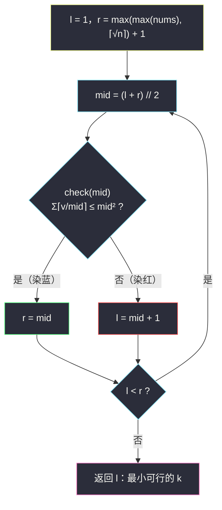

# 减小数组使其满足条件的最小 K 值（二分答案 · 求最小）

## 一、问题描述

给你一个正整数数组 `nums`。

固定一个正整数 `k`，你可以执行任意多次下述操作：

- 任选一个下标 `i`，令 `nums[i] -= k`（同一个下标可以被反复选中）。

记 `nonPositive(nums, k)` 为：**让所有元素都变成小于等于 0 所需的最少操作次数**。

求**最小的 `k`**，使得 `nonPositive(nums, k) <= k * k`。

> 🔗 LeetCode 3824：https://leetcode.cn/problems/minimum-k-to-reduce-array-within-limit/
>
> `nums` 为正整数数组，记 `n = len(nums)`（具体上界见题目页面；本文的上界推导不依赖具体数值）。

**示例**

```
输入：nums = [3,7,5]
输出：3

解释：k = 3 时，3 需要 1 次、7 需要 3 次、5 需要 2 次，共 6 次操作，
      6 <= 3^2 = 9，满足条件；
      k = 2 时需要 2 + 4 + 3 = 9 次操作，9 > 2^2 = 4，不满足。
```

**直观理解**

注意题目问的不是「怎么操作」，而是「`k` 最小能取几」——答案是一个正整数，天然落在 `[1, 某个上界]` 里。这类「猜一个参数、验证代价是否达标、参数越小越难达标」的问题，正是灵茶题单 **§2.1 求最小** 的标准形态：**在答案的取值范围上二分**，每猜一个候选 `k`，用 `O(n)` 的 check 验证。

---

## 二、暴力解法

从 `k = 1` 开始逐个试：对每个 `k` 计算 `nonPositive(nums, k)`，第一次满足 `<= k^2` 的 `k` 就是答案。

```python
class Solution:
    def minK(self, nums: List[int]) -> int:
        k = 1
        while True:
            ops = sum((v + k - 1) // k for v in nums)   # nonPositive(nums, k)
            if ops <= k * k:
                return k
            k += 1
```

### 复杂度

- **时间**：`O(n * M)`，`M` 是答案上界（第三节会证 `M = max(max(nums), ⌈√n⌉)`）。`max(nums)` 达到 `10^5` 量级时就是 `10^10` 级运算，必然超时。
- **空间**：`O(1)`。

### 🔴 瓶颈在哪里

可行与不可行在 `k` 的数轴上是**一刀切**的结构：小 `k` 全不可行，大 `k` 全可行，中间只有一个分界点。「逐个试」完全可以换成「折半试」——这正是二分答案的用武之地。

---

## 三、优化探索（核心章节）

> 📚 本题在灵茶题单中属于 **§2.1 求最小**（与 #875 珂珂、#1283 最小除数、#3453 分割正方形 I 同小节）。模板与 §1.1 基础二分（见同批 `search-insert-position.md`）完全一致，只是 check 从「比较数组元素」换成了「模拟减法计数」。

### 3.1 先把 nonPositive 写成公式

各下标的操作**互不影响**：元素 `v` 每次操作减 `k`，减到 `≤ 0` 最少需要 `⌈v / k⌉` 次（最后一下减多了不算浪费，反正只要非正）。所以：

```
nonPositive(nums, k) = Σ ⌈v / k⌉    （v 取遍 nums）
```

于是问题变成：求最小正整数 `k`，使得

```
check(k)：Σ ⌈v / k⌉ <= k^2
```

### 3.2 关键观察：check 关于 k 单调

设 `f(k) = Σ ⌈v / k⌉`，则：

- `k` 变大 → 每个 `⌈v / k⌉` **不增** → `f(k)` 单调不增；
- `k` 变大 → `k^2` **严格增大**。

于是「`f(k) <= k^2`」在数轴上呈**左假右真**：`k` 太小操作次数太多、预算 `k^2` 又太小（红）；`k` 足够大后次数骤降、预算膨胀（蓝）。**要的答案 = 最小的蓝色 k**。


单调性一经确认，二分答案的合法性就拿到了**入场券**。

### 3.3 上界怎么定：max(nums) 单独还不够！

二分需要一个「保证为真」的上界。两条事实：

1. `k >= max(nums)` 时，任何元素一次操作就非正（`v <= k`，减一下 `v - k <= 0`），所以 `f(k) = n`（每元素恰好 1 次，且至少 1 次）；
2. 预算侧需要 `k^2 >= n`，即 `k >= ⌈√n⌉`。

两条合起来，取

```
hi = max( max(nums), ⌈√n⌉ )
```

则 `f(hi) = n <= hi^2`，`check(hi)` **必然为真**——答案一定落在 `[1, hi]` 内。

**⚠️ 一个容易踩的坑（自造例子）**：`nums = [1,1,1,1]`，此时 `max(nums) = 1`，但答案是 `2`：

- `k = 1`：`f = 4 > 1^2 = 1`，不可行；
- `k = 2`：`f = 4 <= 2^2 = 4`，可行。

答案**大于** `max(nums)`！因为当 `max` 很小而 `n` 很大时，卡脖子的不是「次数降不下来」而是「预算 `k^2` 太小」。这就是上界必须同时取 `⌈√n⌉` 的原因。

### 3.4 统一模板（求最小）

```
求满足 check(x) 的最小 x（红蓝染色）：
    l = 下界, r = 上界 + 1          # 候选区间左闭右开 [l, r)
    while l < r:
        mid = (l + r) // 2
        if check(mid): r = mid       # mid 蓝：可行，收缩右界
        else:          l = mid + 1   # mid 红：不可行，收缩左界
    答案 = l                         # l == r，最左蓝
```

循环不变量：`l` 左边全红、`r` 及右边全蓝，未染色区间每轮至少减半，`log2(hi)` 轮内收敛。



### 3.5 一句话核心

> **「Σ⌈v/k⌉ ≤ k²」关于 k 左假右真 → 在 `[1, max(max(nums), ⌈√n⌉)]` 上跑「求最小」红蓝模板，check = 模拟计数。**

---

## 四、代码实现

### Python（主解）

```python
import math

class Solution:
    def minK(self, nums: List[int]) -> int:
        n = len(nums)

        def check(k: int) -> bool:
            limit = k * k                    # 预算 k²
            ops = 0
            for v in nums:
                ops += (v + k - 1) // k      # ⌈v/k⌉
                if ops > limit:              # 提前退出，防止白算
                    return False
            return True

        # ⌈√n⌉ = isqrt(n-1) + 1（对 n ≥ 1 成立）
        hi = max(max(nums), math.isqrt(n - 1) + 1)
        l, r = 1, hi + 1                     # 答案 ∈ [1, hi]，check(hi) 必真
        while l < r:
            mid = (l + r) // 2
            if check(mid):
                r = mid                      # mid 及更大的 k 都可行
            else:
                l = mid + 1                  # mid 不可行，更小更不行
        return l
```

**变量含义**

| 变量 | 含义 |
|------|------|
| `k` / `mid` | 猜测的每次操作减量 |
| `(v + k - 1) // k` | 元素 `v` 变非正的最少次数 `⌈v/k⌉` |
| `limit = k * k` | 预算：允许的最大总操作次数 |
| `hi` | 可行上界：`max(max(nums), ⌈√n⌉)` |
| `l` / `r` | 红区右边界 / 蓝区左边界（左闭右开 `[l, r)`） |
| 返回值 `l` | 满足条件的最小 `k` |

### Java（最优解同款写法）

```java
class Solution {
    public int minK(int[] nums) {
        int n = nums.length;
        long mx = 0;
        for (int v : nums) mx = Math.max(mx, v);

        long s = (long) Math.sqrt(n);        // 修正成 ⌈√n⌉，避免浮点误差
        while (s * s < n) s++;

        long l = 1, r = Math.max(mx, s) + 1; // 答案 ∈ [1, max(mx, ⌈√n⌉)]
        while (l < r) {
            long mid = l + (r - l) / 2;      // 防溢出写法
            if (check(nums, mid)) r = mid;
            else l = mid + 1;
        }
        return (int) l;
    }

    // Σ⌈v/k⌉ ≤ k² ？
    private boolean check(int[] nums, long k) {
        long limit = k * k, ops = 0;         // k² 与求和都可能超 int，一律 long
        for (int v : nums) {
            ops += (v + k - 1) / k;          // ⌈v/k⌉
            if (ops > limit) return false;
        }
        return true;
    }
}
```

**Java 易错**：`k` 可达 `10^5` 量级，`k * k` 约为 `10^10`，直接用 `int` 相乘会溢出；`⌈√n⌉` 用 `Math.sqrt` 后必须做整数修正（`while (s * s < n) s++`），浮点开方在完全平方数附近可能差一。

---

## 五、具体例子演示

以 `nums = [3,7,5]` 端到端走一遍。`n = 3`，`max(nums) = 7`，`⌈√3⌉ = 2`，`hi = max(7, 2) = 7`，初始 `l = 1`，`r = 8`。

每轮 check 明细：`⌈3/mid⌉ + ⌈7/mid⌉ + ⌈5/mid⌉`。

| 轮次 | l | r | mid | 三项耗时 | 总和 | 预算 mid² | ≤ 预算 ? | 染色 | 动作 |
|------|---|---|-----|----------|------|-----------|----------|------|------|
| 1 | 1 | 8 | 4 | 1 + 2 + 2 | 5 | 16 | ✓ | 蓝 | `r = 4` |
| 2 | 1 | 4 | 2 | 2 + 4 + 3 | 9 | 4 | ✗ | 红 | `l = 3` |
| 3 | 3 | 4 | 3 | 1 + 3 + 2 | 6 | 9 | ✓ | 蓝 | `r = 3` |

`l == r == 3`，循环结束，返回 **3** ✓。

**验证「最小」**：`k = 3` 时 `6 <= 9` 可行；`k = 2` 时 `9 > 4` 不可行——分界点确实在 3。二分只用了 3 轮（`log2(7) ≈ 2.8`），暴力却要从 1 试到 3；数组元素变大时差距是数量级的。

**再走一遍 3.3 的坑例子** `nums = [1,1,1,1]`：`n = 4`，`max = 1`，`⌈√4⌉ = 2`，`hi = 2`，初始 `l = 1, r = 3`。

| 轮次 | l | r | mid | 四项耗时 | 总和 | 预算 mid² | ≤ 预算 ? | 染色 | 动作 |
|------|---|---|-----|----------|------|-----------|----------|------|------|
| 1 | 1 | 3 | 2 | 1+1+1+1 | 4 | 4 | ✓ | 蓝 | `r = 2` |
| 2 | 1 | 2 | 1 | 1+1+1+1 | 4 | 1 | ✗ | 红 | `l = 2` |

`l == r == 2`，返回 **2** ✓。若上界只取 `max(nums) = 1`，二分区间 `[1,1]` 会直接给出错误答案 1——上界论证不是走过场。

---

## 六、复杂度分析

| 方法 | 时间 | 空间 | 说明 |
|------|------|------|------|
| 暴力递增 | `O(n * M)`，M = max(max(nums), ⌈√n⌉) | `O(1)` | 逐个 k 全量重算 |
| 二分答案 | `O(n log M)` | `O(1)` | `log2(10^5) ≈ 17` 轮，每轮 `O(n)` 且可提前退出 |

check 里的提前退出（`ops > limit` 即返回）在实践中能让红区侧的 mid 几乎不用扫完全数组，进一步压低常数。

---

## 七、对比总结

**§2.1「求最小」家族的 check 对照**：

| 题 | 二分对象 | check 内容 | 单调方向 |
|----|----------|-----------|----------|
| #3824 本篇 | 减量 k | Σ⌈v/k⌉ ≤ k² | k 越大次数越小、预算越大（**双向发力**） |
| #875 珂珂 | 速度 k | Σ⌈p/k⌉ ≤ h | k 越大耗时越小，见 `koko-eating-bananas.md` |
| #1283 最小除数 | 除数 d | Σ⌈x/d⌉ ≤ threshold | 与珂珂完全同构，见 `find-the-smallest-divisor-given-a-threshold.md` |
| #2187 完成旅途 | 时间 t | Σ⌊t/time⌋ ≥ totalTrips | check 方向反成 ≥，见 `minimum-time-to-complete-trips.md` |
| #1011 送包裹 | 载重 cap | 贪心装载天数 ≤ days | check 从求和升级成贪心，见 `capacity-to-ship-packages-within-d-days.md` |

本篇的特色：**不等式两边都随 k 变化**——左边 `Σ⌈v/k⌉` 非增、右边 `k^2` 递增，两边一起把「可行」往大 k 方向推，单调性反而更显然。

**易错点**

1. **上界别只取 `max(nums)`**：全 1 大数组时答案是 `⌈√n⌉`，比 `max` 还大；上界必须取 `max(max(nums), ⌈√n⌉)`。
2. **⌈v/k⌉ 写成 `(v + k - 1) // k`**；写成 `v // k` 会漏掉最后的零头，次数偏小、答案偏小。
3. **k² 与求和的溢出**：Java 一律 `long`；Python 天然大整数无此虑。
4. **别把 `nonPositive` 想复杂**：各下标独立，没有「选哪个下标更优」的博弈，直接逐元素计数即可。

**模板（求最小，Python 版）**

```python
def smallest_ok(check, lo, hi):        # 答案 ∈ [lo, hi]，check(hi) 必真
    l, r = lo, hi + 1
    while l < r:
        mid = (l + r) // 2
        if check(mid): r = mid
        else:          l = mid + 1
    return l
```

---

## 八、举一反三

| 题目 | 关系 |
|------|------|
| [875. 爱吃香蕉的珂珂](https://leetcode.cn/problems/koko-eating-bananas/) | 同小节招牌题，check 同为 `Σ⌈·/k⌉ ≤ 上限`，见同批 `koko-eating-bananas.md` |
| [1283. 使结果不超过阈值的最小除数](https://leetcode.cn/problems/find-the-smallest-divisor-given-a-threshold/) | 与珂珂同构，见同批 `find-the-smallest-divisor-given-a-threshold.md` |
| [2187. 完成旅途的最少时间](https://leetcode.cn/problems/minimum-time-to-complete-trips/) | check 方向反转为 ≥ 的同族题，见同批 `minimum-time-to-complete-trips.md` |
| [1870. 准时抵达的列车最小时速](https://leetcode.cn/problems/minimum-speed-to-arrive-on-time/) | 二分时速、check 里逐段向上取整，见同批 `minimum-speed-to-arrive-on-time.md` |
| [3453. 分割正方形 I](https://leetcode.cn/problems/separate-squares-i/) | 同小节的**浮点版**求最小，见同批 `separate-squares-i.md` |
| [2064. 分配给商店的最多商品的最小值](https://leetcode.cn/problems/minimized-maximum-of-products-distributed-to-any-store/) | §2.4 最小化最大值，check 又见 `Σ⌈q/x⌉`，见同批 `minimized-maximum-of-products-distributed-to-any-store.md` |
| [410. 分割数组的最大值](https://leetcode.cn/problems/split-array-largest-sum/) | 「最大值最小化」经典 Hard，check 从计数换成贪心划分 |

**思想迁移**

- 看到「**最小的 x 使得某个代价 ≤ x 的某个函数**」，先证**两边单调**，再套求最小模板；本题的不等式两侧都随 `k` 变，是少见的「双向单调」。
- 上界论证是二分答案的**安全带**：写 check 之前先问「哪个 k 一定可行？」，答不上来说明题意还没吃透。
- 口诀：**「次数随 k 降、预算随 k 涨；左红右蓝一刀切，折半去把分界量。」**
