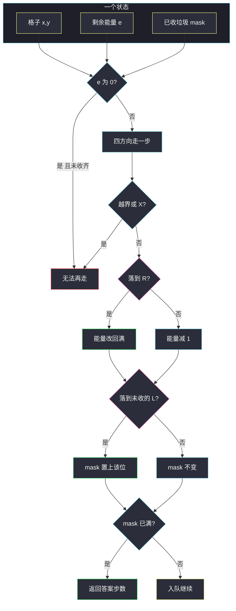

# 3568. 清理教室的最少移动（Minimum Moves to Clean the Classroom）

> 题目来源：[https://leetcode.cn/problems/minimum-moves-to-clean-the-classroom/](https://leetcode.cn/problems/minimum-moves-to-clean-the-classroom/)
>
> 灵茶题单小节定位：§9.3 旅行商问题（TSP）

## 一、问题描述

给你 `m × n` 网格 `classroom` 和整数 `energy`。格子是下列字符之一：

- `'S'`：起点（恰好一个）
- `'L'`：垃圾，必须收走（收完变空地；最多 10 个）
- `'R'`：重置区，一踏上就把能量恢复成最大值 `energy`（可反复用）
- `'X'`：障碍，不能进
- `'.'`：空地

学生从 `'S'` 出发，带着满能量 `energy`。每次走到上下左右相邻格消耗 1 点能量。能量为 0 时不能再走——除非当前就在 `'R'`（而踏上 `'R'` 时已经回满，所以队列里不会出现「站在 R 上却是 0 能量」）。求收齐全部 `'L'` 的最少步数；不可能则 `-1`。

**数据范围**：

- `1 <= m, n <= 20`
- `classroom[i][j]` 是 `'S'` / `'L'` / `'R'` / `'X'` / `'.'`
- `1 <= energy <= 50`
- 恰好一个 `'S'`，最多 10 个 `'L'`

**示例 1**：

```text
输入：classroom = ["S.","XL"], energy = 2
输出：2
解释：
S .
X L
(0,0) → (0,1) → (1,1) 收走唯一的 L，两步，能量刚好够。
```

**示例 2**：

```text
输入：classroom = ["LS","RL"], energy = 4
输出：3
解释：
L S
R L
(0,1) → (0,0) 收第一袋 → (1,0) 回满 → (1,1) 收第二袋。
```

**示例 3**：

```text
输入：classroom = ["L.S","RXL"], energy = 3
输出：-1
解释：energy = 3 绕不开障碍，两袋垃圾收不齐。
```

**核心思考点**：必须路过全部 L，L ≤ 10，这是 TSP 的「城市集合」信号——用 `mask` 记哪些已经收过。但教室里还有能量和重置点，**两点之间的代价不是一个常数**（出发时剩多少能量、路上要不要绕 R，都会变）。所以不能只在 L 之间跑 Held-Karp，要把坐标、剩余能量一起塞进状态：`(x, y, energy, garbage_mask)`。步数当边权全是 1，BFS 就是最短路。没有 L 时答案是 0，不必搜。

## 二、暴力解法

### 思路

没有 L：直接 0。只有 1～2 个 L 时，递归尝试四方向，用「每个状态的最少步数」剪枝，找到收齐的最小步。本质已经是在状态图上搜最短路，只是用递归而不是队列；网格稍大或 L 一多就会因递归顺序不优而膨胀。

### 代码

```python
def minMovesBrute(classroom: list[str], energy: int) -> int:
    m, n = len(classroom), len(classroom[0])
    lid, sx, sy, idx = {}, 0, 0, 0
    for i, row in enumerate(classroom):
        for j, c in enumerate(row):
            if c == "S":
                sx, sy = i, j
            elif c == "L":
                lid[(i, j)] = idx
                idx += 1
    if idx == 0:
        return 0
    full = (1 << idx) - 1
    best, ans = {}, 10**9

    def dfs(x, y, e, mask, steps):
        nonlocal ans
        if steps >= ans or (e == 0 and mask != full):
            return
        if mask == full:
            ans = steps
            return
        key = (x, y, e, mask)
        if best.get(key, 10**9) <= steps:
            return
        best[key] = steps
        for dx, dy in ((-1, 0), (1, 0), (0, -1), (0, 1)):
            nx, ny = x + dx, y + dy
            if not (0 <= nx < m and 0 <= ny < n) or classroom[nx][ny] == "X":
                continue
            ne = energy if classroom[nx][ny] == "R" else e - 1
            nmask = mask
            if classroom[nx][ny] == "L":
                nmask |= 1 << lid[(nx, ny)]
            dfs(nx, ny, ne, nmask, steps + 1)

    dfs(sx, sy, energy, 0, 0)
    return -1 if ans == 10**9 else ans
```

### 复杂度

- 时间：最坏仍是状态数级别，但 DFS 不按步数分层，同一状态可能被更差的路径先展开再回退，常数差。
- 空间：`O(m · n · energy · 2^{L数})` 的 `best` 表。

L = 10、网格 20×20 时必须改成 BFS，保证**第一次收齐就是最少步**。

## 三、优化探索

### 3.1 为什么是 TSP，却不在 L 上跑 Held-Karp ⭐

经典 TSP：`f[mask][i]` = 已访集合 `mask`、当前停在城市 `i` 的最小代价，边权预先算好。本题「城市」是 S + 所有 L，看似 `2^{10} · 10` 很小。

做不到预计算边权的原因：

- 走完一条路后**剩余能量不同**，下一段能走多远就不同；
- 路上的 `'R'` 会把能量瞬间拉满，有时必须**绕远去充电**，最短几何路反而是死路；
- 去 L1 的路上可能顺便踩过 L2，城市之间不是「封闭路段」。

要把「当前能量」和「当前格子」都当作状态的一部分。格子最多 400 个，能量 ≤ 50，L 的子集 `2^{10} = 1024`，总量：

```text
20 × 20 × 51 × 1024 ≈ 2.1 × 10^7
```

状态图里每步代价为 1，BFS 一遍即可。这就是带资源约束的网格 TSP：子集在 mask 里，位置不再收缩到城市。

### 3.2 状态与转移 ⭐⭐

`q` 里每个点：`(x, y, e, mask, steps)`

- `mask` 的第 `k` 位 = 第 `k` 袋垃圾是否已经收过（踩到该 L 就 `|= 1<<k`，再来一次不会抹掉）；
- 能量 `e == 0` 且还没收齐：这格可以站（可能刚在这里收了最后一袋），但不能再扩展；
- 走到 `'R'`：`ne = energy`（回满，不是 `e-1` 再加）；走到其它可通行格：`ne = e - 1`；
- 走到 `'X'` 或越界：丢弃。

`mask` 已满时，当前 `steps` 就是答案。BFS 分层 / 把 `steps` 塞进队列，两种写法等价。



### 3.3 同一格、同一 mask：能量大为优 ⭐

若两次到达 `(x, y, mask)`，能量分别是 `e1 > e2`，步数还是 BFS 序（先来的步数更小或相同），则 `e1` 能走的路 `e2` 都能走，`e2` 是劣态。可把 `vis[x][y][e][mask]` 收成 `best[x][y][mask] = 到达时见过的最大能量`，新来的能量 `≤ best` 就丢。教学主解用四维 `vis` 更直观，和题目状态一一对应；这份剪枝只是常数优化。

**核心一句**：L 用 mask 压成 TSP 子集，格子和能量进状态，边权全 1 所以 BFS。

## 四、代码实现

### 主解：状态 BFS

```python
from collections import deque

class Solution:
    def minMoves(self, classroom: List[str], energy: int) -> int:
        m, n = len(classroom), len(classroom[0])
        lid = [[-1] * n for _ in range(m)]
        sx = sy = cnt = 0
        for i, row in enumerate(classroom):
            for j, c in enumerate(row):
                if c == "S":
                    sx, sy = i, j
                elif c == "L":
                    lid[i][j] = cnt
                    cnt += 1
        if cnt == 0:                         # 没有垃圾
            return 0
        full = (1 << cnt) - 1
        vis = [[[[False] * (1 << cnt) for _ in range(energy + 1)]
                for _ in range(n)] for _ in range(m)]
        q = deque()
        q.append((sx, sy, energy, 0, 0))     # x,y,e,mask,steps
        vis[sx][sy][energy][0] = True
        while q:
            x, y, e, mask, steps = q.popleft()
            if mask == full:
                return steps
            if e == 0:                       # 收齐的情况上一行已经返回
                continue
            for dx, dy in ((-1, 0), (1, 0), (0, -1), (0, 1)):
                nx, ny = x + dx, y + dy
                if not (0 <= nx < m and 0 <= ny < n):
                    continue
                c = classroom[nx][ny]
                if c == "X":
                    continue
                ne = energy if c == "R" else e - 1
                nmask = mask
                if c == "L":
                    nmask |= 1 << lid[nx][ny]
                if not vis[nx][ny][ne][nmask]:
                    vis[nx][ny][ne][nmask] = True
                    q.append((nx, ny, ne, nmask, steps + 1))
        return -1
```

### 对照：Java

```java
import java.util.ArrayDeque;

class Solution {
    public int minMoves(String[] classroom, int energy) {
        int m = classroom.length, n = classroom[0].length();
        int[][] lid = new int[m][n];
        int sx = 0, sy = 0, cnt = 0;
        for (int i = 0; i < m; i++) {
            for (int j = 0; j < n; j++) {
                char c = classroom[i].charAt(j);
                if (c == 'S') {
                    sx = i;
                    sy = j;
                } else if (c == 'L') {
                    lid[i][j] = cnt++;
                }
            }
        }
        if (cnt == 0) {
            return 0;
        }
        int full = (1 << cnt) - 1;
        boolean[][][][] vis = new boolean[m][n][energy + 1][1 << cnt];
        ArrayDeque<int[]> q = new ArrayDeque<>();
        q.add(new int[] {sx, sy, energy, 0, 0});
        vis[sx][sy][energy][0] = true;
        int[] dx = {-1, 1, 0, 0};
        int[] dy = {0, 0, -1, 1};
        while (!q.isEmpty()) {
            int[] cur = q.poll();
            int x = cur[0], y = cur[1], e = cur[2], mask = cur[3], steps = cur[4];
            if (mask == full) {
                return steps;
            }
            if (e == 0) {
                continue;
            }
            for (int k = 0; k < 4; k++) {
                int nx = x + dx[k], ny = y + dy[k];
                if (nx < 0 || nx >= m || ny < 0 || ny >= n) {
                    continue;
                }
                char c = classroom[nx].charAt(ny);
                if (c == 'X') {
                    continue;
                }
                int ne = c == 'R' ? energy : e - 1;
                int nmask = mask;
                if (c == 'L') {
                    nmask |= 1 << lid[nx][ny];
                }
                if (!vis[nx][ny][ne][nmask]) {
                    vis[nx][ny][ne][nmask] = true;
                    q.add(new int[] {nx, ny, ne, nmask, steps + 1});
                }
            }
        }
        return -1;
    }
}
```

### 细节说明

- **没有 L 返回 0**：起点不用动。漏掉会去 BFS，`full = 0`，一开始 `mask == 0` 倒也能返回 0——但前提是你用「已收集」而不是「剩余」。两种 mask 约定必须贯穿：本文是「已收集」，满了结束；若用「剩余」，起点应是 `(1<<cnt)-1`，降到 0 结束。
- **L 收过仍可再踩**：格子变成空地，只是 mask 不再变化。不要把 L 改成障碍。
- **R 是赋值不是累加**：`ne = energy`。即使走过去只剩 1 点，踏上立刻满。
- **先判断 `mask == full` 再判断 `e == 0`**：最后一步用尽能量收掉最后一袋，仍然合法。
- **S 与 L 不会重叠**（格子只有一种字符），起点不用预先或进 mask。

## 五、例子演示

**示例 2：`["LS","RL"]`，`energy = 4`**

编号：`(0,0)` 是 L0，`(1,1)` 是 L1。起点 `(0,1)`，`mask = 00`，能量 4。

| 步 | 位置 | 能量 | mask | 动作 |
|---|---|---|---|---|
| 0 | (0,1) S | 4 | 00 | 出发 |
| 1 | (0,0) L0 | 3 | 01 | 收第一袋 |
| 2 | (1,0) R | 4 | 01 | 回满 |
| 3 | (1,1) L1 | 3 | 11 | 收齐，返回 3 |

对称的另一条 `(0,1)→(1,1)→(1,0)→(0,0)` 也是 3 步。BFS 谁先收齐都是 3。

**示例 1：`["S.","XL"]`，`energy = 2`**

`(0,0)` 不能往下（X）。只能右再下：`(0,0) e=2 → (0,1) e=1 → (1,1) e=0 mask 满`。2 步。能量若改成 1，走到 `(0,1)` 就剩 0，无法再去 L，答案 `-1`。

**示例 3：`["L.S","RXL"]`，`energy = 3`**

```text
L . S
R X L
```

先收下侧 L：`(0,2)→(1,2)`，剩 2；再想去左上 L，中间隔着 X，只能回到上侧横着走，3 点能量走不到还要充电的路径。先收左上 L 再绕 R：从 R 回满后到右下 L 需要 4 步，能量 3 差一步。状态搜完队列空，**-1** ✅。

## 六、复杂度分析

设格子 `N = m · n`，垃圾数 `K ≤ 10`，能量上界 `E`：

| 项目 | 量级 |
|---|---|
| 时间 | 每个状态出队一次、扩 4 个邻居，`O(N · E · 2^K)` |
| 空间 | 四维 `vis` 同阶 `O(N · E · 2^K)` |

`N ≤ 400`，`E ≤ 50`，`2^K ≤ 1024`，约两千万，可过。

## 七、对比总结

| 维度 | 递归搜 | 网格状态 BFS | 只在 L 上 Held-Karp |
|---|---|---|---|
| 最短性 | 要靠步数剪枝 | 第一次收齐即最优 | 边权若算不对就错 |
| 能量 / R | 能处理 | 能处理 | 边权依赖出发能量，要再套一层 |
| 实现 | 短，L 多易慢 | 主解 | 更绕，状态量不见少 |

**套路归纳**：看到「必须访问一组 ≤ 16 个关键点」先想 TSP / 状压；再检查两点之间是否有**额外资源**（能量、钥匙、剩余消除次数）。有的话，把资源维度留下，在原图 BFS，mask 只负责关键点。边权全 1 用 BFS，边权非 1 用 Dijkstra。

## 八、举一反三

1. **[864. 获取所有钥匙的最短路径](https://leetcode.cn/problems/shortest-path-to-get-all-keys/)**：几乎同构，mask 记钥匙，门靠对应钥匙才能过；本题的能量是另一种资源维。
2. **[847. 访问所有节点的最短路径](https://leetcode.cn/problems/shortest-path-visiting-all-nodes/)**：纯图 TSP，`f[mask][i]` 或 `(i, mask)` BFS，没有格子能量。
3. **[980. 不同路径 III](https://leetcode.cn/problems/unique-paths-iii/)**：网格哈密顿路径计数，mask 压的是格子本身（总格数 ≤ 20）。
4. **[1293. 网格中的最短路径](https://leetcode.cn/problems/shortest-path-in-a-grid-with-obstacles-elimination/)**：状态 `(x,y,剩余消除次数)`，和能量一样是第三维资源。
5. **[1210. 穿过迷宫的最少移动次数](https://leetcode.cn/problems/minimum-moves-to-reach-target-with-rotations/)**：蛇有横竖形态，状态同样是「位置 + 额外姿态」。

**同族互引**：§9.3 的 TSP 在网格里往往退化成「关键点 mask + 原图最短路」。先会 847 的 `(点, mask)`，再给点换成格子、再叠一维能量，就是本题。
