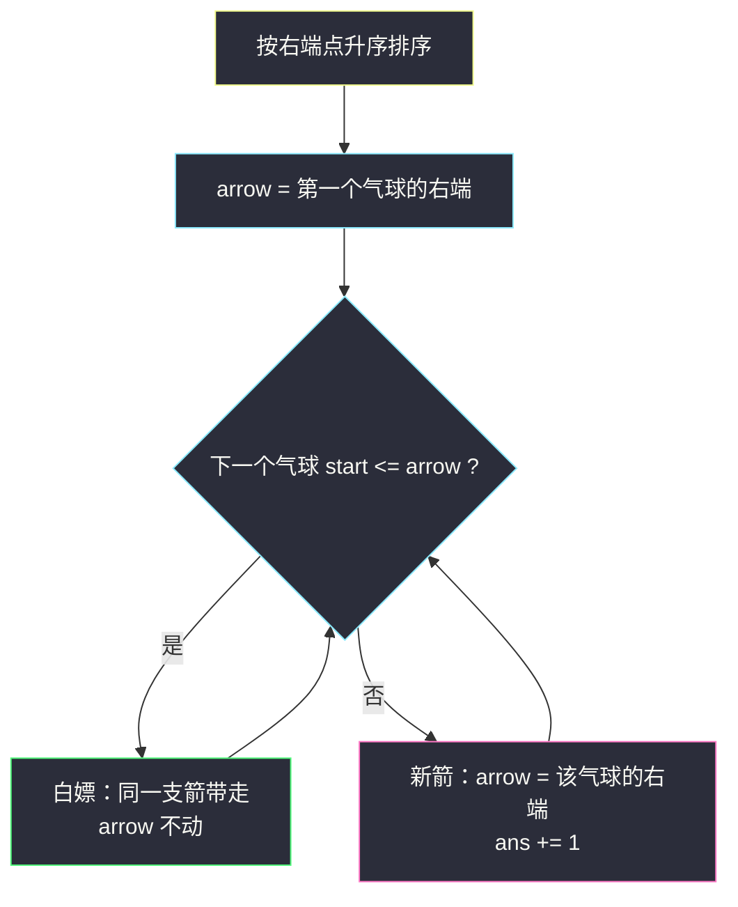
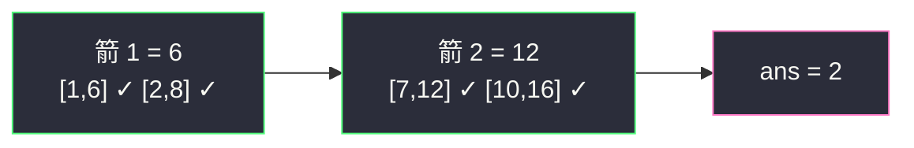

# 用最少数量的箭引爆气球（区间选点 · 按右端点贪心）

## 一、问题描述

在二维空间中有 `n` 个气球，用数组 `points` 表示，`points[i] = [x_start, x_end]` 表示气球分布在**横坐标区间** `[x_start, x_end]`（含端点）之间。

一支弓箭可以垂直于 x 轴射出，位于横坐标 `x` 处：若有气球的区间满足 `x_start <= x <= x_end`，则该气球被引爆。弓箭数目无限，一支箭只能射一个位置。

返回引爆**所有**气球所需的**最少弓箭数**。

> 🔗 LeetCode 452：https://leetcode.cn/problems/minimum-number-of-arrows-to-burst-balloons/
>
> 数据范围：`1 <= points.length <= 10^5`，`-2^31 <= x_start < x_end <= 2^31 - 1`。

**示例 1**

```
输入：points = [[10,16],[2,8],[1,6],[7,12]]
输出：2
解释：箭 x = 6 引爆 [2,8] 和 [1,6]；箭 x = 11（或 12）引爆 [7,12] 和 [10,16]。
```

**示例 2**

```
输入：points = [[1,2],[3,4],[5,6],[7,8]]
输出：4
解释：四个气球互不重叠，每个都需要一支箭。
```

**直观理解**

一支箭 = 数轴上一个**点**，它能引爆所有覆盖该点的区间。要最少的点命中所有区间——这就是「区间选点」：区间贪心家族（灵茶题单 §2.1–§2.5）的第三课。它与 §2.1「不相交区间」是一对对偶：**最多互不重叠的区间数 = 最少选点数**（能两两挤进同一支箭的气球，正好构成一个「被公共点击中」的团伙，而互不重叠的气球必须各吃一箭）。

---

## 二、暴力解法

每次扫一遍还没爆的气球，找它们中最小的右端点，把箭射在那里，引爆所有能被击中的，重复直到清空：

```python
class Solution:
    def findMinArrowShots(self, points: List[List[int]]) -> int:
        alive = [tuple(p) for p in points]
        ans = 0
        while alive:
            x = min(p[1] for p in alive)        # 射在最小右端点
            alive = [p for p in alive if not (p[0] <= x <= p[1])]
            ans += 1
        return ans
```

### 复杂度

- **时间**：`O(n²)`，每轮 `O(n)` 找最小值 + `O(n)` 过滤，最坏 `n` 轮；`n = 10^5` 超时。
- **空间**：`O(n)`。

### 🔴 瓶颈在哪里

「每次找当前最小右端点」本身就是重复劳动——若先**按右端点排序**，最小右端点永远排在最前面，被这支箭击中的气球也必然是排序后的一段连续前缀。排序让 `n` 轮扫描塌缩成一次线性扫描。

---

## 三、优化探索（核心章节）

> 📚 本题在灵茶题单中属于 **§2.3 区间选点**（贪心② A 路 · 区间贪心）：按**右端点**排序，箭打在当前未爆气球的最小右端点上，能不打新箭就不打。它与排序不等式家族（同目录 `advantage-shuffle.md` 的田忌赛马）共享「排序后对齐」的底层逻辑：把乱序的博弈变成有序的单调匹配。

### 3.1 观察特征

| 特征 | 说明 |
|------|------|
| 一支箭命中「覆盖同一点」的所有区间 | 要尽量让每支箭多带货 |
| 最小右端点是「最紧的气球」 | 它的右边界最靠左，箭放更右必丢它 |
| 覆盖含端点 | `x_start <= x <= x_end`，闭区间语义 |

### 3.2 贪心策略与交换论证

按右端点升序排序。设排序后第一个气球是 `A = [a1, a2]`，则 `a2` 是**全体气球中的最小右端点**：

- **第一支箭必须覆盖 A**，即箭位置 `x` 满足 `a1 <= x <= a2`。
- 把箭从 `x` 挪到 `a2`：不会丢掉 A（`a2` 仍在 A 内）。会不会丢掉别人？考察被 `x` 击中但未被 `a2` 击中的气球：要么左端 `> a2`（不可能，左端 `<= x <= a2`），要么右端 `< a2`（也不可能，`a2` 已是最小右端）。所以一个都不会丢。
- 结论：**把第一支箭放在 `a2`，击中的集合不少于放在任何其它位置**。剩余气球都是右端不小于它的，问题规模缩小，同样的论证逐支适用。

这就是灵神模板的一句话：**「箭打在当前最小右端点；后面的气球左端 ≤ 该点的全部白嫖，否则新开一支。」**



### 3.3 为什么不按左端点排序

反例：`[[1,10],[2,3],[4,5]]`。按左端排序从 `[1,10]` 出发，箭放哪都只能覆盖它自己……而按右端排序后 `[2,3]`、`[4,5]`、`[1,10]`：箭 3 带走 `[2,3]`，箭 5 带走 `[4,5]`，`[1,10]` 被其中一支顺带击中（3 ∈ [1,10]），共 2 支。**右端点小 = 死线紧**，先伺候死线最紧的，才可能顺带多救。

### 3.4 与「最多不相交区间」的对偶

每个「团伙」（被同一支箭击中的极大集合）内部区间两两相交于公共点；不同团伙之间必然互不重叠（否则可合并团伙）。所以：

- 最少箭数 = 最多「两两有公共点」的分组数 = **最多互不重叠区间数**（区间图上最小团覆盖 = 最大独立集）。

这正是 §2.1 的调度数：把 [#435 无重叠区间](https://leetcode.cn/problems/non-overlapping-intervals/)倒过来看——435 删最少区间保留不相交，452 直接数不相交团伙，两题答案满足 `ans(452) = n - ans(435)`。

### 3.5 一句话核心

> **按右端点排序，箭永远打在「当前最紧气球的右端点」；能蹭一支箭就蹭，蹭不上再开新箭。**

---

## 四、代码实现

### Python（主解）

```python
class Solution:
    def findMinArrowShots(self, points: List[List[int]]) -> int:
        points.sort(key=lambda p: p[1])         # 按右端点升序
        ans = 1
        arrow = points[0][1]                    # 第一支箭：最紧气球的右端
        for s, e in points[1:]:
            if s > arrow:                       # 蹭不上（注意含等号即蹭上）
                ans += 1
                arrow = e                       # 新箭打在它的右端
            # else: 白嫖，arrow 不动（不动才能继续蹭后面的）
        return ans
```

**变量含义**

| 变量 | 含义 |
|------|------|
| `arrow` | 当前这支箭的位置 = 被击中团伙中**最小右端点** |
| `s > arrow` | 该气球左端已越过箭 → 必须开新箭 |
| `ans` | 已开箭数 |

**循环不变式**：处理第 `i` 个气球前，`arrow` 是「前 `i-1` 个气球所需的最少箭中最后一支的位置」，且它已尽可能靠右（取到团伙最小右端）——这保证后续能蹭到的气球集合最大。

**变体（按左端点排序也可以，但要收紧箭位）**

```python
class Solution:
    def findMinArrowShots(self, points: List[List[int]]) -> int:
        points.sort()                          # 按左端点排序
        ans, arrow = 1, points[0][1]
        for s, e in points[1:]:
            if s > arrow:                      # 蹭不上
                ans += 1
                arrow = e
            else:
                arrow = min(arrow, e)          # 团伙公共区间的右端收紧！
        return ans
```

区别在维护量：按右端排序时，团伙最小右端天然就是先出现的那一个（`arrow` 不动）；按左端排序时，团伙的公共区间是 `[所有左端的最大值, 所有右端的最小值]`，箭必须落在这个公共区间内，所以每蹭上一个新气球都要把 `arrow` 收紧到 `min(arrow, e)`。两种排序殊途同归，但主解的「箭不动」更不容易写错。

### Java（最优解：注意比较器溢出）

```java
class Solution {
    public int findMinArrowShots(int[][] points) {
        // 坐标到 ±2^31-1：a[1] - b[1] 会溢出，必须用 compare
        Arrays.sort(points, (a, b) -> Integer.compare(a[1], b[1]));
        long arrow = points[0][1];
        int ans = 1;
        for (int i = 1; i < points.length; i++) {
            if ((long) points[i][0] > arrow) {   // 蹭不上才开新箭
                ans++;
                arrow = points[i][1];
            }
        }
        return ans;
    }
}
```

---

## 五、具体例子演示

以示例 1 `points = [[10,16],[2,8],[1,6],[7,12]]` 走主解。

**第一步：按右端点排序后的区间表**

| 序 | 区间 | 左端 | 右端 |
|----|------|------|------|
| 1 | [1,6] | 1 | **6** |
| 2 | [2,8] | 2 | 8 |
| 3 | [7,12] | 7 | 12 |
| 4 | [10,16] | 10 | 16 |

**第二步：逐气球决策（箭状态）**

| 序 | 区间 | 判断 `start <= arrow` | 决策 | arrow | ans |
|----|------|------------------------|------|-------|-----|
| 1 | [1,6] | （首发） | 箭 1 打在右端 6 | 6 | 1 |
| 2 | [2,8] | `2 <= 6` ✓ | 白嫖（2..8 覆盖点 6） | 6 | 1 |
| 3 | [7,12] | `7 <= 6` ✗ | 新箭 2 打在右端 12 | 12 | 2 |
| 4 | [10,16] | `10 <= 12` ✓ | 白嫖（10..16 覆盖点 12） | 12 | 2 |

答案 **2** ✓。注意箭 1 停在 6 不动——如果打完 `[2,8]` 后把箭挪到 8，下一个 `[7,12]` 确实也能蹭，但这是错觉般的巧合；不变量要求箭始终是「团伙最小右端」，才能保证对后面所有气球可蹭集合最大。

**示例 2 验证**：排序后 `[1,2],[3,4],[5,6],[7,8]`，每个的 `start` 都严格大于上一箭位，连开 4 支 → **4** ✓。

**变体（按左端点排序）的收紧演示**：用 3.3 节的反例 `[[1,10],[2,3],[4,5]]`，两种排序对照：

| 步骤 | 按右端排序（主解） | 按左端排序（变体，箭收紧） | 按左端但忘收紧（bug 版） |
|------|---------------------|------------------------------|----------------------------|
| 首发 | [2,3] → 箭 3 | [1,10] → 箭 10 | [1,10] → 箭 10 |
| 第二个 | [4,5]：4>3 新箭 5 | [2,3]：2≤10 蹭，箭 min(10,3)=3 | [2,3]：2≤10 误判能蹭，箭仍 10 |
| 第三个 | [1,10]：1≤5 蹭 → 2 支 ✓ | [4,5]：4>3 新箭 5 → 2 支 ✓ | [4,5]：4≤10 误蹭 → 1 支 ✗ |

bug 版只开了 1 支箭，但箭在 10 根本射不中 `[2,3]`（右端 3 < 10）——按左端排序时箭位必须随团伙右端收紧，这正是主解选右端排序的原因：**箭一旦落在最小右端，后面蹭上的都不会把它挤坏。**



---

## 六、复杂度分析

| 方法 | 时间 | 空间 | 说明 |
|------|------|------|------|
| 暴力逐轮找最小右端 | `O(n²)` | `O(n)` | `n = 10^5` 超时 |
| 排序 + 一遍扫描（主解） | `O(n log n)` | `O(1)`（不计排序栈 `O(log n)`） | 相比暴力只是省了重复找最小值 |

---

## 七、对比总结

| 题 | 排序键 | 贪心动作 | 本质 |
|----|--------|----------|------|
| #435 无重叠区间 | 右端点 | 保留不相交区间 | 最多不相交 |
| #452 本篇 | 右端点 | 箭打最小右端 | 最少选点 = 最多不相交团伙 |
| #2406 区间分组 | 左端点 | 堆复用最早结束的组 | 最大重叠层数 |
| #1024 视频拼接 | 左端点 | 跳到能及的最远右端 | 最少段覆盖 |

同为「排序 + 扫描」，**按哪个端点排**由目标决定：要「尽快结束 / 死线最紧」看右端（选点、保留），要「尽快开始 / 尽量铺远」看左端（分组、覆盖）。

**易错点**

1. **命中条件含等号**：`start == arrow` 算蹭上（闭区间），新箭条件是 `start > arrow`。
2. **箭不要乱动**：蹭上后 `arrow` 保持不变（仍是团伙最小右端），更新成当前气球右端是常见 bug。
3. **Java 排序比较器**：坐标达 `±2^31`，`a[1] - b[1]` 溢出返回错误顺序，必须 `Integer.compare`。
4. 单独处理空数组虽非本题范围（`n >= 1`），但写通用模板时注意 `points[0]` 越界。

**模板（按右端点选点，Python）**

```python
items.sort(key=lambda p: p[1])
ans, arrow = 1, items[0][1]
for s, e in items[1:]:
    if s > arrow:          # 闭区间：等号算命中
        ans += 1
        arrow = e
```

---

## 八、举一反三

| 题目 | 关系 |
|------|------|
| [435. 无重叠区间](https://leetcode.cn/problems/non-overlapping-intervals/) | 对偶题：`ans(452) = n - ans(435)`，同一副排序骨架 |
| [2406. 将区间分为最少组数](https://leetcode.cn/problems/divide-intervals-into-minimum-number-of-groups/) | 同批 `divide-intervals-into-minimum-number-of-groups.md`，§2.2 换按左端 + 堆 |
| [1024. 视频拼接](https://leetcode.cn/problems/video-stitching/) | 同批 `video-stitching.md`，§2.4 区间覆盖 |
| [2580. 统计将重叠区间合并成组的方案数](https://leetcode.cn/problems/count-ways-to-group-overlapping-ranges/) | 同批 `count-ways-to-group-overlapping-ranges.md`，§2.5 合并区间 |
| [1326. 灌溉花园的最少水龙头数目](https://leetcode.cn/problems/minimum-number-of-taps-to-open-to-water-a-garden/) | 选点 + 覆盖的合体变体，右端思想再进一步 |
| [870. 优势洗牌](https://leetcode.cn/problems/advantage-shuffle/) | 同目录 `advantage-shuffle.md`，排序不等式 / 田忌赛马家族互引 |

**思想迁移**

- 「最少资源命中所有需求」先想**按限制最紧的一端排序**：右端点最小的区间决定箭的下限位置。
- 交换论证的口头版本：把最优解里的第一支箭**向右挪到当前最小右端**，击中集合不减——挪不坏，所以贪心解就是最优解。
- 口诀：**「右端排好队，箭打最紧右；左边够得着就蹭，够不着再开手。」**
