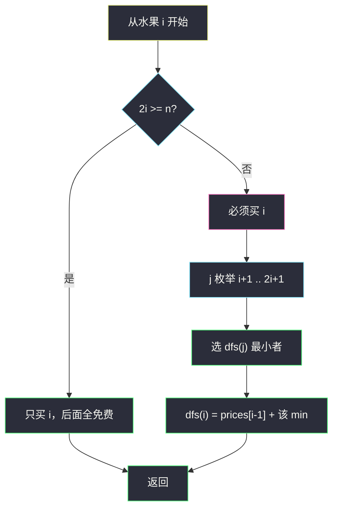

# 2944. 购买水果需要的最少金币数（Minimum Number of Coins for Fruits）

> 题目来源：[https://leetcode.cn/problems/minimum-number-of-coins-for-fruits/](https://leetcode.cn/problems/minimum-number-of-coins-for-fruits/)
>
> 灵茶题单小节定位：§7.1 一维 DP

## 一、问题描述

给你下标从 0 开始的数组 `prices`，`prices[i]` 表示购买**第 `i+1` 个**水果（1-index）要花的金币。促销规则：

- 若花费 `prices[i]` 买下 1-index 为 `x = i+1` 的水果，则可**免费**获得 1-index 落在 `[x+1, 2x]` 内的水果。

即使水果 `j` 本可以免费拿，你仍可再花 `prices[j-1]` 买它，以便拿到 **j 自己的奖励**。求获得全部 `n` 个水果的最少金币。

**数据范围**：

- `1 <= prices.length <= 1000`
- `1 <= prices[i] <= 10^5`

**示例 1**：

```text
输入：prices = [3,1,2]
输出：4
解释：花 3 买第 1 个，本可免费拿第 2 个；仍花 1 买第 2 个，以便免费拿第 3 个。总 4。
```

**示例 2**：

```text
输入：prices = [1,10,1,1]
输出：2
解释：买第 1 个（免费第 2 个），再买第 3 个（免费第 4 个）。
```

**示例 3**：

```text
输入：prices = [26,18,6,12,49,7,45,45]
输出：39
解释：买第 1 个（免费第 2 个），买第 3 个（免费第 4、5、6 个），仍买第 6 个以便免费第 7、8 个。26+6+7=39。
```

**核心思考点**：水果 1 无人能「奖」到，必买。买 `x` 后，`x+1 … 2x` 已覆盖；下一次真正需要「作为购买点」的位置是某个 `j ∈ [x+1, 2x+1]`——既可买已免费的以续奖励，也可等到第一颗未覆盖的 `2x+1`。后缀最优 → 一维 DP，`n ≤ 1000` 时 `O(n²)` 足够。

## 二、暴力解法

### 思路

水果 1 必买。对其余水果枚举「是否花钱买」，检查每种购买集合是否覆盖 `1..n`（买了 `x` 则 `x` 自身以及 `[x+1, 2x]` 被覆盖），取合法集合的最小花费。

### 代码

```python
def minimumCoinsBrute(prices: list[int]) -> int:
    n = len(prices)
    ans = sum(prices)
    for mask in range(1 << n):
        if not (mask & 1):                 # 第 1 个必须买
            continue
        covered = [False] * n
        cost = 0
        for i in range(n):
            if mask >> i & 1:
                cost += prices[i]
                x = i + 1
                covered[i] = True
                for j in range(x + 1, min(2 * x, n) + 1):
                    covered[j - 1] = True
        if all(covered):
            ans = min(ans, cost)
    return ans
```

### 复杂度

- 时间：`O(2^n · n)`。`n = 1000` 不可用。
- 空间：`O(n)`。

## 三、优化探索

### 3.1 后缀决策：下一次买哪一个 ⭐⭐

用 **1-index**。`dfs(i)` = 从第 `i` 个水果开始，买完后缀 `i..n` 的最少金币（调用前，`1..i-1` 已全部到手）。

- 若 `2i ≥ n`：买 `i` 就能免费覆盖到 `2i ≥ n`，后面全白送，`dfs(i) = prices[i-1]`。
- 否则：必须买 `i`（这颗是当前后缀的起点，没人再给它奖励），然后在 `j = i+1 … 2i+1` 中选下一个购买点：

```text
dfs(i) = prices[i-1] + min{ dfs(j) | i+1 ≤ j ≤ 2i+1 }
```

`j = 2i+1` 表示「免费段用尽，从第一颗没盖到的开始买」；更小的 `j` 表示提前买一颗本可免费的，换它的奖励。

记忆化后每个 `i` 枚举 `O(n)` 个 `j`，总 `O(n²)`。

### 3.2 倒着递推，可写在原数组上 ⭐

`f[i]` 与 `dfs(i)` 相同。`i` 从大到小：大的 `f[j]` 先算完。当 `i > (n-1)//2` 时 `2i ≥ n`，`f[i] = prices[i-1]` 不用改；否则

```text
prices[i-1] += min(prices[i : 2i+1])    # 切片即 f[i+1 .. 2i+1]
```

最后 `prices[0]` 就是 `f[1]`。这是 §7.1 一维 DP 的原地写法。

### 3.3 单调队列可再压到 `O(n)`（了解即可）

`i` 变小时，窗口 `[i+1, 2i+1]` 的右端 `2i+1` 也在收。从大到小扫，维护 `f[j]` 的单调队列可 `O(1)` 取 min。`n = 1000` 不值得作为主解，知道「窗口最小值」这一眼即可。



## 四、代码实现

### 主解：记忆化搜索 `O(n²)`

```python
from functools import cache

class Solution:
    def minimumCoins(self, prices: list[int]) -> int:
        n = len(prices)
        @cache
        def dfs(i: int) -> int:              # 1-index
            if i * 2 >= n:
                return prices[i - 1]
            return prices[i - 1] + min(
                dfs(j) for j in range(i + 1, i * 2 + 2)
            )
        return dfs(1)
```

### 对照：倒推原地 DP

```python
class Solution:
    def minimumCoins(self, prices: list[int]) -> int:
        n = len(prices)
        for i in range((n - 1) // 2, 0, -1):
            prices[i - 1] += min(prices[i : i * 2 + 1])
        return prices[0]
```

原地版会改输入数组；如果不想改，先 `prices = prices[:]`。

### 细节说明

- **下标**：状态用 1-index 最贴规则 `免费到 2x`；数组取值时 `-1`。
- **`range(i+1, i*2+2)`**：右开，最后一个是 `2i+1`，不要写成 `2i`。
- **`2i >= n` 只买当前**：不要再 `min` 空区间。
- **免费仍可买**：这正是枚举 `j ∈ [i+1, 2i]` 的意义，示例 1、3 都用了这一步。

## 五、例子演示

**示例 1：prices = [3,1,2]，n = 3（1-index 水果 1,2,3）**

| 状态 | 判定 | 计算 | 值 |
|---|---|---|---|
| dfs(3) | 6 ≥ 3 | 只买 3 | 2 |
| dfs(2) | 4 ≥ 3 | 只买 2 | 1 |
| dfs(1) | 2 < 3 | 3 + min(dfs(2), dfs(3)) = 3+min(1,2) | **4** |

买 1 后免费到 2；下一购买点选 2（花 1 换第 3 个免费）优于选 3（再花 2）。返回 **4** ✅。

**示例 2：prices = [1,10,1,1]，n = 4**

| 状态 | 计算 | 值 |
|---|---|---|
| dfs(4), dfs(3) | `2i ≥ 4` | 1, 1 |
| dfs(2) | 4 ≥ 4，只买 2 | 10 |
| dfs(1) | 1 + min(dfs(2), dfs(3)) = 1+min(10,1) | **2** |

下一购买点选 3：第 2 个靠第 1 个的奖励白拿，第 3 个花 1 再白拿第 4 个。不要被 `prices[1]=10` 骗去买 2。

**示例 3 关键一步**：`dfs(3)` 买第 3 个花 6，免费 4..6；下一购买点选 6（`dfs(6)=7`，因 `12 ≥ 8`），不选更贵的 4/5/7。`dfs(1)=26 + dfs(3)=26+13=39` ✅。

## 六、复杂度分析

设 `n = len(prices)`：

- **时间复杂度：`O(n²)`**——每个 `i` 枚举最多 `i+1` 个后继；倒推切片 `min` 同阶。
- **空间复杂度：`O(n)`**——记忆化栈 + 缓存；原地倒推 `O(1)` 额外空间。

## 七、对比总结

| 维度 | 子集枚举 | 主解 dfs / 倒推 | 单调队列 |
|---|---|---|---|
| 时间 | `O(2^n · n)` | `O(n²)` | `O(n)` |
| 决策 | 全局买不买 | 下一购买点 | 同左，窗口取 min |
| 适用 | n ≤ 20 对拍 | `n ≤ 1000` 主解 | 知道即可 |

**套路归纳**：**「覆盖到哪，下一刀切在哪」** 的一维后缀 DP。奖励区间是 `[i+1, 2i]` 这种与下标成比例的覆盖，转移来源是一段连续下标，所以能再套滑动窗口最小值。先写出正确的 `O(n²)`，再谈优化。

## 八、举一反三

1. **[322. 零钱兑换](https://leetcode.cn/problems/coin-change/)**：同样「最少花费覆盖」，但物品无限、无下标奖励。
2. **[45. 跳跃游戏 II](https://leetcode.cn/problems/jump-game-ii/)**：从 i 能覆盖到 `i+nums[i]`，问最少跳跃——覆盖区间 DP / 贪心。
3. **[1696. 跳跃游戏 VI](https://leetcode.cn/problems/jump-game-vi/)**：窗口 max 优化一维 DP，与本题窗口 min 对称。
4. **[1425. 带限制的子序列和](https://leetcode.cn/problems/constrained-subsequence-sum/)**：`f[i] = nums[i] + max(0, max(f[i-k..i-1]))`，单调队列模板。
5. **[983. 最低票价](https://leetcode.cn/problems/minimum-cost-for-tickets/)**：买一张票覆盖一段未来日期，后缀 / 日期 DP。

**同族互引**：§7.1 一维 DP；覆盖+再买的决策与 `check-if-there-is-a-valid-partition-for-the-array.md`（划分点）同类，只是本题最小化费用。
