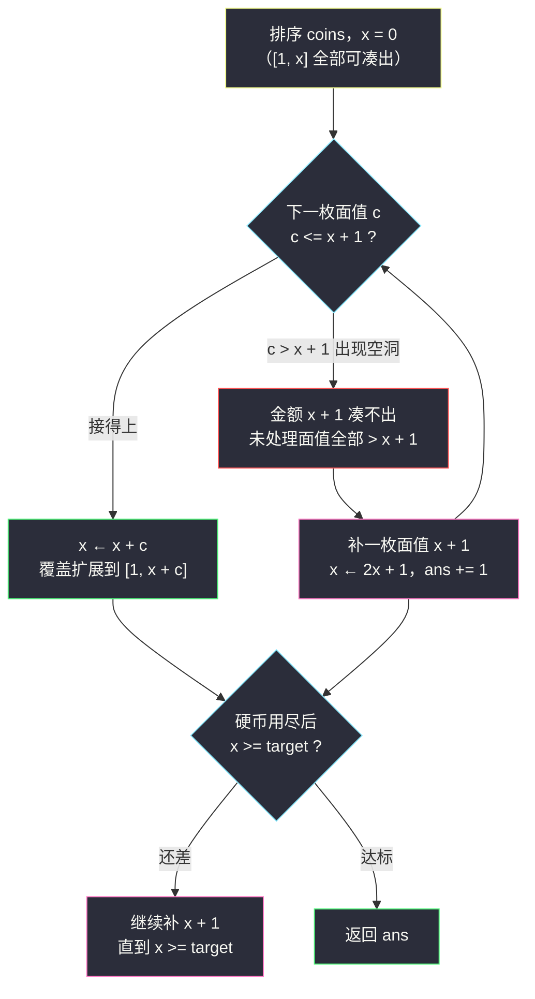
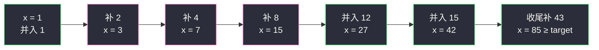

# 需要添加的硬币的最小数量（归纳法构造 · 维护连续可达上界）

## 一、问题描述

给你一个下标从 0 开始的整数数组 `coins`，表示可以使用的**不同面值**硬币（每种面值只有一枚，元素互不相同），以及一个整数 `target`。

你需要从 `coins`（以及你新添加的硬币）中选出若干枚，使得 **`1` 到 `target` 之间的每个整数**都能被某个子集的面值之和恰好表示。请返回**最少需要添加**的硬币数量；添加的硬币面值可以任选，但同样每种面值至多一枚。

> 🔗 LeetCode 2952：https://leetcode.cn/problems/minimum-number-of-coins-to-be-added/
>
> 数据范围：`1 <= target <= 10^5`，`1 <= coins.length <= target - 1`，`1 <= coins[i] <= target`，`coins` 中元素互不相同。

**示例 1**

```
输入：coins = [1,4,10,5,7,19], target = 19
输出：1
解释：只添加一枚面值 2 的硬币，即可表示 1..19 的所有整数。
```

**示例 2（自拟，便于观察补币节奏）**

```
输入：coins = [15,1,12], target = 43
输出：4
解释：依次添加 2、4、8、43 四枚硬币。
```

**直观理解**

「能凑出的金额」不是一堆零散的数，而可以看成一个**连续区间 `[1, x]`**：手里的硬币能凑出 1 到 x 的每一个值。新来一枚面值 `v` 的硬币时，如果 `v <= x + 1`，新区间恰好无缝拼成 `[1, x + v]`；如果 `v > x + 1`，中间就会出现 `x + 1` 这个**永远填不上的洞**，必须靠添加硬币来补。这就是灵茶题单 §4.6 归纳法构造的标准形态：**已覆盖 `[1, x]` 时，加入面值 `v <= x + 1` 可把覆盖扩展到 `x + v`，否则必须补一枚「`x + 1`」面值**。

---

## 二、暴力解法

朴素思路分两层：先用 0/1 背包求出当前 `coins` 能凑出的所有金额，再反复找出**最小的凑不出的金额**、添加一枚同面值硬币，直到 `1..target` 全部覆盖。

```python
class Solution:
    def minimumAddedCoins(self, coins: List[int], target: int) -> int:
        ans = 0
        while True:
            # 0/1 背包：可达[i] 表示金额 i 能否被凑出
            reach = [False] * (target + 1)
            reach[0] = True
            for c in coins:
                for i in range(target, c - 1, -1):
                    if reach[i - c]:
                        reach[i] = True
            if all(reach[1:]):                 # 1..target 全覆盖
                return ans
            miss = next(v for v in range(1, target + 1) if not reach[v])
            coins.append(miss)                 # 补一枚 miss 面值
            ans += 1
```

### 复杂度

- **时间**：每轮背包 `O(n * target)`，最多补 `O(log target)` 枚（后面会证明 x 每次至少翻倍），总计约 `O(n * target * log target)`，`n, target = 10^5` 时约 `10^11` 量级。
- **空间**：`O(target)`。

### 🔴 瓶颈在哪里

每一轮都**从头重算整个可达集合**，而实际上可达集合自始至终都是一个连续区间 `[1, x]`——我们真正需要的只有**上界 `x` 这一个数**。把「重跑背包」换成「`O(1)` 更新上界」，就是本题的全部优化。

---

## 三、优化探索（核心章节）

> 📚 本题在灵茶题单中属于 **§4.6 归纳法构造**（贪心② C 路）。模板要点：**已覆盖 `[1, x]` 时，加入面值 `v <= x + 1` 可扩展覆盖到 `[1, x + v]`，否则必须补币**。排序后归纳处理，缺就补「`x + 1`」面值。

### 3.1 关键观察：可达集合是连续区间

如果手里若干枚硬币能凑出 `[1, x]` 中的**每一个**值（归纳基础：空集凑出 `[1, 0]`，即空区间），那么加入一枚面值 `v` 的硬币后，新的可达集合是：

```
[1, x]  ∪  [v, v + x]
```

（新硬币要么不用，要么用——用的时候恰好给每个旧和加上 `v`。）

- 若 `v <= x + 1`：两个区间相交或紧邻，合并成**连续的 `[1, x + v]`**；
- 若 `v > x + 1`：`x + 1` 到 `v - 1` 之间出现空洞，区间断裂。

于是「能不能表示 1..target」被压缩成一个数 `x`：**只要 `x >= target` 就全覆盖**。

### 3.2 归纳引理与贪心决策

把 `coins` **升序排序**后从左到右处理，维护上界 `x`（初始 0）：

| 情形 | 判断 | 动作 | 新上界 |
|------|------|------|--------|
| 面值 `c` 接得上 | `c <= x + 1` | 并入这枚硬币 | `x + c` |
| 面值 `c` 接不上 | `c > x + 1` | 补一枚面值 `x + 1` 的硬币 | `2x + 1`，再重新判断 `c` |

**为什么缺口必然是 `x + 1`、补的面值必然选 `x + 1`？**

1. 当 `c > x + 1` 时，金额 `x + 1` 凑不出来：能参与凑出 `x + 1` 的硬币面值都必须 `<= x + 1`，而排序后**未处理的硬币面值全部 `>= c > x + 1`**，已处理的硬币上限就是 `x`——所以必须**添加**一枚面值 `<= x + 1` 的硬币。
2. 添加的面值 `v <= x + 1` 时新上界是 `x + v`，显然 `v` 取最大合法值 `x + 1` 时扩张最远（`2x + 1`）。补小的面值既不增加覆盖范围也不省硬币数，**不劣于任何其他选择**。

这就是「缺就补上界 + 1」——每一步都是当前局面下唯一且最优的补法。

### 3.3 收尾：硬币用完了还差一点

遍历完 `coins` 后若 `x < target`，继续按同样的规则补 `x + 1`（此时没有「下一枚硬币」的约束，纯粹补到覆盖为止）：

```
while x < target:
    x = 2x + 1     # 补一枚面值 x+1
    ans += 1
```



### 3.4 正确性小结（归纳法）

**归纳命题**：处理完排序后的前 `i` 枚硬币（外加必要补币）后，`x` 恰等于「这些硬币能连续覆盖的上界」。

- 基础：`i = 0` 时 `x = 0` ✓。
- 归纳步：由 §3.2 的区间合并引理，`c <= x + 1` 时上界变为 `x + c`；`c > x + 1` 时 `x + 1` 是不可补救的缺口，补 `x + 1` 是能填缺口的所有面值中扩张最远的。

再由 §3.2 的交换论证（补币只该发生在缺口处、只该补 `x + 1`），整套流程给出的就是**最少补币数**。

### 3.5 补币次数的上界

每次补币 `x` 至少翻倍：`x → 2x + 1 >= 2x`。从 0 到 `target`（最多 `10^5`）至多补 `⌊log2(target)⌋ + 1 ≈ 17` 枚。因此主循环加上补币循环的总代价是 `O(n + log target)`，瓶颈只剩排序。

---

## 四、代码实现

### Python（主解：排序 + 维护可达上界）

```python
class Solution:
    def minimumAddedCoins(self, coins: List[int], target: int) -> int:
        coins.sort()
        x = 0                    # [1, x] 内所有金额都已可凑出（归纳不变式）
        ans = 0
        for c in coins:
            while c > x + 1:     # 缺口 x+1：未处理面值都更大，必须补
                x = 2 * x + 1    # 补一枚面值 x+1 的硬币
                ans += 1
            x += c               # 无缝拼接：覆盖扩展到 [1, x + c]
            if x >= target:      # 提前达标，后面的硬币无关紧要
                break
        while x < target:        # 硬币用尽仍未覆盖 target
            x = 2 * x + 1
            ans += 1
        return ans
```

**变量含义**

| 变量 | 含义 |
|------|------|
| `x` | 已选硬币（含补币）能**连续**凑出的金额上界，`[1, x]` 全可达 |
| `ans` | 已添加的硬币数量 |
| `c` | 当前处理的原有硬币面值（升序） |

**循环不变式**：进入每轮循环时，`[1, x]` 内每个金额都能被「已并入的硬币 + 已补的硬币」凑出，且 `x + 1` 凑不出（除非硬币还没处理完）。

**细节**：

1. **必须先排序**——「未处理面值全部 `> x + 1`」这一步论证依赖升序。
2. 判断条件是 `c > x + 1` 才补；`c == x + 1` 恰好接得上，直接并入。
3. `x >= target` 后即可 `break`，后面硬币无论多大都无关紧要（也能省掉大数累加）。
4. 收尾的 `while x < target` 不能漏：最后一枚硬币并入后可能仍差一点点（见例 2 的第 4 枚补币）。

### Java（最优解同款）

```java
class Solution {
    public int minimumAddedCoins(int[] coins, int target) {
        Arrays.sort(coins);
        long x = 0;                       // [1, x] 全部可凑出
        int ans = 0;
        for (int c : coins) {
            while (c > x + 1) {           // 缺口 x+1，必须补
                x = 2 * x + 1;
                ans++;
            }
            x += c;
            if (x >= target) break;       // 提前达标
        }
        while (x < target) {              // 收尾补币
            x = 2 * x + 1;
            ans++;
        }
        return ans;
    }
}
```

`x` 最终不超过 `2 * target`，`int` 其实够用；用 `long` 只是防御性写法。

---

## 五、具体例子演示

### 例 1：coins = [1,4,10,5,7,19]，target = 19（示例 1）

排序后依次处理 `[1, 4, 5, 7, 10, 19]`：

| 步 | 当前面值 c | 处理前 x | 判断 `c <= x+1`？ | 动作 | 处理后 x | ans |
|----|-----------|---------|-------------------|------|---------|-----|
| 1 | 1 | 0 | 1 ≤ 1 ✓ | 并入 | 1 | 0 |
| 2 | 4 | 1 | 4 > 2 ✗ | **补面值 2** | 3 | 1 |
| 3 | 4 | 3 | 4 ≤ 4 ✓ | 并入 | 7 | 1 |
| 4 | 5 | 7 | 5 ≤ 8 ✓ | 并入 | 12 | 1 |
| 5 | 7 | 12 | 7 ≤ 13 ✓ | 并入 | 19 | 1 |
| 6 | 10 | 19 | 已 ≥ target | break | 19 | 1 |

答案 `1` ✓——只补了一枚面值 2 的硬币，`{1,2,4,5,7}` 覆盖 `[1,19]`。

### 例 2：coins = [15,1,12]，target = 43（自拟，观察补币节奏）

排序后 `[1, 12, 15]`：

| 步 | 当前面值 c | 处理前 x | 判断 | 动作 | 处理后 x | ans |
|----|-----------|---------|------|------|---------|-----|
| 1 | 1 | 0 | 1 ≤ 1 ✓ | 并入 | 1 | 0 |
| 2 | 12 | 1 | 12 > 2 ✗ | 补面值 2 | 3 | 1 |
| 3 | 12 | 3 | 12 > 4 ✗ | 补面值 4 | 7 | 2 |
| 4 | 12 | 7 | 12 > 8 ✗ | 补面值 8 | 15 | 3 |
| 5 | 12 | 15 | 12 ≤ 16 ✓ | 并入 | 27 | 3 |
| 6 | 15 | 27 | 15 ≤ 28 ✓ | 并入 | 42 | 3 |
| 7 | —（用尽） | 42 | 42 < 43 | 补面值 43 | 85 | 4 |

答案 `4` ✓，补币序列 `2, 4, 8, 43`。

注意 `x` 的轨迹 `1 → 3 → 7 → 15 → 27 → 42 → 85`：补币时 `x` 严格翻倍（`x → 2x+1`），这正是「补币至多 `log target` 次」的来源；而并入硬币时 `x` 只增加面值本身。三枚面值 `2, 4, 8` 是被同一枚大面值 `12`「逼」出来的——它迟迟接不上，只能一路补到 `x + 1 >= 12`。



---

## 六、复杂度分析

| 方法 | 时间 | 空间 | 说明 |
|------|------|------|------|
| 背包暴力 | `O(n * target * log target)` | `O(target)` | 每轮全量重算可达集合 |
| 归纳贪心 | `O(n log n)` | `O(1)` | 排序为瓶颈；扫描 `O(n)`，补币累计 `O(log target)` |

- **时间**：`O(n log n)`，`n = 10^5` 时轻松通过。
- **空间**：`O(1)` 额外空间（不计排序与输出）。

---

## 七、对比总结

**「连续覆盖」家族的统一框架**

| 题 | 问法 | 核心 |
|----|------|------|
| #1798 你能构造出连续值的最大数目 | 给定 coins，最多连续到几 | 同一个 `x` 的演化，只是不补币、问终点 |
| #330 按要求补齐数组 | 补齐 1..n | 与本题完全同款（nums 可含重复，思路不变） |
| **#2952 本篇** | 补几枚才能覆盖 1..target | 缺 `x+1` 就补 `x+1`，翻倍式扩张 |

**易错点**

1. **忘记排序**：未排序时「未处理面值都更大」不成立，贪心会误判缺口。
2. **边界条件写成 `c > x`**：正确是 `c > x + 1`（`c == x + 1` 恰好无缝衔接，不需要补）。
3. **漏掉收尾循环**：`coins` 处理完 `x` 仍可能 `< target`（例 2 的最后一步）。
4. **误以为要枚举补什么面值**：面值 `x + 1` 是唯一需要考虑的选择，无需搜索。

**模板（归纳法维护可达上界，Python 版）**

```python
x = 0                            # [1, x] 可连续凑出
ans = 0
for c in sorted(coins):
    while c > x + 1:             # 缺口出现，必须补 x+1
        x = 2 * x + 1
        ans += 1
    x += c                       # 无缝扩展
while x < target:                # 收尾
    x = 2 * x + 1
    ans += 1
```

---

## 八、举一反三

| 题目 | 关系 |
|------|------|
| [330. 按要求补齐数组](https://leetcode.cn/problems/patching-array/) | 完全同款模板：排序 + 维护 `[1, x]` + 缺口补 `x+1`，史上最经典的一道 |
| [1798. 你能构造出连续值的最大数目](https://leetcode.cn/problems/maximum-number-of-consecutive-values-you-can-make/) | 本题的镜像问法：不许补币，问 `x` 最远走到哪 |
| [2589. 完成所有任务的最少时间](https://leetcode.cn/problems/minimum-time-to-finish-all-tasks/) | 另一种「覆盖缺口 + 贪心补」的区间版直觉训练 |
| [1402. 做菜顺序](https://leetcode.cn/problems/reducing-dishes/) | 同批姊妹篇（`reducing-dishes.md`）：排序不等式 + 后缀叠加 |
| [1363. 形成三的最大倍数](https://leetcode.cn/problems/largest-multiple-of-three/) | 同批姊妹篇（`largest-multiple-of-three.md`）：模 3 剩余类删数位 |

**思想迁移**

- 看到「子集和要覆盖一段连续区间」，第一反应就是**把可达集合压缩成上界 `x`**，用归纳法论证每一步的扩展与补缺。
- 「最小不可达值 = `x + 1`」这一事实把「检查覆盖」降到 `O(1)`；补 `x + 1` 让覆盖翻倍，天然给出对数次数上界。
- 口诀：**「覆盖看上界，接上就并入；缺口必补一，翻倍不回头。」**
