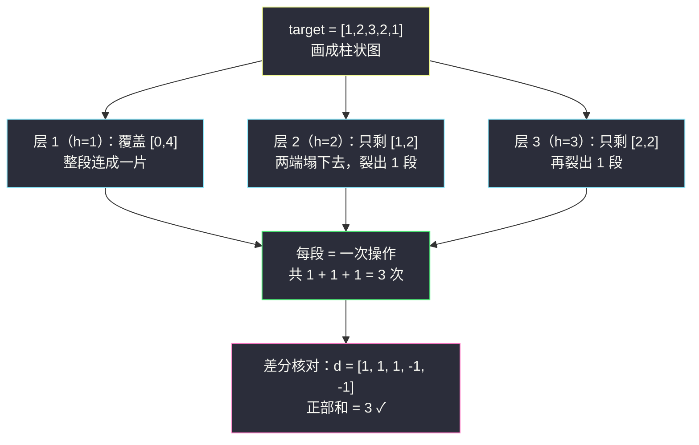

# 形成目标数组的子数组最少增加次数（一维差分 · 上坡求和）

## 一、问题描述

给你一个长度为 `n` 的整数数组 `target` 和一个整数数组 `nums`，其中 `nums` 的初始状态是一个**全 0** 数组。

一次操作中，你可以选择任意下标 `l` 和 `r`（`0 <= l <= r < n`），并把 `nums` 中**闭区间 `[l, r]` 内的每个元素**恰好加 `1`。

返回使 `nums` 从初始全 0 状态变成 `target` 所需的**最少操作次数**。

> 🔗 LeetCode 1526：https://leetcode.cn/problems/minimum-number-of-increments-on-subarrays-to-form-a-target-array/
>
> 数据范围：`1 <= n <= 10^5`，`1 <= target[i] <= 10^5`。
>
> 📚 灵茶题单 **§2.1 一维差分**。与 [#3914 使数组非递减需要的最小累计值](minimum-operations-to-make-array-non-decreasing.md) 互为**对偶**：那题从给定数组出发**削下坡**、最小化 `x` 之和；本题从零数组出发**填上坡**、最小化操作次数。两篇务必对照着看。

**示例 1**

```
输入：target = [1,2,3,2,1]
输出：3
解释：把 [0,4] 加 1、把 [1,2] 加 1、把 [2,2] 加 1，三个操作后
nums = [1,2,3,2,1]。无法用少于 3 次操作做到。
```

**示例 2**

```
输入：target = [3,1,1,2]
输出：4
```

**示例 3**

```
输入：target = [3,1,5,4,2]
输出：7
```

**直观理解**

把 `target` 画成柱状图，每次操作恰好像**铺一层砖**：选一段连续区间、高度整体抬 1。要铺出 `target` 的轮廓，每一「层」都必须由若干个互不相邻的区间拼出，而一次操作只能铺**一个**区间——答案就是所有层的区间数总和，也就是**上坡（含左端起坡）的总量**。

---

## 二、暴力解法

**分层视角**：高度 `h` 的层由所有 `target[i] >= h` 的位置构成，它们组成若干个**互不相邻的连续段**，每段必须恰好由一次操作铺出来。逐层扫描统计段数：

```python
class Solution:
    def minNumberOperations(self, target: List[int]) -> int:
        n = len(target)
        ans = 0
        for h in range(1, max(target) + 1):      # 每一层
            for i in range(n):
                if target[i] >= h and (i == 0 or target[i - 1] < h):
                    ans += 1                     # 一段新区间的左端
        return ans
```

### 复杂度

- **时间**：`O(n · max(target))`。`n = 10^5`、`target[i] = 10^5` 时高达 `10^10`，严重超时。
- **空间**：`O(1)` 额外。

### 🔴 瓶颈在哪里

高度一共 `max(target)` 层，但**相邻两层之间，段的结构变化只发生在「跨越这一层高度的坡沿」处**。逐层从头数段数，是在为几乎相同的分层结构反复付费——这正是差分增量该接手的地方。

---

## 三、优化探索（核心章节）

> 📚 本题在灵茶题单中属于 **§2.1 一维差分**。灵神模板：`d[i] = a[i] - a[i-1]`，子数组 `[l, r]` 整体加 1 等价于 `d[l] += 1、d[r+1] -= 1`。本题把「构造 `target`」看作差分域里从全 0 出发搬运正增量：**每次操作至多给一个差分位置 +1**，于是下界就是差分数组正部之和；分层铺砖恰好取等。

### 3.1 差分建模：操作在差分域里干了什么

设差分 `d[0] = target[0] - 0`（把全 0 数组看成前一个元素是 0），`d[i] = target[i] - target[i-1]`。从全 0 数组（差分全 0）出发，一次操作 `[l, r]` 加 1 在差分域等价于：

```
d[l]   += 1
d[r+1] -= 1      （若 r = n-1 则无处可减，跳过）
```

要到达 `target` 的差分数组，每个位置 `i` 的增量必须恰好等于 `d[i]`。

### 3.2 下界：正部必须逐个搬

看任何一个 `d[i] > 0` 的位置（上坡）：

- 让 `d[i]` 增加的唯一来源是「`l = i` 的操作」，每次 `+1`；
- `r + 1 = i` 的操作只会 `-1`，帮倒忙；
- 其余操作不触碰 `d[i]`。

因此「以 `i` 开头的操作次数」至少为 `d[i]`。**关键一步**：不同上坡位置的 `l` 互不相同，一次操作只有一个 `l`，所以把这些要求**相加**不会重复计数：

```
操作次数 >= Σ max(0, d[i]) = target[0] + Σ max(0, target[i] - target[i-1])
```

注意 `d[0] = target[0]` 必然非负（题目保证 `target[i] >= 1`），它对应「最左端从 0 起坡」的那一段抬升。

### 3.3 上界：分层铺砖恰好取等

回到第二章的分层图：把每一层的每个连续段用一次操作铺出来。验证层间关系——高度 `h` 的层比 `h-1` 层**新增**的段数，恰好是「在 `h` 处跨越上升沿」的个数：

- 位置 `i` 若满足 `target[i-1] < h <= target[i]`，说明轮廓在第 `i` 格从 `h-1` 层以下升到了 `h` 层以上，第 `h` 层在这里裂出一个新段（或在段左端新开一段）。

把所有层的新增段数加总，位置 `i` 的贡献是 `max(0, target[i] - target[i-1])`（它跨越的高度数），位置 0 的贡献是 `target[0]`——正好等于下界。分层构造是可行解，于是**下界 = 构造 = 答案**：



### 3.4 与 #3914 的对偶关系

| | 本题 #1526 | [#3914 使数组非递减](minimum-operations-to-make-array-non-decreasing.md) |
|---|---|---|
| 起点 | 全 0 数组 | 给定 `nums` |
| 操作 | 子数组 `+1`（只能加 1） | 子数组 `+x`（`x` 任意正整数） |
| 目标 | 变成 `target` | 变非递减 |
| 数什么 | 差分**正部**之和（填上坡） | 差分**负部**绝对值之和（削下坡） |
| 最小化的量 | 操作**次数** | 操作的 `x` **总和** |

证明骨架两题一模一样：「一次操作对每个差分位置至多提升 1（或 `x`）→ 相加得下界；对每个坡独立操作可取等 → 上界」。差别只在操作粒度与方向：一题从谷底垫上去，一题把峰顶托下来。

### 3.5 别忘了三种容易混淆的量

- `Σ max(0, target[i] - target[i-1])`：**不含** `target[0]` 时不是答案——左端起坡也要砖；
- `Σ |target[i] - target[i-1]|`：把下坡也计入，会偏大（下坡不需要任何操作，砖自然断开）；
- `target[0] + Σ max(0, ...)`：正确答案。

### 3.6 一句话核心

> **一次子数组 +1 在差分域只动两端、至多给一个位置 +1，所以操作次数 ≥ 差分正部之和；分层铺砖恰好取等。答案 = `target[0] + Σ max(0, target[i] - target[i-1])`。**

---

## 四、代码实现

### Python（主解：一遍扫描数上坡）

```python
class Solution:
    def minNumberOperations(self, target: List[int]) -> int:
        ans = target[0]                          # 左端起坡：从 0 抬到 target[0]
        for i in range(1, len(target)):
            if target[i] > target[i - 1]:        # 上坡
                ans += target[i] - target[i - 1]
        return ans
```

**变量含义**

| 变量 | 含义 |
|------|------|
| `target[0]` | 差分 `d[0]`，最左端必须抬的高度 |
| `target[i] - target[i-1]`（正部） | 差分 `d[i]` 的上坡量，位置 `i` 需要新开的砖层数 |
| `ans` | 全部上坡之和 = 最少操作次数 |

**循环不变式**：处理完位置 `i` 后，`ans` = 用「以 `0..i` 为起点的操作」构造前缀 `target[0..i]` 所需的最少操作数（后续操作不会改变 `i` 及之前的差分）。

### 显式差分版（展示推导路径）

```python
class Solution:
    def minNumberOperations(self, target: List[int]) -> int:
        ans = prev = 0
        for v in target:
            ans += max(0, v - prev)              # d[i] 的正部（i=0 时 prev=0 即 d[0]）
            prev = v
        return ans
```

### Java（最优解同款）

```java
class Solution {
    public int minNumberOperations(int[] target) {
        int n = target.length;
        long ans = target[0];                    // n 与 target[i] 均到 1e5，总和可达 1e10
        for (int i = 1; i < n; i++) {
            if (target[i] > target[i - 1]) {
                ans += target[i] - target[i - 1];
            }
        }
        return (int) ans;                        // 题目保证答案在 int 范围内
    }
}
```

**验证正确性的对拍脚本（可选练习）**：小规模 BFS 精确搜索「从全 0 到 target 的最少操作数」，与公式对拍：

```python
from collections import deque

def bfs(t):
    n = len(t)
    start, goal = tuple([0]*n), tuple(t)
    q, seen = deque([(start, 0)]), {start}
    while q:
        st, steps = q.popleft()
        if st == goal: return steps
        for l in range(n):
            for r in range(l, n):
                if any(st[j] >= t[j] for j in range(l, r + 1)):
                    continue                     # 剪枝：不能加过头
                ns = list(st)
                for j in range(l, r + 1): ns[j] += 1
                ns = tuple(ns)
                if ns not in seen:
                    seen.add(ns); q.append((ns, steps + 1))
    return -1

# for _ in range(800): 随机 target 对拍 assert 一致 —— 实测全部吻合
```

---

## 五、具体例子演示

### 例 1：target = [1,2,3,2,1]（官方示例 1，答案 3）

**第一步：差分数组（把全 0 看作 `prev = 0` 起步）**

| i | prev | target[i] | d[i] = v - prev | 正部 max(0, d) |
|---|------|-----------|-----------------|----------------|
| 0 | 0 | 1 | +1 | **1** |
| 1 | 1 | 2 | +1 | **1** |
| 2 | 2 | 3 | +1 | **1** |
| 3 | 3 | 2 | -1 | 0 |
| 4 | 2 | 1 | -1 | 0 |

正部和 = `1 + 1 + 1 = 3`，即答案。两个下坡（`-1、-1`）分文不花——砖铺到坡沿自然断开。

**第二步：分层铺砖构造（验证 3 次确实够）**

| 高度 h | 该层的连续段 | 对应操作 |
|--------|--------------|----------|
| 1 | `[0,4]`（所有 `target[i] >= 1`） | 操作 1：`[0,4]` 加 1 |
| 2 | `[1,2]`（`target[i] >= 2` 的位置 1、2） | 操作 2：`[1,2]` 加 1 |
| 3 | `[2,2]`（`target[i] >= 3` 的位置 2） | 操作 3：`[2,2]` 加 1 |

**第三步：逐层叠加的中间状态**

| 步骤 | 操作 | nums 当前状态 |
|------|------|---------------|
| 初始 | — | `[0,0,0,0,0]` |
| 1 | `[0,4]` +1 | `[1,1,1,1,1]` |
| 2 | `[1,2]` +1 | `[1,2,2,1,1]` |
| 3 | `[2,2]` +1 | `[1,2,3,2,1]` ✓ 与 target 相等 |

### 例 2：target = [3,1,5,4,2]（官方示例 3，答案 7）

| i | 0 | 1 | 2 | 3 | 4 |
|---|---|---|---|---|---|
| d[i] | +3 | -2 | +4 | -1 | -2 |
| 正部 | **3** | 0 | **4** | 0 | 0 |

答案 `3 + 4 = 7` ✓。两座独立的「山峰」（高度 3 的峰在位置 0、高度 5 的峰在位置 2）互不共享砖层——正如差分视角所言：峰与峰之间的深谷（`-2`）让两边的 `l` 互不重叠，操作无法复用。

### 例 3：单调不减 target = [1,2,3,4,5]

| i | 0 | 1 | 2 | 3 | 4 |
|---|---|---|---|---|---|
| d[i] | +1 | +1 | +1 | +1 | +1 |

答案 5：整个轮廓是一整段斜坡，但每上一层高度都要**新开**一次操作（高度 5 的层只有位置 4 一格），一次操作只能铺同一高度的一层，不能斜着铺。

---

## 六、复杂度分析

| 方法 | 时间 | 空间 | 说明 |
|------|------|------|------|
| 逐层扫描 | `O(n · max(target))` | `O(1)` | 每层从头数段 |
| 差分上坡求和 | `O(n)` | `O(1)` | 一遍扫描 |

- **时间**：单次线性扫描，`n <= 10^5` 毫无压力。
- **空间**：滚动变量即可；显式差分数组也只 `O(n)`。

---

## 七、对比总结

**「差分数组 + 相邻差求和」三兄弟（灵神 §2.1）**

| 题 | 方向 | 公式 | 最小化对象 |
|----|------|------|------------|
| 本题 #1526 | 填上坡 | `target[0] + Σ max(0, target[i] - target[i-1])` | 操作次数 |
| #3914 使数组非递减 | 削下坡 | `Σ max(0, nums[i-1] - nums[i])` | `x` 之和 |
| #995 K 连续位翻转 | 维护奇偶 | 差分数组动态记账 | 翻转次数 |

**易错点**

1. **漏掉 `target[0]`**：只写 `Σ max(0, target[i] - target[i-1])` 会把左端起坡丢掉（显式差分版里用 `prev = 0` 起步自然规避）。
2. **把下坡计入**：`Σ |d[i]|` 是错误答案，下坡（砖自然断开）不需要任何操作。
3. **溢出**：`n = 10^5`、每个上坡至多 `10^5`，总和可达 `10^10`，Java 要用 `long` 累加再按题目范围收敛。
4. **与「+x 版」混淆**：若允许一次加任意 `x`，答案是「上坡位置数」而非上坡总量（见 #3914 的对偶表）。

**模板（上坡总量求和，Python 版）**

```python
def min_ops_build(target):
    ans = prev = 0
    for v in target:
        ans += max(0, v - prev)   # 差分正部（含 d[0] = target[0]）
        prev = v
    return ans
```

---

## 八、举一反三

| 题目 | 关系 |
|------|------|
| [3914. 使数组非递减需要的最小累计值](https://leetcode.cn/problems/minimum-operations-to-make-array-non-decreasing/) | 对偶姊妹篇：削下坡、最小化 `x` 之和；同目录 `minimum-operations-to-make-array-non-decreasing.md` |
| [1109. 航班预订统计](https://leetcode.cn/problems/corporate-flight-bookings/) | §2.1 入门：区间加 + 前缀和统一还原 |
| [1094. 拼车](https://leetcode.cn/problems/car-pooling/) | 差分数组判定「任意时刻容量不超」——本题的下坡断开直觉在那是硬约束 |
| [1854. 人口最多的年份](https://leetcode.cn/problems/maximum-population-year/) | 区间事件差分计数，同一记账手法的计数版 |
| [995. K 连续位的最小翻转次数](https://leetcode.cn/problems/minimum-number-of-k-consecutive-bit-flips/) | 同小节姊妹篇：差分动态维护翻转奇偶，见 `minimum-number-of-k-consecutive-bit-flips.md` |
| [2536. 子矩阵元素加 1 的整数矩阵](https://leetcode.cn/problems/increment-submatrices-by-one/) | 差分升二维：四角标记 + 二维前缀和还原，见 `increment-submatrices-by-one.md` |

**思想迁移**

- 「从零构造轮廓」类问题先画柱状图：**分层**看清「每层几个区间」，再发现「层间变化量 = 上坡跨越数」，最后落到差分正部之和——三层递进是本题最值得带走的东西。
- 「下界用能力上限卡、上界给显式构造」是此类最优化题的万能两步，与 #3914、#2132（邮票贴满网格）一脉相承。
- 口诀：**「铺砖一层一段平，坡起之处加新层；左端起坡别漏算，上坡求和便是答。」**
